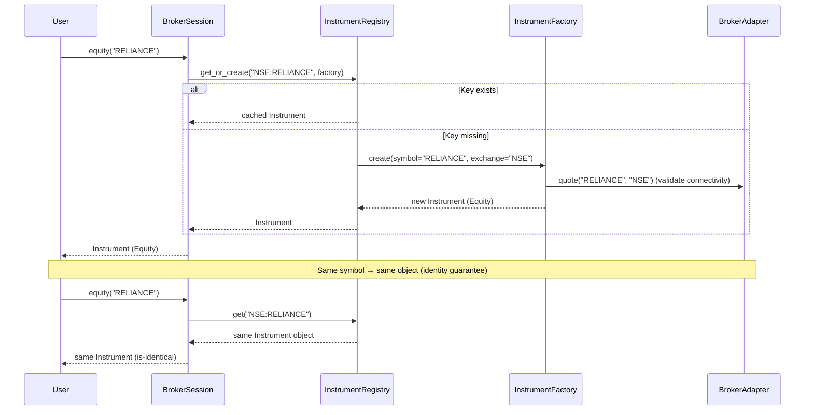
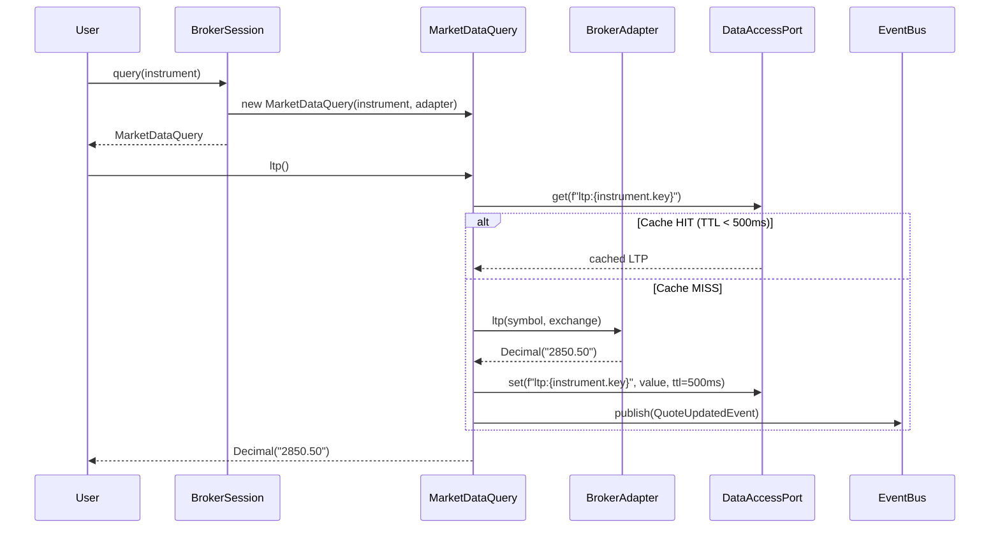
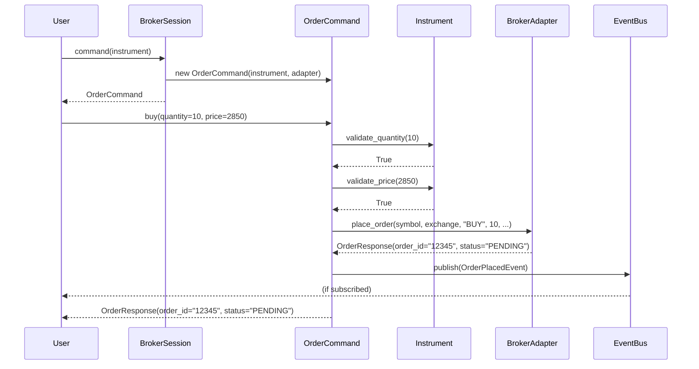
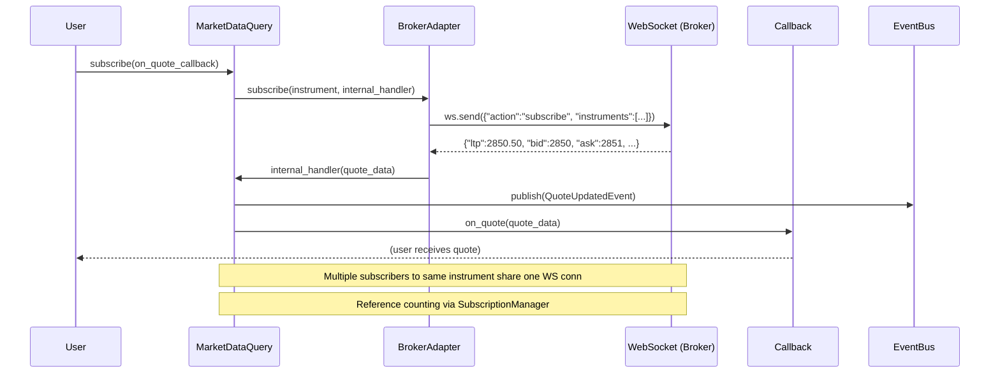
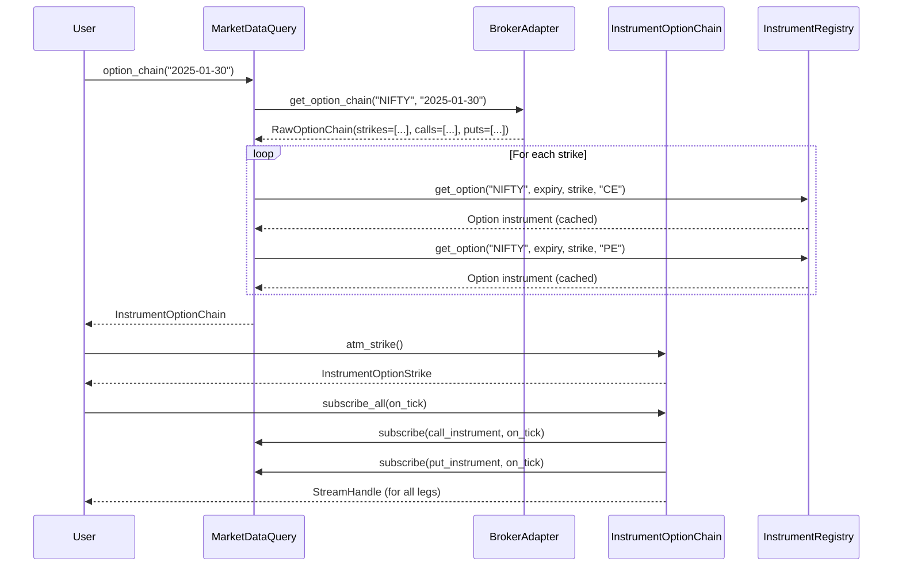
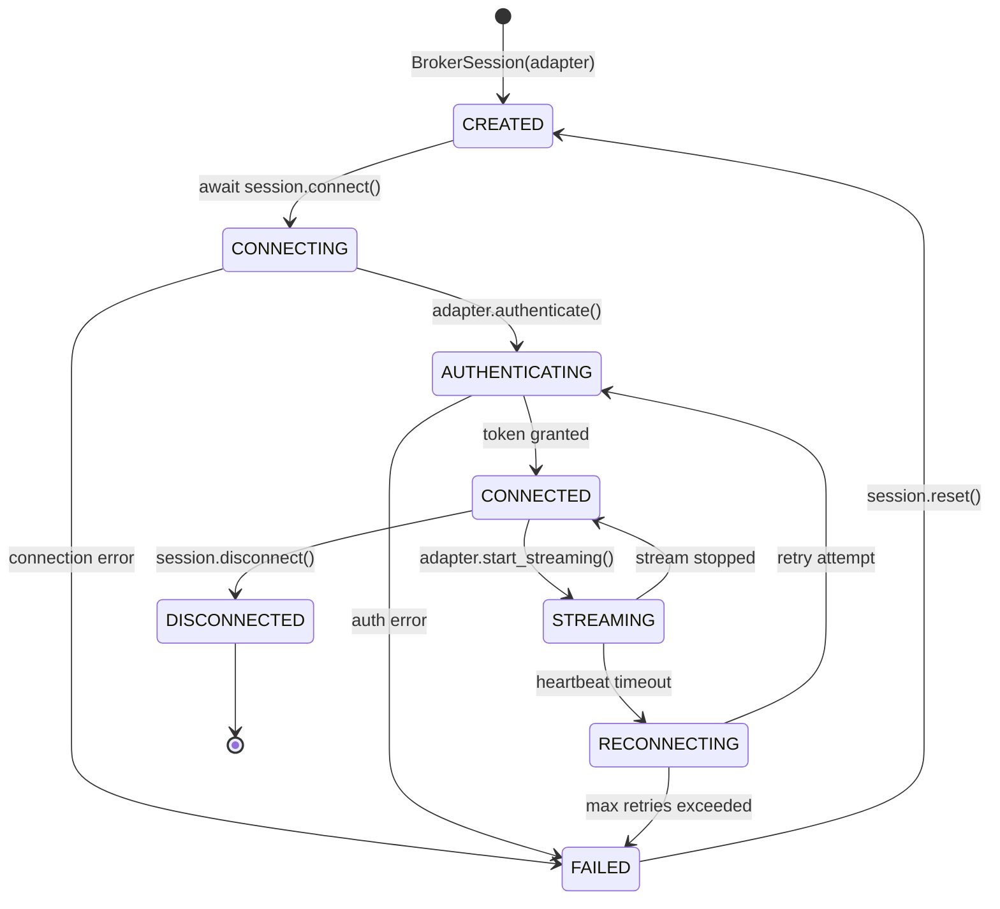
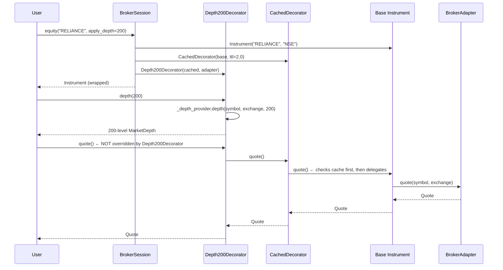

# TradeXV2 Architecture V3: Package Separation & Object-Centric Design

> **Reviewed & Approved by**: Elite Quantitative Engineering Board  
> **Board Members**: R.C. Martin (Clean Architecture), E. Evans (DDD), M. Fowler (Enterprise),  
> G. Young (CQRS/ES), V. Vernon (Strategic DDD), K. Beck (TDD), M. Feathers (Evolution),  
> V. Subramaniam (Modern Design), M. Thompson (High-Performance Systems)  
> **Date**: 2026-07-06  
> **Status**: Approved — Begin Iteration 1

---

## Table of Contents

1. [Executive Summary](#1-executive-summary)
2. [Package Architecture](#2-package-architecture)
3. [Instrument Object Model (Fixed)](#3-instrument-object-model-fixed)
4. [CQS Separation: Query vs Command](#4-cqs-separation)
5. [Infrastructure: 6 Collapsed Protocol Groups](#5-infrastructure-6-collapsed-protocol-groups)
6. [Domain Events Model](#6-domain-events-model)
7. [Broker Connection & Session Model](#7-broker-connection--session-model)
8. [Class Diagrams](#8-class-diagrams)
9. [Flow Diagrams](#9-flow-diagrams)
10. [Broker-Specific Extensions (Depth Decorators)](#10-broker-specific-extensions)
11. [Option Chain Composition](#11-option-chain-composition)
12. [Iteration Plan: 3 Vertical Slices](#12-iteration-plan)
13. [Backward Compatibility & Strangler Pattern](#13-backward-compatibility)
14. [Migration Path](#14-migration-path)
15. [Dependency Enforcement](#15-dependency-enforcement)

---

## 1. Executive Summary

### What We're Building

A **fully independent `brokers-core` package** with **zero dependencies on `inc_trade`**.
The dependency arrow is **one-way only**: `inc_trade → brokers-core` (never the reverse).

### Board's 5 Blocking Issues (Fixed in This Design)

| # | Issue | Severity | Resolution |
|---|-------|----------|------------|
| 1 | **Instrument identity crisis** — frozen dataclass (VO) used as Entity | 🔴 Blocking | Identity-based `__eq__`/`__hash__` on `(symbol, exchange)` |
| 2 | **22 infra ports too many** — describes frameworks, not behavior | 🔴 Blocking | Collapsed to **6 protocol groups** |
| 3 | **CQS violation** — queries (`quote`) + commands (`buy`) on same object | 🔴 Blocking | Split into `MarketDataQuery` + `OrderCommand` |
| 4 | **Phases are waterfall-ish** | 🟡 Major | Restructured as **3 vertical iterations** |
| 5 | **No event model** | 🟡 Major | `QuoteUpdatedEvent`, `OrderPlacedEvent`, event bus wired |

### Design Philosophy

```
OLD: Gateway → DTO → Service → Adapter → API
NEW: Instrument Object → Self-contained → Delegates to Provider via Protocols
```

---

## 2. Package Architecture

```
┌─────────────────────────────────────────────────────────────────────────┐
│                           inc_trade                                      │
│                                                                         │
│   Depends ON brokers-core. Contains:                                    │
│   - Trading strategies, algorithms, analytics                          │
│   - High-level orchestration (OMS, Risk Manager)                       │
│   - User-facing API (BrokerSession, portfolio views)                   │
│                                                                         │
│   imports: brokers_core.domain, brokers_core.ports, etc.               │
└─────────────────────────────────────────────────────────────────────────┘
                                    │
                                    │ depends ON (one-way)
                                    ▼
┌─────────────────────────────────────────────────────────────────────────┐
│                         brokers-core                                     │
│                                                                         │
│   ZERO dependencies on inc_trade.                                       │
│   Standalone, pip-installable package.                                  │
│                                                                         │
│   Contains:                                                             │
│   - Domain entities (Instrument, Equity, Future, Option, Order)        │
│   - Ports/Protocols (6 infrastructure groups + provider protocols)     │
│   - Application services (MarketDataQuery, OrderCommand, OptionChain)  │
│   - Infrastructure defaults (MemoryCache, EventBus, etc.)              │
│   - Broker adapters (Dhan, Upstox, Paper)                              │
└─────────────────────────────────────────────────────────────────────────┘
```

### Directory Structure

```
brokers-core/
├── pyproject.toml                    # NO dependency on inc_trade
├── src/
│   └── brokers_core/
│       ├── __init__.py
│       │
│       ├── domain/                   # ⭐ Layer 0 — Zero dependencies
│       │   ├── __init__.py
│       │   ├── instrument.py         # Instrument (Entity with identity)
│       │   ├── equity.py             # Equity mixin
│       │   ├── future.py             # Future mixin
│       │   ├── option.py             # Option mixin
│       │   ├── order.py              # Order, OrderResponse entities
│       │   ├── quote.py              # Quote, MarketDepth, Candle
│       │   ├── exceptions.py         # TradeXV2Error hierarchy
│       │   ├── error_codes.py        # String constant error codes
│       │   ├── events.py             # DomainEvent base + concrete events
│       │   ├── enums.py              # Side, OrderType, OrderStatus, etc.
│       │   └── symbols.py            # Symbol normalization
│       │
│       ├── ports/                    # ⭐ Layer 1 — Protocols only
│       │   ├── __init__.py
│       │   ├── providers.py          # InstrumentDataProvider, DepthProvider,
│       │   │                         #   OrderProvider, StreamingProvider,
│       │   │                         #   HistoricalDataProvider
│       │   ├── broker_adapter.py     # BrokerAdapter = union of all providers
│       │   └── infrastructure.py     # 6 collapsed protocol groups
│       │       # HttpPort, WebSocketPort, SecurityPort,
│       │       # ObservabilityPort, DataAccessPort, ConcurrencyPort
│       │
│       ├── market/                   # Application Services
│       │   ├── __init__.py
│       │   ├── query.py              # MarketDataQuery (CQS query side)
│       │   ├── order.py              # OrderCommand (CQS command side)
│       │   ├── registry.py           # InstrumentRegistry (identity map)
│       │   ├── option_chain.py       # InstrumentOptionChain (composition)
│       │   ├── decorators.py         # InstrumentDecorator base + with_*()
│       │   ├── depth_decorators.py   # Depth20/30/200Decorators
│       │   └── cache_decorator.py    # CachedDecorator
│       │
│       ├── infrastructure/           # Default implementations
│       │   ├── __init__.py
│       │   ├── http/                 # HttpClientImpl
│       │   ├── cache/                # MemoryCacheImpl
│       │   ├── event_bus.py          # EventBusImpl
│       │   └── ...
│       │
│       └── adapters/                 # Broker-specific adapters
│           ├── dhan/                 # Implements BrokerAdapter
│           │   ├── adapter.py        # DhanAdapter
│           │   ├── auth.py
│           │   ├── http_client.py
│           │   ├── market_data.py
│           │   ├── orders.py
│           │   ├── streaming.py
│           │   ├── depth20.py
│           │   ├── depth200.py
│           │   └── ...
│           ├── upstox/
│           │   ├── adapter.py
│           │   └── ...
│           └── paper/
│               └── adapter.py
│
└── tests/
    ├── unit/
    ├── integration/
    └── contract/                    # Contract tests for port implementations
```

### Dependency Direction Map

```
domain/       → zero dependencies
ports/        → domain/ + standard library only
market/       → domain/ + ports/
infrastructure/ → ports/ + standard library + external libs (aiohttp, etc.)
adapters/     → domain/ + ports/ + infrastructure/

RESULT: brokers-core NEVER imports from inc_trade
```

### How inc_trade Bridges

```
inc_trade/
├── market/
│   ├── instrument.py    → from brokers_core.domain.instrument import Instrument  # re-export
│   ├── decorators.py    → from brokers_core.market.decorators import *           # re-export
│   └── ...
├── adapters/
│   ├── dhan.py          → from brokers_core.adapters.dhan import DhanAdapter     # re-export
│   └── ...
└── infrastructure/
    └── ...              → from brokers_core.infrastructure import *              # re-export
```

---

## 3. Instrument Object Model (Fixed)

### The Identity Fix

**Problem**: `Instrument` is a `@dataclass(frozen=True)` — `__eq__` compares ALL fields.  
This is Value Object semantics, but the system uses it as an Entity (same symbol = same identity).

**Fix**: Add custom `__eq__`/`__hash__` based on `(symbol, exchange)` only.

```python
@dataclass(frozen=True)
class Instrument:
    """Canonical domain entity — identity is (symbol, exchange)."""

    symbol: str
    exchange: str
    segment: str = ""
    name: str = ""
    lot_size: int = 1
    tick_size: Decimal = Decimal("0.05")
    isin: str = ""
    expiry: datetime | None = None
    strike: Decimal | None = None
    option_type: str | None = None

    def __eq__(self, other: object) -> bool:
        if not isinstance(other, Instrument):
            return NotImplemented
        return self.symbol == other.symbol and self.exchange == other.exchange

    def __hash__(self) -> int:
        return hash((self.symbol, self.exchange))

    @property
    def composite_key(self) -> str:
        """Unique identifier: ``{exchange}:{symbol}``."""
        return f"{self.exchange}:{self.symbol}"
```

### Instrument Hierarchy (Type Mixins)

Equity, Future, Option, and Index are NOT subclasses. They are **pure mixins** that
add type-specific methods but share the same identity space:

```python
class Instrument(Entity): ...
class Equity(Protocol):    # mixin — "is a" instrument that has equity properties
class Future(Protocol):    # mixin
class Option(Protocol):    # mixin
class Index(Protocol):     # mixin
```

The repository uses a single identity map for ALL instrument types:
- `InstrumentRegistry.get_equity("RELIANCE")` → checks type after lookup
- `InstrumentRegistry.get_option("NIFTY", strike=25000, type="CE")` → checks type

### What was REMOVED from Instrument (CQS Split)

**Removed from domain entity → moved to application services:**

| Method | Moved To |
|--------|----------|
| `quote()` | `MarketDataQuery.quote(instrument)` |
| `ltp()` | `MarketDataQuery.ltp(instrument)` |
| `depth()` | `MarketDataQuery.depth(instrument, levels)` |
| `ohlcv()` | `MarketDataQuery.ohlcv(instrument, ...)` |
| `option_chain()` | `MarketDataQuery.option_chain(instrument)` |
| `subscribe()` | `MarketDataQuery.subscribe(instrument, callback)` |
| `buy()` | `OrderCommand.buy(instrument, ...)` |
| `sell()` | `OrderCommand.sell(instrument, ...)` |

**Kept on Instrument:**

| Method | Reason |
|--------|--------|
| `is_equity()`, `is_future()`, etc. | Type detection (domain logic) |
| `validate_price()`, `validate_quantity()` | Invariant validation |
| `days_to_expiry()`, `is_expired()` | Temporal logic |
| `composite_key`, `display_name()` | Identity |
| `metadata()` | Static metadata (no I/O) |
| `oi()` | Lightweight convenience (reads cached state) |
| `greeks()` | Lightweight convenience (reads cached state) |

---

## 4. CQS Separation

### MarketDataQuery (Query Side — Read-Only)

```python
class MarketDataQuery:
    """Read-only market data operations.
    
    Pure query side of CQS. Never modifies system state.
    Every method is idempotent and side-effect-free.
    """

    def __init__(
        self,
        instrument: Instrument,
        provider: InstrumentDataProvider | None = None,
        depth_provider: DepthProvider | None = None,
        historical_provider: HistoricalDataProvider | None = None,
        streaming_provider: StreamingDataProvider | None = None,
        context: Any = None,  # legacy fallback
    ) -> None: ...

    def quote(self) -> Quote: ...
    def ltp(self) -> Decimal: ...
    def depth(self, levels: int = 5) -> MarketDepth: ...
    def ohlcv(self, start: datetime, end: datetime, resolution: str) -> list[Candle]: ...
    def option_chain(self, expiry: str | None = None) -> InstrumentOptionChain: ...
    def subscribe(self, callback: Callable) -> StreamHandle: ...
    def unsubscribe(self) -> None: ...
    def snapshot(self) -> Quote: ...
```

### OrderCommand (Command Side — Mutating)

```python
class OrderCommand:
    """Write-only order operations.
    
    Pure command side of CQS. Every method mutates system state
    (creates an order on the exchange).
    """

    def __init__(
        self,
        instrument: Instrument,
        order_provider: OrderProvider | None = None,
    ) -> None: ...

    def buy(
        self,
        quantity: int,
        order_type: OrderType = OrderType.MARKET,
        price: Decimal = Decimal("0"),
        trigger_price: Decimal = Decimal("0"),
        **kwargs: Any,
    ) -> OrderResponse: ...

    def sell(
        self,
        quantity: int,
        order_type: OrderType = OrderType.MARKET,
        price: Decimal = Decimal("0"),
        trigger_price: Decimal = Decimal("0"),
        **kwargs: Any,
    ) -> OrderResponse: ...
```

### User API — Clean Separation

```python
# Old way (CQS violation — don't do this)
inst.quote()      # query
inst.buy(10)      # command — same object, mixed concerns

# New way (CQS clean)
query = session.query(instrument)
query.quote()     # → Quote

cmd = session.command(instrument)
cmd.buy(10)       # → OrderResponse

# Or, for backwards compatibility, Instrument still has convenience methods
# that delegate to internal query/command objects:
instrument.quote()  # delegates to internal MarketDataQuery
instrument.buy(10)  # delegates to internal OrderCommand
```

### Bridge: Instrument Convenience Methods

For backward compatibility, `Instrument` still exposes `quote()` and `buy()` as
convenience methods that delegate to internal `MarketDataQuery` and `OrderCommand`:

```python
@dataclass(frozen=True)
class Instrument:
    _query: MarketDataQuery | None = field(default=None, repr=False)
    _command: OrderCommand | None = field(default=None, repr=False)

    def quote(self) -> Quote:
        if self._query is None:
            raise RuntimeError("No query service configured")
        return self._query.quote()

    def buy(self, quantity: int, **kwargs) -> OrderResponse:
        if self._command is None:
            raise RuntimeError("No command service configured")
        return self._command.buy(quantity, **kwargs)
```

These methods are **delegates only** — they do NOT contain business logic.

---

## 5. Infrastructure: 6 Collapsed Protocol Groups

**Board Verdict**: 22 flat protocols in V2 described frameworks, not behavior.
Collapsed to 6 groups that describe **WHAT** the system needs, not **HOW**.

### Group 1: HttpPort

```python
@runtime_checkable
class HttpPort(Protocol):
    """HTTP client operations — request/response over HTTP.
    
    Replaces: RestClient, RetryEngine, RateLimiter
    """
    async def request(self, method: str, url: str, **kwargs) -> HttpResponse: ...
    async def get(self, url: str, **kwargs) -> HttpResponse: ...
    async def post(self, url: str, **kwargs) -> HttpResponse: ...
    async def put(self, url: str, **kwargs) -> HttpResponse: ...
    async def delete(self, url: str, **kwargs) -> HttpResponse: ...
```

### Group 2: WebSocketPort

```python
@runtime_checkable
class WebSocketPort(Protocol):
    """WebSocket connection operations.
    
    Replaces: WebSocketClient, ConnectionManager, ReconnectManager,
              HeartbeatManager, SubscriptionManager
    """
    async def connect(self, url: str, **kwargs) -> None: ...
    async def disconnect(self) -> None: ...
    async def send(self, message: Any) -> None: ...
    async def receive(self) -> Any: ...
    def subscribe(self, channel: str, handler: Callable) -> SubscriptionHandle: ...
    def unsubscribe(self, channel: str) -> None: ...
    @property
    def is_connected(self) -> bool: ...
    @property
    def latency_ms(self) -> float: ...
```

### Group 3: SecurityPort

```python
@runtime_checkable
class SecurityPort(Protocol):
    """Authentication, authorization, and secrets management.
    
    Replaces: AuthenticationManager, TokenManager, SessionManager,
              SecretsManager, ConfigurationManager
    """
    async def login(self, **credentials) -> AuthToken: ...
    async def logout(self) -> None: ...
    async def refresh_token(self) -> AuthToken: ...
    def get_token(self) -> AuthToken | None: ...
    def is_authenticated(self) -> bool: ...
    def get_secret(self, key: str) -> str | None: ...
    def store_secret(self, key: str, value: str) -> None: ...
```

### Group 4: ObservabilityPort

```python
@runtime_checkable
class ObservabilityPort(Protocol):
    """Metrics, logging, tracing, and health monitoring.
    
    Replaces: MetricsCollector, LoggingManager, TracingManager, HealthMonitor
    """
    def counter(self, name: str, value: float = 1, tags: dict = None) -> None: ...
    def gauge(self, name: str, value: float, tags: dict = None) -> None: ...
    def histogram(self, name: str, value: float, tags: dict = None) -> None: ...
    def get_logger(self, name: str) -> Logger: ...
    def start_span(self, name: str, tags: dict = None) -> SpanContext: ...
    def end_span(self, span: SpanContext) -> None: ...
    def is_healthy(self) -> HealthStatus: ...
    def register_health_check(self, name: str, check: Callable) -> None: ...
```

### Group 5: DataAccessPort

```python
@runtime_checkable
class DataAccessPort(Protocol):
    """Caching and state persistence.
    
    Replaces: Cache, TokenStorePort, instrument state storage
    """
    def get(self, key: str) -> Any | None: ...
    def set(self, key: str, value: Any, ttl_seconds: float = None) -> None: ...
    def invalidate(self, key: str) -> None: ...
    def clear(self) -> None: ...
    def has(self, key: str) -> bool: ...
    def stats(self) -> dict: ...
```

### Group 6: ConcurrencyPort

```python
@runtime_checkable
class ConcurrencyPort(Protocol):
    """Thread pools, scheduling, and async execution.
    
    Replaces: ThreadPoolManager, Scheduler, DIContainer (YAGNI for v1)
    """
    def submit(self, fn: Callable, *args, **kwargs) -> Future: ...
    def schedule(self, interval_seconds: float, fn: Callable) -> ScheduleHandle: ...
    def schedule_once(self, delay_seconds: float, fn: Callable) -> ScheduleHandle: ...
    def cancel(self, handle: ScheduleHandle) -> None: ...
    def shutdown(self) -> None: ...
```

### Why 6 Groups is Correct

| Group | Lines of interface | Lines of implementation | External deps |
|-------|-------|-------|-------|
| HttpPort | ~20 | ~80 | aiohttp/httpx |
| WebSocketPort | ~25 | ~120 | websockets |
| SecurityPort | ~25 | ~200 | cryptography, jwt |
| ObservabilityPort | ~25 | ~150 | structlog, prometheus |
| DataAccessPort | ~15 | ~60 | (stdlib) |
| ConcurrencyPort | ~20 | ~80 | (stdlib) |

22 separate protocols → 6 groups = **3.6× reduction** in interface surface.
Each group maps to a real infrastructure concern, not a framework API.

---

## 6. Domain Events Model

### Event Hierarchy

```python
# domain/events.py

@dataclass(frozen=True)
class DomainEvent:
    """Base class for all domain events."""
    event_id: str = field(default_factory=lambda: str(uuid4()))
    timestamp: datetime = field(default_factory=lambda: datetime.now(UTC))
    source: str = ""

    @property
    def event_type(self) -> str:
        return type(self).__name__


@dataclass(frozen=True)
class QuoteUpdatedEvent(DomainEvent):
    """Published when a new quote tick arrives for an instrument."""
    instrument_key: str
    ltp: Decimal
    bid: Decimal
    ask: Decimal
    volume: int
    oi: int
    timestamp_exchange: datetime | None = None


@dataclass(frozen=True)
class OrderPlacedEvent(DomainEvent):
    """Published when an order is placed successfully."""
    instrument_key: str
    order_id: str
    side: str
    quantity: int
    price: Decimal
    order_type: str


@dataclass(frozen=True)
class OrderFilledEvent(DomainEvent):
    """Published when an order receives fills."""
    instrument_key: str
    order_id: str
    filled_quantity: int
    remaining_quantity: int
    average_price: Decimal


@dataclass(frozen=True)
class OrderRejectedEvent(DomainEvent):
    """Published when an order is rejected."""
    instrument_key: str
    order_id: str
    reason: str
```

### Event Bus (In-Process)

```python
class EventBus:
    """Simple in-process event bus with pub/sub."""

    def __init__(self) -> None:
        self._handlers: dict[str, set[Callable]] = {}

    def subscribe(self, event_type: str, handler: Callable) -> None:
        self._handlers.setdefault(event_type, set()).add(handler)

    def unsubscribe(self, event_type: str, handler: Callable) -> None:
        self._handlers.get(event_type, set()).discard(handler)

    def publish(self, event: DomainEvent) -> None:
        for handler in list(self._handlers.get(event.event_type, set())):
            try:
                handler(event)
            except Exception:
                logger.exception("Event handler failed: %s", handler)
```

### Event Flow

```
Exchange API WebSocket
        │
        ▼
StreamingProvider.on_quote(symbol, exchange, data)
        │
        ▼
MarketDataQuery._on_quote(data)
        ├── updates InstrumentRepository._quote_states[key]
        ├── publishes QuoteUpdatedEvent → EventBus
        └── notifies attached observers

User code subscribes:
    event_bus.subscribe("QuoteUpdatedEvent", my_handler)
```

---

## 7. Broker Connection & Session Model

### Architecture

```
┌─────────────────────────────────────────────────────────────────────────┐
│                         BrokerSession                                    │
│                                                                         │
│   A BrokerSession represents ONE authenticated connection to ONE        │
│   broker. It owns the lifecycle of adapters, repository, and            │
│   streaming connections.                                                │
│                                                                         │
│   Session diagram:                                                      │
│                                                                         │
│   BrokerSession                                                         │
│   ├── InstrumentRepository (identity map, thread-safe)                  │
│   ├── MarketDataQuery.Factory (creates query objects)                   │
│   ├── OrderCommand.Factory (creates command objects)                    │
│   ├── EventBus (pub/sub for domain events)                              │
│   ├── ConnectionManager (connect/disconnect lifecycle)                  │
│   │   ├── AuthenticationManager (login/logout/token refresh)            │
│   │   └── StreamingConnection (WebSocket lifecycle)                     │
│   └── BrokerAdapter (implements all provider protocols)                 │
│       ├── market_data.quote(symbol, exchange)                           │
│       ├── orders.place_order(...)                                       │
│       └── streaming.subscribe(...)                                      │
└─────────────────────────────────────────────────────────────────────────┘
```

### Session Lifecycle

```
┌──────────┐     connect()     ┌────────────┐    disconnect()    ┌───────────┐
│          │ ─────────────────▶│            │ ──────────────────▶│           │
│  CREATED │                   │ CONNECTED  │                    │ DISCONN.  │
│          │                   │            │                    │           │
└──────────┘                   └────────────┘                    └───────────┘
                                    │
                                    │ reconnect()
                                    ▼
                              ┌────────────┐
                              │ RECONNECT  │
                              │            │
                              └────────────┘
```

### Session API

```python
class BrokerSession:
    """A single authenticated broker session.
    
    Usage::
    
        session = BrokerSession.for_broker("dhan", client_id="...", access_token="...")
        await session.connect()
        
        # Get instruments
        rel = session.equity("RELIANCE")
        nifty = session.future("NIFTY", expiry="2025-01-30")
        
        # Query market data
        query = session.query(rel)
        print(query.ltp())
        print(query.depth(200))
        
        # Place orders
        cmd = session.command(rel)
        result = cmd.buy(quantity=10)
        
        # Subscribe to live data
        handle = query.subscribe(on_quote)
        
        # Option chain
        chain = query.option_chain("2025-01-30")
        atm = chain.atm_strike()
        print(atm.call.instrument.composite_key)
        
        # Cleanup
        await session.disconnect()
    """

    def __init__(self, adapter: BrokerAdapter) -> None:
        self._adapter = adapter
        self._registry = InstrumentRegistry()
        self._event_bus = EventBus()
        self._query_factory = MarketDataQueryFactory(self._registry, adapter)
        self._command_factory = OrderCommandFactory(self._registry, adapter)

    async def connect(self) -> None:
        """Authenticate and establish connections."""
        await self._adapter.connect()
        logger.info("Session connected: %s", self._adapter.broker_id)

    async def disconnect(self) -> None:
        """Close all connections and release resources."""
        await self._adapter.disconnect()
        self._registry.clear()
        logger.info("Session disconnected: %s", self._adapter.broker_id)

    def equity(self, symbol: str, exchange: str = "NSE") -> Instrument:
        """Get or create an Equity instrument."""
        return self._registry.get_equity(symbol, exchange)

    def future(self, symbol: str, expiry: datetime, exchange: str = "NFO") -> Instrument:
        """Get or create a Future instrument."""
        return self._registry.get_future(symbol, expiry, exchange)

    def option(
        self,
        symbol: str,
        expiry: datetime,
        strike: Decimal,
        option_type: str,
        exchange: str = "NFO",
    ) -> Instrument:
        """Get or create an Option instrument."""
        return self._registry.get_option(symbol, expiry, strike, option_type, exchange)

    def query(self, instrument: Instrument) -> MarketDataQuery:
        """Create a MarketDataQuery for the given instrument."""
        return self._query_factory.create(instrument)

    def command(self, instrument: Instrument) -> OrderCommand:
        """Create an OrderCommand for the given instrument."""
        return self._command_factory.create(instrument)

    @property
    def event_bus(self) -> EventBus:
        return self._event_bus

    def register_observer(self, observer: QuoteObserver) -> None:
        """Register a session-level quote observer."""
        self._event_bus.subscribe("QuoteUpdatedEvent", observer.on_quote)
```

### BrokerAdapter Protocol (Updated)

```python
@runtime_checkable
class BrokerAdapter(
    InstrumentDataProvider,
    DepthProvider,
    HistoricalDataProvider,
    StreamingDataProvider,
    OrderProvider,
    Protocol,
):
    """Primary broker interface — replaces BrokerGateway."""

    @property
    def broker_id(self) -> str: ...

    async def connect(self) -> None:
        """Authenticate and establish connections."""
        ...

    async def disconnect(self) -> None:
        """Close connections and release resources."""
        ...

    @property
    def is_connected(self) -> bool: ...

    # Each provider protocol is implemented directly.
    # No sub-property accessors like .market_data, .orders, .streaming.
    # The adapter IS the provider.
    def quote(self, symbol: str, exchange: str) -> Quote: ...
    def ltp(self, symbol: str, exchange: str) -> Decimal: ...
    def depth(self, symbol: str, exchange: str, levels: int = 5) -> MarketDepth: ...
    def place_order(self, symbol: str, exchange: str, ...) -> OrderResponse: ...
    def subscribe(self, instrument: Any, callback: Any) -> Any: ...
    def get_candles(self, ...) -> list[Candle]: ...
```

---

## 8. Class Diagrams

### 8.1 Instrument Hierarchy (Fixed)

```
┌─────────────────────────────┐
│        Instrument           │  ◀── Entity (identity on symbol+exchange)
│   @dataclass(frozen=True)   │
├─────────────────────────────┤
│ - symbol: str               │
│ - exchange: str             │
│ - segment: str              │
│ - name: str                 │
│ - lot_size: int             │
│ - tick_size: Decimal        │
│ - isin: str                 │
│ - expiry: datetime?         │
│ - strike: Decimal?          │
│ - option_type: str?         │
│ - _query: MarketDataQuery?  │  ← convenience delegate
│ - _command: OrderCommand?   │  ← convenience delegate
├─────────────────────────────┤
│ + composite_key: str        │
│ + is_equity() → bool        │
│ + is_future() → bool        │
│ + is_option() → bool        │
│ + is_index() → bool         │
│ + days_to_expiry() → int?   │
│ + validate_price(d) → bool  │
│ + validate_quantity(n)→ bool│
│                             │
│ # convenience delegates:    │
│ + quote() → Quote           │  ← delegates to _query
│ + depth(n) → MarketDepth    │  ← delegates to _query
│ + buy(qty) → OrderResponse  │  ← delegates to _command
│ + subscribe(cb) → Handle    │  ← delegates to _query
└─────────────────────────────┘

    ┌─────────────────────┼─────────────────────┐
    │                     │                     │
    ▼                     ▼                     ▼
┌────────────┐    ┌────────────┐    ┌────────────┐
│ is_equity  │    │ is_future  │    │ is_option  │
│ (detection)│    │ (detection)│    │ (detection)│
└────────────┘    └────────────┘    └────────────┘
```

### 8.2 MarketDataQuery & OrderCommand (CQS)

```
┌──────────────────────────────────┐   ┌──────────────────────────────────┐
│         MarketDataQuery          │   │          OrderCommand            │
│          (Query Side)            │   │         (Command Side)           │
├──────────────────────────────────┤   ├──────────────────────────────────┤
│ - _instrument: Instrument        │   │ - _instrument: Instrument        │
│ - _provider: IDataProvider?      │   │ - _order_provider: OrderProvider?│
│ - _depth_provider: DepthProv.?   │   ├──────────────────────────────────┤
│ - _historical_provider: Hist.?   │   │ + buy(qty, type, price) → Resp   │
│ - _streaming_provider: Stream.?  │   │ + sell(qty, type, price) → Resp  │
├──────────────────────────────────┤   └──────────────────────────────────┘
│ + quote() → Quote                │
│ + ltp() → Decimal                │
│ + depth(levels) → MarketDepth    │
│ + ohlcv(start, end, res) → []    │
│ + option_chain(expiry) → Chain   │
│ + subscribe(callback) → Handle   │
│ + unsubscribe() → None           │
└──────────────────────────────────┘
```

### 8.3 InstrumentRegistry (Identity Map)

```
┌─────────────────────────────────────────────────────────────────────────┐
│                         InstrumentRegistry                               │
├─────────────────────────────────────────────────────────────────────────┤
│ - _lock: RWLock  (read-preferring, NOT RLock)                           │
│ - _instruments: dict[str, Instrument]                                   │
│ - _quote_states: dict[str, QuoteState]                                  │
├─────────────────────────────────────────────────────────────────────────┤
│                         Reads (lock-free)                               │
│ + get(key: str) → Instrument | None                                     │
│ + get_quote_state(key: str) → QuoteState | None                         │
│                                                                         │
│                         Writes (copy-on-write)                          │
│ + get_or_create(key: str, factory: Callable) → Instrument               │
│ + get_equity(symbol: str, exchange: str) → Instrument                   │
│ + get_future(symbol: str, expiry: datetime, exchange: str) → Instrument │
│ + get_option(symbol, expiry, strike, type, exchange) → Instrument       │
│ + set_quote_state(key: str, state: QuoteState) → None                   │
│                                                                         │
│                         Utility                                         │
│ + search(query: str) → list[Instrument]                                 │
│ + get_all() → dict[str, Instrument]                                     │
│ + count() → int                                                         │
│ + clear() → None                                                        │
└─────────────────────────────────────────────────────────────────────────┘
```

**Key change from V2**: Uses `RWLock` (readers preference), not `RLock`.
Hot read paths (`get()`, `get_quote_state()`) are completely lock-free.
Writes use copy-on-write semantics for the instruments dict.

### 8.4 BrokerAdapter & Decorator Composition

```
┌─────────────────────────────────────────────────────────────────────────┐
│                       BrokerSession                                     │
│                                                                         │
│   BrokerSession(adapter)                                                │
│       │                                                                 │
│       ▼                                                                 │
│   BrokerAdapter (Protocol)                                              │
│       │                                                                 │
│       ├── DhanAdapter implements BrokerAdapter                          │
│       │   ├── quote(symbol, exchange) → calls Dhan API                  │
│       │   ├── depth(symbol, exchange, levels) → calls Dhan API          │
│       │   ├── place_order(...) → calls Dhan API                         │
│       │   ├── subscribe(instrument, cb) → WS subscription               │
│       │   └── get_candles(...) → calls Dhan API                         │
│       │                                                                 │
│       ├── UpstoxAdapter implements BrokerAdapter                        │
│       │   └── ... (same interface, different API)                       │
│       │                                                                 │
│       └── PaperAdapter implements BrokerAdapter                         │
│           └── ... (in-memory simulation)                                │
│                                                                         │
│   Decorator Stack (applied by session on demand):                       │
│                                                                         │
│   Depth200Decorator(                                                    │
│       CachedDecorator(                                                  │
│           LoggedDecorator(                                              │
│               base_instrument                                            │
│           )                                                             │
│       )                                                                 │
│   )                                                                     │
└─────────────────────────────────────────────────────────────────────────┘
```

### 8.5 Domain Events

```
┌──────────────────────┐
│     DomainEvent      │  (base, frozen dataclass)
├──────────────────────┤
│ - event_id: str      │
│ - timestamp: datetime│
│ - source: str        │
└──────────────────────┘
        ▲
        │
   ┌────┴──────────────────────────┐
   │                               │
   ▼                               ▼
┌──────────────────────┐  ┌──────────────────────┐
│  QuoteUpdatedEvent   │  │  OrderPlacedEvent     │
├──────────────────────┤  ├──────────────────────┤
│ - instrument_key     │  │ - instrument_key      │
│ - ltp, bid, ask      │  │ - order_id            │
│ - volume, oi         │  │ - side, quantity      │
│ - timestamp_exchange │  │ - price, order_type   │
└──────────────────────┘  └──────────────────────┘

   ┌──────────────────────┐  ┌──────────────────────┐
   │  OrderFilledEvent    │  │  OrderRejectedEvent   │
   ├──────────────────────┤  ├──────────────────────┤
   │ - instrument_key     │  │ - instrument_key      │
   │ - order_id           │  │ - order_id            │
   │ - filled_qty         │  │ - reason              │
   │ - remaining_qty      │  │                       │
   │ - avg_price          │  │                       │
   └──────────────────────┘  └──────────────────────┘
```

---

## 9. Flow Diagrams

### 9.1 Instrument Lookup Flow



### 9.2 Quote Query Flow



### 9.3 Order Placement Flow



### 9.4 Streaming Subscription Flow



### 9.5 Option Chain Flow



### 9.6 Broker Connection Lifecycle



### 9.7 Decorator Application Flow



---

## 10. Broker-Specific Extensions

### 10.1 Depth Decorators

Each broker supports different max depth levels:

| Broker | Max Depth | Decorator | Notes |
|--------|-----------|-----------|-------|
| Dhan | 200 | `Depth200Decorator` | 20-level WS, 200-level WS (1 instr/conn) |
| Upstox | 30 | `Depth30Decorator` | 30-level snapshot |
| Paper | 5 | (none needed) | In-memory simulation |

```python
# Usage
query = session.query(instrument)
depth = query.depth(200)  # Adapter resolves actual level

# Or explicit decorator wrapping
inst = with_depth(
    base_instrument,
    levels=200,
    depth_provider=dhan_adapter,
)
inst.depth(200)  # 200-level market depth
```

### 10.2 Decorator Chain Example

```python
# Full stack
from brokers_core.market.decorators import with_depth, with_cache, with_logging

inst = with_logging(
    with_cache(
        with_depth(
            base_inst,
            levels=200,
            depth_provider=adapter,
        ),
        ttl_seconds=2.0,
    )
)

# Call chain:
inst.quote()        # Logged → Cached → Instrument → Adapter
inst.depth(200)     # Depth200 → Instrument → Adapter
inst.buy(10)        # Logged → Cached → ... → Instrument → Adapter
```

### 10.3 Extension Registry

For broker-specific capabilities beyond the standard protocol:

```python
# At session init
session.extensions.register("margin", dhan_adapter)
session.extensions.register("super_orders", dhan_adapter)
session.extensions.register("forever_orders", dhan_adapter)

# User code
margin = session.extensions.get("margin")
margin.get_margin_required(...)
```

---

## 11. Option Chain Composition

```python
# domain/option_chain.py

class InstrumentOptionChain:
    """Option chain composed of rich Instrument references.
    
    Not a frozen dataclass — mutable to allow live updates.
    """

    def __init__(
        self,
        underlying: Instrument,
        expiry: str,
        spot: Decimal,
        strikes: list[InstrumentOptionStrike],
        query_factory: MarketDataQueryFactory,
    ) -> None:
        self.underlying = underlying
        self.expiry = expiry
        self.spot = spot
        self.strikes = tuple(strikes)  # immutable ordering
        self._query_factory = query_factory

    @property
    def atm_strike(self) -> InstrumentOptionStrike:
        """Find the strike closest to current spot."""
        return min(
            self.strikes,
            key=lambda s: abs(s.strike - self.spot),
        )

    @property
    def max_pain(self) -> Decimal:
        """Calculate max pain strike."""
        ...

    @property
    def pcr(self) -> Decimal:
        """Put-Call ratio for this chain."""
        ...

    def subscribe_all(self, callback: Callable) -> StreamHandle:
        """Subscribe to all legs + underlying in one call.

        Returns a composite StreamHandle that manages all subscriptions.
        When unsubscribed, all individual subscriptions are cleaned up.
        """
        handles = []
        handles.append(self._query_factory.create(self.underlying).subscribe(callback))
        for strike in self.strikes:
            handles.append(self._query_factory.create(strike.call.instrument).subscribe(callback))
            handles.append(self._query_factory.create(strike.put.instrument).subscribe(callback))
        return CompositeStreamHandle(handles)

    def refresh(self) -> InstrumentOptionChain:
        """Refetch the chain with updated market data.
        
        Returns a new chain (immutable update pattern).
        """
        ...


class InstrumentOptionStrike:
    """A single strike row."""
    strike: Decimal
    call: InstrumentOptionLeg
    put: InstrumentOptionLeg


class InstrumentOptionLeg:
    """A single option leg (call or put)."""
    instrument: Instrument   # ← Rich Instrument reference
    ltp: Decimal
    oi: int
    volume: int
    iv: Decimal
    delta: Decimal

    def query(self) -> MarketDataQuery:
        """Get a query for this leg."""
        ...

    def command(self) -> OrderCommand:
        """Get a command for this leg."""
        ...


# Usage
chain = session.query(underlying).option_chain("2025-01-30")
atm = chain.atm_strike
print(atm.call.instrument.composite_key)  # "NFO:NIFTY:25000:CE"
print(atm.call.ltp)                       # 125.50

# Trade ATM straddle
atm.call.command().buy(25)    # Buy 25 lots of ATM call
atm.put.command().buy(25)     # Buy 25 lots of ATM put
```

---

## 12. Iteration Plan: 3 Vertical Slices

Instead of 4 horizontal phases, we deliver 3 vertical iterations — each
produces a working, testable increment.

### Iteration 1: Market Data Flow (Week 1)

**Goal**: A working `brokers-core` package where a user can:
- Create a `BrokerSession`
- Get an instrument
- Query quotes, depth, OHLCV
- Subscribe to live ticks

**Deliverables**:

| Component | Status | Files |
|-----------|--------|-------|
| Fix Instrument identity (`__eq__`/`__hash__`) | 🔴 New | `domain/instrument.py` |
| `MarketDataQuery` (query side only) | 🔴 New | `market/query.py` |
| 6 collapsed infra protocols | 🔴 New | `ports/infrastructure.py` |
| `InstrumentRegistry` (copy-on-write) | 🔴 New | `market/registry.py` |
| `EventBus` + `QuoteUpdatedEvent` | 🔴 New | `infrastructure/event_bus.py`, `domain/events.py` |
| `DhanAdapter` refactored (no gateway) | 🔴 Refactor | `adapters/dhan/adapter.py` |
| `PaperAdapter` (market data only) | 🔴 New | `adapters/paper/adapter.py` |
| `InstrumentOptionChain` | 🔴 Refactor | `market/option_chain.py` |
| Decorators (depth, cache, log) | 🔴 Refactor | `market/decorators.py` |
| Tests: unit + contract | 🔴 New | `tests/` |

**Test target**: 200+ new tests, zero regressions.

### Iteration 2: Trading Flow (Week 2)

**Goal**: A working trading system where a user can:
- Place buy/sell orders
- Track order status
- Receive order events (placed, filled, rejected)

**Deliverables**:

| Component | Status | Files |
|-----------|--------|-------|
| `OrderCommand` (command side only) | 🔴 New | `market/order.py` |
| `Order` entity + `OrderResponse` | 🔴 New | `domain/order.py` |
| `OrderPlacedEvent`, `OrderFilledEvent`, `OrderRejectedEvent` | 🔴 New | `domain/events.py` |
| Order validation (quantity, price, limits) | 🔴 New | `domain/validators.py` |
| Dhan order adapter (no gateway) | 🔴 Refactor | `adapters/dhan/orders.py` |
| Paper order adapter | 🔴 New | `adapters/paper/orders.py` |
| `BrokerSession.command()` factory | 🔴 New | `session.py` |
| Tests: unit + contract | 🔴 New | `tests/` |

**Test target**: +200 tests, zero regressions.

### Iteration 3: Package Extraction & Migration (Week 3)

**Goal**: `brokers-core` is a standalone pip-installable package.
`inc_trade` imports from it (not the reverse).

**Deliverables**:

| Component | Status | Files |
|-----------|--------|-------|
| `brokers-core/pyproject.toml` | 🔴 New | root |
| Move `domain/` to `brokers-core` | 🔴 Migrate | all domain files |
| Move `ports/` to `brokers-core` | 🔴 Migrate | all port files |
| Move `adapters/` to `brokers-core` | 🔴 Migrate | all adapter files |
| Move `market/` to `brokers-core` | 🔴 Migrate | all market files |
| Move `infrastructure/` defaults | 🔴 Migrate | infrastructure/ |
| `inc_trade` bridge re-exports | 🔴 New | bridge stubs |
| Strangler pattern for old imports | 🔴 New | backward compat |
| CI/CD for `brokers-core` | 🔴 New | GitHub Actions |
| Full test suite passes | 🔴 Verify | all tests |

**Test target**: Existing 2128+ tests pass, brokers-core has own CI.

---

## 13. Backward Compatibility & Strangler Pattern

### Why Backward Compatibility?

The board was asked: "What backward compatibility do we need since this is v1?"

**Answer**: **Full backward compatibility is required** because:
1. **Tests**: 2128+ existing tests must pass at every commit
2. **Strategies**: User trading strategies use `instrument.quote()`, `instrument.buy()` — these must keep working
3. **Iterative delivery**: Each iteration must produce working software
4. **No big-bang**: We migrate with strangler pattern, not rewrite

### Strangler Pattern

```
Phase 1: Add new alongside old
    inc_trade/market/instrument.py  (old, unchanged)
    brokers_core/domain/instrument.py  (new, fixed)
    
    Old code continues to import from inc_trade.
    New code imports from brokers_core.
    
Phase 2: Bridge old → new
    inc_trade/market/instrument.py  → from brokers_core.domain.instrument import Instrument  # re-export
    
    Old import path still works because it's a thin re-export.
    
Phase 3: Remove old imports
    All code imports directly from brokers_core.
    inc_trade/market/instrument.py deleted.
```

### Backward-Compatible Instrument

```python
# brokers_core/domain/instrument.py
@dataclass(frozen=True)
class Instrument:
    """New canonical entity with identity-based equality."""
    symbol: str
    exchange: str
    ...
    _query: MarketDataQuery | None = None
    _command: OrderCommand | None = None
    
    def __eq__(self, other) -> bool:
        if not isinstance(other, Instrument):
            return NotImplemented
        return self.symbol == other.symbol and self.exchange == other.exchange
    
    def quote(self) -> Quote:
        """Backward-compatible convenience delegate."""
        if self._query is None:
            raise RuntimeError("No query service configured")
        return self._query.quote()
    
    def buy(self, quantity: int, **kwargs) -> OrderResponse:
        """Backward-compatible convenience delegate."""
        if self._command is None:
            raise RuntimeError("No command service configured")
        return self._command.buy(quantity, **kwargs)


# inc_trade/market/instrument.py  (bridge)
from brokers_core.domain.instrument import Instrument  # re-export

__all__ = ["Instrument"]
```

---

## 14. Migration Path

### Week 1 — Iteration 1 (Market Data)

```
Day 1-2: Fix Instrument identity
  - Add __eq__/__hash__ based on (symbol, exchange)
  - Create MarketDataQuery + OrderCommand classes
  - Collapse 22 infra protocols → 6 groups
  
Day 3-4: Build Infrastructure
  - Create EventBus + QuoteUpdatedEvent
  - Create InstrumentRegistry (copy-on-write)
  - Create 6 collapsed infra default implementations
  
Day 5: Broker Adapters (Market Data)
  - DhanAdapter implements market data (no gateway)
  - PaperAdapter implements market data
  - Wire decorators (depth, cache, log)
  - Tests pass
```

### Week 2 — Iteration 2 (Trading)

```
Day 1-2: Order Domain
  - Order entity, OrderResponse
  - OrderValidators (quantity, price, risk)
  - OrderPlacedEvent, OrderFilledEvent, OrderRejectedEvent
  
Day 3-4: Order Adapters
  - DhanAdapter implements order placement (no gateway)
  - PaperAdapter implements order placement
  - BrokerSession.command() factory
  
Day 5: Integration
  - Wire order events into EventBus
  - Option chain trading (buy/sell from chain)
  - Tests pass
```

### Week 3 — Iteration 3 (Package Extraction)

```
Day 1-2: Move to brokers-core
  - Create pyproject.toml
  - Move domain/, ports/, market/ → brokers-core
  - Bridge re-exports in inc_trade
  
Day 3: Move adapters + infrastructure
  - Move adapters/dhan/, adapters/upstox/ → brokers-core
  - Move infrastructure/ defaults → brokers-core
  - Bridge re-exports
  
Day 4-5: CI/CD + Verification
  - brokers-core has own CI pipeline
  - inc_trade imports from brokers-core
  - 2128+ tests pass
  - Clean up Gateway pattern remnants
```

---

## 15. Dependency Enforcement

### Architecture Tests

```python
# brokers-core/tests/unit/test_architecture.py

class TestBrokersCoreBoundaryRules:
    """Enforce that brokers-core never imports from inc_trade."""

    def test_domain_imports_only_stdlib(self):
        """domain/ must not import anything outside stdlib."""
        ...

    def test_ports_imports_only_domain_and_stdlib(self):
        """ports/ must not import inc_trade or external deps."""
        ...

    def test_brokers_core_never_imports_inc_trade(self):
        """Scans all .py files for 'import inc_trade' — must be zero."""
        ...


class TestPortStructure:
    """Enforce port protocol rules."""

    def test_all_ports_are_runtime_checkable_protocols(self):
        """Every class in ports/ must inherit Protocol and be @runtime_checkable."""
        ...


class TestExceptionHierarchy:
    """Enforce exception rules."""

    def test_all_exceptions_inherit_from_tradexv2_error(self):
        """Every exception in domain/exceptions.py inherits from TradeXV2Error."""
        ...
```

### Pre-commit Hooks

```yaml
# .pre-commit-config.yaml
repos:
  - repo: local
    hooks:
      - id: check-brokers-core-imports
        name: Check brokers-core does not import inc_trade
        entry: |
          grep -r "import inc_trade\|from inc_trade" brokers-core/src/ \
            && echo "ERROR: brokers-core must not import inc_trade" && exit 1 \
            || exit 0
        language: system
        files: ^brokers-core/
```

### CI Gate

```yaml
# .github/workflows/brokers-core.yml
jobs:
  test:
    steps:
      - run: python -m pytest tests/unit/
      - run: python -m pytest tests/contract/
      - run: python -m pytest tests/architecture/
      - run: grep -r "import inc_trade" src/ && exit 1 || echo "Clean"
```

---

## Appendix A: Summary of Changes from V2

| Area | V2 (Old) | V3 (New) |
|------|----------|----------|
| **Package** | `brokers/` inside `inc_trade/` | `brokers-core/` standalone package |
| **Dependency** | Circular (both import each other) | One-way: `inc_trade → brokers-core` |
| **Instrument identity** | Frozen dataclass, field-level equality | Entity with `(symbol, exchange)` identity |
| **CQS** | `quote()` and `buy()` on same object | `MarketDataQuery` + `OrderCommand` separated |
| **Infra ports** | 22 flat protocols | 6 collapsed groups |
| **Events** | EventBus exists but unwired | `QuoteUpdatedEvent`, `OrderPlacedEvent`, etc. |
| **Repository locks** | `RLock` on every operation | RWLock + copy-on-write for hot paths |
| **Gateway** | `DhanGateway` exists | Adaptez directly implements protocols |
| **Phases** | 4 horizontal phases | 3 vertical iterations |
| **Migration** | Big-bang | Strangler pattern |

## Appendix B: File-by-File Migration Map

| Old Path | New Path | Action |
|----------|----------|--------|
| `inc_trade/domain/entities.py` | `brokers_core/domain/entities.py` | Move + split |
| `inc_trade/domain/enums.py` | `brokers_core/domain/enums.py` | Move |
| `inc_trade/domain/exceptions.py` | `brokers_core/domain/exceptions.py` | Move |
| `inc_trade/domain/events.py` | `brokers_core/domain/events.py` | Move + enhance |
| `inc_trade/domain/error_codes.py` | `brokers_core/domain/error_codes.py` | Move |
| `inc_trade/domain/symbols.py` | `brokers_core/domain/symbols.py` | Move |
| `inc_trade/ports/providers.py` | `brokers_core/ports/providers.py` | Move |
| `inc_trade/ports/*.py` (remaining) | `brokers_core/ports/` | Collapse to 6 groups |
| `inc_trade/market/instrument.py` | `brokers_core/domain/instrument.py` | Move + fix identity |
| `inc_trade/market/decorators.py` | `brokers_core/market/decorators.py` | Move |
| `inc_trade/market/depth_decorators.py` | `brokers_core/market/depth_decorators.py` | Move |
| `inc_trade/market/cache_decorator.py` | `brokers_core/market/cache_decorator.py` | Move |
| `inc_trade/market/instrument_registry.py` | `brokers_core/market/registry.py` | Move + fix locking |
| `inc_trade/market/factory.py` | `brokers_core/market/factory.py` | Move |
| `inc_trade/market/option_chain.py` | `brokers_core/market/option_chain.py` | Move |
| `inc_trade/infrastructure/` | `brokers_core/infrastructure/` | Move defaults |
| `inc_trade/adapters/broker_adapter.py` | `brokers_core/ports/broker_adapter.py` | Move |
| `inc_trade/adapters/dhan.py` | `brokers_core/adapters/dhan/adapter.py` | Move + flatten |
| `brokers/adapters/dhan/` | `brokers_core/adapters/dhan/` | Move + no gateway |

---

## Appendix C: Key Design Decisions

1. **NO DI Container in v1** — Manual wiring in `BrokerSession.__init__()` is sufficient.
   YAGNI. If needed later, add a lightweight container.

2. **NO Event Sourcing** — Events are for notification, not for state reconstruction.
   Full event sourcing is over-engineering for v1.

3. **CQS, not CQRS** — Separate query and command *objects*, not separate *models*.
   The read model and write model are the same (no separate projections).

4. **Identity-based Instrument Equality** — Two Instruments with the same symbol
   and exchange are the same instrument, regardless of other field values.
   This matches real-world semantics.

5. **Decorator for Depth, not Strategy** — Depth variations are well-bounded
   (20, 30, 200 levels). Decorator composes at object creation time. Strategy
   would add unnecessary indirection for runtime-switchable depth.

6. **6 Infrastructure Groups** — Maps to real concerns (HTTP, WebSocket, Security,
   Observability, Data, Concurrency). Not too few (would be coupled), not too
   many (would be fragmented).

7. **Gateway Removal** — The adapter directly implements provider protocols.
   No monolithic gateway facade. Each method on the adapter calls the broker
   API directly (through infrastructure ports).
