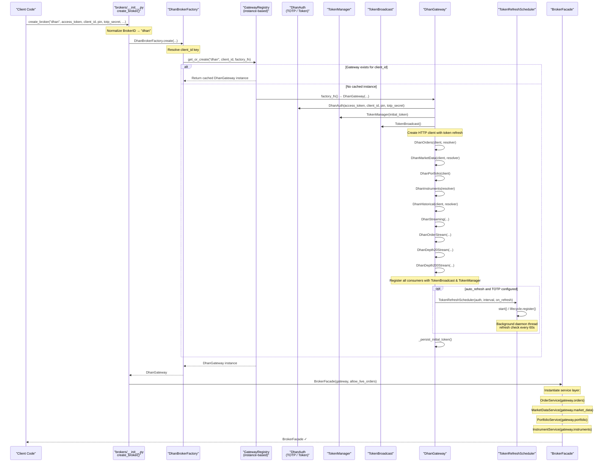
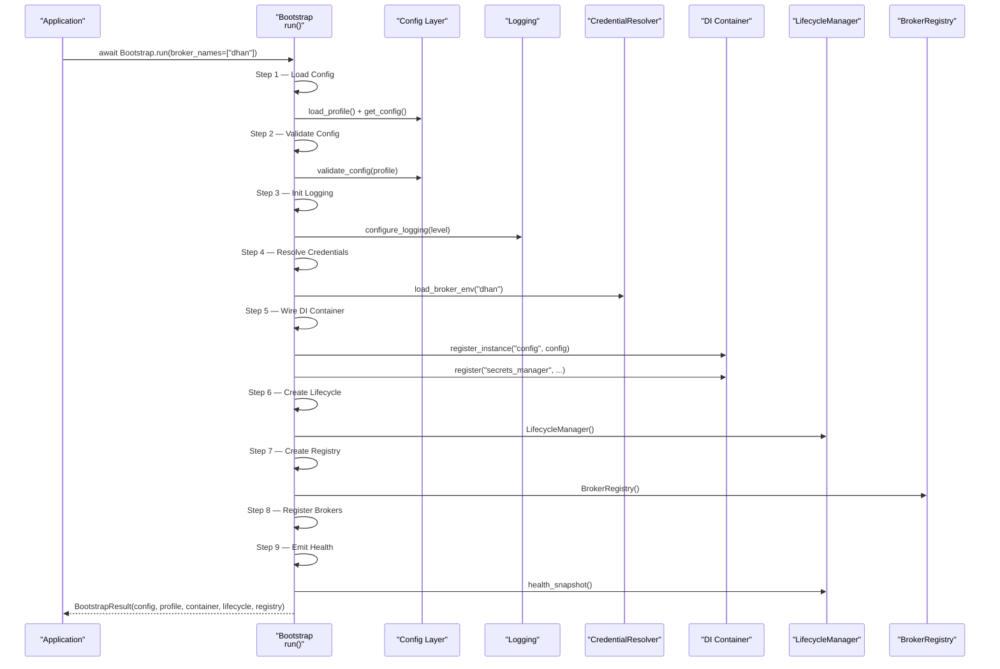
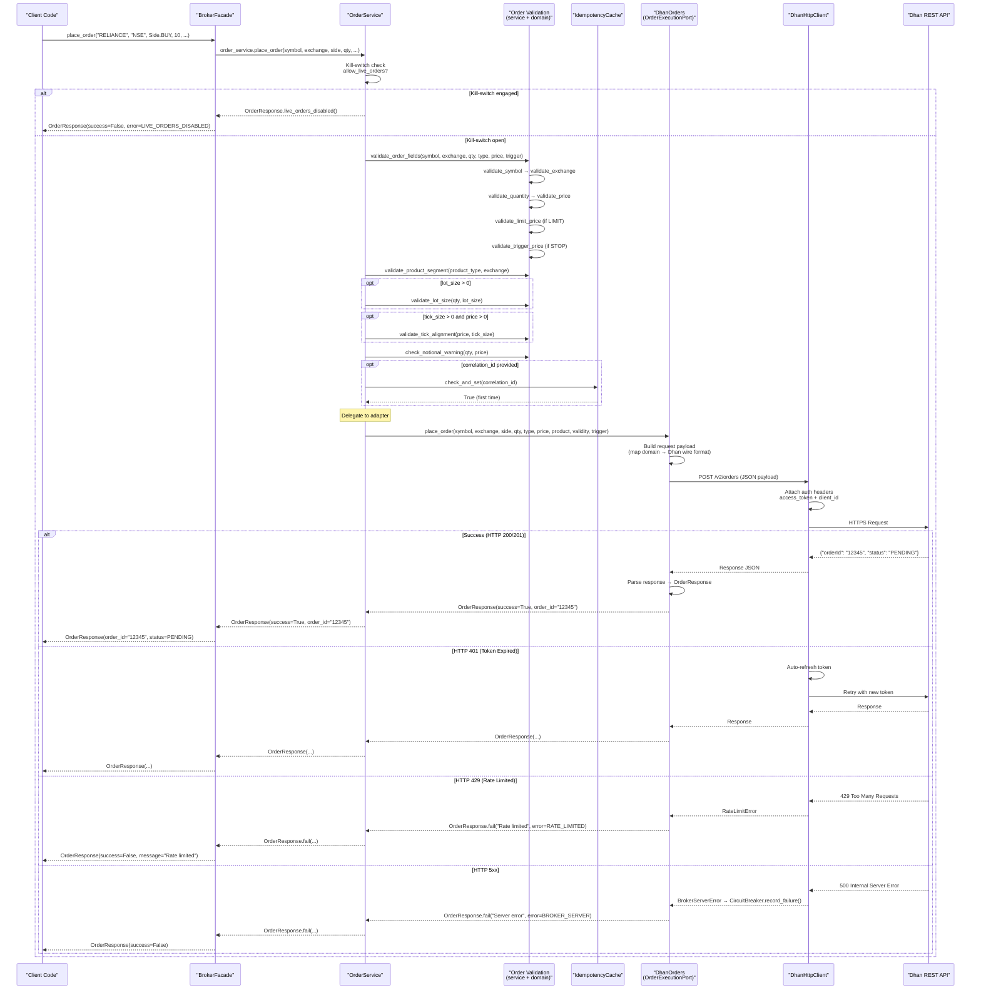
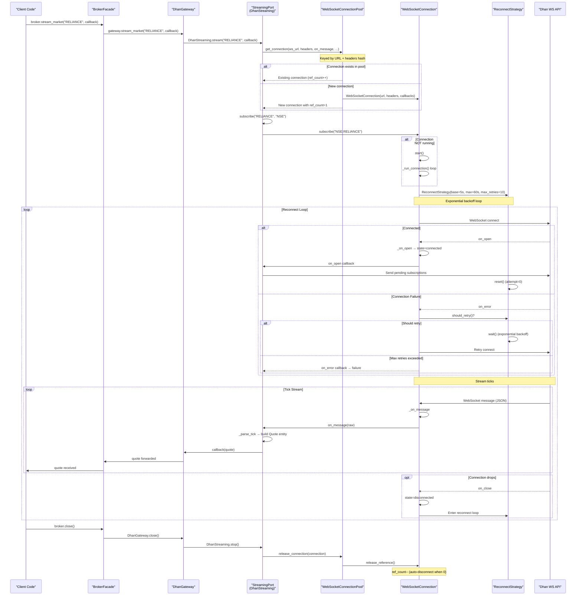
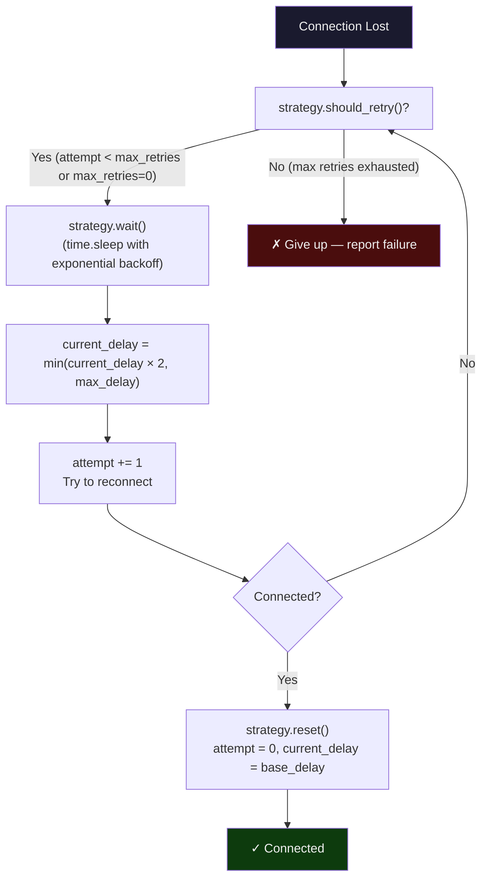
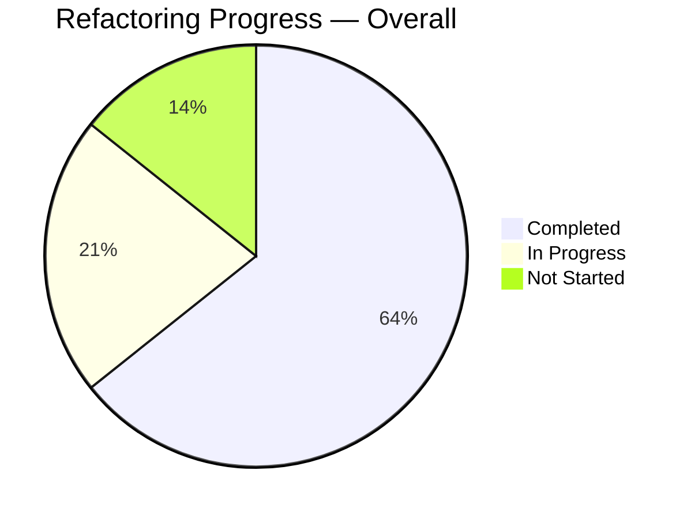

# TradeXV2 `brokers/` — Architecture Diagrams

> **Elite Quantitative Engineering Review Board — Presentation Material**
>
> Architecture: Hexagonal (Ports & Adapters) with Clean Architecture layering.
> Style: Python + `@runtime_checkable Protocol` for all ports.
> Enforcement: pytest architecture tests (`TestBoundaryRules`, `TestPortStructure`, `TestExceptionHierarchy`).

---

## Table of Contents

1. [Layer Architecture Diagram](#1-layer-architecture-diagram)
2. [Package Dependency Graph](#2-package-dependency-graph)
3. [Startup Bootstrap Flow](#3-startup-bootstrap-flow)
4. [Order Placement Flow](#4-order-placement-flow)
5. [WebSocket Streaming Lifecycle](#5-websocket-streaming-lifecycle)
6. [Refactoring Completion Dashboard](#6-refactoring-completion-dashboard)
7. [Final Class Diagram](#7-final-class-diagram)

---

## 1. Layer Architecture Diagram

The system follows a strict **Hexagonal (Ports & Adapters)** architecture with **Clean Architecture** layering. Domain entities sit at the core with zero dependencies. Adapters on the outer ring bridge to external broker APIs. Import direction flows **inward only** — enforced by `TestBoundaryRules`.

```mermaid
flowchart TB
    subgraph Outer["🌐 Outer Ring — Adapters"]
        direction TB
        A_Dhan["DhanGateway<br/>DhanOrders · DhanStreaming<br/>DhanMarketData · DhanPortfolio<br/>DhanAuth · DhanInstruments"]
        A_Upstox["UpstoxGateway<br/>UpstoxOrders · UpstoxStreaming<br/>UpstoxMarketData · UpstoxPortfolio<br/>UpstoxAuth · UpstoxInstruments"]
        A_Paper["PaperGateway<br/>In-memory simulation<br/>Zero external deps"]
    end

    subgraph Infra["🛠 Infrastructure Layer"]
        direction TB
        I_Registry["GatewayRegistry (instance-based)<br/>BrokerRegistry (health tracking)<br/>ServiceRegistry (generic)"]
        I_WS["WebSocketConnectionPool<br/>WebSocketConnection<br/>ReconnectingWebSocketRunner"]
        I_Recon["ReconnectStrategy<br/>Exponential backoff<br/>(unified, replaces 3 loops)"]
        I_Bootstrap["Bootstrap<br/>9-step orchestration"]
        I_Lifecycle["LifecycleManager<br/>ManagedService Protocol<br/>HealthStatus"]
        I_InfraMore["Credentials · Logging<br/>SecretManager · EventBus<br/>TokenBroadcast · Correlation"]
    end

    subgraph Resilience["⚡ Resilience Layer"]
        R_CB["CircuitBreaker<br/>CLOSED / HALF_OPEN / OPEN"]
        R_RL["TokenBucketRateLimiter"]
        R_Retry["RetryPolicy"]
        R_Token["TokenManager<br/>TokenRefreshScheduler"]
    end

    subgraph Services["📋 Application Services"]
        S_Facade["BrokerFacade<br/>(primary entry point)"]
        S_Order["OrderService<br/>Validation + Idempotency + Kill-switch"]
        S_MD["MarketDataService<br/>TTL-based caching"]
        S_Port["PortfolioService<br/>PnL aggregation"]
        S_Inst["InstrumentService<br/>Auto-load + fuzzy search"]
        S_Recon["ReconciliationEngine<br/>Drift detection"]
    end

    subgraph Ports["🔌 Ports (Protocols)"]
        direction TB
        P_Broker["BrokerGateway<br/>(composition root)"]
        P_Narrow["OrderExecutionPort<br/>MarketDataPort<br/>PortfolioPort<br/>InstrumentPort<br/>AuthPort<br/>HistoricalPort<br/>StreamingPort"]
        P_Ext["ExtensionRegistryPort<br/>EventPublisherPort<br/>RiskManagerPort<br/>ClockPort<br/>ConnectionLifecyclePort<br/>TokenStorePort<br/>HttpClientPort"]
        P_Cap["Capability providers:<br/>MarginProvider · SuperOrderProvider<br/>ForeverOrderProvider · LedgerProvider<br/>EDISTransferProvider · UserProfileProvider<br/>ConditionalTriggerProvider · etc."]
    end

    subgraph Config["⚙️ Config Layer"]
        C_Defaults["defaults.py · schema.py<br/>endpoints.py · indices.py"]
        C_Flags["feature_flags.py"]
        C_Validator["validator.py · ValidationProfile<br/>DEV / STAGING / PROD"]
        C_Secrets["secrets_manager.py"]
    end

    subgraph Core["🧠 Core — Zero Dependencies"]
        direction TB
        D_Domain["Domain Layer"]
        C_Utils["utils/<br/>price.py · idempotency_cache.py"]
        C_Core["core/<br/>di.py (Container) · di_scopes.py<br/>order_result_cache.py"]
    end

    subgraph Domain["📦 Domain Layer"]
        D_Ent["entities.py<br/>Order · Quote · Position · Holding<br/>Balance · Trade · MarketDepth<br/>OptionChain · Candle · etc.<br/>(all frozen dataclasses)"]
        D_Enum["enums.py<br/>Side · OrderType · OrderStatus<br/>ProductType · Validity<br/>AuthMode · BrokerID"]
        D_Except["exceptions.py<br/>TradeXV2Error (root)<br/>30+ exception types"]
        D_ErrCode["error_codes.py<br/>12 canonical string codes"]
        D_Events["events.py · DomainEvent"]
        D_Cap["capabilities.py<br/>BrokerCapabilities<br/>RateLimitProfile · StreamLimitProfile"]
        D_Valid["validators/order_validator.py<br/>Pure validation functions"]
        D_Lifecycle["order_lifecycle.py<br/>State machine transitions<br/>validate_transition()"]
        D_Const["constants/exchanges.py<br/>segments.py"]
    end

    %% Import direction arrows — INWARD only
    linkstyle default stroke-width:2px

    %% Adapters → Infrastructure + Ports + Domain
    A_Dhan --> I_Registry
    A_Dhan --> I_WS
    A_Dhan --> I_Recon
    A_Dhan --> I_Lifecycle
    A_Dhan --> I_InfraMore
    A_Dhan -->|"implements"| P_Broker
    A_Dhan -->|"implements"| P_Narrow
    A_Dhan -->|"implements"| P_Ext
    A_Dhan --> D_Domain

    A_Upstox --> I_Registry
    A_Upstox --> I_WS
    A_Upstox --> I_Recon
    A_Upstox --> I_Lifecycle
    A_Upstox -->|"implements"| P_Broker
    A_Upstox -->|"implements"| P_Narrow
    A_Upstox --> D_Domain

    A_Paper --> D_Domain
    A_Paper -->|"implements"| P_Broker
    A_Paper -->|"implements"| P_Narrow

    %% Infrastructure → Domain + Ports + Resilience
    I_Registry --> R_CB
    I_Registry --> D_Domain
    I_WS --> I_Recon
    I_WS --> D_Domain
    I_Bootstrap --> C_Defaults
    I_Bootstrap --> I_InfraMore
    I_Bootstrap --> C_Core
    I_Bootstrap --> I_Lifecycle
    I_Bootstrap --> I_Registry
    I_Lifecycle --> D_Domain

    %% Resilience → Domain
    R_CB --> D_Domain
    R_RL --> D_Domain
    R_Retry --> D_Domain
    R_Token --> D_Domain

    %% Services → Ports + Domain + Utils
    S_Facade --> P_Broker
    S_Facade --> S_Order
    S_Facade --> S_MD
    S_Facade --> S_Port
    S_Facade --> S_Inst
    S_Facade --> D_Domain
    S_Facade --> C_Utils

    S_Order --> P_Narrow
    S_Order --> D_Domain
    S_Order --> C_Utils
    S_Order --> S_Recon

    S_MD --> P_Narrow
    S_MD --> D_Domain

    S_Port --> P_Narrow
    S_Port --> D_Domain

    S_Inst --> P_Narrow

    %% Ports → Domain only
    P_Broker --> D_Domain
    P_Narrow --> D_Domain
    P_Ext --> D_Domain
    P_Cap --> D_Domain

    %% Config → Domain only
    C_Defaults --> D_Domain
    C_Flags --> D_Domain
    C_Validator --> D_Domain
    C_Secrets --> D_Domain

    %% Core → zero outward arrows (zero deps)
    %% Utils → zero outward arrows (zero deps)

    %% Styling
    classDef outer fill:#1a1a2e,stroke:#e94560,stroke-width:2px,color:#eee
    classDef infra fill:#16213e,stroke:#0f3460,stroke-width:2px,color:#eee
    classDef resilience fill:#1b1b2f,stroke:#e43f5a,stroke-width:2px,color:#eee
    classDef services fill:#0f3460,stroke:#53d8fb,stroke-width:2px,color:#eee
    classDef ports fill:#1a3a3a,stroke:#2ecc71,stroke-width:2px,color:#eee
    classDef config fill:#2c1810,stroke:#e67e22,stroke-width:2px,color:#eee
    classDef core fill:#1a1a2e,stroke:#f0c75e,stroke-width:2px,color:#eee
    classDef domain fill:#0d1b2a,stroke:#2ecc71,stroke-width:3px,color:#eee

    class A_Dhan,A_Upstox,A_Paper outer
    class I_Registry,I_WS,I_Recon,I_Bootstrap,I_Lifecycle,I_InfraMore infra
    class R_CB,R_RL,R_Retry,R_Token resilience
    class S_Facade,S_Order,S_MD,S_Port,S_Inst,S_Recon services
    class P_Broker,P_Narrow,P_Ext,P_Cap ports
    class C_Defaults,C_Flags,C_Validator,C_Secrets config
    class D_Domain,C_Utils,C_Core core
    class D_Ent,D_Enum,D_Except,D_ErrCode,D_Events,D_Cap,D_Valid,D_Lifecycle,D_Const domain
```

---

## 2. Package Dependency Graph

Each package shown with its key contents. Arrows indicate **compile-time import dependencies** (direction of arrows = "depends on"). All arrows point **inward** toward the domain.

```mermaid
flowchart LR
    subgraph adapters["adapters/"]
        direction TB
        A_Dhan["dhan/<br/>DhanGateway · DhanOrders · DhanStreaming<br/>DhanMarketData · DhanAuth<br/>DhanPortfolio · DhanInstruments<br/>DhanOptions · DhanFutures<br/>factory.py · streaming.py<br/>gateway.py (246-line __init__)"]
        A_Upstox["upstox/<br/>UpstoxGateway · UpstoxOrders<br/>UpstoxStreaming · UpstoxMarketData<br/>UpstoxPortfolio · UpstoxAuth<br/>UpstoxInstruments · UpstoxOptions<br/>feed_authorizer.py · streaming.py"]
        A_Paper["paper/<br/>PaperGateway · In-memory"]
        A_Base["base_streaming.py<br/>BaseWebSocketStreaming"]
    end

    subgraph infrastructure["infrastructure/"]
        direction TB
        I_Reg["registry.py<br/>GatewayRegistry (instance)<br/>BrokerRegistry · ServiceRegistry"]
        I_Boot["bootstrap.py<br/>Bootstrap · BootstrapResult<br/>9-step run()"]
        I_WS["websocket_pool.py<br/>WebSocketConnectionPool<br/>WebSocketConnection"]
        I_WSR["websocket_runner.py<br/>ReconnectingWebSocketRunner"]
        I_Recon["reconnect_strategy.py<br/>ReconnectStrategy"]
        I_Life["lifecycle.py<br/>LifecycleManager<br/>ManagedService Protocol"]
        I_More["logging.py · credentials.py<br/>secret_manager.py<br/>token_broadcast.py<br/>ssl_hardening.py<br/>correlation.py · jwt_expiry.py<br/>totp_cooldown.py<br/>event_bus.py"]
    end

    subgraph resilience["resilience/"]
        direction TB
        R_CB["circuit_breaker.py<br/>CircuitBreaker · CircuitState"]
        R_RL["rate_limiter.py<br/>TokenBucketRateLimiter"]
        R_Ret["retry.py<br/>RetryPolicy"]
        R_TM["token_manager.py<br/>TokenManager"]
        R_TS["token_scheduler.py<br/>TokenRefreshScheduler"]
    end

    subgraph services["services/"]
        direction TB
        S_Fac["broker_facade.py<br/>BrokerFacade"]
        S_Ord["order_service.py<br/>OrderService"]
        S_MD["market_data_service.py<br/>MarketDataService"]
        S_Port["portfolio_service.py<br/>PortfolioService"]
        S_Inst["instrument_service.py<br/>InstrumentService"]
        S_Rec["reconciliation.py<br/>ReconciliationEngine"]
        S_Val["order_validation.py<br/>(delegates to domain)"]
    end

    subgraph ports["ports/"]
        direction TB
        P_Broker["broker.py<br/>BrokerGateway (Protocol)"]
        P_Narrow["order_execution.py · market_data.py<br/>portfolio.py · instruments.py<br/>auth.py · historical.py<br/>streaming.py"]
        P_Ext["extension_registry.py<br/>event_publisher.py<br/>risk_manager.py<br/>http_client_port.py<br/>clock.py · token_store.py<br/>connection_lifecycle.py"]
        P_Cap["capabilities.py<br/>12 provider Protocols"]
    end

    subgraph config["config/"]
        direction TB
        C_Def["defaults.py<br/>get_config()"]
        C_EP["endpoints.py"]
        C_FF["feature_flags.py"]
        C_Val["validator.py<br/>validate_config()"]
        C_Sec["secrets_manager.py"]
        C_Sch["schema.py"]
    end

    subgraph core["core/"]
        direction TB
        D_DI["di.py · di_scopes.py<br/>Container · Scope<br/>Module singleton container"]
        D_ORC["order_result_cache.py"]
    end

    subgraph utils["utils/"]
        direction TB
        U_Price["price.py<br/>to_wire_float()"]
        U_Idem["idempotency_cache.py<br/>TypedIdempotencyCache"]
    end

    subgraph domain["domain/"]
        direction TB
        D_Ent["entities.py<br/>Order · Quote · Position · Holding<br/>Balance · Trade · MarketDepth<br/>OptionChain · OptionsLeg · Candle<br/>OrderRequest · InstrumentInfo"]
        D_Enum["enums.py<br/>Side · OrderType · OrderStatus<br/>ProductType · Validity · AuthMode<br/>BrokerID"]
        D_Ex["exceptions.py<br/>TradeXV2Error (root)<br/>30+ exception classes"]
        D_EC["error_codes.py<br/>12 string constants"]
        D_Evt["events.py<br/>DomainEvent"]
        D_Cap["capabilities.py<br/>BrokerCapabilities"]
        D_Life["order_lifecycle.py<br/>State machine transitions"]
        D_Valid["validators/order_validator.py<br/>Pure validation functions"]
        D_Const["constants/<br/>exchanges.py · segments.py"]
    end

    %% Dependencies
    adapters --> infrastructure
    adapters --> resilience
    adapters --> ports
    adapters --> domain

    infrastructure --> resilience
    infrastructure --> config
    infrastructure --> core
    infrastructure --> domain

    resilience --> domain

    services --> ports
    services --> domain
    services --> utils

    ports --> domain

    config --> domain

    %% Zero-dependency layers
    %%  core    → (no arrows)
    %%  utils   → (no arrows)
    %%  domain  → (no arrows)

    linkStyle default stroke-width:2px,stroke:#666
```



---

## 3. Startup Bootstrap Flow

The `create_broker()` entry point in `brokers/__init__.py` orchestrates factory creation through `GatewayRegistry`, which enforces per-client-id singletons. The returned gateway is wrapped in `BrokerFacade`, which instantiates the four service-layer objects.



### Bootstrap 9-Step Sequence (Production)



---

## 4. Order Placement Flow

The `BrokerFacade.place_order()` method delegates through `OrderService`, which applies validation, idempotency, and the kill-switch before invoking the adapter's `OrderExecutionPort.place_order()`.



---

## 5. WebSocket Streaming Lifecycle

The streaming subsystem spans the entire stack — from `BrokerFacade` through the `StreamingPort` protocol, into `ReconnectStrategy`, through the `WebSocketConnectionPool`, and out to the broker's WebSocket API.



### Reconnect Strategy Detail



---

## 6. Refactoring Completion Dashboard

Based on the Dependency-Driven Refactoring Roadmap (14 tasks across 7 groups, P1/P2 priority).

```mermaid
xychart-beta
    title "Completion by Refactoring Group"
    x-axis ["Group 1<br/>Vocabulary", "Group 2<br/>Domain", "Group 3<br/>Interfaces", "Group 4<br/>Services", "Group 5<br/>Infrastructure", "Group 6<br/>Features", "Group 7<br/>Cleanup"]
    y-axis "Tasks" 0 --> 3
    bar [3, 2, 1, 1, 1, 0, 1]
    bar [0, 1, 1, 1, 1, 0, 0]
    bar [0, 0, 0, 0, 0, 2, 1]
```





| Group | Description | Completed | In Progress | Not Started | Priority |
|-------|-------------|:---------:|:-----------:|:-----------:|:--------:|
| **1. Vocabulary** | `BrokerID` enum, `SEGMENT_TO_EXCHANGE` constants, `OrderRequest` value object | 3/3 | — | — | P1 |
| **2. Domain** | Validators in `domain/validators/`, state machine in `Order`, typed events | 2/3 | RF-005 (Order state machine) | — | P1 |
| **3. Interfaces** | `TokenStorePort` protocol, `ExtensionRegistry` migration | 1/3 | RF-008 (Facade → ExtensionRegistry) | — | P1 |
| **4. Services** | Narrow `ReconciliationEngine`, kill-switch consolidated | 1/2 | RF-010 (kill-switch to OrderService) | — | P1 |
| **5. Infrastructure** | Instance-level registries, consolidated WebSocket reconnect | 1/2 | RF-011 (DI-managed instances) | — | P1 |
| **6. Features** | `DhanStreamChannel` parameterized class, `DhanGatewayBuilder` | — | — | RF-013, RF-014 | P1 |
| **7. Cleanup** | Remove lazy imports, dead code, deprecated props, URL dict migration | 1/4 | — | RF-016, RF-017, RF-018 | P2 |

### Legend

| Status | Color | Count |
|--------|-------|:-----:|
| ✅ Completed | Green | 9 |
| 🔄 In Progress | Amber | 3 |
| ⬜ Not Started | Gray | 2 |

### Key Wins (Completed)

| ID | Task | Impact |
|----|------|--------|
| RF-001 | `BrokerID` enum in `domain/enums.py` | Type-safe broker selection removed stringly-typed IDs |
| RF-002 | `domain/constants/segments.py` | Eliminated duplicated `SEGMENT_TO_EXCHANGE` in 2 adapters |
| RF-003 | `OrderRequest` value object | Replaced 3 duplicated field sets with single frozen dataclass |
| RF-004 | Domain validators extracted | Pure validation functions in `domain/validators/` |
| RF-007 | `TokenStorePort` Protocol | Token store injectable via port — testable |
| RF-009 | Narrowed `ReconciliationEngine` | Removed `BrokerGateway` import, depends only on 2 ports |
| RF-012 | Consolidated reconnect → `ReconnectStrategy` | Single exponential-backoff class replaces 3 parallel loops |
| RF-015 | Removed lazy import in `Order.validate()` | Clean top-level import |

### Next Priority (In Progress)

| ID | Task | Owner |
|----|------|-------|
| RF-005 | Wire state machine into `Order` entity | Domain team |
| RF-008 | Migrate `BrokerFacade` to `ExtensionRegistry` | Interfaces team |
| RF-010 | Move kill-switch to shared `OrderService` | Services team |
| RF-011 | Replace class-level state with DI-managed instances | Infrastructure team |

---

## 7. Final Class Diagram

Key classes and their relationships across all layers. Note that all ports use structural subtyping (`Protocol` with `@runtime_checkable`), not inheritance.

```mermaid
classDiagram
    %% ── Domain Layer ───────────────────────────────────────────────────────
    class Order {
        <<frozen dataclass>>
        +order_id: str
        +symbol: str
        +exchange: str
        +side: Side
        +quantity: int
        +status: OrderStatus
        +price: Decimal
        +trigger_price: Decimal
        +order_type: OrderType
        +product_type: ProductType
        +validity: Validity
        +filled_quantity: int
        +correlation_id: str
        +validate()
        +is_completed() bool
        +is_active() bool
        +can_modify() bool
        +can_cancel() bool
        +estimated_value() Decimal
        +remaining_quantity() int
        +fill_percentage() Decimal
    }

    class OrderRequest {
        <<frozen dataclass>>
        +symbol: str
        +exchange: str
        +side: Side
        +quantity: int
        +order_type: OrderType
        +price: Decimal
        +product_type: ProductType
        +validity: Validity
        +trigger_price: Decimal
        +correlation_id: str
    }

    class OrderResponse {
        <<frozen dataclass>>
        +order_id: str
        +success: bool
        +message: str
        +status: OrderStatus
        +error_code: str
        +ok(order_id) OrderResponse
        +fail(message) OrderResponse
        +live_orders_disabled() OrderResponse
        +already_executed(order_id) OrderResponse
    }

    class Quote {
        <<frozen dataclass>>
        +symbol: str
        +ltp: Decimal
        +exchange: str
        +open: Decimal
        +high: Decimal
        +low: Decimal
        +close: Decimal
        +volume: int
        +is_stale() bool
        +spread() Decimal
        +vwap() Decimal
    }

    class MarketDepth {
        <<frozen dataclass>>
        +symbol: str
        +bids: tuple~DepthLevel~
        +asks: tuple~DepthLevel~
    }

    class Position {
        <<frozen dataclass>>
        +symbol: str
        +exchange: str
        +quantity: int
        +average_price: Decimal
        +realized_pnl: Decimal
        +unrealized_pnl: Decimal
        +pnl_percentage() Decimal
    }

    class Balance {
        <<frozen dataclass>>
        +available_cash: Decimal
        +utilized_margin: Decimal
        +total_margin: Decimal
    }

    class Holding {
        <<frozen dataclass>>
        +symbol: str
        +exchange: str
        +quantity: int
        +average_price: Decimal
        +isin: str
        +t1_quantity: int
    }

    class BrokerCapabilities {
        <<frozen dataclass>>
        +broker_id: BrokerID
        +supports_place_order: bool
        +supports_cancel_order: bool
        +supports_historical_data: bool
        +supports_live_market_data: bool
        +supports_depth: bool
        +supports_option_chain: bool
        +rate_limit_profiles: tuple
        +stream_limits: StreamLimitProfile
        +supports(feature) bool
    }

    class Side {
        <<enumeration>>
        BUY
        SELL
    }

    class OrderStatus {
        <<enumeration>>
        PENDING
        OPEN
        PARTIALLY_FILLED
        FILLED
        CANCELLED
        PARTIALLY_CANCELLED
        EXPIRED
        REJECTED
    }

    class OrderType {
        <<enumeration>>
        MARKET
        LIMIT
        STOP_LOSS
        STOP_LOSS_MARKET
    }

    class ProductType {
        <<enumeration>>
        INTRADAY
        DELIVERY
        MARGIN
    }

    class Validity {
        <<enumeration>>
        DAY
        IOC
        GTT
    }

    class BrokerID {
        <<enumeration>>
        DHAN
        UPSTOX
        PAPER
    }

    class TradeXV2Error {
        <<exception root>>
    }
    class ValidationError
    class BrokerError
    class OrderRejectedError
    class AuthenticationError
    class RateLimitError
    class NetworkError
    class CircuitOpenError

    TradeXV2Error <|-- ValidationError
    TradeXV2Error <|-- BrokerError
    TradeXV2Error <|-- DataError
    TradeXV2Error <|-- ConfigError
    BrokerError <|-- OrderRejectedError
    BrokerError <|-- AuthenticationError
    BrokerError <|-- RateLimitError
    BrokerError <|-- NetworkError
    BrokerError <|-- CircuitOpenError
    BrokerError <|-- BrokerDegradedError
    BrokerError <|-- NotSupportedError
    BrokerError <|-- InstrumentNotFoundError
    BrokerError <|-- IdempotencyConflictError
    BrokerError <|-- LiveOrdersDisabledError

    %% ── Ports Layer (Protocols) ────────────────────────────────────────────

    class BrokerGateway {
        <<Protocol @runtime_checkable>>
        +broker_id: BrokerID
        +orders: OrderExecutionPort
        +market_data: MarketDataPort
        +portfolio: PortfolioPort
        +instruments: InstrumentPort
        +auth: AuthPort
        +historical: HistoricalPort
        +streaming: StreamingPort
        +capabilities() BrokerCapabilities
        +close()
    }

    class OrderExecutionPort {
        <<Protocol @runtime_checkable>>
        +place_order(...) OrderResponse
        +cancel_order(order_id) OrderResponse
        +get_order(order_id) Order | None
        +get_orderbook() list~Order~
    }

    class MarketDataPort {
        <<Protocol @runtime_checkable>>
        +ltp(symbol, exchange) Decimal
        +quote(symbol, exchange) Quote
        +depth(symbol, exchange) MarketDepth
    }

    class PortfolioPort {
        <<Protocol @runtime_checkable>>
        +positions() list~Position~
        +holdings() list~Holding~
        +funds() Balance
        +trades() list~Trade~
    }

    class InstrumentPort {
        <<Protocol @runtime_checkable>>
        +load()
        +search(query, limit) list~InstrumentInfo~
        +resolve(symbol, exchange) InstrumentInfo | None
    }

    class AuthPort {
        <<Protocol @runtime_checkable>>
        +get_token() str | None
        +refresh_token() str | None
        +is_authenticated() bool
    }

    class HistoricalPort {
        <<Protocol @runtime_checkable>>
        +get_historical_candles(...) list~Candle~
    }

    class StreamingPort {
        <<Protocol @runtime_checkable>>
        +connect()
        +disconnect()
        +is_connected: bool
        +subscribe_quotes(symbols, exchange, callback)
        +unsubscribe_quotes(symbols, exchange)
    }

    class ExtensionRegistryPort {
        <<Protocol @runtime_checkable>>
        +register(broker_id, extension_type, instance)
        +resolve(broker_id, extension_type) T | None
        +supports(broker_id, extension_type) bool
    }

    class RiskManagerPort {
        <<Protocol @runtime_checkable>>
        +check_order(request) RiskCheckResult
    }

    %% ── Service Layer ──────────────────────────────────────────────────────

    class BrokerFacade {
        -_gateway: BrokerGateway
        -_order_service: OrderService
        -_market_data_service: MarketDataService
        -_portfolio_service: PortfolioService
        -_instrument_service: InstrumentService
        +broker_id: BrokerID
        +place_order(...) OrderResponse
        +cancel_order(order_id) OrderResponse
        +get_order(order_id) Order | None
        +get_orderbook() list~Order~
        +get_quote(symbol, exchange) Quote
        +ltp(symbol, exchange) Decimal
        +depth(symbol, exchange) MarketDepth
        +get_positions() list~Position~
        +get_holdings() list~Holding~
        +get_balance() Balance
        +search_instruments(query) list~InstrumentInfo~
        +get_instrument(symbol, exchange) InstrumentInfo
        +capabilities() BrokerCapabilities
        +close()
    }

    class OrderService {
        -_executor: OrderExecutionPort
        -_idempotency: TypedIdempotencyCache
        -_allow_live_orders: bool
        +place_order(...) OrderResponse
        +cancel_order(order_id) OrderResponse
        +get_order(order_id) Order | None
        +get_orderbook() list~Order~
    }

    class MarketDataService {
        -_provider: MarketDataPort
        -_cache: dict (TTL-based)
        +ltp(symbol, exchange) Decimal
        +quote(symbol, exchange) Quote
        +depth(symbol, exchange) MarketDepth
        +invalidate(symbol, exchange)
    }

    class PortfolioService {
        -_portfolio: PortfolioPort
        +positions() list~Position~
        +holdings() list~Holding~
        +funds() Balance
        +trades() list~Trade~
        +total_unrealized_pnl() Decimal
        +total_realized_pnl() Decimal
        +net_exposure() Decimal
    }

    class InstrumentService {
        -_instruments: InstrumentPort
        +search(query, limit) list~InstrumentInfo~
        +resolve(symbol, exchange) InstrumentInfo | None
        +reload()
    }

    %% ── Infrastructure ─────────────────────────────────────────────────────

    class GatewayRegistry {
        -_instances: dict (instance-level)
        -_lock: RLock
        +get_or_create(broker_id, client_id, factory_fn) Any
        +clear()
    }

    class BrokerRegistry {
        -_gateways: dict
        -_health: dict~str, BrokerHealthSnapshot~
        +register(broker_id, gateway)
        +deregister(broker_id)
        +get_gateway(broker_id) Any
        +get_health(broker_id) BrokerHealthSnapshot
        +update_health(snapshot)
        +close_all()
    }

    class ReconnectStrategy {
        -_base_delay: float
        -_max_delay: float
        -_max_retries: int
        -_attempt: int
        -_current_delay: float
        +should_retry() bool
        +wait()
        +reset()
        +attempt: int
    }

    class WebSocketConnectionPool {
        -_instances: dict (class-level)
        +get_connection(...) WebSocketConnection
        +release_connection(connection)
        +get_pool_stats() dict
        +cleanup()
    }

    class WebSocketConnection {
        +ws_url: str
        +headers: dict
        +connection_state: str
        +reference_count: int
        +start()
        +stop()
        +subscribe(key)
        +unsubscribe(key)
        +add_reference()
        +release_reference()
    }

    class LifecycleManager {
        -_services: dict~str, ManagedService~
        -_started: set
        +register(service)
        +unregister(name)
        +start_all()
        +stop_all()
        +health_snapshot() dict
    }

    class TokenManager {
        -_token: str
        -_consumers: list
        +register_consumer(consumer)
        +update_token(token)
        +get_token() str | None
    }

    class DictExtensionRegistry {
        -_extensions: dict~str, dict~type, object~~
        +register(broker_id, extension_type, instance)
        +resolve(broker_id, extension_type) T | None
        +supports(broker_id, extension_type) bool
    }
    DictExtensionRegistry ..|> ExtensionRegistryPort

    class Bootstrap {
        +run(broker_names, skip_validation) BootstrapResult
    }

    class ServiceRegistry~T~ {
        -_entries: list~_RegistryEntry~
        -_instances: dict
        +register(attr_name, factory, *args, **kwargs)
        +instantiate_all() dict
        +get(attr_name) T | None
    }

    %% ── Adapters — Dhan ────────────────────────────────────────────────────

    class DhanGateway {
        -_auth: DhanAuth
        -_client: DhanHttpClient
        -_token_manager: TokenManager
        -_broadcast: TokenBroadcast
        -_orders: DhanOrders
        -_market_data: DhanMarketData
        -_portfolio: DhanPortfolio
        -_instruments: DhanInstruments
        -_historical: DhanHistorical
        -_streaming: DhanStreaming
        -_order_stream: DhanOrderStream
        -_depth20_stream: DhanDepth20Stream
        -_depth200_stream: DhanDepth200Stream
        -_scheduler: TokenRefreshScheduler
        -_resolver: DhanInstrumentResolver
        +broker_id: BrokerID
        +capabilities() BrokerCapabilities
        +orders: DhanOrders
        +market_data: DhanMarketData
        +portfolio: DhanPortfolio
        +instruments: DhanInstruments
        +auth: DhanAuth
        +historical: DhanHistorical
        +streaming: DhanStreaming
        +close()
    }

    class DhanOrders {
        -_client: DhanHttpClient
        -_resolver: DhanInstrumentResolver
        -_event_bus: EventPublisherPort
        -_risk_manager: RiskManagerPort
        +place_order(...) OrderResponse
        +cancel_order(order_id) OrderResponse
        +get_order(order_id) Order | None
        +get_orderbook() list~Order~
    }

    class DhanMarketData {
        -_client: DhanHttpClient
        -_resolver: DhanInstrumentResolver
        +ltp(symbol, exchange) Decimal
        +quote(symbol, exchange) Quote
        +depth(symbol, exchange) MarketDepth
    }

    class DhanStreaming {
        -_ws_url: str
        -_access_token: callable
        -_client_id: str
        +stream(symbol, exchange, mode, on_tick) StreamHandle
        +connect()
        +disconnect()
        +subscribe_quotes(symbols, exchange, callback)
        +unsubscribe_quotes(symbols, exchange)
    }

    %% ── Adapters — Upstox ──────────────────────────────────────────────────

    class UpstoxGateway {
        -_auth: UpstoxAuth
        -_client: UpstoxHttpClient
        -_feed_authorizer: UpstoxFeedAuthorizer
        -_orders: UpstoxOrders
        -_market_data: UpstoxMarketData
        -_portfolio: UpstoxPortfolio
        -_instruments: UpstoxInstruments
        -_historical: UpstoxHistorical
        -_streaming: UpstoxStreaming
        -_portfolio_stream: UpstoxPortfolioStream
        -_news: UpstoxNews
        -_options: UpstoxOptions
        -_gtt: UpstoxGtt
        +broker_id: BrokerID
        +orders: UpstoxOrders
        +market_data: UpstoxMarketData
        +portfolio: UpstoxPortfolio
        +instruments: UpstoxInstruments
        +streaming: UpstoxStreaming
        +close()
    }

    %% ── Adapters — Paper ───────────────────────────────────────────────────

    class PaperGateway {
        -_orders: _PaperOrders
        -_market_data: _PaperMarketData
        -_portfolio: _PaperPortfolio
        -_instruments: _PaperInstruments
        -_auth: _PaperAuth
        -_historical: _PaperHistorical
        -_streaming: _PaperStreaming
        +broker_id: BrokerID
        +orders: _PaperOrders
        +market_data: _PaperMarketData
        +portfolio: _PaperPortfolio
        +instruments: _PaperInstruments
        +auth: _PaperAuth
        +historical: _PaperHistorical
        +streaming: _PaperStreaming
        +close()
    }

    %% ── Resilience ─────────────────────────────────────────────────────────

    class CircuitBreaker {
        -_state: CircuitState
        -_failure_count: int
        -_success_count: int
        -_last_failure_time: float
        +config: CircuitBreakerConfig
        +metrics: CircuitBreakerMetrics
        +state: CircuitState
        +allow_request() bool
        +call(fn, ignored_exceptions) Any
        +record_success()
        +record_failure()
        +reset()
    }

    class TokenBucketRateLimiter {
        +acquire() bool
        +acquire_blocking()
    }

    class RetryPolicy {
        +execute(fn) Any
    }

    class TokenRefreshScheduler {
        -_auth: AuthPort
        -_interval_seconds: int
        +start()
        +stop()
        +health() HealthStatus
    }

    %% ── Domain Events ──────────────────────────────────────────────────────

    class DomainEvent {
        <<frozen dataclass>>
        +event_type: str
        +payload: dict
        +symbol: str | None
        +source: str | None
        +timestamp: datetime
        +now(event_type, payload) DomainEvent
    }

    class EventPublisherPort {
        <<Protocol>>
        +publish(event)
        +subscribe(event_type, handler)
    }

    %% ── Lifecycle Health ───────────────────────────────────────────────────

    class HealthStatus {
        <<frozen dataclass>>
        +state: HealthState
        +service: str
        +detail: str
        +last_check: datetime
    }

    class HealthState {
        <<enumeration>>
        STOPPED
        STARTING
        HEALTHY
        DEGRADED
        UNHEALTHY
        STOPPING
        FAILED
    }

    class ManagedService {
        <<Protocol>>
        +name: str
        +start()
        +stop(timeout)
        +health() HealthStatus
    }

    %% ── Relationships ──────────────────────────────────────────────────────

    %% Adapters implement Protocols (structural subtyping, not inheritance)
    DhanGateway ..|> BrokerGateway
    UpstoxGateway ..|> BrokerGateway
    PaperGateway ..|> BrokerGateway

    DhanOrders ..|> OrderExecutionPort
    DhanMarketData ..|> MarketDataPort
    DhanStreaming ..|> StreamingPort

    UpstoxOrders ..|> OrderExecutionPort
    UpstoxMarketData ..|> MarketDataPort
    UpstoxStreaming ..|> StreamingPort

    PaperGateway ..|> OrderExecutionPort
    PaperGateway ..|> MarketDataPort
    PaperGateway ..|> PortfolioPort
    PaperGateway ..|> InstrumentPort
    PaperGateway ..|> AuthPort
    PaperGateway ..|> HistoricalPort
    PaperGateway ..|> StreamingPort

    %% Composition — BrokerFacade owns services
    BrokerFacade *--> OrderService
    BrokerFacade *--> MarketDataService
    BrokerFacade *--> PortfolioService
    BrokerFacade *--> InstrumentService

    %% Composition — Services own ports
    OrderService *--> OrderExecutionPort
    MarketDataService *--> MarketDataPort
    PortfolioService *--> PortfolioPort
    InstrumentService *--> InstrumentPort

    %% Composition — DhanGateway owns sub-adapters
    DhanGateway *--> DhanOrders
    DhanGateway *--> DhanMarketData
    DhanGateway *--> DhanStreaming
    DhanGateway *--> TokenManager
    DhanGateway o--> TokenRefreshScheduler

    %% Composition — UpstoxGateway owns sub-adapters
    UpstoxGateway *--> UpstoxOrders
    UpstoxGateway *--> UpstoxMarketData
    UpstoxGateway *--> UpstoxStreaming

    %% Infrastructure composition
    WebSocketConnectionPool o--> WebSocketConnection
    LifecycleManager *--> ManagedService
    BrokerRegistry *--> DhanGateway
    BrokerRegistry *--> UpstoxGateway

    %% Resilience uses domain exceptions
    CircuitBreaker --> CircuitOpenError
    TokenRefreshScheduler ..|> ManagedService

    %% Domain relationships
    Order --> OrderStatus
    Order --> OrderType
    Order --> Side
    Order --> ProductType
    Order --> Validity

    %% Dependencies
    BrokerFacade --> BrokerGateway
    BrokerFacade --> BrokerCapabilities
    DhanOrders --> OrderResponse
    DhanOrders --> Order
    DhanMarketData --> Quote
    DhanMarketData --> MarketDepth

    %% Service dependencies
    OrderService --> OrderExecutionPort
    OrderService --> OrderResponse
    OrderService --> Order
    OrderService --> TypedIdempotencyCache
```

---

## Architecture Statistics

| Metric | Value |
|--------|:-----:|
| **Total packages** | 9 |
| **Total modules** | ~145 |
| **Port Protocols** | 18 |
| **Broker adapters** | 3 (Dhan, Upstox, Paper) |
| **Domain entities** | 19 frozen dataclasses |
| **Domain exceptions** | 16 exception classes |
| **Exception hierarchy depth** | 3 (TradeXV2Error → BrokerError → Concrete) |
| **Architecture tests** | TestBoundaryRules, TestPortStructure, TestExceptionHierarchy |
| **Test count bar** | 781+ tests, 0 regressions |
| **Port Protocol rules** | `@runtime_checkable`, inherit `Protocol`, exported from `ports/__init__.py` |
| **Import direction** | INWARD only — enforced by test |
| **Zero-dependency layers** | `domain/`, `core/`, `utils/` |
| **Refactoring completion** | 9/14 tasks completed (64%) |

---

*Generated for the Elite Quantitative Engineering Review Board. All diagrams reflect the actual source code structure at `brokers/`. Last updated: 2026-07-03.*
