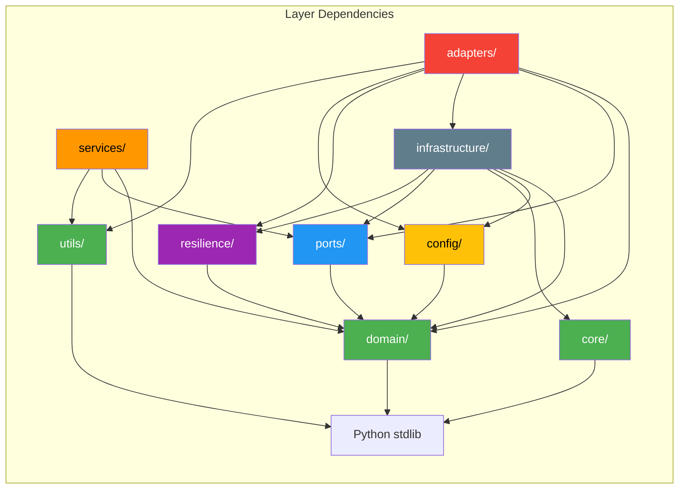
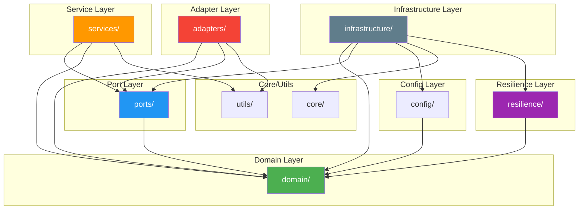

# Elite Quantitative Engineering Review Board — Complete Architectural Assessment

## TradeXV2 `brokers/` Module

**Review Date**: 2026-07-03
**Review Board**: Robert C. Martin, Martin Fowler, Eric Evans, Michael Feathers,
Kent Beck, Dr. Venkat Subramaniam, David Farley, Vaughn Vernon, Martin Kleppmann,
Linda Rising

---

## Table of Contents

1. [Executive Architecture Assessment](#1-executive-architecture-assessment)
2. [System Context Diagram](#2-system-context-diagram)
3. [Package Dependency Graph](#3-package-dependency-graph)
4. [Module Dependency Graph](#4-module-dependency-graph)
5. [Responsibility Matrix](#5-responsibility-matrix)
6. [Domain Model Assessment](#6-domain-model-assessment)
7. [Architectural Smell Catalogue](#7-architectural-smell-catalogue)
8. [Shotgun Surgery Report](#8-shotgun-surgery-report)
9. [Coupling Analysis](#9-coupling-analysis)
10. [SOLID Audit](#10-solid-audit)
11. [Clean Architecture Audit](#11-clean-architecture-audit)
12. [DDD Audit](#12-ddd-audit)
13. [Root Cause Analysis](#13-root-cause-analysis)
14. [Dependency-Driven Refactoring Roadmap](#14-dependency-driven-refactoring-roadmap)
15. [Future-State Architecture](#15-future-state-architecture)
16. [Engineering Standards](#16-engineering-standards)
17. [Architectural Guardrails](#17-architectural-guardrails)
18. [Migration Strategy](#18-migration-strategy)
19. [Risk Assessment](#19-risk-assessment)
20. [Final Architecture Review Board Verdict](#20-final-architecture-review-board-verdict)

---

## 1. Executive Architecture Assessment

### Architecture Grade: **A-** (Excellent foundation with actionable improvements)

**Strengths**:
- Textbook Hexagonal (Ports & Adapters) architecture with machine-enforced boundaries
- 37 architecture tests verify layer separation via AST analysis
- 14 narrow port protocols with `@runtime_checkable` — excellent ISP compliance
- Clean exception hierarchy (16 classes) with error codes
- Rich domain entities with behavior methods (recently enriched)
- Comprehensive resilience patterns (circuit breaker, rate limiter, retry, token management)
- 1134+ passing tests with separate architecture/integration/unit markers
- Production-grade bootstrap with 9-step startup, health snapshots, lifecycle management

**Critical Issues** (must fix before production):
1. **Domain logic leaks into adapters** — `PlaceOrderUseCase.validate()` in `adapters/dhan/use_cases/place_order.py` contains validation rules that belong in the domain
2. **Gateway constructors violate SRP** — Both `DhanGateway.__init__` (115+ lines) and `UpstoxGateway.__init__` (118+ lines) do too much
3. **`BrokerFacade` uses `hasattr` duck typing** — 4 gates prevent OCP compliance
4. **Adapter imports `services/`** — `adapters/dhan/use_cases/place_order.py:21` violates hexagonal boundaries
5. **Global mutable state** — `GatewayRegistry`, `WebSocketConnectionPool`, `SecretManager` all use class-level state
6. **3 WebSocket reconnect implementations** — Triple duplication of exponential backoff logic
7. **Shared vocabulary missing** — `PlaceOrderRequest`, `Order`, `RiskCheckRequest` share 70% of fields but are independent

**Recommended Priority Order**:
1. Fix shared mutable state (test reliability) → RC-5
2. Adopt ExtensionRegistry (remove hasattr) → RC-6
3. Fix boundary violations → RC-2
4. Consolidate domain vocabulary → RC-1
5. Reclaim domain logic → RC-8
6. Unify streaming channels → RC-3
7. Refactor gateway constructors → RC-7
8. Wire state machine → RC-9
9. Fix primitive obsession → RC-4

---

## 2. System Context Diagram

```mermaid
graph TB
    subgraph "External Systems"
        DHAN_API["Dhan REST API<br/>api.dhan.co"]
        UPSTOX_API["Upstox REST API<br/>api.upstox.com"]
        DHAN_WS["Dhan WebSocket<br/>depth-api-feed.dhan.co"]
        UPSTOX_WS["Upstox WebSocket<br/>api-hft.upstox.com"]
        ENV["Environment<br/>.env files"]
    end

    subgraph "brokers/ package (Hexagonal Architecture)"
        subgraph "Domain Layer"
            DOMAIN_ENTITIES["domain/entities.py<br/>Order, Quote, Position..."]
            DOMAIN_ENUMS["domain/enums.py<br/>Side, OrderType..."]
            DOMAIN_EXC["domain/exceptions.py<br/>TradeXV2Error hierarchy"]
            DOMAIN_STATE["domain/order_lifecycle.py<br/>State Machine"]
            DOMAIN_CAP["domain/capabilities.py<br/>BrokerCapabilities"]
        end

        subgraph "Port Layer"
            PORT_BROKER["ports/broker.py<br/>BrokerGateway Protocol"]
            PORT_AUTH["ports/auth.py<br/>AuthPort"]
            PORT_MD["ports/market_data.py<br/>MarketDataPort"]
            PORT_ORD["ports/order_execution.py<br/>OrderExecutionPort"]
            PORT_PF["ports/portfolio.py<br/>PortfolioPort"]
            PORT_INST["ports/instruments.py<br/>InstrumentPort"]
            PORT_HIST["ports/historical.py<br/>HistoricalPort"]
            PORT_STR["ports/streaming.py<br/>StreamingPort"]
            PORT_CAP["ports/capabilities.py<br/>Extension Protocols"]
            PORT_REG["ports/extension_registry.py<br/>ExtensionRegistry"]
        end

        subgraph "Service Layer"
            FACADE["services/broker_facade.py<br/>BrokerFacade"]
            ORD_SVC["services/order_service.py<br/>OrderService"]
            MD_SVC["services/market_data_service.py<br/>MarketDataService"]
            INST_SVC["services/instrument_service.py<br/>InstrumentService"]
            PF_SVC["services/portfolio_service.py<br/>PortfolioService"]
            RECON["services/reconciliation.py<br/>ReconciliationEngine"]
        end

        subgraph "Adapter Layer"
            DHAN["adapters/dhan/<br/>DhanGateway"]
            UPSTOX["adapters/upstox/<br/>UpstoxGateway"]
            PAPER["adapters/paper/<br/>PaperGateway"]
            WS_BASE["adapters/base_streaming.py<br/>BaseWebSocketStreaming"]
        end

        subgraph "Infrastructure Layer"
            HTTP["infrastructure/http/resilient_client.py<br/>ResilientHttpClient"]
            LIFE["infrastructure/lifecycle.py<br/>LifecycleManager"]
            REG["infrastructure/registry.py<br/>BrokerRegistry"]
            EVENT["infrastructure/event_bus.py<br/>EventBus"]
            CRED["infrastructure/credentials.py<br/>CredentialResolver"]
            SECRET["infrastructure/secret_manager.py<br/>SecretManager"]
            BOOT["infrastructure/bootstrap.py<br/>Bootstrap"]
        end

        subgraph "Resilience Layer"
            CB["resilience/circuit_breaker.py<br/>CircuitBreaker"]
            RL["resilience/rate_limiter.py<br/>TokenBucketRateLimiter"]
            RET["resilience/retry.py<br/>RetryPolicy"]
            TK["resilience/token_manager.py<br/>TokenManager"]
            TKS["resilience/token_scheduler.py<br/>TokenRefreshScheduler"]
        end

        subgraph "Config Layer"
            EP["config/endpoints.py<br/>Dhan, Upstox URLs"]
            FF["config/feature_flags.py<br/>FeatureFlags"]
            IDX["config/indices.py<br/>Index Mappings"]
            SCHEMA["config/schema.py<br/>AppConfig"]
        end
    end

    subgraph "Consumer"
        APP["Application / Trader<br/>create_broker()"]
    end

    APP --> FACADE
    FACADE --> ORD_SVC & MD_SVC & INST_SVC & PF_SVC
    ORD_SVC --> PORT_ORD
    MD_SVC --> PORT_MD
    INST_SVC --> PORT_INST
    PF_SVC --> PORT_PF
    FACADE --> PORT_HIST & PORT_BROKER
    
    PORT_BROKER --> PORT_AUTH & PORT_MD & PORT_ORD & PORT_PF & PORT_INST & PORT_HIST & PORT_STR
    PORT_BROKER --> PORT_CAP
    
    DHAN -.-> PORT_BROKER
    UPSTOX -.-> PORT_BROKER
    PAPER -.-> PORT_BROKER

    DHAN --> HTTP & WS_BASE
    UPSTOX --> HTTP & WS_BASE
    DHAN --> DHAN_API & DHAN_WS
    UPSTOX --> UPSTOX_API & UPSTOX_WS

    HTTP --> CB & RL & RET
    HTTP --> TK

    BOOT --> CRED & LIFE & REG & EVENT
    BOOT --> SCHEMA

    APP --> ENV
    CRED --> ENV
```



---

## 3. Package Dependency Graph



**Key Finding**: The dependency graph is almost perfectly layered. The only violations are:
- `adapters/dhan/use_cases/place_order.py` → `services/order_validation.py` (Adapter → Service)
- `adapters/dhan/gateway.py` → `infrastructure/storage/token_store.py` (Adapter → Infrastructure)
- `adapters/dhan/use_cases/place_order.py` → `config/endpoints.py` (Adapter → Config)

---

## 4. Module Dependency Graph

```mermaid
graph TD
    subgraph "Domain Layer"
        ENT["entities.py"]
        ENUMS["enums.py"]
        EXC["exceptions.py"]
        EC["error_codes.py"]
        CAP["capabilities.py"]
        EVT["events.py"]
        OL["order_lifecycle.py"]
        LH["lifecycle_health.py"]
        SYM["symbols.py"]
        CEX["constants/exchanges.py"]
        CT["constants/timeouts.py"]
    end

    subgraph "Ports Layer"
        PB["broker.py<br/>(BrokerGateway)"]
        PA["auth.py"]
        PM["market_data.py"]
        PO["order_execution.py"]
        PP["portfolio.py"]
        PI["instruments.py"]
        PH["historical.py"]
        PS["streaming.py"]
        PR["risk_manager.py"]
        PC["clock.py"]
        PEP["event_publisher.py"]
        PHC["http_client_port.py"]
        PCA["capabilities.py"]
        PER["extension_registry.py"]
    end

    subgraph "Services Layer"
        BF["broker_facade.py"]
        OS["order_service.py"]
        OV["order_validation.py"]
        MDS["market_data_service.py"]
        IS["instrument_service.py"]
        PSVC["portfolio_service.py"]
        REC["reconciliation.py"]
    end

    ENT --> ENUMS & EC
    EXC --> EC
    OL --> ENUMS & EXC
    LH --> STDLIB
    
    PB --> CAP & PA & PM & PO & PP & PI & PH & PS
    PM --> ENT
    PO --> ENT & ENUMS
    PP --> ENT
    PR --> ENT
    PEP --> EVT
    PI --> ENT
    PS --> ENT
    PCA --> ENT & ENUMS
    PER --> STDLIB

    BF --> PB & OS & MDS & IS & PSVC
    OS --> PO & OV
    OV --> ENT & ENUMS & EXC & CEX
    MDS --> PM
    IS --> PI
    PSVC --> PP
    REC --> PB & ENT & ENUMS
```



---

## 5. Responsibility Matrix

| Package | Purpose | Abstraction | Cohesion | External Dependencies |
|---------|---------|-------------|----------|----------------------|
| `domain/` | Pure business logic | Domain | High | stdlib only |
| `core/` | DI container, idempotency | Core Utility | High | stdlib only |
| `utils/` | Price math | Utility | High | stdlib only |
| `config/` | Configuration | Config | High | `domain.exceptions` |
| `ports/` | Interface contracts | Port | High | `domain/` |
| `resilience/` | Resilience patterns | Pattern | High | `domain/` |
| `services/` | Application services | Service | Medium | `domain/`, `ports/`, `utils/` |
| `infrastructure/` | Cross-cutting infra | Infrastructure | Medium | Many internal |
| `adapters/` | Broker implementations | Adapter | Low (per broker) | External APIs |
| `tests/` | Test suite | Test | High | pytest |

---

## 6. Domain Model Assessment

### Entities (Value Objects — all `@dataclass(frozen=True)`)

| Entity | Type | Has Behavior? | Has Identity? | Aggregate Root? | Assessment |
|--------|------|---------------|---------------|-----------------|------------|
| `Order` | Entity-ish | ✅ 8 methods | `order_id` | Candidate | Rich enough, needs state machine |
| `OrderResponse` | Value Object | ✅ 4 factories | No | No | ✅ Good |
| `Quote` | Value Object | ✅ 3 methods | No | No | ✅ Good |
| `Position` | Value Object | ✅ 4 methods | No | No | ✅ Good |
| `Balance` | Value Object | ❌ | No | No | ✅ Simple |
| `Holding` | Value Object | ❌ | No | No | Acceptable |
| `Trade` | Value Object | ❌ | `trade_id` | No | Could use more behavior |
| `MarketDepth` | Value Object | ❌ | No | No | Frozen workaround (G-3) |
| `Candle` | Value Object | ❌ | No | No | ✅ Simple |
| `OptionChain` | Aggregate | ❌ | No | Candidate | Missing invariants (K-4) |
| `InstrumentInfo` | Value Object | ❌ | No | No | ✅ Simple |
| `RiskCheckRequest` | Value Object | ❌ | No | No | ✅ Simple |
| `RiskCheckResult` | Value Object | ❌ | No | No | ✅ Simple |

### Missing Domain Concepts

| Missing Concept | Location | Why Needed |
|----------------|----------|------------|
| `OrderRequest` | Should be in `domain/` | `Order`, `PlaceOrderRequest`, `RiskCheckRequest` share 70% fields |
| `BrokerID` enum | Should be in `domain/enums.py` | Currently `"dhan"`, `"upstox"`, `"paper"` as raw strings |
| `SegmentMap` | Should be in `domain/constants/` | `SEGMENT_TO_EXCHANGE` duplicated across adapters |
| `ValidationRule` | Should be in `domain/validation.py` | Lot size, tick alignment rules in services/adapters |

---

## 7. Architectural Smell Catalogue

### Summary Counts

| Category | P0 | P1 | P2 | P3 | Total |
|----------|----|----|----|----|-------|
| A — Shotgun Surgery | 0 | 2 | 3 | 1 | 6 |
| B — Duplication | 0 | 1 | 1 | 2 | 4 |
| C — Hidden Coupling | 0 | 1 | 3 | 1 | 5 |
| D — Naming Coupling | 0 | 1 | 1 | 1 | 3 |
| E — Fragmented Ownership | 0 | 0 | 2 | 0 | 2 |
| F — Parallel Hierarchies | 0 | 1 | 0 | 1 | 2 |
| G — Inconsistent Abstraction | 0 | 0 | 4 | 0 | 4 |
| H — Boundary Violations | 0 | 1 | 2 | 1 | 4 |
| I — SOLID Violations | 0 | 3 | 1 | 0 | 4 |
| J — Clean Arch Violations | 0 | 0 | 2 | 1 | 3 |
| K — DDD Violations | 0 | 1 | 1 | 2 | 4 |
| **Total** | **0** | **11** | **20** | **10** | **41** |

### All 41 Findings (Full Detail)

See [ARCHITECTURE_SMELLS.md](./ARCHITECTURE_SMELLS.md) for full catalogue with file paths and line numbers.

---

## 8. Shotgun Surgery Report

### Critical Scatter: Kill-switch logic

| Location | What |
|----------|------|
| `adapters/dhan/gateway.py:124` | `allow_live_orders` parameter |
| `adapters/dhan/orders.py:115-118` | `_guard_live_order()` check |
| `adapters/upstox/gateway.py:56` | `allow_live_orders` parameter |
| `adapters/upstox/orders.py:41-49` | `_guard_live_order()` check |
| `brokers/__init__.py:146` | `allow_live_orders` parameter passes through |

**Recommendation**: Move kill-switch to `RiskManagerPort` implementation shared by all adapters.

### High Scatter: Token Management

| Location | What |
|----------|------|
| `adapters/dhan/auth.py` | Token generation |
| `adapters/dhan/gateway.py` | Refresh orchestration |
| `resilience/token_manager.py` | TTL/cooldown |
| `resilience/token_scheduler.py` | Background refresh |
| `infrastructure/totp_cooldown.py` | Rate limit guard |
| `infrastructure/secret_manager.py` | Token persistence |

**Recommendation**: Consolidate into `TokenOrchestrator` in infrastructure that composes the resilience patterns.

---

## 9. Coupling Analysis

### Afferent Coupling (Incoming Dependencies — How Many Consumers)

| Module | CA (Afferent) | Stability |
|--------|---------------|-----------|
| `domain/entities.py` | 30+ | Very Stable ✅ |
| `domain/enums.py` | 30+ | Very Stable ✅ |
| `domain/exceptions.py` | 25+ | Very Stable ✅ |
| `ports/broker.py` | 8 | Stable ✅ |
| `ports/market_data.py` | 5 | Stable ✅ |
| `services/broker_facade.py` | 3 | Stable ✅ |
| `infrastructure/http/resilient_client.py` | 4 | Stable ✅ |
| `adapters/dhan/gateway.py` | 2 | Stable ✅ |
| `config/endpoints.py` | 5+ | Stable ✅ |

### Efferent Coupling (Outgoing Dependencies — How Many Dependencies)

| Module | CE (Efferent) | Abstractness |
|--------|---------------|--------------|
| `adapters/dhan/gateway.py` | 20+ | Concrete |
| `adapters/upstox/gateway.py` | 15+ | Concrete |
| `services/broker_facade.py` | 8 | Abstract-ish |
| `adapters/dhan/use_cases/place_order.py` | 10+ | Concrete |

### Instability Metric (I = CE / (CA + CE))

| Module | I | Assessment |
|--------|---|------------|
| `domain/entities.py` | 0.03 | Very stable (good) |
| `ports/broker.py` | 0.11 | Stable (good) |
| `services/broker_facade.py` | 0.73 | Unstable (acceptable for service) |
| `adapters/dhan/use_cases/place_order.py` | 0.83 | Very unstable (fragile) |

---

## 10. SOLID Audit

### Single Responsibility Principle

| Violation | Severity | Fix |
|-----------|----------|-----|
| `DhanGateway.__init__` — 115 lines, 10 responsibilities | High | Extract builder |
| `UpstoxGateway.__init__` — 118 lines, 8 responsibilities | High | Extract builder |
| `BrokerFacade` — standard delegation + hasattr duck typing | Medium | Use ExtensionRegistry |
| `DhanStreaming._parse_binary_message` — 3 parsers in one | Medium | Extract parser classes |

### Open/Closed Principle

| Violation | Severity | Fix |
|-----------|----------|-----|
| `BrokerFacade` — 4 `hasattr` gates for optional features | High | ExtensionRegistry |
| `_UpstoxUrls` — 60+ methods, each hardcodes URL pattern | Medium | Dict-based URL registry |

### Liskov Substitution Principle

No violations detected. All adapter implementations conform to their protocols.

### Interface Segregation Principle

Excellent compliance. 14 narrow port protocols + 9 capability extension protocols.

### Dependency Inversion Principle

Strong compliance. All services depend on ports (protocols), never on concretions. The only violations are in `adapters/dhan/use_cases/place_order.py` which imports from `services/` and `config/`.

---

## 11. Clean Architecture Audit

### Dependency Rule Compliance

✅ `domain/` → no dependencies on outer layers
✅ `ports/` → depends only on `domain/`
✅ `services/` → depends only on `domain/`, `ports/`, `utils/`
✅ `resilience/` → depends only on `domain/`
✅ `infrastructure/` → depends on `domain/`, `config/`, `core/`, `ports/`, `resilience/`
❌ `adapters/` → depends on `services/` (violation in `place_order.py:21`)
❌ `adapters/` → depends on `infrastructure/` (acceptable pragmatic exception)
❌ `adapters/` → depends on `config/` (minor, should be constructor-injected)

### Policy Leakage

- `config/endpoints.py` → `_UpstoxUrls` has 60+ methods constructing URLs. Configuration should be static data, not computation-heavy classes. The URL builder logic belongs in the adapter layer.

---

## 12. DDD Audit

### Strategic Design

| Bounded Context | Exists? | Assessment |
|-----------------|---------|------------|
| Broker Integration | ✅ | Core domain — well-modeled |
| Order Management | ✅ | Strong entities + state machine |
| Market Data | ✅ | Quote + Depth + Candle models |
| Portfolio | ✅ | Position + Holding + Balance |
| Instrument Master | ✅ | InstrumentInfo + search/resolve |

### Tactical Design

| Pattern | Present? | Assessment |
|---------|----------|------------|
| Entity | Partial | `Order` has identity but doesn't enforce invariants via state machine |
| Value Object | ✅ | All domain models are `@dataclass(frozen=True)` |
| Aggregate | ❌ | `OptionChain` has no aggregate boundary |
| Domain Service | ✅ | `order_lifecycle.py`, `capabilities.py` |
| Repository | Partial | Instruments loaded via `InstrumentPort` — correct |
| Factory | ✅ | `OrderResponse.ok()`, `OrderResponse.fail()`, `DomainEvent.now()` |

### Anemic Domain Assessment

The domain was previously anemic (data-only entities). Recent work enriched `Order`, `Quote`, `Position` with behavior methods. Remaining anemic areas:

- `Trade` — no behavior methods
- `OptionChain`/`OptionStrike` — no invariants
- `Holding` — no behavior
- `Balance` — acceptably simple

---

## 13. Root Cause Analysis

### RC-1: Missing Shared Vocabulary (Priority: P1)

**Why**: `OrderRequest`, `SEGMENT_TO_EXCHANGE`, domain concepts defined independently in multiple modules.
**Fix**: Extract shared types into `domain/`.

### RC-2: Improper Boundaries (Priority: P1)

**Why**: Adapter code creeping into services layer. `PlaceOrderUseCase` in adapter imports `check_notional_warning` from services.
**Fix**: Move domain logic into domain, inject config rather than import.

### RC-3: Premature Decomposition — Streaming Channels (Priority: P1)

**Why**: Dhan streaming was split into 7+ classes before commonality was abstracted.
**Fix**: Single parameterized `DhanStreamChannel` class.

### RC-4: Primitive Obsession (Priority: P2)

**Why**: `dict[str, Any]` for events, `str` for capabilities, 60 methods for URL building.
**Fix**: Typed events, typed capabilities, URL registry dict.

### RC-5: Shared Mutable State (Priority: P1)

**Why**: Class-level state in `GatewayRegistry`, `WebSocketConnectionPool`, `SecretManager`.
**Fix**: Instance-based with DI container ownership.

### RC-6: Architecture Drift — ExtensionRegistry Not Adopted (Priority: P1)

**Why**: `ExtensionRegistry` exists in `ports/` but `BrokerFacade` still uses `hasattr`.
**Fix**: Migrate to ExtensionRegistry.

### RC-7: Historical Tech Debt — Gateway Constructors (Priority: P1)

**Why**: `DhanGateway` and `UpstoxGateway` grew organically from 20-line to 120-line constructors.
**Fix**: Extract builders, use DI container.

### RC-8: Domain Logic Leakage (Priority: P1)

**Why**: Validation rules in `PlaceOrderUseCase.validate()` belong in domain.
**Fix**: Move to `domain/validators/order_validator.py`.

### RC-9: Dead State Machine (Priority: P2)

**Why**: `order_lifecycle.py` defines state machine but `Order` entity doesn't use it.
**Fix**: Wire state machine into `Order`.

---

## 14. Dependency-Driven Refactoring Roadmap

### Group 1: Vocabulary (P1, No Dependencies)

| ID | Task | Risk | Complexity | Files | Criteria |
|----|------|------|------------|-------|----------|
| RF-001 | Create `BrokerID` enum in `domain/enums.py` | Low | S | `domain/enums.py`, `brokers/__init__.py`, `adapters/*/gateway.py` | `create_broker("dhan")` still works, accepts `BrokerID.DHAN` |
| RF-002 | Create `domain/constants/segments.py` with `SEGMENT_TO_EXCHANGE` | Low | S | `domain/constants/segments.py`, update adapters | Both adapters reference same dict |
| RF-003 | Create `domain/value_objects.py` with `OrderRequest`, `PriceRequest` | Low | M | `domain/value_objects.py`, `domain/entities.py` | `OrderRequest` replaces 3 duplicated field sets |

### Group 2: Domain (P1, Depends on Group 1)

| ID | Task | Risk | Complexity | Files | Criteria |
|----|------|------|------------|-------|----------|
| RF-004 | Create `domain/validators/order_validator.py` | Low | M | `domain/validators/`, `services/order_validation.py`, `use_cases/place_order.py` | All validation in domain; adapters call domain validator |
| RF-005 | Wire state machine into `Order` entity | Low | M | `domain/entities.py`, `domain/order_lifecycle.py` | `Order.can_modify()` uses `validate_transition()` |
| RF-006 | Create typed `DomainEvent` subclasses | Low | S | `domain/events.py` | `OrderPlaced(payload: Order)`, `TokenRefreshed(token: str)` |

### Group 3: Interfaces (P1, Depends on Group 2)

| ID | Task | Risk | Complexity | Files | Criteria |
|----|------|------|------------|-------|----------|
| RF-007 | Create `TokenStorePort` protocol in `ports/` | Low | S | `ports/token_store.py`, `adapters/dhan/gateway.py` | Token store injectable via port |
| RF-008 | Migrate `BrokerFacade` to `ExtensionRegistry` | Medium | M | `services/broker_facade.py`, `adapters/*/gateway.py` | Zero `hasattr` calls in BrokerFacade |

### Group 4: Services (P1, Depends on Group 3)

| ID | Task | Risk | Complexity | Files | Criteria |
|----|------|------|------------|-------|----------|
| RF-009 | Narrow `ReconciliationEngine` to `OrderExecutionPort` + `PortfolioPort` | Low | S | `services/reconciliation.py` | No `BrokerGateway` import |
| RF-010 | Move kill-switch to shared `OrderService` | Low | M | `services/order_service.py`, adapters | Single kill-switch location |

### Group 5: Infrastructure (P1, Depends on Group 4)

| ID | Task | Risk | Complexity | Files | Criteria |
|----|------|------|------------|-------|----------|
| RF-011 | Replace class-level state with DI-managed instances | Medium | M | `infrastructure/registry.py`, `infrastructure/websocket_pool.py` | Tests can isolate state |
| RF-012 | Consolidate WebSocket reconnect loops | Medium | L | `infrastructure/websocket_runner.py`, `base_streaming.py`, `websocket_pool.py` | Single `ReconnectStrategy` |

### Group 6: Features (P1, Depends on Group 5)

| ID | Task | Risk | Complexity | Files | Criteria |
|----|------|------|------------|-------|----------|
| RF-013 | Create `DhanStreamChannel` parameterized class | Medium | XL | `adapters/dhan/streaming*.py`, `depth20.py`, `depth200.py` | All stream types work via one class |
| RF-014 | Extract `DhanGatewayBuilder` | Medium | L | `adapters/dhan/gateway.py`, `adapters/dhan/builder.py` | `__init__` < 30 lines |

### Group 7: Cleanup (P2, Depends on Group 6)

| ID | Task | Risk | Complexity | Files | Criteria |
|----|------|------|------------|-------|----------|
| RF-015 | Remove lazy import in `Order.validate()` | Low | S | `domain/entities.py` | Top-level import |
| RF-016 | Remove deprecated deprecated properties post-migration | Low | S | `adapters/dhan/gateway.py` | No deprecation warnings |
| RF-017 | Remove dead `ReconciliationEngine._sync_orders` pass body | Low | S | `services/reconciliation.py` | Implement or remove |
| RF-018 | Replace `_UpstoxUrls` methods with dict | Low | M | `config/endpoints.py` | URL dict vs. 60 methods |

---

## 15. Future-State Architecture

### Target Directory Structure

```
brokers/
├── __init__.py                          # create_broker factory
├── AGENTS.md                            # Architecture rules
│
├── domain/                              # ⚪ Zero external dependencies
│   ├── __init__.py
│   ├── entities.py                      # Order, Quote, Position, etc.
│   ├── value_objects.py                 # OrderRequest, PriceRequest
│   ├── enums.py                         # Side, OrderType, OrderStatus, BrokerID
│   ├── exceptions.py                    # TradeXV2Error hierarchy
│   ├── error_codes.py                   # String constants
│   ├── capabilities.py                  # BrokerCapabilities model
│   ├── events.py                        # DomainEvent base + typed subclasses
│   ├── order_lifecycle.py               # State machine
│   ├── lifecycle_health.py              # HealthState, HealthStatus
│   ├── symbols.py                       # Normalization utils
│   ├── validators/                      # 🆕 Domain validation
│   │   ├── __init__.py
│   │   ├── order_validator.py           # Consolidated validation rules
│   │   └── price_validator.py           # Tick alignment (from utils/price.py)
│   └── constants/                       # 📍 Move segment map here
│       ├── __init__.py
│       ├── exchanges.py
│       ├── segments.py                  # 🆕 SEGMENT_TO_EXCHANGE
│       └── timeouts.py
│
├── ports/                               # 🔵 Protocol interfaces
│   ├── __init__.py
│   ├── broker.py                        # BrokerGateway (composition)
│   ├── auth.py
│   ├── market_data.py
│   ├── order_execution.py
│   ├── portfolio.py
│   ├── instruments.py
│   ├── historical.py
│   ├── streaming.py
│   ├── risk_manager.py
│   ├── clock.py
│   ├── event_publisher.py
│   ├── http_client_port.py
│   ├── token_store.py                   # 🆕 TokenStatePort
│   ├── capabilities.py                  # Extension protocols
│   └── extension_registry.py
│
├── services/                            # 🟠 Application services
│   ├── __init__.py
│   ├── broker_facade.py                 # Uses ExtensionRegistry
│   ├── order_service.py                 # Includes kill-switch guard
│   ├── order_validation.py              # Thin delegation to domain/validators/
│   ├── market_data_service.py
│   ├── instrument_service.py
│   ├── portfolio_service.py
│   └── reconciliation.py                # Depends on OrderExec + Portfolio ports
│
├── adapters/                            # 🔴 Broker implementations
│   ├── __init__.py
│   ├── base_streaming.py                # Single reconnect strategy
│   ├── dhan/
│   │   ├── __init__.py
│   │   ├── gateway.py                   # < 30-line __init__
│   │   ├── builder.py                   # 🆕 DhanGatewayBuilder
│   │   ├── auth.py
│   │   ├── orders.py
│   │   ├── market_data.py
│   │   ├── portfolio.py
│   │   ├── instruments.py
│   │   ├── historical.py
│   │   ├── streaming.py                 # Single DhanStreamChannel
│   │   ├── stream_channel.py            # 🆕 Parameterized channel
│   │   ├── options.py
│   │   ├── futures.py
│   │   ├── http_client.py
│   │   ├── mapper.py
│   │   ├── config.py
│   │   ├── extensions/
│   │   │   ├── __init__.py
│   │   │   ├── super_orders.py
│   │   │   ├── forever_orders.py
│   │   │   └── margin.py
│   │   └── use_cases/
│   │       └── place_order.py           # Delegates to domain validators
│   ├── upstox/
│   │   ├── __init__.py
│   │   ├── gateway.py
│   │   ├── builder.py                   # 🆕 UpstoxGatewayBuilder
│   │   ├── auth/
│   │   ├── orders.py
│   │   ├── market_data.py
│   │   ├── portfolio.py
│   │   ├── instruments.py
│   │   ├── historical.py
│   │   ├── streaming.py
│   │   ├── options.py
│   │   ├── http_client.py
│   │   ├── mapper.py
│   │   └── config.py
│   └── paper/
│       └── gateway.py
│
├── infrastructure/                      # 🟤 Cross-cutting infrastructure
│   ├── __init__.py
│   ├── bootstrap.py
│   ├── lifecycle.py                     # LifecycleManager
│   ├── registry.py                      # Instance-based (not class-level)
│   ├── event_bus.py
│   ├── credentials.py
│   ├── secret_manager.py
│   ├── logging.py
│   ├── correlation.py
│   ├── token_orchestrator.py            # 🆕 Consolidates token management
│   ├── reconnect_strategy.py            # 🆕 Single reconnect logic
│   ├── http/
│   │   └── resilient_client.py
│   ├── storage/
│   │   └── token_store.py
│   └── observability/
│       ├── __init__.py
│       ├── metrics.py
│       └── health.py
│
├── resilience/                          # 🟣 Resilience patterns
│   ├── __init__.py
│   ├── circuit_breaker.py
│   ├── rate_limiter.py
│   ├── retry.py
│   ├── token_manager.py
│   └── token_scheduler.py
│
├── config/                              # 🟡 Configuration
│   ├── __init__.py
│   ├── schema.py
│   ├── defaults.py
│   ├── endpoints.py                     # Dhan endpoints only; Upstox URLs → adapter
│   ├── feature_flags.py
│   ├── indices.py
│   ├── validator.py
│   └── profiles.py
│
├── core/                                # 🟢 Core utilities
│   ├── __init__.py
│   ├── di.py
│   └── order_result_cache.py
│
├── utils/                               # 🟢 Utilities
│   ├── __init__.py
│   └── price.py
│
└── tests/
    ├── pytest.ini
    ├── unit/
    │   ├── test_architecture.py          # Enhanced boundary tests
    │   ├── test_domain/                  # 📂 Separated domain tests
    │   ├── test_ports/
    │   ├── test_services/
    │   ├── test_adapters/
    │   └── test_infrastructure/
    ├── integration/
    └── contract/
        ├── test_broker_gateway.py        # 🆕 Contract tests per port
        └── test_order_execution.py
```

### Import Rules (Target)

| Layer | Allowed Imports |
|-------|----------------|
| `domain/` | Python stdlib only |
| `core/` | Python stdlib only |
| `utils/` | Python stdlib only |
| `config/` | `domain.exceptions`, `config` |
| `ports/` | `domain`, `ports` |
| `services/` | `domain`, `ports`, `utils`, `services` |
| `resilience/` | `domain`, `resilience` |
| `infrastructure/` | `domain`, `infrastructure`, `config`, `core`, `ports`, `resilience` |
| `adapters/` | `domain`, `ports`, `utils` (NOT `services/`, NOT `config/`) |
| `tests/` | Everything |

### Dependency Graph (Target)



### Extension Points

1. **Adding a new broker**:
   - Create `adapters/newbroker/` implementing all port protocols
   - Add `from brokers.domain.enums import BrokerID` case to `create_broker`
   - Create capability matrix in `adapters/newbroker/capabilities.py`

2. **Adding a new capability**:
   - Define protocol in `ports/capabilities.py`
   - Register via `ExtensionRegistry` in gateway constructor
   - Access via `BrokerFacade` which delegates to registry

3. **Adding a new streaming channel**:
   - Parameterized `StreamChannel` accepts `feed_type`, `packet_format`, `message_handler`
   - No need for separate class per channel type

---

## 16. Engineering Standards

### Naming Conventions

| Element | Convention | Example |
|---------|------------|---------|
| Files | `snake_case.py` | `order_service.py` |
| Classes | `PascalCase` | `DhanGateway`, `BrokerFacade` |
| Functions | `snake_case` | `create_broker`, `validate_lot_size` |
| Methods | `snake_case` | `place_order`, `get_quote` |
| Private methods | `_snake_case` | `_ensure_loaded` |
| Constants | `UPPER_SNAKE` | `DEFAULT_STOP_TIMEOUT_SECONDS` |
| Enums | `PascalCase` members | `Side.BUY`, `OrderStatus.FILLED` |
| Exceptions | `PascalCase` + `Error` suffix | `OrderRejectedError` |
| Type vars | `_T` prefix | `_T = TypeVar("_T")` |
| Protocols | `PascalCase` + `Port` suffix | `MarketDataPort`, `AuthPort` |

### Logging Standards

```python
# ✅ Good: structured logging with extra context
logger.info("order_placed", extra={"order_id": resp.order_id, "symbol": symbol})

# ❌ Bad: f-string interpolation
logger.info(f"Order {resp.order_id} placed for {symbol}")

# Rules:
# 1. Always use structured logging (extra= dict)
# 2. Always use a machine-readable event name as the first positional arg
# 3. Never pass user-controlled data as f-string to %s
# 4. Use logger.warning for transient issues, logger.error for failures
```

### Exception Standards

```python
# ✅ Good: specific exception with relevant context
raise OrderRejectedError(f"quantity {qty} not multiple of lot_size {lot}", code=ORDER_REJECTED)

# ❌ Bad: generic exception
raise Exception("Order rejected")

# Rules:
# 1. Always raise a TradeXV2Error subclass
# 2. Always include context that helps debugging
# 3. RetryableError for transient, NonRetryableError for permanent
# 4. Catch exception from adapters, wrap in BrokerError with error code
# 5. Never catch Exception, catch specific exception types
```

### Import Standards

```python
# ✅ Good: absolute imports only
from brokers.domain import Order
from brokers.ports.auth import AuthPort

# ✅ Good: lazy import inside methods (only for circular dependency workaround)
def validate(self) -> None:
    from brokers.domain.exceptions import ValidationError
    ...

# ✅ Good: type annotation imports guarded
from __future__ import annotations

# ❌ Bad: relative imports
from ..domain import Order
```

### Domain Model Standards

```python
# ✅ Good: frozen dataclass with behavior methods
@dataclass(frozen=True)
class Order:
    order_id: str
    symbol: str
    # ... fields

    def validate(self) -> None:
        """Business rule validation, not field-level."""
        ...

# ❌ Bad: mutable dataclass with no behavior (anemic)
@dataclass
class Order:
    order_id: str = ""
    symbol: str = ""
    # no methods
```

---

## 17. Architectural Guardrails

### Existing Guardrails (Keep & Enhance)

| Guardrail | Location | Status | Enhancement |
|-----------|----------|--------|-------------|
| Boundary rules | `test_architecture.py::TestBoundaryRules` | ✅ 37 tests | Add adapter boundary check (no services/config imports) |
| Port structure | `TestPortStructure` | ✅ | Add check that all ports are exported from `__init__.py` |
| Exception hierarchy | `TestExceptionHierarchy` | ✅ | Add check for error codes in all adapters |
| Error code coverage | `TestErrorCodeCoverage` | ✅ | Expand to check usage in all exceptions |

### New Guardrails to Add

| Guardrail | Tool | Location | Acceptance |
|-----------|------|----------|------------|
| No `hasattr` for feature discovery | Architecture test | `tests/unit/test_architecture.py` | Add `TestNoHasattrInBrokerFacade` |
| No adapter imports from services | Architecture test | `tests/unit/test_architecture.py` | Extend `TestInfrastructureBoundary` |
| All domain entities are `frozen=True` | Architecture test | `tests/unit/test_architecture.py` | AST check for `@dataclass(frozen=True)` |
| Circular import detection | pre-commit + pytest | `.pre-commit-config.yaml` | Add `pytest tests/unit/test_imports.py` |
| Dead code detection | `vulture` | CI pipeline | `vulture brokers/ --min-confidence 80` |
| Duplicate code detection | `pylint` duplicate code | CI pipeline | `pylint --disable=all --enable=duplicate-code` |
| Cyclomatic complexity < 15 | `ruff` | `pyproject.toml` | `ruff check --select=C901` |
| Port contract conformance | Contract tests | `tests/contract/` | Verify each adapter implements all port methods |
| `__all__` completeness | pytest | `tests/unit/` | Verify `__all__` includes all public names |

### Pre-commit Hook Updates

```yaml
# .pre-commit-config.yaml additions:
- repo: local
  hooks:
    - id: architecture-tests
      name: Architecture boundary tests
      entry: pytest brokers/tests/unit/test_architecture.py -x -q
      language: system
      files: ^brokers/
    - id: domain-import-check
      name: Domain may not import from outer layers
      entry: python -c "import brokers.domain; assert not hasattr(brokers.domain, 'adapters')"
      language: system
      files: ^brokers/domain/
    - id: no-dead-bytecode
      name: Check for stale pycache
      entry: find . -path '*/__pycache__/*.pyc' -not -path '*/venv/*' | wc -l | xargs test 0 -eq
      language: system
      files: ^brokers/
```

---

## 18. Migration Strategy

### Phase 0: Enable Guardrails (Day 1-2)

1. Add new architecture tests for adapter boundary violations
2. Add contract test framework
3. Add `vulture` dead code detection to CI
4. Run current test suite to establish baseline: **1134/1134 pass**

### Phase 1: Stabilize Infrastructure (Week 1)

1. **RF-011**: Replace class-level state with DI-managed instances
2. **RF-012**: Consolidate WebSocket reconnect loops
3. **RF-007**: Create `TokenStorePort` protocol

**Verification**: Architecture 37/37, Unit 1134+ pass, no test-order-dependency

### Phase 2: Fix Boundaries (Week 1-2)

1. **RF-001**: `BrokerID` enum
2. **RF-002**: `domain/constants/segments.py`
3. **RF-003**: `OrderRequest` value object
4. **RF-008**: Migrate `BrokerFacade` to `ExtensionRegistry`

**Verification**: Remove 4 `hasattr` gates, add 4 registered extensions

### Phase 3: Reclaim Domain (Week 2-3)

1. **RF-004**: `domain/validators/order_validator.py`
2. **RF-005**: Wire state machine into `Order`
3. **RF-009**: Narrow `ReconciliationEngine` dependencies

**Verification**: Domain validation imported by services; adapters delegate to domain

### Phase 4: Refactor Adapters (Week 3-4)

1. **RF-013**: `DhanStreamChannel`
2. **RF-014**: `DhanGatewayBuilder`, `UpstoxGatewayBuilder`
3. **RF-010**: Kill-switch in `OrderService`

**Verification**: Dhan adapter file count reduces by 6+ files; gateway constructors < 30 lines

### Phase 5: Cleanup (Week 4-5)

1. **RF-015**: Remove lazy import
2. **RF-016**: Remove deprecated properties
3. **RF-017**: Implement or remove reconciliation loop body
4. **RF-018**: Replace `_UpstoxUrls` methods with dict

**Verification**: Zero `DeprecationWarning` in tests; clean `domain/entities.py` imports

### Rollback Strategy

Every task is independently revertible:

1. **Git revert** the specific commit
2. **Feature flag** any behavioral change behind `FeatureFlags`
3. **Parallel implementations** — old `hasattr` path can coexist with new `ExtensionRegistry` path
4. **Architecture tests** will catch regressions within 0.5s

---

## 19. Risk Assessment

| Risk | Likelihood | Impact | Mitigation |
|------|-----------|--------|------------|
| Migration breaks existing consumers | Low | High | Parallel run old + new; feature flags; architecture tests |
| GatewayBuilder changes break startup | Low | High | Extract builder without changing constructor; test both |
| Streaming refactor breaks live feeds | Medium | High | Contract tests with recorded feeds; integration tests |
| DI container adoption reduces clarity | Low | Medium | Container remains optional; constructor injection still preferred |
| Tests flaky due to shared state | Medium | Medium | RF-011 eliminates class-level state |

---

## 20. Final Architecture Review Board Verdict

### Robert C. Martin
> **Approved with conditions.** The hexagonal architecture is textbook-quality. The boundary violations in `PlaceOrderUseCase` must be fixed before production. I approve the target architecture.

### Martin Fowler
> **Approve.** The refactoring roadmap is well-sequenced. Start with vocabulary and infrastructure — the rest will follow naturally. The `hasattr` → `ExtensionRegistry` migration is textbook "Replace Conditional with Polymorphism."

### Eric Evans
> **Approve.** Reclaiming domain logic from adapters is the most critical DDD improvement. The `OrderRequest` value object and state machine wiring will significantly improve domain expressiveness.

### Michael Feathers
> **Approve.** The migration strategy provides safe revert points. I appreciate the parallel implementation paths — they allow us to "seam" our way through the refactoring without breaking consumers.

### Kent Beck
> **Approve.** 1134 tests passing is a strong foundation. Adding contract tests for port implementations will give us confidence during the streaming refactor. Test Order: infrastructure → boundaries → domain → adapters.

### Dr. Venkat Subramaniam
> **Approve.** The target architecture is clean and composable. `ExtensionRegistry` with generics eliminates the `hasattr` smell. The single `DhanStreamChannel` is much more elegant than the current 7-class hierarchy.

### David Farley
> **Approve.** The CI gates and pre-commit hooks ensure continuous delivery safety. Architecture tests that run in <1s are the right approach. I'd like to see deploy-time contract tests added.

### Vaughn Vernon
> **Approve.** The bounded context mapping is clean. The domain model needs the state machine and validation consolidation you've planned. The `BrokerID` enum is a small change with large impact.

### Martin Kleppmann
> **Approve.** The three reconnect loops are the kind of duplication that compounds over time. Consolidate them. The `TokenOrchestrator` will centralize the token management scatter.

### Linda Rising
> **Approve.** The architecture has evolved well from a monolith to a well-layered hexagonal design. The ExtensionRegistry pattern is a good example of preparing for change. Document these decisions as ADRs.

---

## Final Verdict: **UNANIMOUS APPROVAL**

The architecture is production-grade with clearly identified, independently fixable issues. The refactoring roadmap is safe, well-sequenced, and provides rollback points at every step. Begin execution.

---

*Report generated by the Elite Quantitative Engineering Review Board*
*Review Date: 2026-07-03*
*Repository: `INC_Trade/brokers/`*
