# Broker Platform — Class Diagrams & Flows

> Focused reference for class diagrams and runtime flows.
> All diagrams are derived from the actual codebase (1690 unit tests, 75 architecture tests passing).

---

## 1. Core Class Diagram — Domain & Bounded Contexts

```mermaid
classDiagram
    direction LR

    %% Domain Layer
    classDef domain fill:#e8f5e9,stroke:#2e7d32
    classDef port fill:#e3f2fd,stroke:#1565c0
    classDef market fill:#fff3e0,stroke:#ef6c00
    classDef trading fill:#fce4ec,stroke:#c2185b
    classDef service fill:#f3e5f5,stroke:#6a1b9a
    classDef adapter fill:#ffebee,stroke:#c62828
    classDef infra fill:#eceff1,stroke:#37474f

    namespace Domain {
        class Order {
            <<frozen>>
            +order_id: str
            +symbol: str
            +exchange: str
            +side: Side
            +quantity: int
            +status: OrderStatus
            +price: Decimal
            +order_type: OrderType
            +product_type: ProductType
            +validity: Validity
            +filled_quantity: int
            +correlation_id: str
            +validate()
            +is_active() bool
            +is_completed() bool
            +remaining_quantity() int
        }
        class Quote {
            <<frozen>>
            +symbol: str
            +ltp: Decimal
            +exchange: str
            +open, high, low, close: Decimal
            +volume: int
            +timestamp: datetime
            +seq_no: int
        }
        class MarketDepth {
            +symbol: str
            +bids: tuple
            +asks: tuple
            +exchange: str
            +timestamp: datetime
        }
        class Candle {
            +symbol: str
            +timestamp: datetime
            +open, high, low, close: Decimal
            +volume: int
        }
        class Trade {
            +trade_id: str
            +order_id: str
            +symbol: str
            +side: Side
            +quantity: int
            +price: Decimal
        }
        class Position {
            +symbol: str
            +quantity: int
            +average_price: Decimal
            +unrealized_pnl: Decimal
            +realized_pnl: Decimal
            +pnl_percentage() Decimal
            +is_profitable() bool
        }
        class Holding {
            +symbol: str
            +quantity: int
            +average_price: Decimal
            +isin: str
        }
        class Balance {
            +available_cash: Decimal
            +utilized_margin: Decimal
            +total_margin: Decimal
        }
        class OptionLeg {
            +symbol: str
            +ltp: Decimal
            +oi: int
            +iv: Decimal
            +delta: Decimal
            +theta: Decimal
            +gamma: Decimal
            +vega: Decimal
        }
        class OptionStrike {
            +strike: Decimal
            +call: OptionLeg
            +put: OptionLeg
        }
        class OptionChain {
            +underlying: str
            +expiry: str
            +spot: Decimal
            +strikes: tuple
        }
        class FillResult {
            +order_id: str
            +fill_price: Decimal
            +fill_quantity: int
            +is_complete: bool
        }
        class BrokerCapabilities {
            +broker_id: str
            +supports_*: bool
            +rate_limit_profiles: list
            +stream_limits: StreamLimitProfile
        }
    }

    namespace Ports {
        class MarketDataPort {
            <<protocol>>
            +ltp(symbol, exchange) Decimal
            +quote(symbol, exchange) Quote
            +depth(symbol, exchange) MarketDepth
            +ltp_batch(symbols, exchange) dict
            +quote_batch(symbols, exchange) dict
        }
        class HistoricalPort {
            <<protocol>>
            +get_historical_candles(...) list~Candle~
        }
        class HistoricalProvider {
            <<protocol>>
            +get_historical_candles(...) list
            +provider_id: str
            +is_available: bool
        }
        class StreamingPort {
            <<protocol>>
            +connect() async
            +disconnect() async
            +subscribe_quotes(symbols, exchange, callback) async
            +unsubscribe_quotes(symbols, exchange) async
        }
        class OrderExecutionPort {
            <<protocol>>
            +place_order(...) OrderResponse
            +modify_order(...) OrderResponse
            +cancel_order(...) OrderResponse
            +get_orderbook() list
        }
        class PortfolioPort {
            <<protocol>>
            +positions() list~Position~
            +holdings() list~Holding~
            +funds() Balance
            +trades() list~Trade~
        }
        class OptionsPort {
            <<protocol>>
            +get_option_chain(...) OptionChain
            +get_expiries(underlying, exchange) list
        }
        class InstrumentPort {
            <<protocol>>
            +search(query, limit) list
            +resolve(symbol, exchange) InstrumentInfo
            +load() None
        }
        class AuthPort {
            <<protocol>>
            +login() None
            +logout() None
            +refresh() None
        }
        class CachePort {
            <<protocol>>
            +get(key) Any
            +set(key, value, ttl) None
            +delete(key) bool
            +clear() None
        }
    }

    namespace Market {
        class Instrument {
            <<frozen, instrument-centric>>
            +symbol: str
            +exchange: str
            +segment: str
            +lot_size: int
            +tick_size: Decimal
            +expiry: datetime
            +strike: Decimal
            +option_type: str
            +composite_key: str
            +is_equity() bool
            +is_future() bool
            +is_option() bool
            +is_index() bool
            +is_call() bool
            +is_put() bool
            +is_expired() bool
            +is_expiring_soon() bool
            +days_to_expiry() int
            +validate_price(price) bool
            +validate_quantity(qty) bool
        }
        class InstrumentRegistry {
            <<thread-safe>>
            -RLock _lock
            -dict _instruments
            +get_or_create(key, factory)
            +get(key)
            +get_all() dict
        }
        class QuoteState {
            <<mutable>>
            +composite_key: str
            +ltp, bid, ask: Decimal
            +volume, oi: int
            +timestamp: datetime
            +seq_no: int
            +update_from_quote(quote)
            +snapshot() Quote
            +is_stale() bool
            +spread: Decimal
        }
        class DepthState {
            <<mutable>>
            +composite_key: str
            +bids, asks: list
            +update_from_depth(...)
            +snapshot() MarketDepth
        }
        class InstrumentHandle {
            -Instrument _instrument
            -MarketDataContext _context
            +symbol, exchange: str
            +quote() Quote
            +ltp() Decimal
            +depth() MarketDepth
            +ohlcv(start, end, res) list
            +history(start, end, res) list
            +option_chain(expiry) OptionChain
            +subscribe(callback) StreamHandle
            +unsubscribe() None
            +quote_state() QuoteState
            +metadata() dict
            +greeks() dict
            +oi() int
            +market_status() str
            +snapshot() Quote
        }
        class MarketDataContext {
            -InstrumentRegistry _registry
            -MarketDataPort _market_data
            -MarketRouter _market_router
            -HistoricalRouter _historical_router
            -StreamingPort _streaming
            -SubscriptionManager _subscription_manager
            -StreamingRouter _streaming_router
            -dict _quote_states
            +instrument(symbol, exchange) InstrumentHandle
            +quote(symbol, exchange) Quote
            +ltp(symbol, exchange) Decimal
            +depth(symbol, exchange) MarketDepth
            +ohlcv(...) list
            +option_chain(underlying, exchange, expiry) OptionChain
            +expiries(underlying, exchange) list
            +subscribe(symbol, exchange, callback)
            +unsubscribe(symbol, exchange)
            +quote_state(symbol, exchange) QuoteState
        }
        class MarketRouter {
            <<cache-first router>>
            -CachePort _cache
            -MarketDataPort _primary
            -list _fallbacks
            -dict _metrics
            +set_primary(provider)
            +add_fallback(provider)
            +quote(symbol, exchange) Quote
            +ltp(symbol, exchange) Decimal
            +depth(symbol, exchange) MarketDepth
            +quote_batch(symbols, exchange) dict
            +ltp_batch(symbols, exchange) dict
            +invalidate(symbol, exchange)
            +metrics() dict
        }
        class HistoricalRouter {
            -CachePort _cache
            -list~HistoricalProvider~ _providers
            +add_provider(provider)
            +fetch_candles(...) list
        }
        class StreamingRouter {
            -list~StreamingBackend~ _backends
            -dict _callbacks
            +add_backend(backend)
            +subscribe(key, exchange, callback)
            +unsubscribe(key, exchange, callback)
            +dispatch_tick(key, data)
            +disconnect_all()
        }
        class SubscriptionManager {
            <<thread-safe, ref-counted>>
            -RLock _lock
            -dict _ref_counts
            -dict _states
            -dict _callbacks
            +subscribe(key, exchange, callback)
            +unsubscribe(key, exchange, callback)
            +dispatch_tick(key, data)
            +is_subscribed(key) bool
        }
        class Scanner {
            +scan(criteria, symbols) ScanResult
            +scan_with_callback(criteria, cb, symbols) ScanResult
        }
        class ScanCriteria {
            <<protocol>>
            +matches(instrument, market_data) bool
        }
        class PriceAbove {
            -Decimal _threshold
            +matches(instrument, market_data) bool
        }
        class VWAPCalculator {
            -Decimal cumulative_pv
            -int cumulative_volume
            +update(trade)
            +value: Decimal
            +reset()
        }
        class GreeksCalculator {
            +single_leg(leg) dict
            +portfolio_greeks(positions) dict
        }
        class ReplayEngine {
            -float _speed
            -dict _candles_by_key
            +speed: float
            +load_csv(filepath)
            +ltp(symbol, exchange) Decimal
            +quote(symbol, exchange) Quote
            +get_historical_candles(...) list
            +provider_id: str
            +is_available: bool
        }
        class DegradedMode {
            -RLock _lock
            -dict _degraded
            +is_degraded(key) bool
            +enter_degraded(key)
            +recover(key)
            +degraded_keys() list
        }
    }

    namespace Trading {
        class Account {
            +account_id: str
            +broker_id: str
            +name: str
            +type: AccountType
            +status: AccountStatus
        }
        class AccountRegistry {
            <<thread-safe>>
            -RLock _lock
            -dict _accounts
            +register(account)
            +get(account_id)
            +get_all() dict
        }
        class AccountHandle {
            -Account _account
            -OrderExecutionPort _order_execution
            -PortfolioPort _portfolio
            -OrderManagementSystem _oms
            +place_order(...) OrderResponse
            +modify_order(order_id, ...) OrderResponse
            +cancel_order(order_id) OrderResponse
            +get_orders() list
            +positions() list
            +holdings() list
            +funds() Balance
            +trades() list
        }
        class TradingContext {
            -AccountRegistry _registry
            -OrderManagementSystem _oms
            -OrderRepository _order_repository
            +account(account_id) AccountHandle
            +default_account() AccountHandle
            +accounts() list
        }
        class OrderManagementSystem {
            <<Orchestrator>>
            -ExecutionRouter _router
            -OrderRepository _repository
            -bool _kill_switch
            -dict _idempotency_cache
            -dict _metrics
            +kill_switch: bool
            +place_order(account_id, ...) OrderResponse
            +modify_order(account_id, order_id, ...) OrderResponse
            +cancel_order(account_id, order_id) OrderResponse
            +get_order(account_id, order_id) Order
            +get_orderbook(account_id) list
            +get_active_orders(account_id) list
            +metrics() dict
        }
        class ExecutionRouter {
            <<thread-safe>>
            -RLock _lock
            -dict _adapters
            +register_adapter(broker_id, adapter)
            +place_order(account_id, ...) OrderResponse
            +modify_order(account_id, order_id, ...) OrderResponse
            +cancel_order(account_id, order_id) OrderResponse
            +get_orderbook(account_id) list
        }
        class OrderRepository {
            <<thread-safe>>
            -RLock _lock
            -dict _orders
            +save(order, account_id)
            +get(order_id)
            +get_active(account_id) list
            +update_status(order_id, status, ...)
        }
        class PortfolioAggregator {
            <<static>>
            +aggregate_positions(positions) ExposureSummary
            +aggregate_holdings(holdings) ExposureSummary
            +net_exposure_by_symbol(positions) dict
        }
        class ExposureSummary {
            +gross_exposure: Decimal
            +net_exposure: Decimal
            +unrealized_pnl: Decimal
            +by_symbol: dict
        }
    }

    namespace Services {
        class BrokerSession {
            <<composition root>>
            -Any _facade
            -Any _market
            -Any _trading
            +broker_id: str
            +market: MarketDataContext
            +trading: TradingContext
            +orders: Any
            +streaming: StreamingPort
            +auth: AuthPort
            +portfolio: PortfolioPort
            +historical: HistoricalPort
            +scanner: Scanner
            +replay: ReplayEngine
            +degraded_mode: DegradedMode
            +analytics: AnalyticsNamespace
            +close()
        }
        class BrokerFacade {
            <<backward compat>>
            +orders, market, portfolio: Any
            +place_order(...)
            +cancel_order(...)
            +get_quote(...)
            +get_balance()
            +close()
        }
    }

    %% Cross-layer relationships
    MarketDataPort ..> Quote
    MarketDataPort ..> MarketDepth
    HistoricalPort ..> Candle
    OrderExecutionPort ..> Order
    PortfolioPort ..> Position
    PortfolioPort ..> Holding
    PortfolioPort ..> Balance
    PortfolioPort ..> Trade
    OptionsPort ..> OptionChain

    InstrumentRegistry "1" --> "*" Instrument
    InstrumentHandle "1" --> "1" Instrument
    InstrumentHandle "1" --> "1" MarketDataContext
    MarketDataContext "1" --> "1" InstrumentRegistry
    MarketDataContext "1" --> "*" QuoteState
    MarketDataContext "1" --> "1" MarketRouter
    MarketDataContext "1" --> "1" HistoricalRouter
    MarketDataContext "1" --> "1" StreamingRouter
    MarketDataContext "1" --> "1" SubscriptionManager
    MarketRouter --> MarketDataPort
    HistoricalRouter --> HistoricalProvider
    StreamingRouter --> StreamingBackend
    SubscriptionManager --> QuoteState

    AccountRegistry "1" --> "*" Account
    AccountHandle "1" --> "1" Account
    TradingContext "1" --> "1" AccountRegistry
    TradingContext "1" --> "1" OrderManagementSystem
    AccountHandle --> OrderManagementSystem
    OrderManagementSystem --> ExecutionRouter
    OrderManagementSystem --> OrderRepository
    ExecutionRouter --> OrderExecutionPort
    ExecutionRouter --> PortfolioPort
    PortfolioAggregator ..> Position
    PortfolioAggregator ..> Holding

    Scanner --> ScanCriteria
    Scanner --> InstrumentRegistry
    Scanner --> MarketDataContext
    PriceAbove ..|> ScanCriteria
    VWAPCalculator --> Trade
    GreeksCalculator --> OptionLeg

    BrokerSession "1" --> "1" MarketDataContext
    BrokerSession "1" --> "1" TradingContext
    BrokerSession "1" --> "*" Scanner
    BrokerSession "1" --> "*" ReplayEngine
    BrokerSession "1" --> "*" DegradedMode

    class Order domain
    class Quote domain
    class MarketDepth domain
    class Candle domain
    class Trade domain
    class Position domain
    class Holding domain
    class Balance domain
    class OptionLeg domain
    class OptionStrike domain
    class OptionChain domain
    class FillResult domain
    class BrokerCapabilities domain
    class MarketDataPort port
    class HistoricalPort port
    class HistoricalProvider port
    class StreamingPort port
    class OrderExecutionPort port
    class PortfolioPort port
    class OptionsPort port
    class InstrumentPort port
    class AuthPort port
    class CachePort port
    class Instrument market
    class InstrumentRegistry market
    class QuoteState market
    class DepthState market
    class InstrumentHandle market
    class MarketDataContext market
    class MarketRouter market
    class HistoricalRouter market
    class StreamingRouter market
    class SubscriptionManager market
    class Scanner market
    class ScanCriteria market
    class PriceAbove market
    class VWAPCalculator market
    class GreeksCalculator market
    class ReplayEngine market
    class DegradedMode market
    class Account trading
    class AccountRegistry trading
    class AccountHandle trading
    class TradingContext trading
    class OrderManagementSystem trading
    class ExecutionRouter trading
    class OrderRepository trading
    class PortfolioAggregator trading
    class ExposureSummary trading
    class BrokerSession service
    class BrokerFacade service
```

---

## 2. Order Placement Flow (Detailed Sequence)

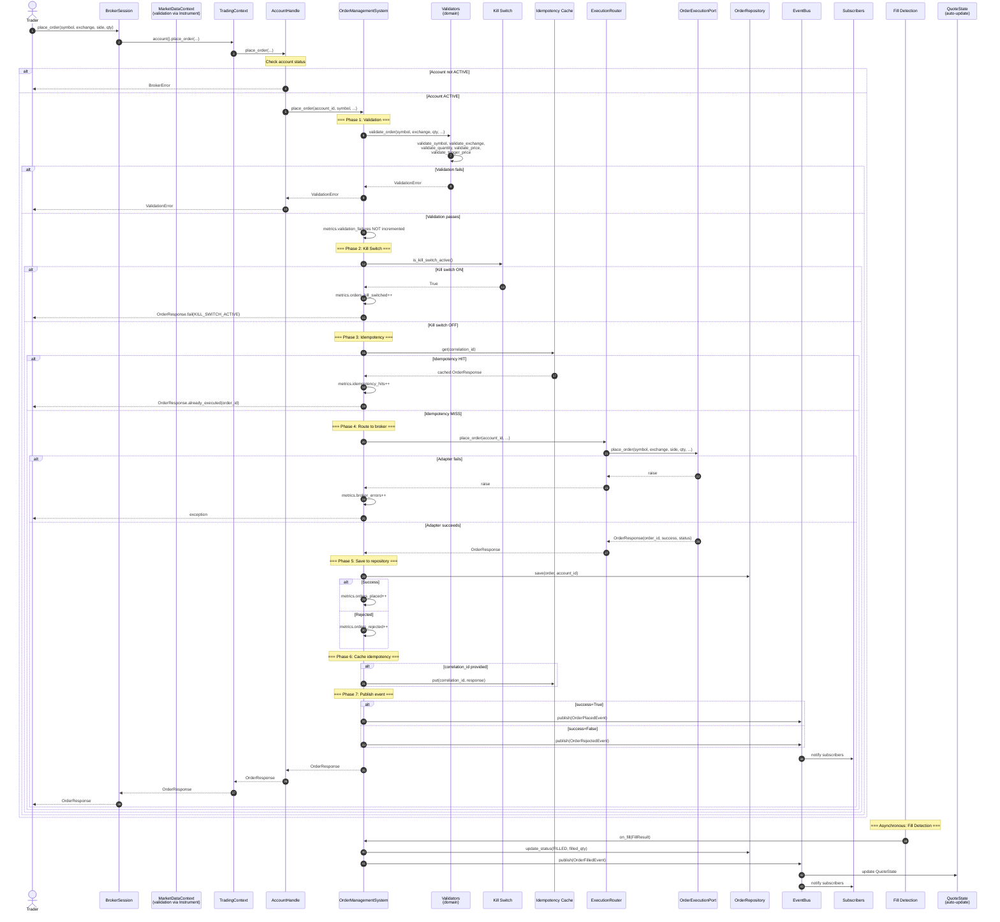

---

## 3. Market Data Quote Flow (Detailed)

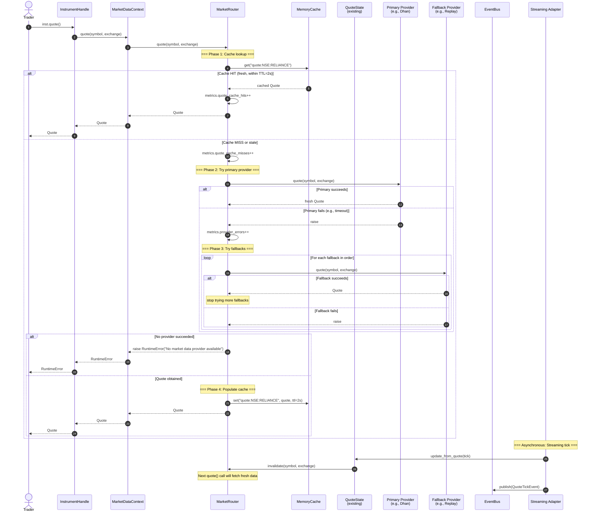

---

## 4. Streaming Subscription Flow (Reference Counting)

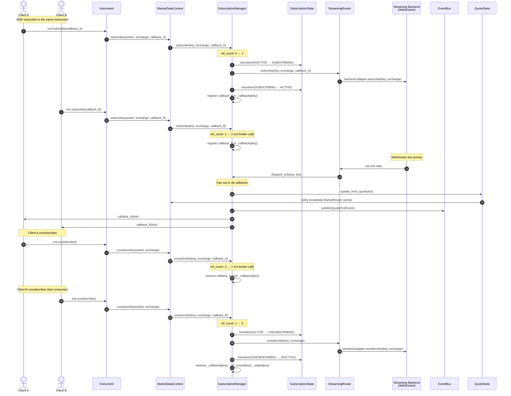

---

## 5. Historical Data Flow (Cache-First with Replay Fallback)

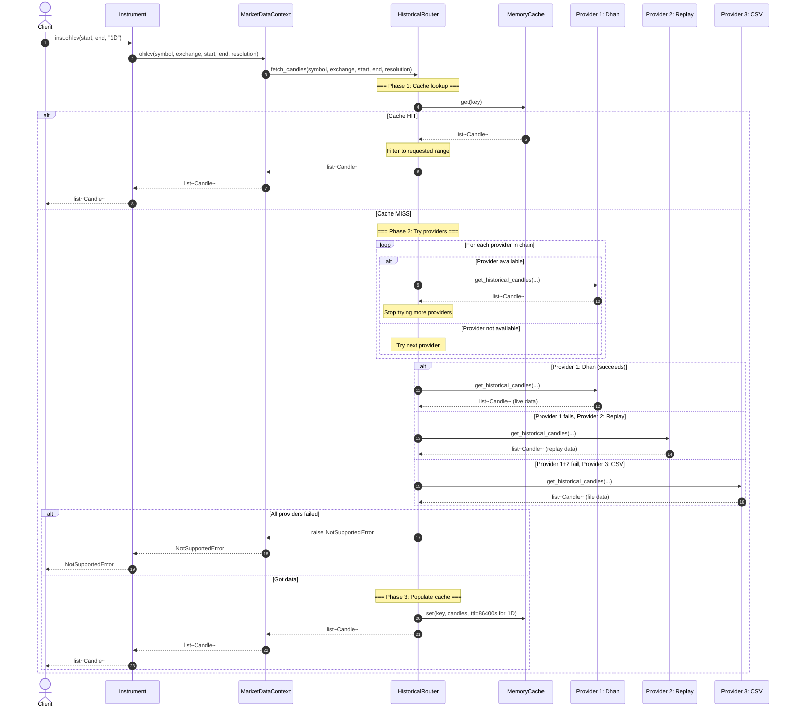

---

## 6. Authentication & Token Lifecycle

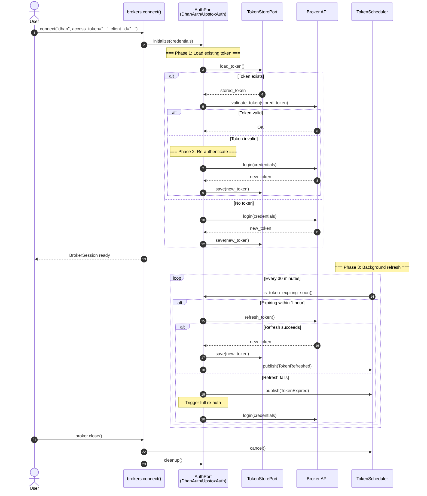

---

## 7. Order Lifecycle State Machine

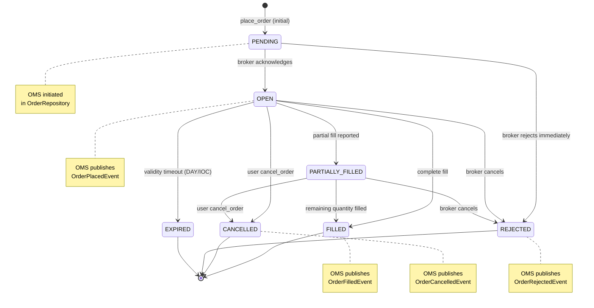

---

## 8. Subscription Lifecycle State Machine

```mermaid
stateDiagram-v2
    [*] --> INACTIVE
    INACTIVE --> SUBSCRIBING : first subscribe (ref_count: 0→1)
    SUBSCRIBING --> ACTIVE : backend.adapter.subscribe() OK
    SUBSCRIBING --> INACTIVE : backend.adapter.subscribe() fails

    ACTIVE --> ACTIVE : additional subscribe (ref_count: N→N+1)
    ACTIVE --> ACTIVE : tick dispatched (fan-out to all callbacks)
    ACTIVE --> ACTIVE : unsubscribe one of N (ref_count: N→N-1)

    ACTIVE --> UNSUBSCRIBING : last unsubscribe (ref_count: 1→0)
    UNSUBSCRIBING --> INACTIVE : backend.adapter.unsubscribe() OK

    INACTIVE --> INACTIVE : unsubscribe (no-op)

    note right of ACTIVE : _callbacks[key] may have<br/>multiple consumers
    note right of UNSUBSCRIBING : Cleanup: remove<br/>_ref_counts, _states, _callbacks
```

---

## 9. Connection Health State Machine (Degraded Mode)

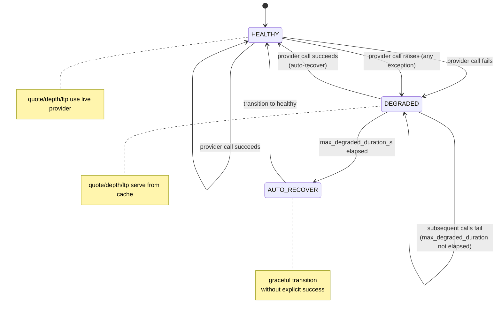

---

## 10. Component Dependency Graph

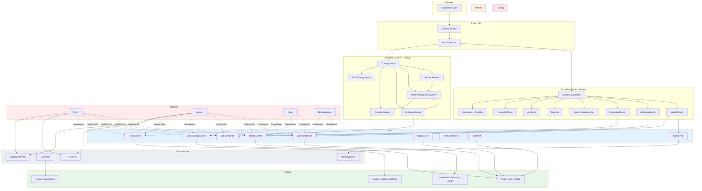

---

## 11. Threading & Concurrency Model

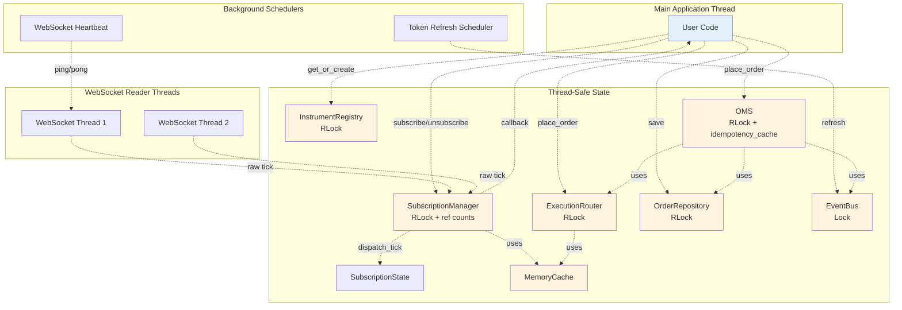

---

## 12. Memory & Identity Model

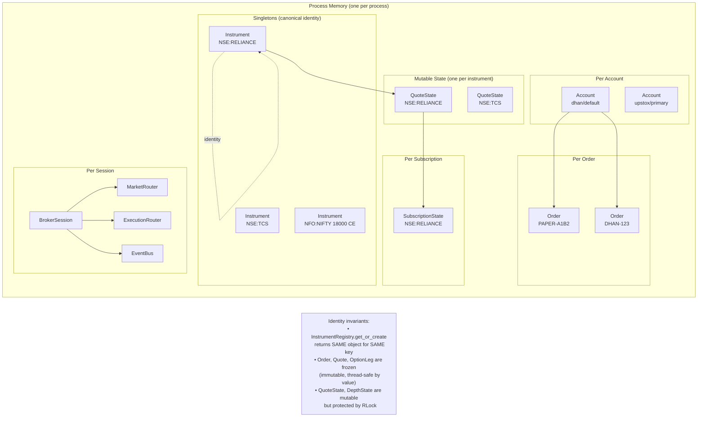

---

## 13. Public API Surface

```mermaid
graph TB
    Start[import brokers]
    Start --> Connect[brokers.connect]
    Start --> Domain[brokers.domain entities]

    Connect -->|name, **credentials| Sess[BrokerSession]

    Sess --> P1[broker.market]
    Sess --> P2[broker.trading]
    Sess --> P3[broker.orders]
    Sess --> P4[broker.streaming]
    Sess --> P5[broker.auth]
    Sess --> P6[broker.portfolio]
    Sess --> P7[broker.historical]
    Sess --> P8[broker.extensions]
    Sess --> P9[broker.capabilities]
    Sess --> P10[broker.scanner]
    Sess --> P11[broker.replay]
    Sess --> P12[broker.degraded_mode]
    Sess --> P13[broker.analytics]

    P1 --> Inst[market.instrument]
    Inst --> IH[InstrumentHandle]
    IH --> M1[inst.quote]
    IH --> M2[inst.depth]
    IH --> M3[inst.ohlcv]
    IH --> M4[inst.history]
    IH --> M5[inst.option_chain]
    IH --> M6[inst.subscribe]
    IH --> M7[inst.metadata]
    IH --> M8[inst.greeks]
    IH --> M9[inst.oi]
    IH --> M10[inst.market_status]

    P2 --> Acc[trading.account]
    Acc --> AH[AccountHandle]
    AH --> A1[place_order]
    AH --> A2[modify_order]
    AH --> A3[cancel_order]
    AH --> A4[positions]
    AH --> A5[holdings]
    AH --> A6[funds]
    AH --> A7[trades]

    P10 --> Scan[scanner.scan]
    P13 --> Anal[analytics namespace]
    Anal --> AN1[vwap]
    Anal --> AN2[greeks]
    Anal --> AN3[atr]
    Anal --> AN4[volume_profile]
```

---

## 14. Failure Modes & Resilience

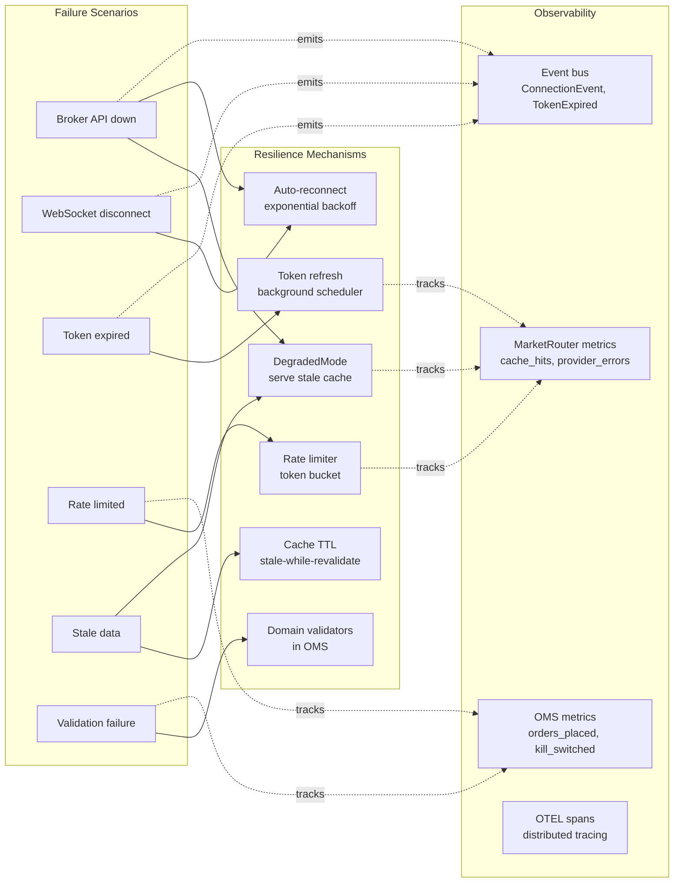

---

## 15. Architecture Fitness Functions (26 CI-Enforced)

| Category | Test | What It Enforces |
|----------|------|------------------|
| **Layer Boundaries** | `TestBoundaryRules` | Domain/ports/services/market/trading cannot import forbidden layers |
| **Port Structure** | `TestPortStructure` | All 21 ports must be `@runtime_checkable Protocol` |
| **Exception Hierarchy** | `TestExceptionHierarchy` | All exceptions inherit from `TradeXV2Error` |
| **Error Code Coverage** | `TestErrorCodeCoverage` | All error codes are referenced in exceptions.py |
| **API Hygiene** | `TestNoDuplicateAll`, `TestNoCompatGateways` | No duplicate exports, no deprecated gateway files |
| **Infrastructure** | `TestInfrastructureBoundary`, `TestNoRawDictInDomain` | Infrastructure doesn't import adapters, no raw dict fields |
| **Single Source of Truth** | `TestSingleIdempotencyImplementation`, `TestSingleEndpointAuthority` | Idempotency in core/, no duplicate endpoint files |
| **Singleton Discipline** | `TestNoGlobalSingletons` | No class-level `_instances` outside allowed paths |
| **Capability Design** | `TestCapabilityConstants` | All capability constants in ALL_CAPS, no duplicates |
| **Type Safety** | `TestNoHasattrOnGateway`, `TestServiceConstructorArgLimit` | No `hasattr()` in facade, services ≤5 init params |
| **DIP Enforcement** | `TestNoAdapterImportsService`, `TestServiceLayer` | Adapters don't import services, services don't import adapters |
| **Contract Tests** | `TestBrokerGatewayContract`, `TestHttpClientPort` | All gateways have required properties, adapters use port abstractions |
| **Bounded Contexts** | `TestMarketTradingBoundary`, `TestTradingBoundaryNoServices` | Market/trading isolated, trading doesn't import services/infra/adapters |
| **Identity Guarantees** | `TestOneInstrumentPerSymbol` | Same key returns same object (10-thread stress test) |
| **DIP (No DTO Leakage)** | `TestNoBrokerDtoLeakage` | Domain/ports don't import from adapters |
| **Extension Isolation** | `TestExtensionIsolation` | Broker-specific protocols not in `ports/__init__.py` |
| **API Stability** | `TestNoBrokerGatewayInPorts` | `BrokerGateway` moved from ports to services |
| **Router Boundary** | `TestRouterBoundary` | Routers don't import adapters/infrastructure |
| **No Broker Leakage** | `TestNoBrokerInternalDataLeakage` | Domain/market don't use Dhan's `security_id`, Upstox's `instrument_key` |

**Total: 26 fitness function classes, 75 architecture tests, 0 failures.**

---

## 16. Diagram Conventions

| Convention | Meaning |
|------------|---------|
| `<<frozen>>` | Immutable dataclass (no mutation after construction) |
| `<<protocol>>` | `@runtime_checkable Protocol` interface |
| `<<mutable>>` | Mutable state object (thread-safe) |
| `<<Orchestrator>>` | Coordinates multiple collaborators |
| `<<composition root>>` | Top-level factory that wires all dependencies |
| `<<static>>` | Static utility class (no instance state) |
| Green boxes | Domain layer (no external deps) |
| Blue boxes | Ports layer (interfaces only) |
| Orange boxes | Market context |
| Pink boxes | Trading context |
| Purple boxes | Service layer |
| Red boxes | Adapters |
| Gray boxes | Infrastructure |

---

*For complete file listing and architecture details, see `ARCHITECTURE_DIAGRAMS.md` (the main file).*
*For test coverage, see `TESTING_STRATEGY.md`.*
