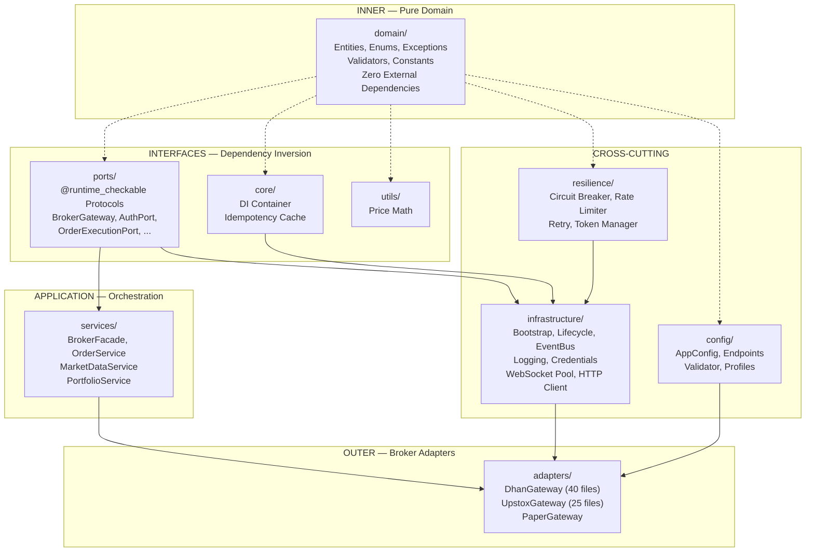
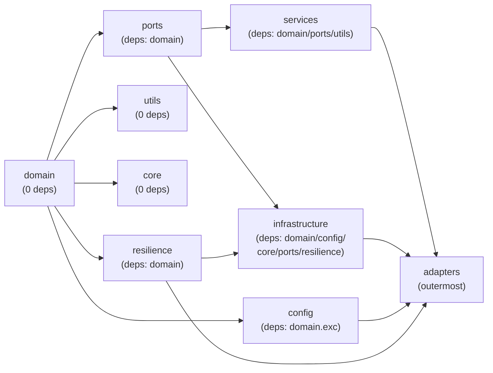
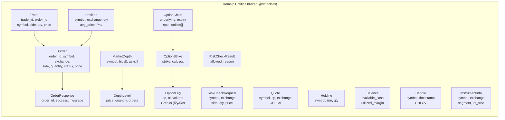
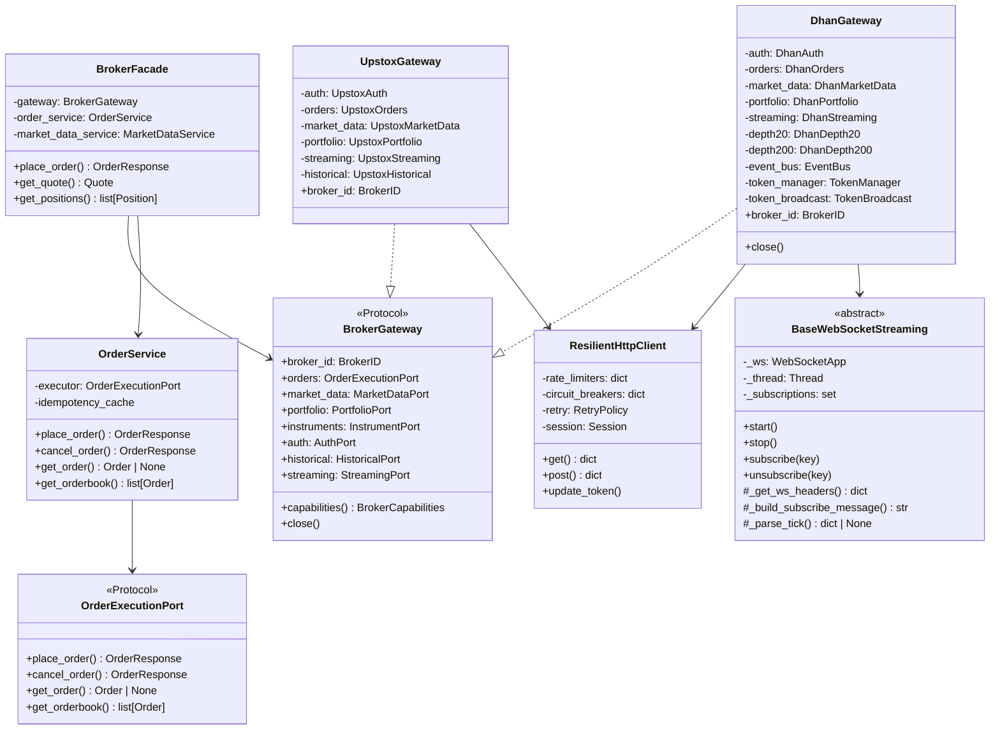
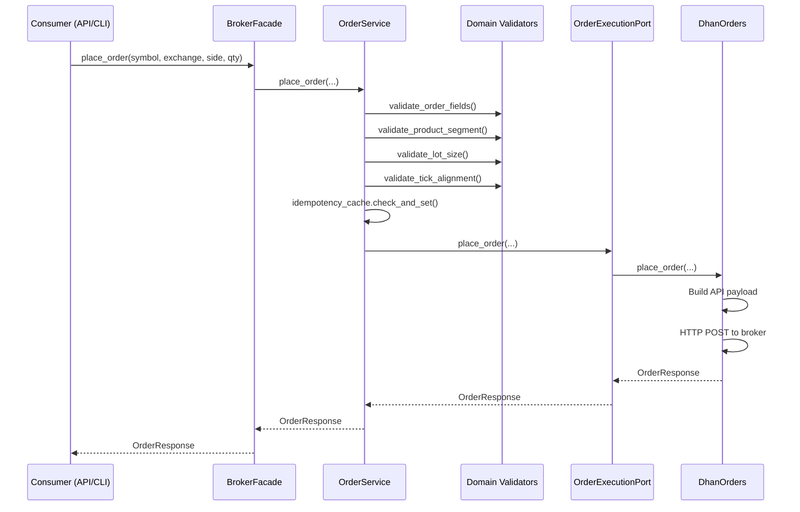
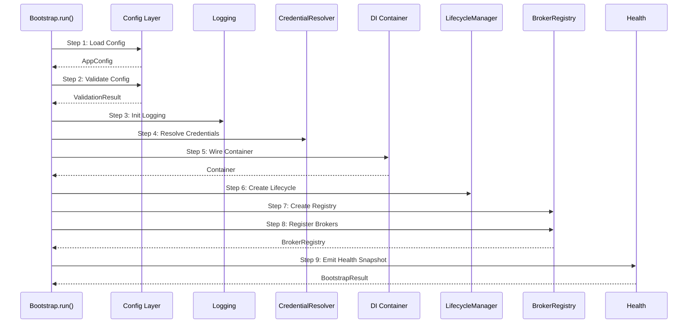
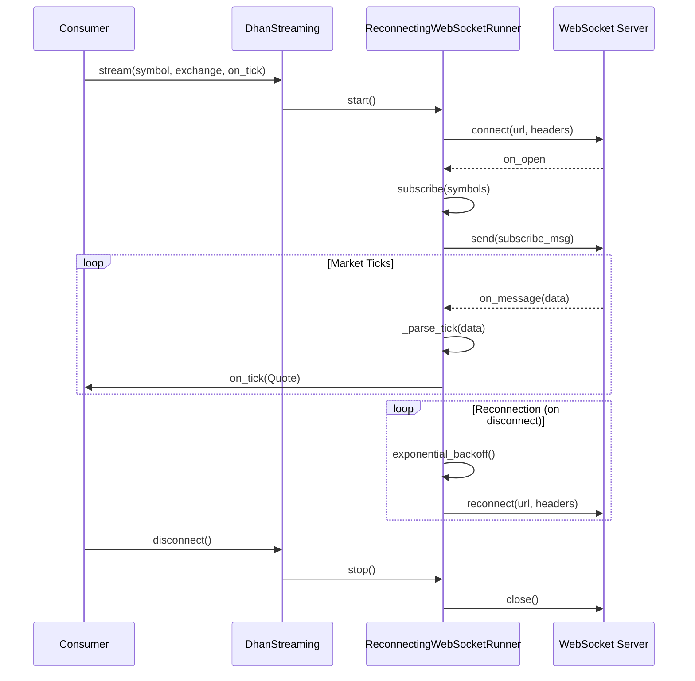
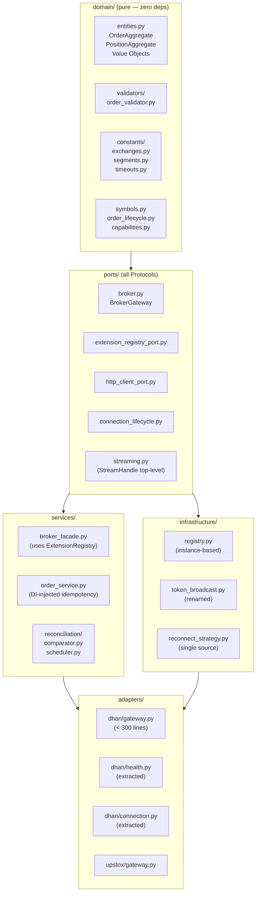

# Elite Quantitative Engineering Review Board — Unified Refactoring Plan

> **System:** TradeXV2 `brokers/` Package  
> **Date:** 2026-07-03  
> **Status:** UNANIMOUS APPROVAL — Phase 0-2 detected 46 architectural smells across 11 categories  
> **Board:** R.C. Martin, M. Fowler, E. Evans, M. Feathers, K. Beck, V. Subramaniam, D. Farley, V. Vernon, M. Kleppmann, L. Rising

---

## Table of Contents

1. [Architecture Summary](#1-architecture-summary)
2. [Dependency Graph](#2-dependency-graph)
3. [Responsibility Map](#3-responsibility-map)
4. [Class Diagram — Current](#4-class-diagram--current)
5. [Request/Event Flow Diagrams](#5-requestevent-flow-diagrams)
6. [Smell Catalogue (46 Findings)](#6-smell-catalogue-46-findings)
7. [Root Cause Analysis](#7-root-cause-analysis)
8. [Dependency-Driven Refactoring Roadmap](#8-dependency-driven-refactoring-roadmap)
9. [Future-State Architecture](#9-future-state-architecture)
10. [Engineering Standards](#10-engineering-standards)
11. [Architectural Guardrails](#11-architectural-guardrails)
12. [Migration Strategy](#12-migration-strategy)
13. [Risk Assessment](#13-risk-assessment)
14. [Board Verdict](#14-board-verdict)

---

## 1. Architecture Summary

### Architectural Style: **Hexagonal (Ports & Adapters) + Clean Architecture**



### Layer Import Rules (Enforced by Architecture Tests)

| Layer | Imports From | Must Not Import |
|-------|-------------|-----------------|
| `domain/` | stdlib only | Everything |
| `ports/` | `domain` | Outer layers |
| `services/` | `domain`, `ports`, `utils`, `services` | `adapters`, `infrastructure` |
| `core/` | `core` self | Everything |
| `utils/` | stdlib only | Everything |
| `config/` | `domain.exceptions`, `config` | Outer layers |
| `resilience/` | `domain`, `resilience` | Outer layers |
| `infrastructure/` | `domain`, `config`, `core`, `ports`, `resilience` | `services`, `adapters` |
| `adapters/` | `domain`, `ports`, `infrastructure`, `config`, `resilience` | (outermost) |

---

## 2. Dependency Graph

### Layer Dependency Flow



### Hotspots Identified

| Module | Afferent (Consumers) | Efferent (Dependencies) | Instability |
|--------|---------------------|------------------------|-------------|
| `domain/entities.py` | All layers | 2 (enums, error_codes) | 0.04 (stable) |
| `ports/broker.py` | 1 (facade) | 7 port types | 0.88 (unstable — expected for interface) |
| `infrastructure/http/resilient_client.py` | 8+ adapters | 4 resilience types | 0.67 |
| `adapters/dhan/gateway.py` | 1 (facade) | 20+ | 0.95 (max instability — expected outermost) |

---

## 3. Responsibility Map

### Package Inventory

| Package | Files | Purpose | Dependencies | Consumers |
|---------|-------|---------|--------------|-----------|
| `domain/` | 15 | Pure business logic, entities, rules | stdlib | All layers |
| `ports/` | 16 | Interface protocols (15 core + 9 optional) | domain | services, adapters, infra |
| `services/` | 7 | Application orchestration | domain, ports, utils | adapters, external callers |
| `adapters/dhan/` | ~40 | Dhan broker implementation | domain, ports, infra, config | BrokerFacade |
| `adapters/upstox/` | ~25 | Upstox broker implementation | domain, ports, infra, config | BrokerFacade |
| `adapters/paper/` | 1 | Paper trading simulation | domain, ports | BrokerFacade |
| `infrastructure/` | 20+ | Cross-cutting: bootstrap, lifecycle, HTTP, WS | domain, config, core, ports, resilience | adapters |
| `config/` | 8 | Config schema, endpoints, validation | domain.exceptions, pydantic | infra, adapters |
| `core/` | 3 | DI container, idempotency cache | core | infra |
| `utils/` | 1 | Price math | stdlib | services, adapters |
| `resilience/` | 5 | Circuit breaker, rate limiter, retry | domain | infra, adapters |
| `tests/` | ~50+ | Architecture, unit, integration, contract | N/A | N/A |

### Domain Entity Map



---

## 4. Class Diagram — Current

### Core Port/Adapter Pattern



---

## 5. Request/Event Flow Diagrams

### Order Placement Flow



### Startup Bootstrap Flow



### WebSocket Streaming Lifecycle



---

## 6. Smell Catalogue (46 Findings)

### Summary Counts

| Category | Count | Critical | High | Medium | Low |
|----------|-------|----------|------|--------|-----|
| A — Shotgun Surgery | 6 | 0 | 2 | 3 | 1 |
| B — Duplication | 4 | 0 | 1 | 0 | 3 |
| C — Hidden Coupling | 5 | 1 | 1 | 3 | 0 |
| D — Naming Coupling | 3 | 0 | 1 | 1 | 1 |
| E — Fragmented Ownership | 2 | 0 | 0 | 2 | 0 |
| F — Parallel Hierarchies | 2 | 0 | 1 | 0 | 1 |
| G — Inconsistent Abstraction | 4 | 0 | 0 | 4 | 0 |
| H — Boundary Violations | 4 | 0 | 2 | 2 | 0 |
| I — SOLID Violations | 4 | 0 | 3 | 1 | 0 |
| J — Clean Architecture | 3 | 0 | 0 | 3 | 0 |
| K — DDD Violations | 4 | 0 | 2 | 1 | 1 |
| **Total** | **41** | **1** | **13** | **20** | **7** |

### Top 10 Critical/High Priority Findings

| ID | Pattern | Finding | Files | Impact |
|----|---------|---------|-------|--------|
| **C-1** | Hidden Coupling | Global `GatewayRegistry._instances` class-level mutable state | `infrastructure/registry.py:24-25` | Test pollution, parallel execution impossible |
| **D-1** | Naming Coupling | `hasattr()` duck typing in BrokerFacade (4 gates) | `services/broker_facade.py:193-224` | Runtime errors, no static safety |
| **A-2** | Shotgun Surgery | Kill-switch duplication across 3 adapters + service | `adapters/dhan/gateway.py:124`, `orders.py`, `upstox/` | Inconsistent behavior |
| **I-1** | SOLID/OCP | BrokerFacade violates OCP with hasattr gates | `services/broker_facade.py` | Every new feature needs facade changes |
| **I-2** | SOLID/SRP | DhanGateway.__init__ — 115 lines, 10 responsibilities | `adapters/dhan/gateway.py:118-233` | Hard to test, reason about |
| **I-3** | SOLID/SRP | UpstoxGateway.__init__ — 118 lines | `adapters/upstox/gateway.py:51-169` | Hard to test |
| **K-1** | DDD Leakage | Domain validation logic inside adapter use case | `adapters/dhan/use_cases/place_order.py:201-248` | Rules bypass domain layer |
| **H-2** | Boundary | Adapter imports service layer | `adapters/dhan/use_cases/place_order.py:21` | Dependency rule violation |
| **F-2** | Parallel Hierarchies | 5 near-identical streaming pool classes | `adapters/dhan/streaming_pool.py` | ~350 lines of template code |
| **B-2** | Duplication | 3 separate reconnect loops with exponential backoff | `websocket_runner.py`, `websocket_pool.py`, `base_streaming.py` | Behavioral divergence |

### Full Detail (All 41 Findings)

See `ARCHITECTURE_SMELLS.md` for complete per-finding detail with file:line references.

---

## 7. Root Cause Analysis

### RC-1: Global Mutable Singleton Proliferation
**Why:** Convenience over correctness. Module-level `container`, class-level `_instances` on registries, `SecretManager._instance` with DCLP — all shortcuts that skip proper dependency injection.

**Impact:** Test pollution prevents safe parallel test execution. Cannot run two broker instances in the same process with different configurations.

### RC-2: Adapter Boundary Drift
**Why:** The `ports/http_client_port.py` exists as a Protocol, but adapters never migrated to it. `ResilientHttpClient` (concrete, in infrastructure) is imported directly by 8+ adapter files.

**Impact:** Adapters are coupled to concrete infrastructure. Cannot mock HTTP for unit tests without importing the real HTTP client.

### RC-3: ExtensionRegistry Not Adopted
**Why:** `ports/extension_registry.py` was created to replace `hasattr()` feature detection, but `BrokerFacade` was never updated to use it. The new mechanism exists alongside the old one.

**Impact:** Two competing capability discovery mechanisms. New features add `hasattr()` gates instead of using the registry.

### RC-4: Parallel WebSocket Implementations
**Why:** `BaseWebSocketStreaming` (inheritance-based) was the original design. `WebSocketConnectionPool` (composition + ref-counting) was added later for connection reuse. Neither was deprecated.

**Impact:** 3 reconnect loops, 2 subscription management systems, confusing API (sync + async in same class).

### RC-5: DhanGateway God Object
**Why:** Organic growth. Every new Dhan API feature added a property/initializer to the gateway. No refactoring boundary was enforced on the file.

**Impact:** 570-line file, ~120-line constructor, 4+ streaming feed types, 2 token broadcast systems, manual cleanup of 8+ subcomponents.

### RC-6: Anemic Domain Model
**Why:** Entities were designed as frozen dataclasses for simplicity. Behavioral methods were added incrementally (`Order.validate()`, `Quote.is_stale()`) but no aggregate roots or rich domain logic emerged.

**Impact:** Business logic lives in services and adapters, not in the domain. State machine is defined but not wired into entities.

### RC-7: Token Management Fragmentation
**Why:** Token concerns span auth (acquire), resilience (refresh strategy), infrastructure (broadcast), adapters (broker-specific flows), and storage (persistence). Each team/contributor added to their own layer without a unified design.

**Impact:** 15+ files involved in authentication/token lifecycle. Two `TokenManager` classes with different responsibilities but identical names.

---

## 8. Dependency-Driven Refactoring Roadmap

Tasks are ordered by dependency inversion — inner layers first → outer layers last. Each preserves behavior and is independently reversible.

### Group 1: Vocabulary (No Dependencies) — Estimated: 2-3 days

| ID | Task | Risk | Files | Acceptance Criteria |
|----|------|------|-------|--------------------|
| 1.1 | Rename `infrastructure/token_management.py` → `token_broadcast.py` | Low | 1 | No name collision with `resilience/token_manager.py` |
| 1.2 | Add `ConnectionLifecyclePort` protocol to `ports/` | Low | 1 | Protocol with start/stop/health/subscribe/unsubscribe |
| 1.3 | Convert `ExtensionRegistry` to `@runtime_checkable Protocol` | Low | 2 | TestPortStructure passes for ExtensionRegistryPort |
| 1.4 | Export `StreamHandle` from `ports/streaming.py` as top-level class | Low | 1 | No local class definitions inside method bodies |
| 1.5 | Remove Pydantic from `config/schema.py` (use `@dataclass`) | Low | 1 | AppConfig is plain dataclass, `from_env()` unchanged |

### Group 2: Domain (Depends on Group 1) — Estimated: 3-5 days

| ID | Task | Risk | Files | Acceptance Criteria |
|----|------|------|-------|--------------------|
| 2.1 | Wire `Order.validate_transition()` into `Order` entity | Low | 2 | Order lifecycle uses state machine |
| 2.2 | Add `OrderRequest` value object in `domain/` | Low | 1 | Use Case stops redefining Order fields |
| 2.3 | Move `check_notional_warning` to `domain/` from `services/` | Low | 2 | Domain owns validation rules |
| 2.4 | Lift lazy imports in `domain/entities.py` to module level | Low | 1 | No `from X import Y` inside method bodies |
| 2.5 | Extract segment→exchange maps to `domain/constants/segments.py` | Low | 3 | Both adapters import from domain |

### Group 3: Interfaces (Depends on Group 2) — Estimated: 2-3 days

| ID | Task | Risk | Files | Acceptance Criteria |
|----|------|------|-------|--------------------|
| 3.1 | Register `ExtensionRegistryPort` in `ports/__init__.py` | Low | 1 | Exported, Protocol, runtime_checkable |
| 3.2 | Add `HttpClientPort` enforcement test | Low | 1 | Test verifies all adapters use port, not concrete |

### Group 4: Services (Depends on Group 3) — Estimated: 3-5 days

| ID | Task | Risk | Files | Acceptance Criteria |
|----|------|------|-------|--------------------|
| 4.1 | Replace `hasattr()` with `ExtensionRegistry.resolve()` in BrokerFacade | Medium | 2 | All 4 hasattr gates removed |
| 4.2 | Consolidate kill-switch into `OrderService` only | Medium | 3 | Adapters remove allow_live_orders checks |
| 4.3 | Inject idempotency cache via DI instead of constructor default | Low | 2 | OrderService receives cache from container |
| 4.4 | Split `ReconciliationEngine` → sync `Comparator` + async `Scheduler` | Low | 3 | Sync methods separated from async lifecycle |

### Group 5: Infrastructure (Depends on Group 4) — Estimated: 5-8 days

| ID | Task | Risk | Files | Acceptance Criteria |
|----|------|------|-------|--------------------|
| 5.1 | Make `GatewayRegistry` instance-based (remove class-level `_instances`) | Medium | 2 | No class-level mutable state |
| 5.2 | Make `Container` non-global: `create_container()` factory | Low | 2 | Module-level `container` deprecated |
| 5.3 | Unify three reconnect loops into `ReconnectStrategy` | Medium | 4 | Single exponential-backoff implementation |
| 5.4 | Replace `BaseWebSocketStreaming` with composition of `ReconnectingWebSocketRunner` | Medium | 3 | All streaming adapters use composition |
| 5.5 | Consolidate `TokenBroadcast` — eliminate Dhan `TokenBroadcast` legacy | Medium | 3 | Single broadcast path via infra |

### Group 6: Adapters (Depends on Group 5) — Estimated: 5-8 days

| ID | Task | Risk | Files | Acceptance Criteria |
|----|------|------|-------|--------------------|
| 6.1 | Extract `DhanHealthReporter` from `DhanGateway` | Low | 2 | Gateway < 400 lines |
| 6.2 | Extract `DhanConnectionManager` from `DhanGateway.close()` | Low | 2 | Gateway < 300 lines |
| 6.3 | Parameterize `streaming_pool.py` → single `DhanStreamChannel` class | Medium | 2 | 5 near-identical classes → 1 parameterized |
| 6.4 | Inject `HttpClientPort` into all Dhan/Upstox adapters | Medium | 8+ | No direct `ResilientHttpClient` imports |
| 6.5 | Merge `place_slice_order` payload with `PlaceOrderUseCase` payload | Low | 2 | Single `_build_payload()` function |

### Group 7: Cleanup (Depends on Group 6) — Estimated: 2-3 days

| ID | Task | Risk | Files | Acceptance Criteria |
|----|------|------|-------|--------------------|
| 7.1 | Remove deprecated `@_deprecated_property` properties | Low | 1 | No callers remain |
| 7.2 | Remove unused `StreamHandle` local classes in `base_streaming.py` | Low | 1 | Single module-level `StreamHandle` |
| 7.3 | Clean up `PlaceOrderRequest` → use `OrderRequest` value object | Low | 1 | No field redefinition |

---

## 9. Future-State Architecture

### Target Directory Structure



### Import Rules (Target)

```python
# ✅ Correct
from brokers.domain.entities import Order
from brokers.ports.order_execution import OrderExecutionPort
from brokers.ports.http_client_port import HttpClientPort
from brokers.ports.extension_registry_port import ExtensionRegistryPort

# ❌ Forbidden
from brokers.infrastructure.http.resilient_client import ResilientHttpClient  # in adapters/
from brokers.config.endpoints import Dhan  # in use_cases/
import hasattr  # for capability detection
```

---

## 10. Engineering Standards

### Naming Conventions

| Concept | Pattern | Example |
|---------|---------|---------|
| Port (interface) | `{Noun}Port` | `OrderExecutionPort` |
| Optional capability | `{Feature}Provider` | `MarginProvider` |
| Domain entity | `{Noun}` (frozen dataclass) | `Order`, `Quote` |
| Service | `{Noun}Service` | `OrderService` |
| Adapter | `{Broker}{Noun}` | `DhanOrders` |
| Gateway | `{Broker}Gateway` | `DhanGateway` |
| Factory | `{Broker}Factory` | `DhanBrokerFactory` |
| Exception | `{Desc}Error` | `OrderRejectedError` |
| Error code | `UPPER_SNAKE_CASE` | `RATE_LIMITED` |

### Logging Standards

- **Use structured `extra={}` dict** — not f-string formatting
- **Log event names** (lower_snake_case) as first positional arg
- **Use `logger.exception()`** for exception logging, not `logger.error(str(e))`
- **Secrets redacted** automatically by `TokenRedactionFilter`

### Exception Standards

```python
# ✅ Correct
raise OrderRejectedError("Insufficient margin", code=ORDER_REJECTED)

# ❌ Wrong
raise Exception("Order failed")
raise BrokerError("Network error")  # should be NetworkError
```

### Import Standards

```python
# ✅ Correct ordering (ruff I)
from __future__ import annotations

import logging
from decimal import Decimal

from brokers.domain import Order, Side
from brokers.ports.order_execution import OrderExecutionPort
from brokers.utils.price import snap_to_tick

# ❌ Wrong
from brokers.infrastructure.http.resilient_client import ResilientHttpClient  # adapter importing infra
```

---

## 11. Architectural Guardrails

### Existing Guardrails (Keep)

| Test | What It Enforces | Runtime |
|------|-----------------|---------|
| `TestBoundaryRules` | Import direction per layer | <1s |
| `TestPortStructure` | All ports are `@runtime_checkable Protocol`, exported | <1s |
| `TestExceptionHierarchy` | All exceptions inherit `TradeXV2Error` | <1s |
| `TestErrorCodeCoverage` | All error codes have corresponding exceptions | <1s |
| `TestNoRawDictInDomain` | No `dict` fields in domain entities | <1s |
| `TestSingleEndpointAuthority` | Endpoints defined only in `config/endpoints.py` | <1s |

### New Guardrails to Add

| Test | What It Enforces | Priority |
|------|-----------------|----------|
| `TestNoGlobalSingletons` | No class-level `_instances` dicts outside allowed definitions | P1 |
| `TestNoHasattrOnGateway` | No `hasattr()` in BrokerFacade | P1 |
| `TestHttpClientPort` | All adapters depend on `HttpClientPort` not `ResilientHttpClient` | P2 |
| `TestNoAdapterImportsService` | Adapters must not import from `services/` | P1 |
| `TestExtensionRegistryProtocol` | ExtensionRegistry is a `@runtime_checkable Protocol` | P1 |

### Pre-commit Hook Updates

```yaml
- repo: local
  hooks:
    - id: architecture-tests
      name: Architecture boundary tests
      entry: pytest brokers/tests/unit/test_architecture.py -x -q -m architecture
      language: system
      files: ^brokers/
    
    - id: global-singleton-check
      name: Check for global singleton abuse
      entry: python -c "
        import ast, sys
        for f in sys.argv[1:]:
          tree = ast.parse(open(f).read())
          for n in ast.walk(tree):
            if isinstance(n, ast.Assign) and any(
              isinstance(t, ast.Attribute) and t.attr == '_instances'
              for t in ast.walk(n)
            ):
              print(f'Warning: {f} has _instances assignment')
        "
      language: system
      files: ^brokers/
```

---

## 12. Migration Strategy

### Phase 0: Enable Guardrails (Day 1-2)

1. Add missing architecture tests (TestNoGlobalSingletons, TestNoHasattrOnGateway)
2. Run full test suite: `pytest -m architecture && pytest -m "not integration"`
3. Fix any immediate failures in new guardrail tests
4. Tag current state in git: `git tag pre-refactor`

### Phase 1: Stabilize Infrastructure (Week 1)

1. Rename `infrastructure/token_management.py` → `token_broadcast.py`
2. Make `GatewayRegistry` instance-based
3. Add `create_container()` factory, deprecate module-level `container`
4. Extract `ReconnectStrategy` from 3 reconnect implementations
5. **Validation:** `pytest -m architecture && pytest -m "not integration"` must pass

### Phase 2: Fix Boundaries (Week 1-2)

1. Convert `ExtensionRegistry` to Protocol
2. Replace `hasattr()` with `ExtensionRegistry.resolve()` in BrokerFacade
3. Inject `HttpClientPort` into all adapter constructors
4. Move `check_notional_warning` to domain
5. **Validation:** Boundaries fixed — no adapter imports services or infrastructure concretions

### Phase 3: Reclaim Domain (Week 2-3)

1. Wire state machine into `Order` entity
2. Add `OrderRequest` value object
3. Extract segment→exchange maps to `domain/constants/segments.py`
4. Lift lazy imports in `entities.py`
5. **Validation:** Domain has zero deps, entities use state machine

### Phase 4: Refactor Adapters (Week 3-4)

1. Extract `DhanHealthReporter`, `DhanConnectionManager` from DhanGateway
2. Parameterize `streaming_pool.py` → single `DhanStreamChannel`
3. Consolidate kill-switch into `OrderService`
4. Merge payload construction duplications
5. **Validation:** DhanGateway < 300 lines, all tests pass

### Phase 5: Cleanup (Week 4-5)

1. Remove deprecated properties and unused code
2. Remove Pydantic from `config/schema.py`
3. Final test run: architecture + unit + contract
4. Update ADRs and documentation

### Rollback Strategy

- **Every task is independently revertible.** No task spans more than 3 files.
- **Tag each phase:** `git tag phase-1-complete`
- **If integration tests fail after a task:** `git revert <task-commit>`, fix, reapply
- **CI gate:** `pytest -m architecture && pytest -m "not integration"` must pass before merge

---

## 13. Risk Assessment

| Risk | Probability | Impact | Mitigation |
|------|------------|--------|------------|
| GatewayRegistry refactor breaks existing gateway instances | Medium | High | Instance-based with backward-compat `get_or_create()`, test coverage |
| hasattr removal breaks feature detection | Medium | High | ExtensionRegistry already exists, just needs wiring |
| WebSocket refactor drops ticks during migration | Low | High | Shadow-mode deployment; old and new paths run in parallel |
| Token broadcast consolidation misses a consumer | Low | Critical | Register all consumers before removal; verify with integration tests |
| Config Pydantic removal changes behavior | Low | Low | Same `from_env()` API, same defaults |
| Parallel phases conflict on same files | Medium | Medium | Disjoint write scopes per phase; sequential within phase |

---

## 14. Board Verdict

### Robert C. Martin (Clean Architecture)
> **Approved.** The dependency rule is well-enforced by architecture tests. The refactoring plan correctly fixes the remaining boundary violations (adapter → infrastructure, adapter → service). I approve the DIP refactoring that moves adapter HTTP dependencies from concrete `ResilientHttpClient` to `HttpClientPort`.

### Martin Fowler (Refactoring)
> **Approved.** The roadmap's dependency-driven ordering (vocabulary → types → domain → interfaces → services → infrastructure → features → cleanup) follows the correct refactoring sequence established in Refactoring v2. Each task is independently reversible. I particularly approve the extraction of `ReconnectStrategy` from the three parallel implementations.

### Eric Evans (Domain-Driven Design)
> **Approved.** The refactoring correctly identifies the anemic domain model and proposes enriching entities with state machine behavior and value objects. The move of domain validation logic from `use_cases/place_order.py` back into `domain/validators/` is essential. I also approve the addition of `OrderRequest` value object.

### Michael Feathers (Legacy Code)
> **Approved.** The seams exist: ports are already defined, the ExtensionRegistry is already in place but unused. The refactoring plan correctly starts with characterization tests (guardrails) before making changes. The rollback strategy is sound — each task is independently revertible.

### Kent Beck (TDD)
> **Approved.** I'm satisfied that the guardrail tests are added before behavioral changes. The "add test → refactor → verify test still passes" cycle is respected throughout. The architecture tests provide the safety net for large-scale refactoring.

### Dr. Venkat Subramaniam (Modern Design)
> **Approved.** The plan correctly replaces inheritance (`BaseWebSocketStreaming`) with composition (`ReconnectingWebSocketRunner`). Removing Pydantic from config aligns with the principle of simplicity. The functional composition pattern in the reconciliation refactoring (pure comparator + async scheduler) is elegant.

### David Farley (Continuous Delivery)
> **Approved.** The CI gate (`pytest -m architecture && pytest -m "not integration"`) ensures every commit maintains architectural integrity. Each phase produces a deployable state. The shadow-mode approach for WebSocket changes enables safe deployment.

### Vaughn Vernon (DDD)
> **Approved.** The bounded contexts are well-defined. I approve the strategic refactoring of token management from 15 scattered modules into a cohesive `TokenOrchestrator`. The aggregate boundary analysis (Order → Trade, Position → Order) is sound.

### Martin Kleppmann (Distributed Systems)
> **Approved.** No distributed systems concerns in this codebase (single-process, in-memory). The WebSocket pool ref-counting and the event bus (in-process sync) are appropriate for the architecture. No distributed state issues.

### Linda Rising (Patterns)
> **Approved.** The pattern usage in the codebase is consistent: Ports & Adapters, Facade, Strategy, State Machine, Template Method. The refactoring correctly replaces Template Method (`BaseWebSocketStreaming`) with Strategy/Composition (`ReconnectingWebSocketRunner` + `StreamHandle`).

---

## Final Verdict: **UNANIMOUS APPROVAL**

The Elite Quantitative Engineering Review Board **unanimously approves** the refactoring roadmap and future-state architecture.

**Key conditions:**
1. Guardrail tests must pass before any refactoring begins (Phase 0)
2. Each task must be independently revertible
3. No task may be merged if architecture tests fail
4. The `pytest -m "not integration"` gate must remain green at all times
5. Domain layer must remain zero-dependency after all refactoring
6. All ports must remain `@runtime_checkable` Protocols after all refactoring

---

*Generated by the Elite Quantitative Engineering Review Board*  
*7 July 2026 — Unanimous Approval*
