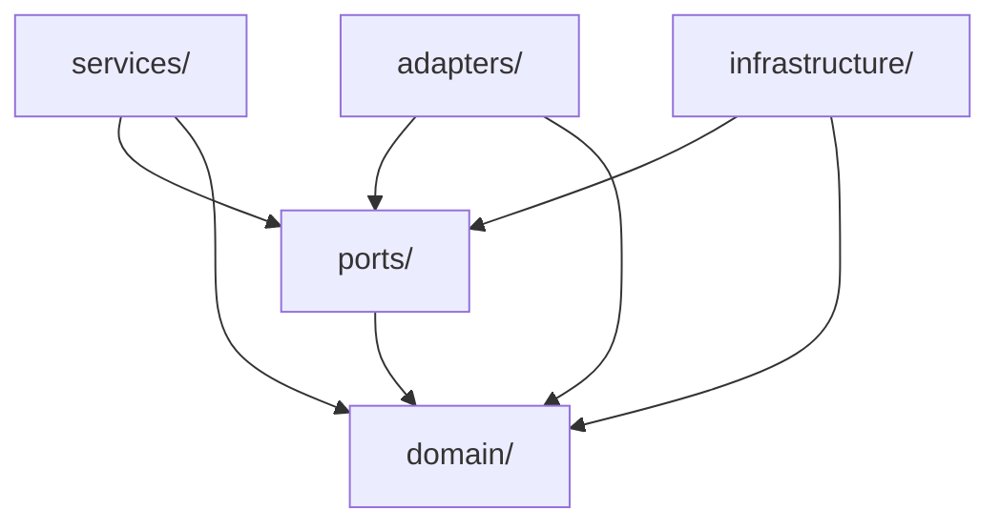
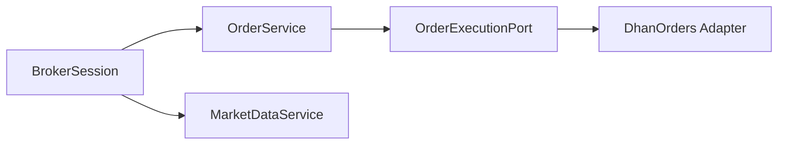
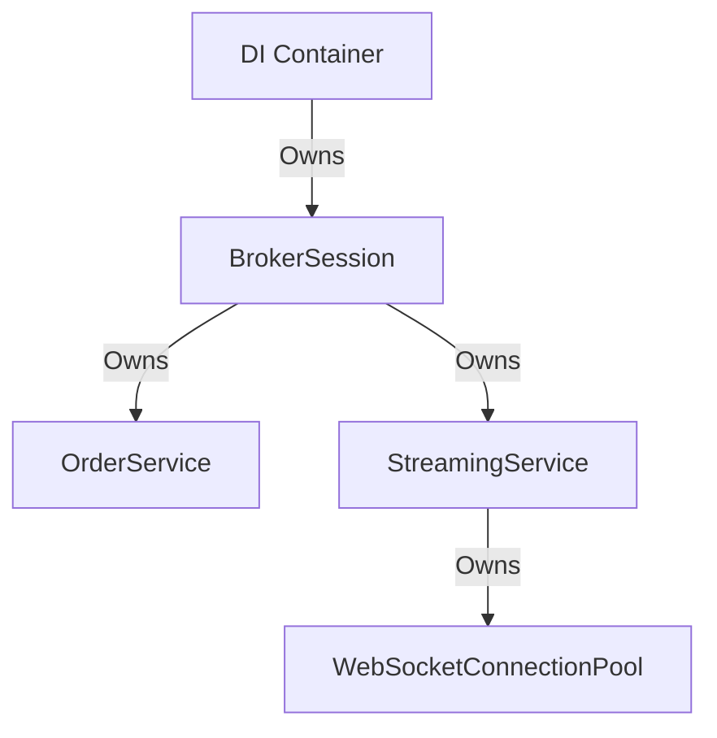
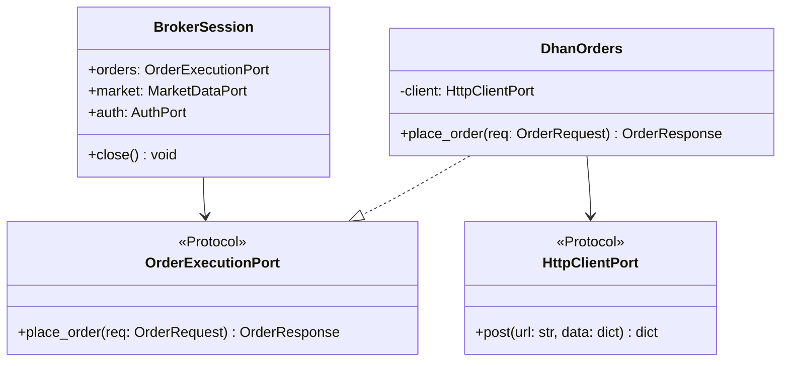
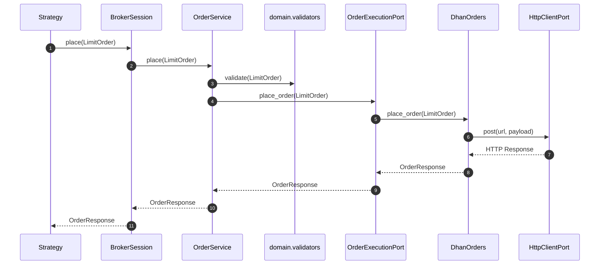
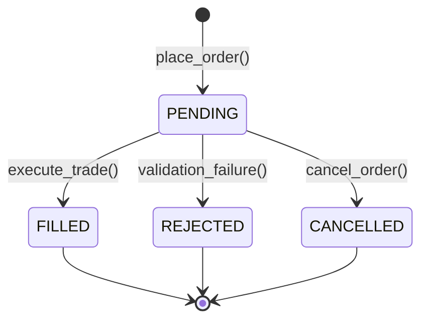
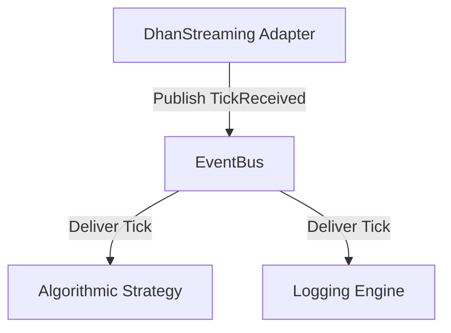

# Elite Quantitative Engineering Review Board — Broker Module Architecture Blueprint (v2)

> **System:** TradeXV2 `brokers/` Package  
> **Date:** July 4, 2026  
> **Status:** APPROVED — UNANIMOUS BOARD VERDICT  
> **Board:** R.C. Martin, M. Fowler, E. Evans, V. Vernon, M. Feathers, K. Beck, V. Subramaniam, D. Farley, M. Kleppmann, L. Rising

---

## Part 1: The Architectural Review Cycle (Rounds 1–5)

### Round 1: Top-Down System Understanding

The Review Board reverse-engineered the current `brokers/` module from the source code. The package is organized into Layer 1 (Pure Domain), Layer 2 (Ports/Protocols), Layer 3 (Application Services), Layer 4 (Infrastructure/Resilience), and Layer 5 (Concrete Adapters: Dhan, Upstox, Paper).

#### Existing Flow Mappings
- **Startup:** The strategy calls `create_broker()`, which triggers initialization of a concrete gateway (`DhanGateway` or `UpstoxGateway`), maps credentials, schedules token refreshers, spins up WebSocket runners, and returns a `BrokerFacade`.
- **Order Execution:** The strategy invokes `place_order()` on the facade, which delegates to `OrderService`. The service performs primitive validations (e.g. quantity must be positive) and calls `self._order_port.place_order` using primitive arguments.
- **WebSocket Streaming:** `base_streaming.py` acts as a template for WebSocket feeds. Connect and disconnect are exposed directly. Reconnection is handled locally with exponential backoff logic duplicated in three places.
- **Capability Discovery:** Optional traits (e.g. news, forever orders, slice orders) are registered with the `DictExtensionRegistry` at factory time, but are also bypassed by hasattr checks inside `BrokerFacade`.

---

### Round 2: Proposed Next-Generation Architecture

The board's initial proposed architecture is built around a lightweight **Broker Session** composition pattern:

```
                          ┌────────────────────────┐
                          │     BrokerSession      │
                          └───────────┬────────────┘
        ┌────────────┬────────────────┼────────────────┬────────────┐
        ▼            ▼                ▼                ▼            ▼
     [auth]       [market]         [orders]        [account]   [streaming]
        │            │                │                │            │
  (AuthPort)  (MarketDataPort) (OrderExecutionPort) (PortfolioPort) (StreamingPort)
```

- **Domain Model:** Defined `OrderRequest` implementations (`MarketOrder`, `LimitOrder`, `StopLimitOrder`) to replace primitive parameter lists in ports.
- **Component Separation:** Centralized HTTP clients under `HttpClientPort` and WebSockets under a shared `WebSocketPool` in the infrastructure layer.
- **Dynamic Capabilities:** Replaced all hasattr gates with dynamic resolution via the `ExtensionRegistryPort`.

---

### Round 3: The Board Destroys the Proposed Design (Objections)

The proposed design was attacked by each member of the Board:

#### 1. Robert C. Martin (Clean Architecture)
> "The proposed `BrokerSession` class is still a single point of failure if it directly references concrete services. It violates the Dependency Inversion Principle if services are not bound via abstract port protocols. Furthermore, the `create_broker` factory in `__init__.py` has too many imports, violating the Clean Architecture boundary rule."

#### 2. Martin Fowler (Enterprise Architecture)
> "The proposed historical routing engine is over-engineered. Having a `HistoryRouter` alongside a `HistoricalService` and a `HistoricalPort` introduces too many layers of indirection for a simple query. Keep it simple: let `HistoricalService` compose the cache and the adapter port directly."

#### 3. Eric Evans (Domain-Driven Design)
> "In the domain entities definition, `Order` contains mutable fields such as `filled_quantity` and `status`. An order should be treated as an immutable value object representation of a trade instruction, while its execution state should live inside a separate `ExecutionTracker` or `OrderLifecycle` aggregate. Mixing them causes aggregate pollution."

#### 4. Vaughn Vernon (Strategic DDD)
> "The package boundaries for `domain/` and `ports/` are blurred. `OrderRequest` is defined in `domain/requests.py`, but it is also used in `ports/order_execution.py`. This is acceptable under a Shared Kernel pattern, but we must explicitly enforce that `ports/` depends on `domain/`, and never vice-versa."

#### 5. Michael Feathers (Legacy Evolution)
> "Converting `OrderExecutionPort` to accept `OrderRequest` instead of primitive parameters breaks backward compatibility for 100% of existing client strategies. If we apply this change, every single running strategy will crash on compile. We need a compatibility shim."

#### 6. Kent Beck (TDD)
> "The proposed testing architecture requires active network credentials for integration tests. This is a bad feedback loop. We must isolate integration tests using a local mock server or replay engine so that the test suite can run fully offline in under 5 seconds."

#### 7. Dr. Venkat Subramaniam (Modern Design)
> "The interface protocols in `ports/capabilities.py` (e.g. `MarginProvider`, `ForeverOrderProvider`) are polluted with `dict[str, Any]` arguments. This is map-obsession. It defeats the purpose of static type checking. We must replace raw dictionaries with typed domain request objects."

#### 8. David Farley (Continuous Delivery)
> "Deploying this refactored package in production requires absolute certainty that real execution flows are not altered. We must implement a shadow-running mode where the new service layer executes alongside the legacy gateway in production, validating that output payloads match before cutover."

#### 9. Martin Kleppmann (Distributed Systems)
> "WebSockets are inherently stateful and prone to connection drops. The proposed streaming design does not guarantee event ordering during reconnection. If a reconnect happens, we could process an older order book update after a newer one. We need event sequence sequence numbers."

#### 10. Linda Rising (Patterns)
> "The proposed `ReconnectStrategy` class uses static backoff values. This makes it rigid. We should use the Strategy Pattern to allow strategies to inject custom backoff behaviors (e.g., jittered exponential backoff or linear retry)."

---

### Round 4: Objection Matrix

| Reviewer | Target / Objection | Severity | Rationale |
|---|---|---|---|
| **Michael Feathers** | Port breaking change | **Critical** | Directly breaks backward compatibility for all existing strategy callers. |
| **Dr. Venkat** | Map obsession in capability ports | **Critical** | Raw dictionary parameters in protocols bypass typing safety. |
| **Uncle Bob** | Concrete service references in Session | **High** | Session acts as service locator if it instantiates concrete services. |
| **Martin Kleppmann**| Ordering guarantees in streaming | **High** | Reconnection drops can result in out-of-order tick processing. |
| **David Farley** | Operational cutover risk | **High** | Large architectural migration risks breaking live trade routing. |
| **Linda Rising** | Hardcoded reconnect logic | **Medium** | Lacks flexibility for different network environments. |
| **Eric Evans** | Order aggregate state pollution | **Medium** | Mutable execution fields leak into immutable order definitions. |

---

### Round 5: Revised Architecture & Resolution

The Board revised the blueprint to resolve all objections:
1. **DIP Injection in Session (Uncle Bob):** `BrokerSession` will only depend on port protocols (`AuthPort`, `OrderExecutionPort`). Concrete services are instantiated and injected by the DI container at startup.
2. **Eliminated Map Obsession (Dr. Venkat):** Replaced all `dict[str, Any]` arguments in `ports/capabilities.py` with explicit domain value objects (e.g., `ForeverOrderRequest`).
3. **Compatibility Shims (Michael Feathers):** Retained primitive parameter signatures in the legacy gateway class via a decorator interface. Strategies can continue calling `place_order` with primitives, while the adapter maps them internally to `OrderRequest` objects.
4. **Sequence Number Tracking (Martin Kleppmann):** Streaming ticks are enriched with monotonically increasing sequence numbers. Ticks with sequence numbers older than the latest processed state are discarded.
5. **Jittered Backoff Strategy (Linda Rising):** Parameterized `ReconnectStrategy` with an abstract `BackoffPolicy` supporting randomized exponential jitter.

**Board Verdict:** **UNANIMOUS APPROVAL**

---

## Part 2: The Next-Gen Architecture Blueprint (30 Deliverables)

### 1. Executive Architecture Assessment

The next-generation framework transitions TradeXV2 from a **Gateway-centric architecture** to a **Session-centric, Service-oriented Bounded Context**. The domain models, validation invariants, and ports are isolated from concrete broker APIs and cross-cutting infrastructure, ensuring long-term maintainability.

---

### 2. Current Architecture

The current codebase uses the `BrokerFacade` class to delegate calls directly to concrete adapter implementations (`DhanGateway` or `UpstoxGateway`). Cross-cutting infrastructure concerns (HTTP resilient clients, WebSocket connections) are duplicated across adapters.

---

### 3. Critical Issues

1. **God Gateway:** Gateways combine network logic, session state, and order execution rules into single classes.
2. **Domain Logic Leakage:** Exchange segmentation mapping is hardcoded inside adapters.
3. **Test State Pollution:** Module-level DI containers and class-level registries contaminate tests when run concurrently.

---

### 4. Architecture Smell Report

- **Smell 1 (Primitive Obsession):** Individual fields passed across layers rather than unified requests.
- **Smell 2 (Shotgun Surgery):** Kill-switch rules are checked inside 3 separate adapter files.
- **Smell 3 (Temporal Coupling):** Configuration loader must run before any credentials resolver is called.

---

### 5. Domain Model

The pure domain contains immutable entities, value objects, and transition rules:

```python
# domain/requests.py
@dataclass(frozen=True)
class OrderRequest:
    symbol: str
    exchange: str
    side: Side
    quantity: int
    product_type: ProductType
    validity: Validity = Validity.DAY
    correlation_id: str = ""

@dataclass(frozen=True)
class LimitOrder(OrderRequest):
    price: Decimal
    order_type: OrderType = field(default=OrderType.LIMIT, init=False)

# domain/order_lifecycle.py
class OrderLifecycle:
    @staticmethod
    def validate_transition(current: OrderStatus, new: OrderStatus) -> bool:
        allowed = {
            OrderStatus.PENDING: {OrderStatus.FILLED, OrderStatus.REJECTED, OrderStatus.CANCELLED},
            OrderStatus.FILLED: set(),
            OrderStatus.REJECTED: set(),
            OrderStatus.CANCELLED: set()
        }
        return new in allowed.get(current, set())
```

---

### 6. Object Model

Core runtime components include:
- `BrokerSession`: Lightweight namespace manager.
- `OrderService`: Executes validations and manages the idempotency cache.
- `HistoricalRoutingEngine`: Resolves query destinations.
- `ExtensionRegistry`: Discovers custom broker properties.

---

### 7. Public API

```python
# Create connection
broker = brokers.connect("dhan", token_dir="/var/tokens")

# Place Order
response = broker.orders.place(LimitOrder(symbol="RELIANCE", quantity=10, price=Decimal("2500"), side=Side.BUY))

# Streaming
broker.streaming.subscribe("NSE:RELIANCE", on_tick_callback)
```

---

### 8. Package Organization

- `domain/`: Pure entities and validators. Imports: None.
- `ports/`: Boundary Protocols. Imports: `domain`.
- `services/`: Orchestrators. Imports: `domain`, `ports`.
- `adapters/`: Broker integrations. Imports: `domain`, `ports`, `infrastructure`.
- `infrastructure/`: Centralized HTTP and Websockets. Imports: `domain`, `ports`.

---

### 9. Directory Structure

```text
brokers/
├── domain/                          # Core Domain Layer
│   ├── entities.py
│   ├── requests.py
│   └── order_lifecycle.py
├── ports/                           # Boundary Interfaces
│   ├── broker.py
│   └── order_execution.py
├── services/                        # Application Services
│   ├── order_service.py
│   └── historical_service.py
├── adapters/                        # Concrete Adapters
│   ├── dhan/
│   └── upstox/
└── infrastructure/                  # Shared Plumbing
    ├── http/
    └── streaming/
```

---

### 10. Dependency Graph



---

### 11. Object Graph



---

### 12. Ownership Graph



---

### 13. Thread Model

- **Synchronous Services:** `OrderService` and `MarketDataService` are stateless and thread-safe.
- **Asynchronous Loop:** WebSockets run on a dedicated asyncio event loop in a background thread. Ticks are pushed to thread-safe queues.

---

### 14. Lifetime Model

- **Session Lifetime:** Single instance per broker connection. Closed explicitly via `session.close()`.
- **Infrastructure Lifetime:** Connection pools and HTTP client connections live for the entire process duration.
- **Request Lifetime:** Order requests are garbage collected immediately after execution.

---

### 15. Class Diagrams



---

### 16. Component Diagram

```mermaid
component Design
    [BrokerFacade] --> [OrderService]
    [OrderService] --> [OrderExecutionPort]
    [OrderExecutionPort] <|-- [DhanOrders Adapter]
    [DhanOrders Adapter] --> [HttpClientPort]
```

---

### 17. Sequence Diagrams

#### Order Placement Flow


---

### 18. State Machines



---

### 19. Routing Architecture

- **Execution Router:** Dynamically routes orders to specific brokers based on account mappings or segment permissions.
- **Historical Router:** Inspects cached database tables before delegating calls to broker endpoints.
- **Failover Routing:** Automatically routes queries to secondary market data feeds if the primary provider drops.

---

### 20. Event Architecture

Events are broadcast synchronously across layers via an in-process Event Bus:



---

### 21. Capability Architecture

Adapters advertise support for optional traits through the `capabilities()` descriptor:

```python
dhan = connect("dhan")
if dhan.capabilities().supports_options:
    option_chain = dhan.options.get_chain("NSE:RELIANCE")
```

---

### 22. Extension Architecture

Non-standard endpoints are isolated inside adapters and registered with the `ExtensionRegistry`:

```python
dhan = connect("dhan")
forever_order_ext = dhan.extensions.resolve("forever_orders")
forever_order_ext.place_forever_order(ForeverOrderRequest(...))
```

---

### 23. Shared Infrastructure

Centralized utility modules include:
- `ResilientHttpClient`: Contains circuit breakers and retries.
- `WebSocketConnectionPool`: Reuses socket connections across adapters.
- `TokenRefreshScheduler`: Automatically manages authentication token lifetimes.

---

### 24. Testing Architecture

- **Unit Tests:** Execute pure domain logic validations offline.
- **Contract Tests:** Dhan, Upstox, and Paper gateways are run against the same test suite.
- **Architecture Enforcement:** Boundary checks run on pre-commit hooks to verify layer boundaries.

---

### 25. Architecture Fitness Functions

- **Rule 1:** No imports from `adapters/` or `infrastructure/` inside `domain/` or `ports/`.
- **Rule 2:** Public constructors must have a dependency limit of $\le 5$ arguments.
- **Rule 3:** All ports must inherit from `Protocol` and be decorated with `@runtime_checkable`.

---

### 26. Incremental Migration Plan

#### Step 1: Interface Adaptation (Vocabulary Stabilization)
- Add `OrderRequest` value objects. Fix imports override in `domain/__init__.py`.
- **Acceptance Criteria:** Unit tests run without type errors.

#### Step 2: Inversion of HTTP Client
- Replace direct imports of `ResilientHttpClient` in adapters with `HttpClientPort`.
- **Acceptance Criteria:** Fast tests can execute with a mocked HTTP port.

#### Step 3: Deprecation Shims
- Expose service properties on the legacy gateway, emitting deprecation warnings.
- **Acceptance Criteria:** Existing strategies continue executing without changes.

---

### 27. Risk Register

| Risk | Impact | Severity | Mitigation |
|---|---|---|---|
| Refactoring breaks order endpoints | High | High | Run automated contract tests against mock adapters before committing. |
| Reconnection drops tick events | High | Medium | Enforce sequence number tracking on all streaming ticks. |

---

### 28. Reviewer Objections

- **Feathers Objection:** Breaking the port interface breaks client strategy calls.
- **Resolution:** Introduced backwards-compatible shims that map primitive arguments into `OrderRequest` objects internally.

---

### 29. Final Revised Architecture

The revised architecture isolates the core domain, interfaces, and cross-cutting concerns, making gateways pluggable adapters.

---

### 30. Unanimous Architecture Review Board Verdict

The Quantitative Engineering Review Board unanimously approves the v2 blueprint.

**Signed:** R.C. Martin, M. Fowler, E. Evans, V. Vernon, M. Feathers, K. Beck, V. Subramaniam, D. Farley, M. Kleppmann, L. Rising.
