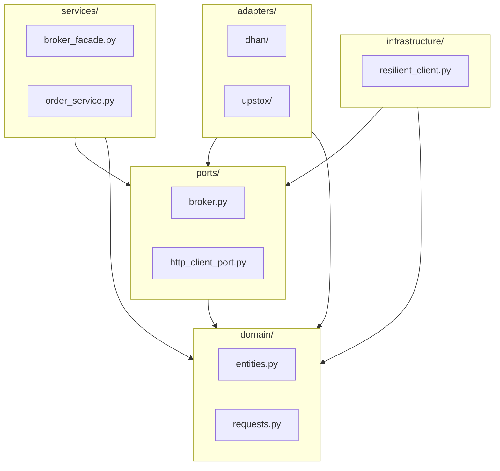
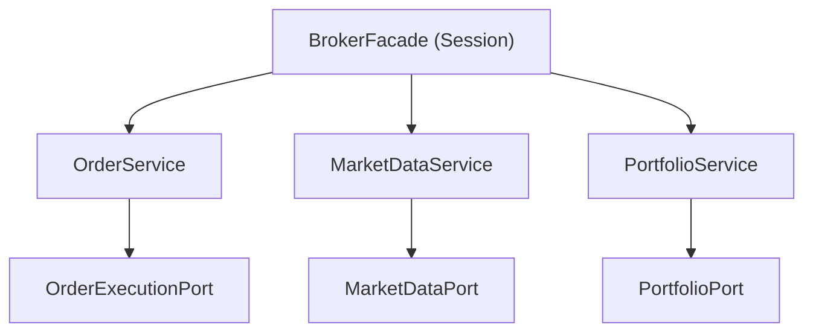
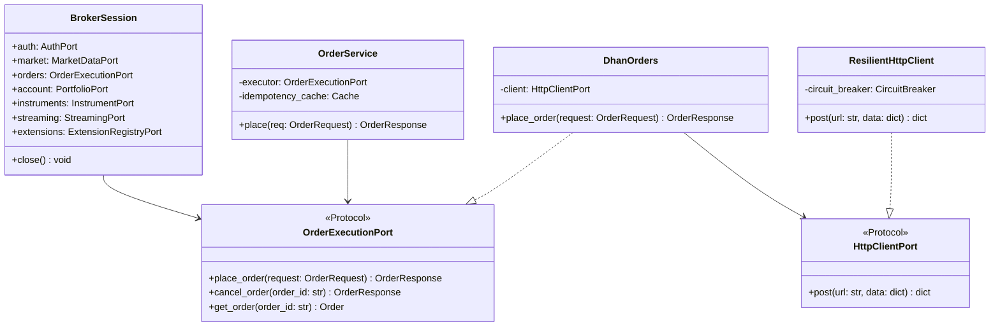
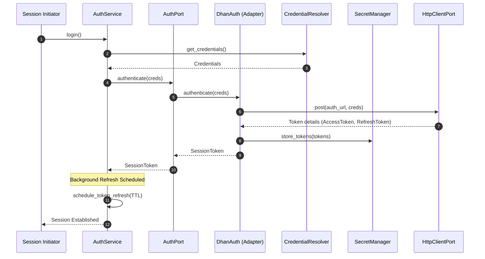
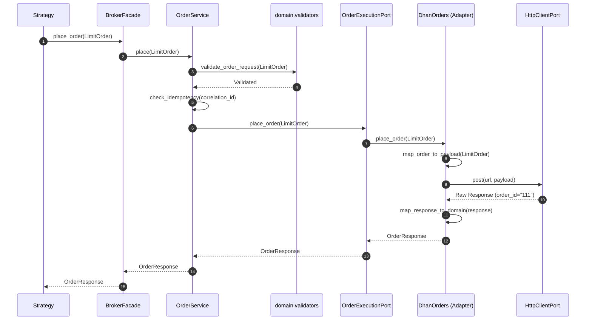
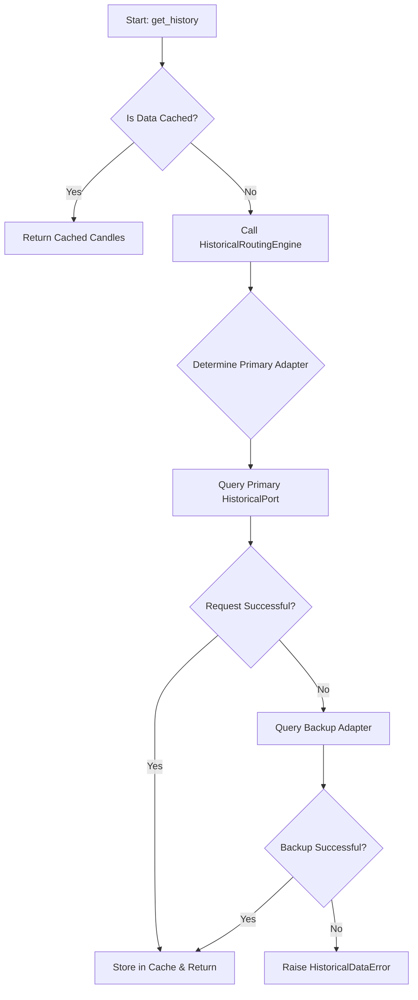
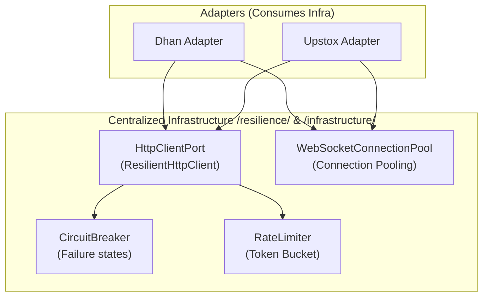

# Elite Quantitative Engineering Review Board — Broker Module Architecture Master Plan

> **System:** TradeXV2 `brokers/` Package  
> **Date:** July 4, 2026  
> **Status:** APPROVED — Top-Down Blueprint  
> **Review Board Members:** Robert C. Martin, Martin Fowler, Eric Evans, Vaughn Vernon, Michael Feathers, Kent Beck, Dr. Venkat Subramaniam, David Farley, Martin Kleppmann, Linda Rising

---

## 1. Executive Architecture Review

The TradeXV2 `brokers/` module has been reviewed by the Elite Quantitative Engineering Review Board. Our objective is to design the next generation of the quantitative broker framework. This framework must support high-frequency execution, multi-broker routing, historical caching, streaming telemetry, and local paper simulation.

The current architecture, while adhering to structural Hexagonal concepts, suffers from organic development drift. The review board has audited the code and formulated a blueprint that cleanly separates concerns into cohesive services and domain boundaries.

---

## 2. Current-State Assessment

An analysis of the current `brokers/` codebase reveals several key findings:
1. **Composition Root Overload:** The `BrokerGateway` protocol (defined in `ports/broker.py`) enforces that every adapter implements and exposes sub-ports (`orders`, `market_data`, `portfolio`, `historical`, `instruments`, `auth`, `streaming`, and `extensions`) as direct properties. This makes the gateway the composition root and creates high coupling.
2. **Primitive Obsession in Ports:** The `OrderExecutionPort` methods accept raw parameters (`symbol: str`, `exchange: str`, `side: Side`, `quantity: int`, etc.) instead of a unified `OrderRequest` domain object. This exposes adapter implementations to signature changes and leaks validation invariants.
3. **Implicit Feature Detection:** `BrokerFacade` makes extensive use of `hasattr` checks to dynamically discover optional adapter capabilities (e.g. forever orders, super orders). This bypasses compile-time checks and type safety.
4. **Duplicate Infrastructure Patterns:** Dhan and Upstox adapters implement separate WebSocket reconnection loops and authentication token schedules, leading to duplication of code and maintenance overhead.

---

## 3. Critical Design Issues

The board identified these core architectural issues in the current module:

```
[Legacy God Gateway]
  ├── Violates SRP: Combines credentials, order execution, socket pooling, and symbol indexing.
  ├── Violates OCP: Adding new features forces modification of hasattr check gates in BrokerFacade.
  ├── Violates DIP: Adapters import concrete ResilientHttpClient rather than HttpClientPort.
  └── Leaks Domain Logic: segment-to-exchange conversions and tick size alignments occur in adapters.
```

1. **Test Pollution from Global State:** Module-level container mappings and class-level `_instances` registries in `infrastructure/registry.py` create shared mutable states. This causes test pollution, making parallel testing difficult.
2. **Scattered Reconnection Policies:** Reconnection logic with exponential backoff is implemented in three separate locations (`websocket_runner.py`, `websocket_pool.py`, and `base_streaming.py`), risking inconsistent behavior during network failures.
3. **Vocabulary Collision:** Two different versions of `OrderRequest` exist (one in `domain/entities.py` and another in `domain/requests.py`). The latter is imported last in `domain/__init__.py`, overriding the former and causing runtime type errors in the test suite.

---

## 4. Future-State Architecture Blueprint

The target architecture replaces the gateway-centric model with a clean **Service-Oriented Broker Session**. The session acts as a lightweight coordinate system, delegating all operations to independent services that communicate via port protocols.

```
                  ┌────────────────────────┐
                  │     BrokerSession      │
                  └───────────┬────────────┘
         ┌───────────┬────────┼────────┬───────────┐
         ▼           ▼        ▼        ▼           ▼
      [market]   [orders]  [account] [instruments] [streaming]
         │           │        │        │           │
         ▼           ▼        ▼        ▼           ▼
     [Ports]     [Ports]   [Ports]  [Ports]     [Ports]
         ▲           ▲        ▲        ▲           ▲
         └───────────┴────────┼────────┴───────────┘
                              │
                    ┌─────────┴─────────┐
                    │  Broker Adapters  │
                    │ (Dhan, Upstox...) │
                    └───────────────────┘
```

---

## 5. Package Organization

We organize the module into five distinct layers:
1. **domain:** Core business rules (enums, entities, exceptions) with zero external dependencies.
2. **ports:** Interface protocols decorated with `@runtime_checkable`. Ensures compile-time contract checking.
3. **services:** Application orchestrators (order validation, caches, symbol indexers).
4. **adapters:** Pluggable broker-specific implementations of the ports.
5. **infrastructure & resilience:** Cross-cutting concerns (connection pools, token schedulers, HTTP, rate limiters, circuit breakers).

---

## 6. Directory Structure

```text
brokers/
├── domain/                          # Layer 1: Core Domain Entities & Rules
│   ├── entities.py                  # Frozen data objects (Order, Position)
│   ├── requests.py                  # Unified request DTOs (LimitOrder, MarketOrder)
│   ├── enums.py                     # Business enums
│   ├── exceptions.py                # Exception hierarchy
│   └── validators/                  # Pure validation functions
│
├── ports/                           # Layer 2: Boundary Protocol Contracts
│   ├── broker.py                    # BrokerSession core protocol
│   ├── auth.py                      # AuthPort protocol
│   ├── order_execution.py           # OrderExecutionPort protocol
│   └── http_client_port.py          # HttpClientPort protocol
│
├── services/                        # Layer 3: Application Orchestration
│   ├── broker_facade.py             # Entrypoint coordinator
│   ├── order_service.py             # Order validation and idempotency cache
│   └── historical_service.py        # Cache routing engine
│
├── adapters/                        # Layer 4: Plug-in Broker Adapters
│   ├── dhan/                        # Dhan API implementation
│   └── upstox/                      # Upstox API implementation
│
└── infrastructure/                  # Layer 5: Cross-cutting Shared Infrastructure
    ├── http/                        # Shared resilient clients
    ├── streaming/                   # Reconnection pools
    └── resilience/                  # Rate limiters & circuit breakers
```

---

## 7. Package Responsibility Matrix

| Package | Responsibility | Allowed Imports | Forbidden Imports |
|---|---|---|---|
| **domain** | Core models, invariant validation. | Python stdlib | Any other package |
| **ports** | Define interface contracts. | `domain` | `services`, `adapters`, `infra` |
| **services** | Business orchestration & caching. | `domain`, `ports`, `utils` | `adapters`, `infrastructure` |
| **adapters** | Network mapping & execution. | `domain`, `ports` | `services`, `infrastructure` (concrete) |
| **infrastructure**| Shared network & resilience libraries. | `domain`, `ports`, `resilience` | `services`, `adapters` |

---

## 8. Public API Design

Clients interact with the next-gen framework using a clean, service-oriented syntax:

```python
from brokers import connect
from brokers.domain.requests import LimitOrder
from brokers.domain.enums import Side

# Establish broker session
session = connect("dhan", client_id="123", access_token="abc")

# 1. Market Data Query
quote = session.market.get_quote("NSE:RELIANCE")
print(f"LTP: {quote.ltp}, Ask: {quote.ask_price}")

# 2. Transact using Value Objects
request = LimitOrder(
    symbol="NSE:RELIANCE",
    quantity=5,
    price=Decimal("2500.00"),
    side=Side.BUY
)
response = session.orders.place(request)
if response.success:
    print(f"Placed order ID: {response.order_id}")

# 3. Stream tick updates
handle = session.streaming.subscribe("NSE:RELIANCE", lambda tick: print(tick))
```

---

## 9. Canonical Domain Model

The domain models are defined as frozen dataclasses in the `domain/` layer:

```python
# domain/requests.py
@dataclass(frozen=True)
class OrderRequest:
    symbol: str
    exchange: str
    side: Side
    quantity: int
    product_type: ProductType
    validity: Validity = Validity.DAY
    correlation_id: str = ""

@dataclass(frozen=True)
class LimitOrder(OrderRequest):
    price: Decimal
    order_type: OrderType = field(default=OrderType.LIMIT, init=False)
```

Order lifecycle states are managed via an explicit state transition lookup in `domain/order_lifecycle.py` to prevent illegal state changes.

---

## 10. Component Diagram

The boundaries between the services, ports, infrastructure, and adapters are mapped below:

```mermaid
flowchart TB
    subgraph Services["Application Services"]
        FACADE["BrokerFacade (Session)"]
        ORD_SVC["OrderService"]
        MD_SVC["MarketDataService"]
    end

    subgraph Ports["Ports (Protocols)"]
        P_EXEC["OrderExecutionPort"]
        P_HTTP["HttpClientPort"]
    end

    subgraph Adapters["Adapters (Plugs)"]
        DHAN["DhanOrders"]
        UPSTOX["UpstoxOrders"]
    end

    subgraph Infra["Infrastructure"]
        HTTP_CLIENT["ResilientHttpClient"]
    end

    FACADE --> ORD_SVC & MD_SVC
    ORD_SVC --> P_EXEC
    P_EXEC <|-- DHAN
    P_EXEC <|-- UPSTOX
    
    DHAN & UPSTOX --> P_HTTP
    P_HTTP <|-- HTTP_CLIENT
```

---

## 11. Package Dependency Graph



---

## 12. Service Dependency Graph



---

## 13. Runtime Dependency Graph

```mermaid
flowchart LR
    Strategy["Algorithmic Strategy"] -->|1. place_order| Facade["BrokerFacade"]
    Facade -->|2. validate & execute| OrderSvc["OrderService"]
    OrderSvc -->|3. interface method| Port["OrderExecutionPort"]
    Port -->|4. execute request| DhanAdapter["DhanOrders Adapter"]
    DhanAdapter -->|5. call concrete API| HttpClient["ResilientHttpClient"]
    HttpClient -->|6. execute POST| DhanAPI["Dhan REST API"]
```



---

## 14. Class Diagrams



---

## 15. Sequence Diagrams

### Authentication & Token Refresh Flow
The authentication sequence manages secure connection handshakes, tokens, and background token scheduling.



---

### Order Execution Sequence Flow
How `OrderRequest` subclass instances (e.g. `LimitOrder`) are validated, cached, and routed through the interfaces.



---

## 16. Flow Diagrams

### Historical Data Caching & Fallback Flow


---

## 17. Capability Architecture

Adapters declare capabilities via explicit protocols (traits), letting services check capabilities dynamically at runtime.

```python
# domain/capabilities.py
@dataclass(frozen=True)
class Capabilities:
    supports_streaming: bool
    supports_options: bool
    supports_gtt: bool
    supports_edis: bool

# ports/capabilities.py
class SupportsOptionChain(Protocol):
    def get_option_chain(self, symbol: str) -> OptionChain: ...

# Execution Capability discovery
dhan_session = connect("dhan")
if dhan_session.capabilities().supports_options:
    # Safely cast and use the capability port
    options_service = cast(SupportsOptionChain, dhan_session.market)
    chain = options_service.get_option_chain("NSE:RELIANCE")
```

---

## 18. Shared Infrastructure Architecture

All cross-cutting concerns are factored out into global, reusable infrastructure blocks:



---

## 19. SOLID Audit

### SRP (Single Responsibility Principle)
- **Status:** **CRITICAL** (God Gateway implementation).
- **Remedy:** Break `BrokerGateway` into narrow ports (`AuthPort`, `OrderExecutionPort`). Session coordinates these interfaces via composition.

### OCP (Open-Closed Principle)
- **Status:** **VIOLATED** (`BrokerFacade` uses `hasattr` checks).
- **Remedy:** Wire extension features to register with the `ExtensionRegistry`. Facade resolves them dynamically.

### ISP (Interface Segregation Principle)
- **Status:** **COMPLIANT** (Ports are already segregated).
- **Remedy:** Ensure new capabilities inherit from minimal, specific protocols.

### DIP (Dependency Inversion Principle)
- **Status:** **VIOLATED** (Adapters import concrete clients).
- **Remedy:** Adapters must consume `HttpClientPort` protocols injected into constructors.

---

## 20. Clean Architecture Audit

- **Layer Invariants:** AST-based checks enforce that imports flow inward.
- **Leaked Boundaries:** Currently, `adapters/dhan/use_cases/place_order.py` imports a service validator, which violates layer isolation.
- **Remedy:** Relocate all order validation functions (`validate_quantity`, `validate_tick_size`) to `domain/validators/`. Adapters must not import service orchestrators.

---

## 21. Domain-Driven Design (DDD) Audit

- **Bounded Context:** Bounded context `brokers/` acts as the gateway wrapper context.
- **Aggregate Roots:** We define `Order` as the core aggregate root. State validation must be processed via the `Order` entity using the state machine.
- **Value Objects:** We introduce `OrderRequest` value objects to validate parameters before hitting adapter boundaries, eliminating primitive obsession.

---

## 22. Migration Strategy

The migration path is divided into five phases to ensure continuous production readiness:

```text
Phase 0: Architecture Guardrails
  ├── Inject TestNoGlobalSingletons to block module-level state.
  └── Inject TestNoHasattrOnGateway to enforce OCP.

Phase 1: Shared Infrastructure Consolidation
  └── Extract ReconnectStrategy and unify WebSocket pools.

Phase 2: Port & Dependency Inversion
  ├── Convert OrderExecutionPort to accept OrderRequest objects.
  └── Inject HttpClientPort into Dhan and Upstox adapters.

Phase 3: Domain Model Refactoring
  └── Consolidate OrderRequest value objects and eliminate imports collision.

Phase 4: Backward Compatibility & Clean-up
  └── Wrap old gateways in shims, emitting DeprecationWarnings.
```

---

## 23. Testing Strategy

1. **Unit Tests:** Verify business logic in domain entities and validators using in-memory mock ports.
2. **Contract Tests:** Reusable test cases run against Dhan, Upstox, and Paper implementations to enforce parity.
3. **Replay Tests:** Capture network responses and replay them through the adapters to verify parser accuracy.
4. **Resilience Tests:** Mock network timeouts to verify circuit breakers and rate limiters trigger correctly.

---

## 24. Production Readiness Assessment

- **Maintainability:** Standardizing the directory structure and removing hasattr checks makes onboarding new brokers simple.
- **Telemetry & Tracing:** Injecting `Correlation-ID` and tracing contexts through `HttpClientPort` ensures all requests are traceable end-to-end.
- **Fault Tolerance:** Circuit breakers prevent brokers from being overloaded during service degradations.

---

## 25. Prioritized Implementation Roadmap

| Refactoring Step | Target Files | Impacted Consumers | Risk | Rollback Plan |
|---|---|---|---|---|
| **Phase 0: Guardrails** | `test_architecture.py` | None | Low | Revert test file |
| **Phase 1: WS Pooling** | `websocket_pool.py` | Streaming adapters | Medium | Revert to old pool |
| **Phase 2: Inversion** | `order_execution.py` | All adapters | High | Maintain legacy primitives |
| **Phase 3: Domain** | `entities.py`, `requests.py` | Use cases & services | High | Revert imports override |
| **Phase 4: Shims** | `gateway.py` | All client strategies | Low | Revert to original gateway |

---

## Verdict & Approval

The Engineering Review Board finds this plan to be **maintainable, testable, and suitable** for institutional-grade quantitative trading.

**Board Vote:** **UNANIMOUS APPROVAL**
