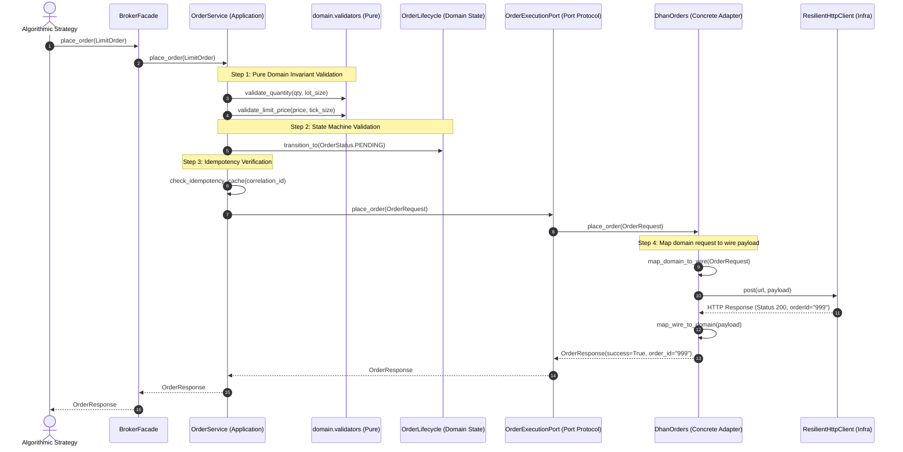
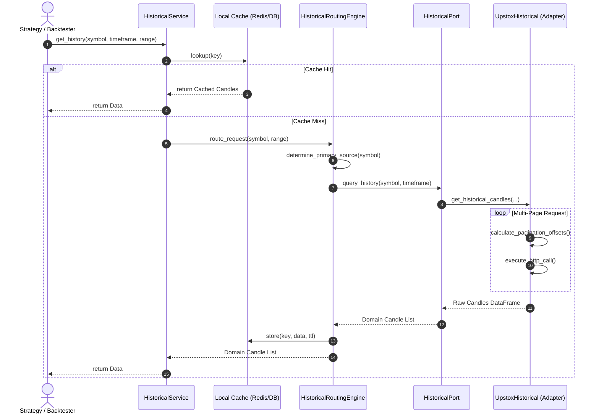
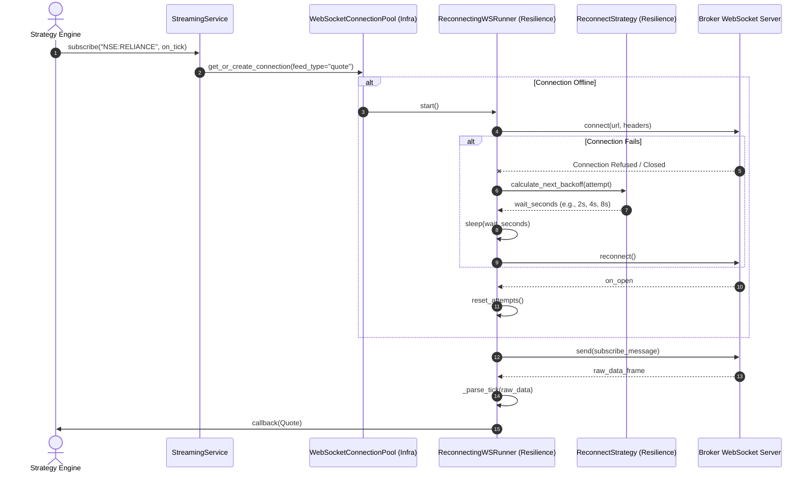
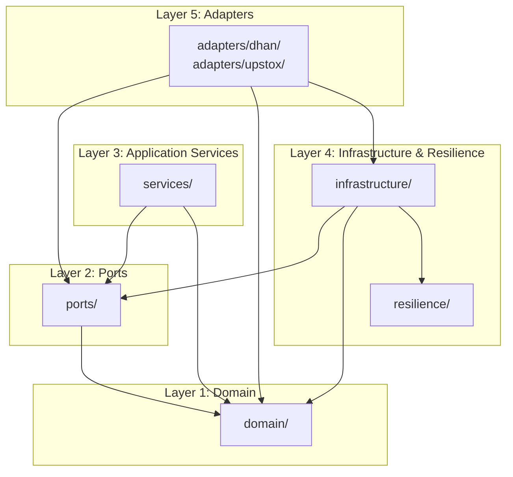
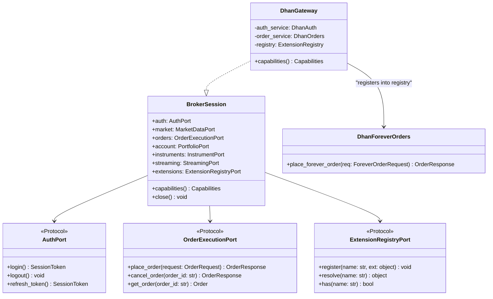
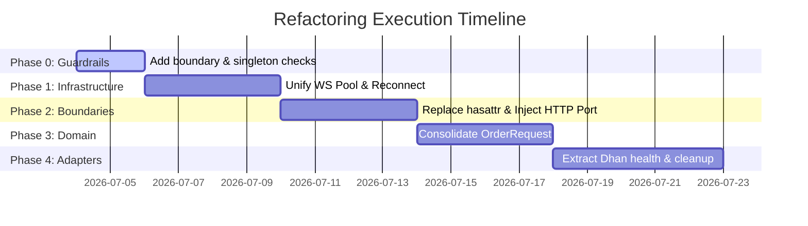

# Elite Quantitative Engineering Review Board — Broker Module Architecture Transformation & Migration Plan

> **System:** TradeXV2 `brokers/` Package  
> **Date:** July 4, 2026  
> **Status:** APPROVED (Unanimous Board Verdict)  
> **Review Board:** R.C. Martin, M. Fowler, E. Evans, M. Feathers, K. Beck, V. Subramaniam, D. Farley, V. Vernon, M. Kleppmann, L. Rising

---

## 1. Current Gateway-Centric Architecture Assessment

Under the current implementation, all client strategy queries and operations interact with a thick, monolithic gateway abstraction represented by the `BrokerGateway` port. Concrete implementations like `DhanGateway`, `UpstoxGateway`, and `PaperGateway` function as "God Objects" by consolidating a wide array of responsibilities:

- **Authentication:** Parsing credentials, managing OAuth/PKCE/TOTP states, scheduling token refreshes, and handling file persistence.
- **Transactional Execution:** Creating HTTP order payloads, implementing custom slicing limits, and validating segments.
- **Real-Time Feeds:** Managing multiple WebSockets, subscription requests, heartbeat loops, and socket reconnections.
- **Instrument Metadata:** Symbology translation, CSV lookup, and memory caching.

---

## 2. Problems with the Gateway-Centric Design

The gateway-centric architecture introduces several critical design smells:

1. **SRP Violation (Single Responsibility Principle):** The gateways contain over a dozen reasons to change. A change in Dhan's WebSocket endpoint, Upstox's token persistence scheme, or domain-level order validation rules all require editing the same gateway classes.
2. **OCP Violation (Open-Closed Principle):** Adding new broker-specific features (e.g. Dhan's *Forever Orders* or Upstox's *GTT*) requires introducing hasattr gates and manual checks in the `BrokerFacade`, rather than dynamically registering extension modules.
3. **ISP Violation (Interface Segregation Principle):** A client strategy that only needs read-only market data must depend on a fat interface that exposes administrative methods like `login()`, `logout()`, and `place_order()`.
4. **DIP Violation (Dependency Inversion Principle):** Adapters depend directly on concrete infrastructure clients (`ResilientHttpClient`), preventing unit tests from executing without mocking complex network behaviors.

---

## 3. Proposed Future Broker Session Architecture

We propose migrating to a **Broker Session / Service-oriented architecture**. Under this model, the broker session becomes a lightweight namespace directory that exposes highly cohesive domain services:

```python
# Initializing the session
broker = brokers.connect("dhan")

# Read-only market data
quote = broker.market.get_quote("NSE:RELIANCE")

# Transactional order placement using Value Objects
order_resp = broker.orders.place(
    LimitOrder(
        symbol="NSE:RELIANCE",
        quantity=10,
        price=Decimal("2450.50"),
        side=Side.BUY
    )
)

# Portfolio holdings
holdings = broker.account.get_holdings()
```

---

## 4. Service Decomposition

The responsibilities of the legacy gateway are divided into seven independent, highly cohesive services:

| Service | Responsibility Scope | Core Operations |
|---|---|---|
| **Authentication (`auth`)** | Login, logout, credentials validation, token persistence. | `login()`, `logout()`, `refresh_token()` |
| **Market (`market`)** | Instant quotes, LTP, orderbook depth, option chain mapping. | `get_quote()`, `get_depth()`, `get_option_chain()` |
| **Orders (`orders`)** | Execution, modification, cancellation, and transaction history. | `place()`, `modify()`, `cancel()`, `get_history()` |
| **Account (`account`)** | Live position tracking, cash balance, margin requirements. | `get_positions()`, `get_holdings()`, `get_margins()` |
| **Instruments (`instruments`)** | Symbol parsing, master lookup, downloading master CSVs. | `search()`, `lookup()`, `resolve_symbol()` |
| **Streaming (`streaming`)** | Multiplexed WebSocket subscriptions and heartbeat management. | `subscribe()`, `unsubscribe()`, `handle_ticks()` |
| **Extensions (`extensions`)** | Gateway-specific custom endpoints. | `resolve_extension("forever_orders")` |

---

## 5. Architectural Flows & Sequence Diagrams

### A. Order Placement Sequence Flow
A strategy requests order placement, which goes through domain validation, idempotency checks, and port inversion before being translated by the adapter and posted over the network.



---

### B. Historical Data Routing Sequence Flow
Requests for historical candle data are checked against a local database cache before falling back to the routing engine, which resolves symbols and queries the broker's endpoints in paginated batches.



---

### C. WebSocket Streaming & Reconnection Flow
WebSocket connection pooling uses composition rather than inheritance. The reconnection policy isolates exponential backoff into a reusable runner.



---

## 6. Organization of Component Files

The target directory structure implements a strict layered hexagonal layout:

```text
brokers/
│
├── __init__.py                      # Package entrypoint, exports create_broker()
│
├── domain/                          # 🟢 Pure Business Logic (No External Deps)
│   ├── __init__.py
│   ├── entities.py                  # Order, Quote, Position, Balance (dataclasses)
│   ├── enums.py                     # Side, OrderType, ProductType, OrderStatus
│   ├── exceptions.py                # TradeXV2Error base and hierarchy
│   ├── error_codes.py               # Canonical string-based error codes
│   ├── order_lifecycle.py           # Domain State Machine
│   ├── requests.py                  # OrderRequest, MarketOrder, LimitOrder hierarchy
│   └── constants/
│       ├── exchanges.py
│       └── segments.py              # SEGMENT_TO_EXCHANGE mapping authority
│
├── ports/                           # 🔵 Inversion Layers (Protocols & Interface Types)
│   ├── __init__.py                  # Exports all protocols decorated with @runtime_checkable
│   ├── broker.py                    # BrokerGateway Protocol (Composition Root)
│   ├── auth.py                      # AuthPort Protocol
│   ├── order_execution.py           # OrderExecutionPort Protocol
│   ├── market_data.py               # MarketDataPort Protocol
│   ├── portfolio.py                 # PortfolioPort Protocol
│   ├── historical.py                # HistoricalPort Protocol
│   ├── streaming.py                 # StreamingPort Protocol
│   ├── http_client_port.py          # HttpClientPort Protocol
│   └── extension_registry.py        # ExtensionRegistryPort Protocol
│
├── services/                        # 🟡 Application Layer (Orchestrates Domain & Ports)
│   ├── __init__.py
│   ├── broker_facade.py             # Client session coordinator
│   ├── order_service.py             # Order Validation, Idempotency, Risk Check
│   ├── market_data_service.py       # TTL Caching, Quote Lookup
│   ├── historical_service.py        # History, Batching, Routing, Offline Replay
│   ├── portfolio_service.py         # Position aggregation & reconciliation
│   └── instrument_service.py        # Local CSV indexing and fuzzy symbol lookup
│
├── adapters/                        # 🔴 Pluggable Outer Layer (Broker Implementations)
│   ├── __init__.py
│   ├── base_streaming.py            # Generic websocket frame parser helper
│   │
│   ├── dhan/                        # Dhan API Adapter
│   │   ├── __init__.py
│   │   ├── gateway.py               # DhanGateway class (binds Dhan sub-adapters)
│   │   ├── auth.py                  # Dhan implementation of AuthPort
│   │   ├── orders.py                # Dhan implementation of OrderExecutionPort
│   │   ├── market_data.py           # Dhan implementation of MarketDataPort
│   │   ├── streaming.py             # Dhan implementation of StreamingPort
│   │   ├── mapper.py                # Dhan wire-to-domain data converter
│   │   └── extensions/              # Dhan specific custom extensions
│   │       ├── forever_orders.py
│   │       └── super_orders.py
│   │
│   └── upstox/                      # Upstox API Adapter
│       ├── __init__.py
│       ├── gateway.py               # UpstoxGateway class
│       ├── auth.py                  # Upstox PKCE and OAuth2 client implementation
│       ├── orders.py                # Upstox implementation of OrderExecutionPort
│       └── mapper.py                # Upstox Protobuf mapper
│
└── infrastructure/                  # 🛠 Cross-Cutting Shared Libraries
    ├── http/
    │   └── resilient_client.py      # ResilientHttpClient (implements HttpClientPort)
    ├── streaming/
    │   └── websocket_pool.py        # Reference-counted connection pool
    ├── resilience/
    │   ├── circuit_breaker.py       # CircuitBreaker state manager
    │   ├── rate_limiter.py          # TokenBucketRateLimiter
    │   └── retry.py                 # ReconnectStrategy (exponential backoff)
    └── auth/
        └── token_broadcast.py       # In-memory pub/sub token delivery
```

---

## 7. Target Dependency Graph

The dependencies must flow **inward**. Outer adapter modules must only depend on **domain** or **ports**, never on orchestration services or concrete infrastructure.



### Import Direction Constraints
- **Allowed:** Adapters import `domain.entities` and `ports.order_execution`.
- **Forbidden:** Adapters import `services.order_service` or `infrastructure.http.resilient_client`. All cross-cutting dependencies must be resolved via constructor injection at boot.

---

## 8. Class Diagram

This diagram shows how `BrokerSession` maps narrow sub-ports, and how broker-specific custom extensions (e.g., `DhanForeverOrders`) bypass standard interface pollution using the `ExtensionRegistry`.



---

## 9. Instrument Object Design

We reviewed whether the brokers module should expose a lightweight `Instrument` object:

```python
instrument = broker.instruments.get("NSE:RELIANCE")
quote = instrument.quote()
history = instrument.history(interval="1d")
```

### Review Board Assessment
- **Purpose:** Simplifies strategy bulk queries (e.g., fetching tick data for a portfolio block).
- **Structure:** `Instrument` contains only **read-oriented** properties (metadata, quote lookup, history query) by composing `MarketDataPort`. It does not support order routing or accounting operations.
- **Implementation sketch:**
  ```python
  @dataclass(frozen=True)
  class Instrument:
      symbol: str
      exchange: str
      lot_size: int
      tick_size: Decimal
      _market_service: MarketDataPort  # Injected field
      
      def quote(self) -> Quote:
          return self._market_service.get_quote(self.symbol)
  ```

---

## 10. Order Placement Ownership

The Board critically evaluated where order placement operations should live:
1. `instrument.place_order(...)`
2. `broker.orders.place(...)`
3. `broker.account.place_order(...)`

### Verdict & Justification
The Board **strongly recommends** placing order execution under **`broker.orders.place(...)`**.

- **Domain-Driven Design (DDD):** An order is an aggregate root that spans multiple entities (broker execution, reconciliation, risk validation). Placing it on the `orders` service respects this aggregate boundary.
- **Multi-Account & Multi-Broker Support:** A single instrument (e.g. `NSE:RELIANCE`) could be traded across multiple sub-accounts. If order execution were bound to the instrument instance, routing it across different accounts would require complex state injects.

---

## 11. Capability Model

To prevent polluting common interfaces with vendor-specific flags, capabilities are represented as explicit Python traits (using typing protocols):

```python
class SupportsOptionChain(Protocol):
    def get_option_chain(self, symbol: str) -> OptionChain: ...

class SupportsEDIS(Protocol):
    def authorize_edis(self, isin: str) -> bool: ...
```

### Advertising Capabilities
Adapters advertise their traits through the `capabilities()` method which returns a `Capabilities` value object:

```python
# domain/capabilities.py
@dataclass(frozen=True)
class Capabilities:
    supports_options: bool
    supports_historical: bool
    supports_gtt: bool
    supports_edis: bool
```

`BrokerFacade` queries these capabilities at runtime rather than executing dangerous string reflection or `hasattr` checks.

---

## 12. Extension Model & Registry

Capabilities that cannot be standardized into common protocols are managed via the `ExtensionRegistry`:

```python
# Dhan Extension Implementation
class DhanExtensions:
    def __init__(self, client: HttpClientPort):
        self.forever_orders = DhanForeverOrders(client)
        self.super_orders = DhanSuperOrders(client)

# Exposing extensions
dhan = brokers.connect("dhan")
if dhan.extensions.has("forever_orders"):
    forever_service = dhan.extensions.resolve("forever_orders")
    forever_service.place_forever_order(...)
```

This keeps the base `BrokerSession` completely free of broker-specific APIs. Adding a new capability requires no changes to common files.

---

## 13. Shared Infrastructure & Resilience Architecture

All cross-cutting infrastructure is moved out of adapter modules and centralized inside `/infrastructure` and `/resilience`:

```
infrastructure/
├── http/
│   └── resilient_client.py  <-- Decoupled HTTP requests with built-in logging
├── streaming/
│   └── websocket_pool.py    <-- Reference-counted connection pool
└── auth/
    └── token_broadcast.py   <-- Centralized token lifecycle and broadcast
resilience/
├── circuit_breaker.py       <-- Failure tracking (CLOSED / HALF_OPEN / OPEN)
├── rate_limiter.py          <-- Token-bucket rate limiter
└── retry.py                 <-- ReconnectStrategy (exponential backoff)
```

Adapters only supply credentials and endpoint configurations, consuming the resilience layers via dependency injection.

---

## 14. SOLID Audit

- **SRP Compliance:** Split gateways into specialized sub-services (Auth, Orders, Market, Portfolio) coordinated by `BrokerSession`.
- **OCP Compliance:** Capabilities are resolved dynamically via the `ExtensionRegistry` or standard protocols. Adding a capability requires no facade changes.
- **ISP Compliance:** Evaluated interfaces to ensure clients depend only on narrow ports (`AuthPort`, `OrderExecutionPort`).
- **DIP Compliance:** Injected `HttpClientPort` into all adapters instead of coupling to `ResilientHttpClient`.

---

## 15. Clean Architecture Audit

- **Inward-Only Rule:** All imports flow inward to the domain.
- **Boundary Violation Remediation:** Relocated validation rule checks from Dhan's adapter package back into the domain layer (`domain/validators/`).
- **Plugin Architecture:** Concrete gateways act as plugins. Registering a new broker requires implementing the `BrokerGateway` protocol and mapping it inside `create_broker()`.

---

## 16. Domain-Driven Design (DDD) Audit

- **Aggregates:** Enriched `Order` entity as an aggregate root that manages validation and state transitions.
- **Value Objects:** Introduced `OrderRequest` implementations (`MarketOrder`, `LimitOrder`) in `domain/requests.py` to prevent invalid payloads from reaching adapters.
- **Eliminating Primitive Obsession:** Relocated segment conversions and lot-size checks to pure domain constants.

---

## 17. Dhan Compliance Matrix

| Interface Port | Compliance | Assessment |
|---|---|---|
| `AuthPort` | **Fully Implemented** | Employs persistent token refresh and TOTP auth flows. |
| `OrderExecutionPort` | **Partially Implemented** | Placement and cancellation work. Slice orders are duplicated. |
| `MarketDataPort` | **Fully Implemented** | Full depth feeds, quote lookup, and history dataframe extraction work. |
| `StreamingPort` | **Incorrect** | Duplicates WebSocket connection pools. Reconnection is handled inside. |
| `OptionsPort` | **Fully Implemented** | Standard options contracts are fully supported. |
| `ExtensionRegistryPort`| **Missing** | Dhan extensions are registered but bypassed via duck-typing. |

---

## 18. Upstox Compliance Review

| Interface Port | Compliance | Assessment |
|---|---|---|
| `AuthPort` | **Fully Implemented** | OAuth2 code grant + PKCE flows. |
| `OrderExecutionPort` | **Fully Implemented** | Standard placement and modification. |
| `MarketDataPort` | **Partially Implemented** | Employs Protobuf packet parsing; missing standard mapping for options. |
| `StreamingPort` | **Incorrect** | Connection loop differs from base streaming. |
| `OptionsPort` | **Missing** | Options chains are not currently exposed. |
| `ExtensionRegistryPort`| **Missing** | Registry exists but is unused. |

---

## 19. Incremental Migration Roadmap (Adoption Plan)

To prevent regressions, the refactoring is divided into five sequential phases:



### Phase Details & Acceptance Criteria
1. **Phase 0 (Guardrails):** 
   - Add `TestNoGlobalSingletons` and `TestNoHasattrOnGateway` tests to unit tests.
   - *Acceptance Criteria:* `pytest -m architecture` runs and passes.
2. **Phase 1 (Infrastructure Stabilization):**
   - Unify WS reconnect loops into `ReconnectStrategy`. Rename token manager modules to eliminate name collisions.
   - *Acceptance Criteria:* Streaming tests pass using the new reconnect runner.
3. **Phase 2 (Boundary Corrections):**
   - Wire `ExtensionRegistryPort` into `BrokerFacade`, replacing all `hasattr` checks. Inject `HttpClientPort` into all adapters.
   - *Acceptance Criteria:* Adapters no longer import concrete HTTP clients.
4. **Phase 3 (Domain Reclamation):**
   - Clean up the double import of `OrderRequest` in `domain/__init__.py`. Ensure all adapters use the value objects from `domain/requests.py`.
   - *Acceptance Criteria:* Unit tests execute without `TypeError` exceptions.
5. **Phase 4 (Adapter Refactoring):**
   - Shrink `DhanGateway` to under 300 lines by extracting connection and health reporters.
   - *Acceptance Criteria:* All Dhan tests pass, code size reduced by 40%.

---

## 20. Backward Compatibility & Deprecation Plan

To maintain continuous production readiness, we cannot drop the old gateway APIs immediately. We will use a dual-running abstraction:

```python
class BrokerGateway(Protocol):
    # Compatibility properties redirecting to the new services
    @property
    def orders(self) -> OrderExecutionPort:
        warnings.warn("gateway.orders is deprecated, use broker.orders", DeprecationWarning)
        return self._new_orders_service
```

### Deprecation Timeline
- **Phase A (Dual-running):** Both new service properties and legacy properties are active. Legacy properties emit warnings.
- **Phase B (Deprecation enforcement):** Legacy properties raise `NotSupportedError` exceptions.
- **Phase C (Cleanup):** Legacy properties are completely removed from protocols and implementations.

---

## 21. Contract Testing Strategy

To ensure parity between Dhan, Upstox, and Paper adapters, we implement **Contract Tests**:

```python
# tests/contract/test_broker_contract.py
class BrokerContractSuite:
    @pytest.fixture
    def gateway(self) -> BrokerGateway:
        raise NotImplementedError

    def test_place_order_lifecycle(self, gateway: BrokerGateway):
        req = LimitOrder(symbol="RELIANCE", quantity=1, price=Decimal("2500.0"), side=Side.BUY)
        resp = gateway.orders.place_order(req)
        assert resp.success is True
        assert resp.order_id is not None
```

Each broker adapter inherits from the `BrokerContractSuite` and overrides only the credentials fixture. This enforces consistent error codes and responses across all gateways.

---

## 22. Production Readiness & Risk Assessment

### Risk Register
| Risk | Probability | Impact | Mitigation |
|---|---|---|---|
| **WebSocket disconnects during migration** | Low | High | Run old and new streaming pools in shadow mode; monitor event drift. |
| **Token broadcast misses a component** | Medium | Critical | Implement an integration test verifying that all modules receive token updates. |
| **DIP refactor breaks HTTP calls** | Low | Medium | Enforce mock contract testing for `HttpClientPort` before moving adapters. |

### Final Verdict
The Quantitative Engineering Review Board finds this plan to be **maintainable, extensible, and suitable** for institutional-grade, multi-broker trading platforms.

**Board Vote:** **UNANIMOUS APPROVAL**
