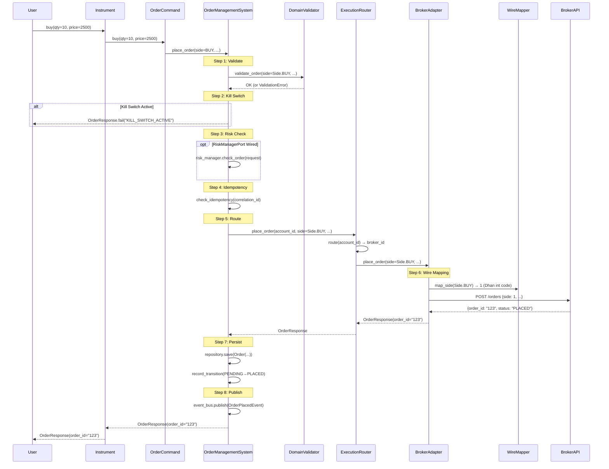
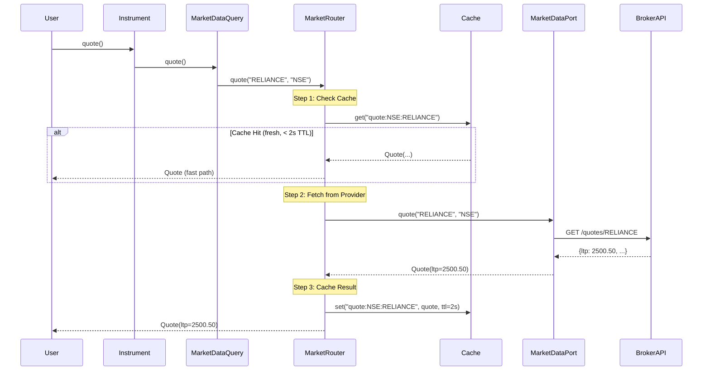
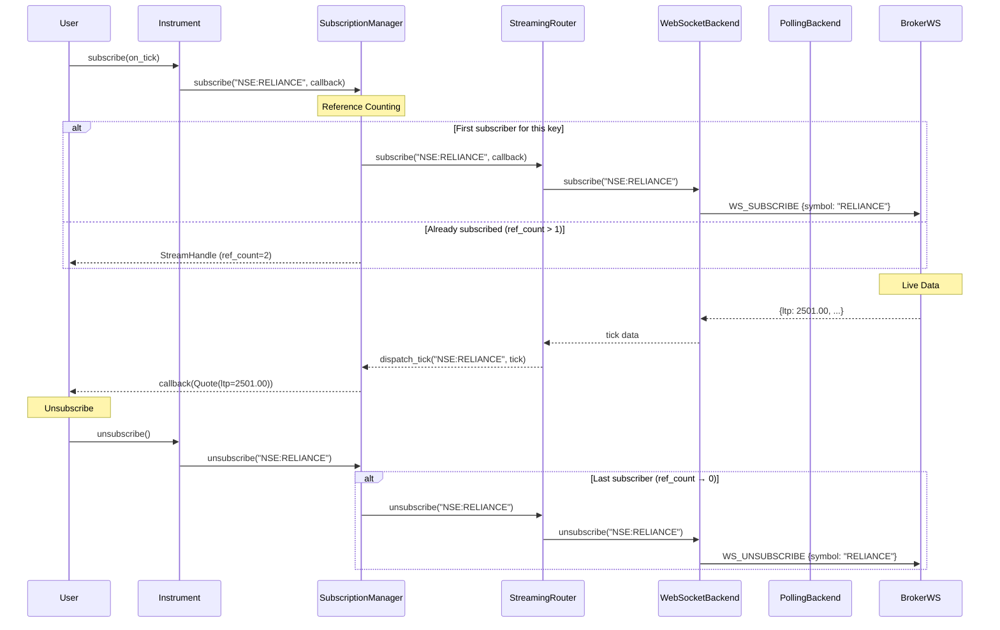
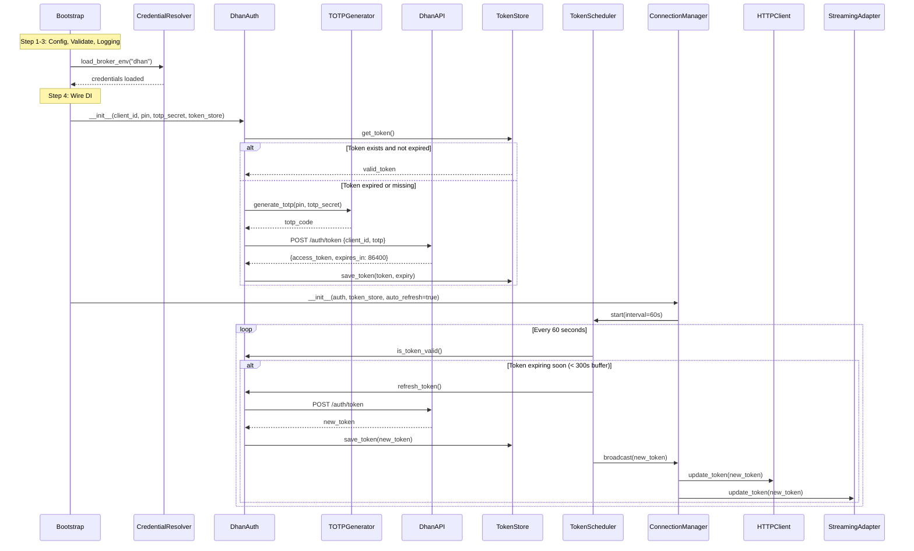
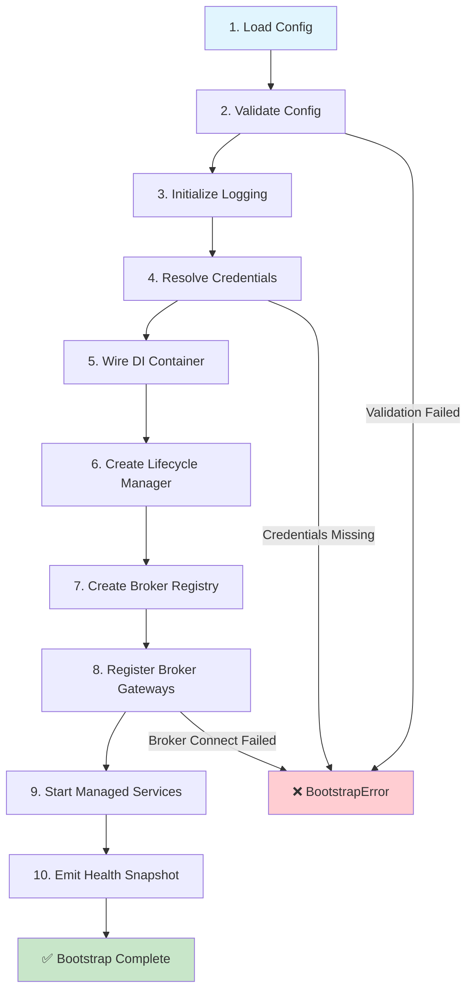
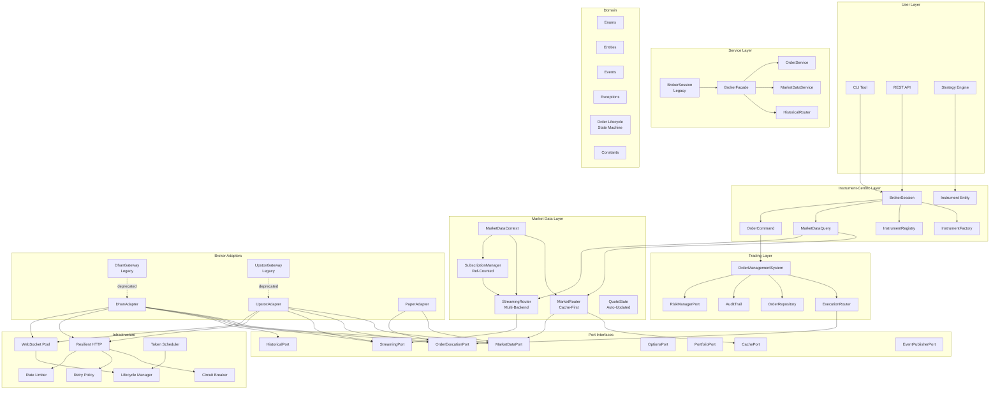
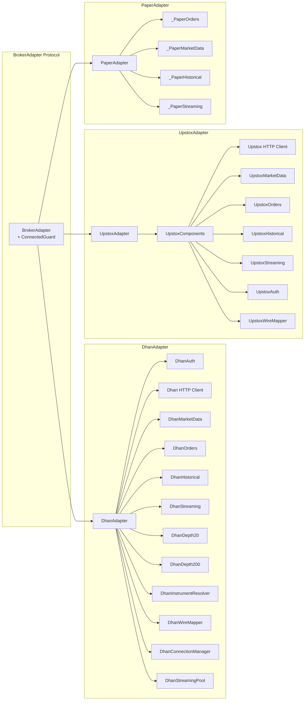
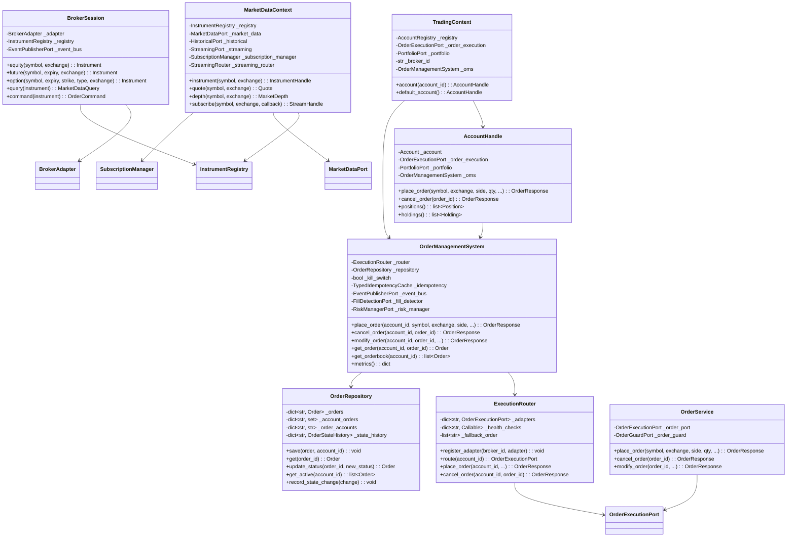

# INCTrade V4 Architecture Redesign Plan

**Date:** July 6, 2026
**Scope:** Full codebase transformation — `brokers-core/`, `inc_trade/`, `brokers/`
**Status:** PLANNING — No code changes yet

---

## Table of Contents

1. [Executive Summary](#1-executive-summary)
2. [Current State Analysis](#2-current-state-analysis)
3. [Reactive Module Analysis](#3-reactive-module-analysis)
4. [New Architecture Design](#4-new-architecture-design)
5. [Flow Diagrams](#5-flow-diagrams)
6. [Component Diagram](#6-component-diagram)
7. [Class Diagrams](#7-class-diagrams)
8. [Multi-Agent Team Plan](#8-multi-agent-team-plan)
9. [Phased Adoption Strategy](#9-phased-adoption-strategy)
10. [Testing Strategy](#10-testing-strategy)
11. [Risk Mitigation](#11-risk-mitigation)

---

## 1. Executive Summary

### Current Problems

The codebase has accumulated **5 major structural debts** during its evolution from a monolithic `brokers/` package to a three-package architecture (`brokers-core` → `inc_trade` → `brokers`):

| Problem | Severity | Blast Radius |
|---------|----------|-------------|
| **Triple package maintenance** — identical code in `brokers-core`, `inc_trade` (strangler bridges), and `brokers` (wrapper bridges) | HIGH | 100+ files |
| **Parallel order validation** — 3 independent validation paths with inconsistent behavior | HIGH | 3 critical paths |
| **Subscription chaos** — 6+ different `subscribe()` signatures across 20+ files | HIGH | 20+ files |
| **Scattered magic constants** — reconnect delays, TTLs, exchange strings hardcoded in 10+ files | MEDIUM | 10+ files |
| **Adapter inconsistency** — `str` vs `Side` enum, string broker IDs vs `BrokerID` enum | MEDIUM | 15+ files |

### Target State

A **single canonical package** (`brokers-core`) with clean hexagonal boundaries, a unified subscription model, centralized constants, and type-safe adapter interfaces. The strangler bridge layer (`inc_trade`) is retired. Tests are restructured to validate architectural invariants automatically.

---

## 2. Current State Analysis

### 2.1 Package Topology

```
┌─────────────────────────────────────────────────────────────────┐
│                        brokers/ (Test Suite + Wrappers)          │
│  tests/unit/  tests/contract/  tests/integration/              │
│  adapters/dhan/  adapters/upstox/  adapters/paper/  adapters/  │
│  replay/                                                     │
└──────────────────────────────┬──────────────────────────────────┘
                               │ imports (strangler bridges)
┌──────────────────────────────▼──────────────────────────────────┐
│                     inc_trade/ (Backward Compat Layer)          │
│  ~100 files, each: `from brokers_core.X import *  # noqa: F403`│
│  domain/  ports/  adapters/  services/  trading/  market/      │
│  resilience/  infrastructure/  config/  utils/  extensions/     │
└──────────────────────────────┬──────────────────────────────────┘
                               │ re-exports from
┌──────────────────────────────▼──────────────────────────────────┐
│                  brokers-core/src/brokers_core/ (Canonical)      │
│  domain/  ports/  services/  adapters/  market/  resilience/    │
│  infrastructure/  config/  utils/  extensions/                  │
└─────────────────────────────────────────────────────────────────┘
```

### 2.2 Module Dependency Map

```
domain/        → ∅ (zero dependencies)
utils/         → ∅ (zero dependencies)
config/        → domain.exceptions
ports/         → domain/
services/      → domain/ + ports/ + utils/
resilience/    → domain/ + self
market/        → domain/ + ports/ + extensions/
infrastructure/→ domain/ + resilience/ + ports/ + external libs
adapters/      → domain/ + ports/ + infrastructure/ + external SDKs
```

### 2.3 Component Inventory

| Component | Files | Responsibility | Current Health |
|-----------|-------|----------------|---------------|
| **Domain** | 12 | Enums, entities, exceptions, lifecycle, events | ✅ Clean |
| **Ports** | 22 | Protocol interfaces | ✅ Clean |
| **Services** | 10 | Application services | ⚠️ 3 validation paths |
| **Adapters** | 70+ | Broker implementations | ⚠️ Duplicated guards, str-side |
| **Market** | 25+ | Instrument-centric domain | ⚠️ 6 subscribe signatures |
| **Resilience** | 6 | Fault tolerance | ✅ Clean |
| **Infrastructure** | 20+ | External integrations | ⚠️ Scattered constants |
| **Config** | 12 | Configuration | ✅ Clean |
| **Trading** | 6 | OMS, execution, repository | ⚠️ Parallel validation |
| **OMS** | 3 | Idempotency, kill switch | ✅ Clean |

---

## 3. Reactive Module Analysis

### 3.1 What Are Reactive Modules?

Reactive modules are components that **must change in response to changes in other modules**. They exhibit high coupling and low cohesion — a change in one module forces coordinated changes across multiple others.

### 3.2 Identified Reactive Modules

#### RM-1: `OrderValidation` (CRITICAL)

**Reactive because:** Order validation logic exists in 3 independent locations:

```
OrderService.place_order()     → manual string/exchange/quantity checks
OrderManagementSystem.place_order() → delegates to validate_order()
BrokerAdapter.place_order()    → broker-specific use-case validation
```

**Change scenarios:**
- Adding lot-size validation → must update all 3 paths
- Adding risk check integration → OMS has it, OrderService doesn't
- Changing error response format → inconsistent across paths

**Affected files:** `order_service.py`, `oms.py`, `order_validator.py`, `broker_facade.py`, `dhan/use_cases/place_order.py`, `upstox/use_cases/place_order.py`

#### RM-2: `SubscriptionManagement` (CRITICAL)

**Reactive because:** `subscribe()` has 6+ different signatures with no unified contract:

| Signature | Location | Count |
|-----------|----------|-------|
| `subscribe(instrument, callback)` | BrokerAdapter protocol | 4 |
| `subscribe(symbol, exchange)` | DhanStreaming, UpstoxStreaming | 6 |
| `subscribe(key, exchange)` | StreamingRouter, SubscriptionManager | 4 |
| `subscribe(channel, handler)` | EventBus | 2 |
| `subscribe(callback)` | Instrument, MarketDataContext | 6 |
| `subscribe(instruments: list[tuple])` | DepthFeedBase | 2 |

**Change scenarios:**
- Adding subscription deduplication → must update all paths
- Adding subscription priority → no unified place to add it
- Changing callback signature → must update 20+ call sites

#### RM-3: `BrokerAdapter Lifecycle` (HIGH)

**Reactive because:** 3 adapters independently implement identical lifecycle patterns:

```python
# Identical in DhanAdapter, UpstoxAdapter, PaperAdapter:
def _require_connected(self) -> None:
    if not self._connected or self._market_data is None:
        raise RuntimeError(f"{ClassName} not connected. Call adapter.connect() first.")

@property
def is_connected(self) -> bool:
    return self._connected
```

**Change scenarios:**
- Changing error type from `RuntimeError` to `ConnectionError` → 3 files
- Adding connection state logging → 3 files
- Adding auto-reconnect on disconnect → 3 files

#### RM-4: `Side/String Conversion` (MEDIUM)

**Reactive because:** Side enum conversion is duplicated across adapters:

```python
# Duplicated in 3+ adapter files:
side_enum = Side.BUY if side.upper() == "BUY" else Side.SELL
```

**Change scenarios:**
- Adding validation (e.g., reject unknown sides) → 3 files
- Adding new side types (e.g., `SHORT_SELL`) → 3 files + protocol

#### RM-5: `Constants & Magic Values` (MEDIUM)

**Reactive because:** Magic numbers are scattered without centralization:

| Constant | Files | Values |
|----------|-------|--------|
| Reconnect delay | 10+ | `5.0`, `60.0` |
| TTL seconds | 10+ | `86400`, `3600`, `300`, `2`, `1` |
| Exchange strings | 20+ | `"NSE"`, `"NFO"`, `"BSE"` |
| Broker IDs | 15+ | `"dhan"`, `"upstox"`, `"paper"` |

#### RM-6: `Strangler Bridge Layer` (HIGH)

**Reactive because:** Every new module in `brokers-core` requires creating a corresponding bridge file in `inc_trade/`:

```python
# inc_trade/<module>.py — 100+ files like this:
from brokers_core.<module> import *  # noqa: F403
```

**Change scenarios:**
- Renaming a module → 100+ bridge files break
- Adding a new module → must create a new bridge file
- Changing `__all__` → all bridge files must be updated

---

## 4. New Architecture Design

### 4.1 Target Directory Structure

```
brokers-core/src/brokers_core/
│
├── domain/                          # PURE BUSINESS LOGIC — zero dependencies
│   ├── enums.py                     # Side, OrderType, OrderStatus, BrokerID, AuthMode
│   ├── entities.py                  # Order, Quote, MarketDepth, Instrument (frozen dataclasses)
│   ├── events.py                    # Domain events (OrderPlaced, QuoteTick, etc.)
│   ├── exceptions.py                # TradeXV2Error hierarchy
│   ├── error_codes.py               # String constants for error codes
│   ├── order_lifecycle.py           # State machine (PENDING→OPEN→FILLED, etc.)
│   ├── value_objects.py             # Fundamentals, Greeks, CorporateAction
│   ├── symbols.py                   # Symbol normalization
│   ├── cache_policy.py              # TTL policies (QUOTE: 2s, DEPTH: 1s, etc.)
│   ├── capabilities.py              # Capability descriptor
│   ├── lifecycle_health.py          # Health status
│   └── constants/                   # ALL MAGIC NUMBERS CENTRALIZED
│       ├── __init__.py              # Re-exports all constants
│       ├── exchanges.py             # EQUITY_EXCHANGES, DERIVATIVE_EXCHANGES, defaults
│       ├── segments.py              # SEGMENT_TO_EXCHANGE, SegmentResolver
│       ├── timeouts.py              # HTTP, reconnect, token, cache, idempotency TTLs
│       ├── capabilities.py          # Broker capability constants
│       └── broker_ids.py            # BrokerID string constants (NEW)
│
├── ports/                           # PROTOCOL INTERFACES — depends only on domain/
│   ├── providers.py                 # InstrumentDataProvider, DepthProvider, etc.
│   ├── order_execution.py           # OrderExecutionPort (Side enum, not str)
│   ├── market_data.py               # MarketDataPort
│   ├── streaming.py                 # StreamingPort, StreamHandle
│   ├── subscription.py              # SubscriptionPort (NEW — unified subscribe contract)
│   ├── historical.py                # HistoricalPort
│   ├── options.py                   # OptionsPort
│   ├── portfolio.py                 # PortfolioPort
│   ├── capabilities.py              # Capabilities, MarginProvider, etc.
│   ├── wire_mapper.py               # WireMapper protocol
│   ├── auth.py                      # AuthPort
│   ├── cache_port.py                # CachePort
│   ├── event_publisher.py           # EventPublisherPort
│   ├── risk_manager.py              # RiskManagerPort
│   ├── token_store.py               # TokenStorePort
│   ├── infrastructure.py            # InfrastructurePort
│   ├── clock.py                     # ClockPort
│   ├── connection_lifecycle.py      # ConnectionLifecyclePort
│   ├── fill_detection.py            # FillDetectionPort
│   ├── observers.py                 # QuoteObserver
│   ├── instruments.py               # InstrumentPort
│   ├── extension_registry.py        # ExtensionRegistryPort
│   └── http_client_port.py          # HttpClientPort
│
├── utils/                           # ZERO-DEPENDENCY UTILITIES
│   ├── price.py                     # snap_to_tick, to_wire_float, to_decimal
│   └── idempotency_cache.py         # TypedIdempotencyCache
│
├── services/                        # APPLICATION SERVICES — domain/ + ports/ + utils/
│   ├── order_service.py             # UNIFIED order validation (single path)
│   ├── broker_facade.py             # Gateway → service composition
│   ├── broker_session.py            # FacadeBrokerSession (legacy compat)
│   ├── instrument_service.py        # Symbol resolution with auto-load
│   ├── market_data_service.py       # DEPRECATED — use Instrument.quote()
│   ├── historical_service.py        # Historical data delegation
│   ├── historical_router.py         # Cache-first historical routing
│   ├── portfolio_service.py         # Portfolio delegation
│   ├── options_service.py           # Options delegation
│   ├── reconciliation.py            # Order reconciliation
│   ├── order_guard.py               # Kill switch guard
│   ├── audit_facade.py              # Audit trail facade
│   ├── shadow_broker.py             # Shadow broker for testing
│   ├── broker_router.py             # Multi-broker routing
│   ├── capability_discovery.py      # Runtime capability detection
│   └── feature_registry.py          # Feature flag registry
│
├── market/                          # INSTRUMENT-CENTRIC DOMAIN
│   ├── instrument.py                # Instrument entity (frozen dataclass)
│   ├── types/                       # Type hierarchy
│   │   ├── equity.py                # Equity(Instrument)
│   │   ├── future.py                # Future(Instrument)
│   │   ├── option.py                # Option(Instrument)
│   │   └── index.py                 # Index(Instrument)
│   ├── factory.py                   # InstrumentFactory (content-based creation)
│   ├── registry.py                  # InstrumentRegistry (identity guarantee)
│   ├── session.py                   # BrokerSession (V3 instrument-centric API)
│   ├── context.py                   # MarketDataContext (legacy facade)
│   ├── query.py                     # MarketDataQuery (CQS read side)
│   ├── order.py                     # OrderCommand (CQS write side)
│   ├── option_chain.py              # InstrumentOptionChain
│   ├── streaming_router.py          # StreamingRouter (multi-backend)
│   ├── market_router.py             # MarketRouter (cache-first)
│   ├── subscription_manager.py      # SubscriptionManager (ref-counted)
│   ├── config.py                    # MarketDataConfig
│   ├── decorators.py                # InstrumentDecorator, with_depth()
│   ├── depth_decorators.py          # Depth20/30/200 decorators
│   ├── cache_decorator.py           # CachedDecorator
│   ├── log_decorator.py             # LoggedDecorator
│   ├── depth_state.py               # DepthState
│   ├── quote_state.py               # QuoteState (auto-updated)
│   ├── tick_coalescer.py            # TickCoalescer
│   ├── degraded_mode.py             # DegradedMode, DegradedGuard
│   ├── null_event_publisher.py      # NullEventPublisher
│   ├── scanner/                     # Market scanner
│   │   ├── scanner.py               # Scanner
│   │   ├── criteria.py              # ScanCriteria protocol
│   │   └── result.py                # ScanResult
│   ├── strategies/                  # Option strategies
│   │   ├── base.py                  # OptionStrategy (ABC)
│   │   ├── iron_condor.py           # IronCondor
│   │   ├── straddle.py              # Straddle
│   │   ├── strangle.py              # Strangle
│   │   ├── vertical.py              # VerticalSpread
│   │   └── combo.py                 # ComboOrder
│   └── analytics/                   # Analytics calculators
│       ├── greeks.py                # GreeksCalculator
│       ├── vwap.py                  # VWAPCalculator
│       ├── atr.py                   # ATRCalculator
│       ├── volume_profile.py        # VolumeProfile
│       └── order_flow.py            # OrderFlowAnalyzer
│
├── resilience/                      # FAULT TOLERANCE — domain/ + self
│   ├── retry.py                     # RetryPolicy
│   ├── circuit_breaker.py           # CircuitBreaker
│   ├── rate_limiter.py              # TokenBucketRateLimiter
│   ├── backoff_policy.py            # ExponentialBackoff, JitteredExponentialBackoff
│   ├── token_scheduler.py           # TokenScheduler (background refresh)
│   └── token_manager.py             # TokenManager (lifecycle)
│
├── infrastructure/                  # EXTERNAL INTEGRATIONS
│   ├── bootstrap.py                 # 9-step startup orchestration
│   ├── lifecycle.py                 # LifecycleManager
│   ├── reconnect_strategy.py        # ReconnectStrategy, run_reconnect_loop
│   ├── websocket_pool.py            # ManagedWebSocket
│   ├── websocket_runner.py          # WebSocketApp reconnect loop
│   ├── event_bus.py                 # EventBus
│   ├── logging.py                   # configure_logging
│   ├── credentials.py               # CredentialResolver
│   ├── registry.py                  # GatewayRegistry, BrokerRegistry
│   ├── correlation.py               # CorrelationId generator
│   ├── seq_counter.py               # SequenceCounter
│   ├── jwt_expiry.py                # JWT expiry calculation
│   ├── secret_manager.py            # SecretManager
│   ├── ssl_hardening.py             # HardenedHTTPSAdapter
│   ├── token_broadcast.py           # TokenManager broadcast
│   ├── totp_cooldown.py             # TOTP cooldown
│   ├── http/
│   │   ├── client.py                # HttpClientImpl
│   │   └── resilient_client.py      # ResilientHttpClient (retry + circuit breaker)
│   ├── cache/
│   │   └── memory_cache.py          # MemoryCache (TTL-based, LRU)
│   ├── storage/
│   │   └── token_store.py           # JsonTokenStateStore
│   └── observability/
│       ├── audit.py                 # Audit trail
│       ├── health_check.py          # HealthCheck
│       ├── tracing.py               # OpenTelemetry tracing
│       ├── event_metrics.py         # Event metrics
│       ├── alerting.py              # Alerting
│       └── opentelemetry_setup.py   # OTel setup
│
├── adapters/                        # BROKER IMPLEMENTATIONS
│   ├── broker_adapter.py            # BrokerAdapter protocol
│   ├── base.py                      # ConnectedGuard mixin (NEW)
│   ├── base_streaming.py            # BaseStreamingAdapter
│   ├── paper/
│   │   ├── adapter.py               # PaperAdapter
│   │   ├── gateway.py               # PaperGateway (legacy)
│   │   └── capabilities.py          # PaperCapabilities
│   ├── dhan/
│   │   ├── adapter.py               # DhanAdapter
│   │   ├── gateway.py               # DhanGateway (legacy)
│   │   ├── auth.py                  # DhanAuth
│   │   ├── config.py                # DhanConfig
│   │   ├── identity.py              # DhanInstrumentResolver
│   │   ├── wire_mapper.py           # DhanWireMapper
│   │   ├── market_data.py           # DhanMarketData
│   │   ├── orders.py                # DhanOrders
│   │   ├── historical.py            # DhanHistorical
│   │   ├── streaming.py             # DhanStreaming
│   │   ├── depth20.py               # DhanDepth20Stream
│   │   ├── depth200.py              # DhanDepth200Stream
│   │   ├── depth_feed_base.py       # DepthFeedBase
│   │   ├── reconnecting_service.py  # ReconnectingServiceMixin
│   │   ├── connection_manager.py    # DhanConnectionManager
│   │   ├── connection_admission.py  # ConnectionAdmission
│   │   ├── subscription_engine.py   # SubscriptionEngine
│   │   ├── streaming_pool.py        # StreamingPool
│   │   ├── http_client.py           # create_dhan_http_client
│   │   ├── mapper.py                # DhanResponseMapper
│   │   ├── payload.py               # PayloadBuilder
│   │   ├── options.py               # DhanOptions
│   │   ├── portfolio.py             # DhanPortfolio
│   │   ├── instruments.py           # DhanInstruments
│   │   ├── instrument_loader.py     # CSV instrument loader
│   │   ├── metrics.py               # DhanMetrics
│   │   ├── health_reporter.py       # DhanHealthReporter
│   │   ├── invariants.py            # Dhan invariants
│   │   ├── segments.py              # Dhan segment mapping
│   │   ├── index_registry.py        # Dhan index registry
│   │   ├── symbol_validator.py      # Symbol validation
│   │   ├── alerts.py                # DhanAlerts
│   │   ├── conditional_triggers.py  # Conditional triggers
│   │   ├── edis.py                  # EDIS support
│   │   ├── exit_all.py              # Exit all positions
│   │   ├── futures.py               # Futures support
│   │   ├── ip_management.py         # IP whitelisting
│   │   ├── ledger.py                # Ledger access
│   │   ├── mtf.py                   # MTF support
│   │   ├── new_capabilities.py      # New capabilities
│   │   ├── order_stream.py          # DhanOrderStream
│   │   ├── token_broadcast.py       # Token broadcast
│   │   ├── user_profile.py          # User profile
│   │   ├── use_cases/
│   │   │   └── place_order.py       # PlaceOrderUseCase
│   │   ├── extensions/
│   │   │   ├── margin.py            # DhanMargin
│   │   │   ├── super_orders.py      # DhanSuperOrders
│   │   │   ├── forever_orders.py    # DhanForeverOrders
│   │   │   ├── protocols.py         # Extension protocols
│   │   │   └── models.py            # Extension models
│   │   ├── factories/
│   │   │   ├── auth_factory.py      # Auth factory
│   │   │   ├── client_factory.py    # Client factory
│   │   │   ├── service_factory.py   # Service factory
│   │   │   ├── streaming_factory.py # Streaming factory
│   │   │   └── health_factory.py    # Health factory
│   │   └── resilience/
│   │       └── websocket_rate_limiter_simple.py
│   ├── upstox/
│   │   ├── adapter.py               # UpstoxAdapter
│   │   ├── gateway.py               # UpstoxGateway
│   │   ├── composition.py           # UpstoxComponents, build/teardown
│   │   ├── _builder.py              # UpstoxGatewayBuilder
│   │   ├── auth/                    # OAuth, TOTP, PKCE
│   │   │   ├── config.py
│   │   │   ├── login.py
│   │   │   ├── oauth_client.py
│   │   │   ├── token_manager.py
│   │   │   ├── token_expiry.py
│   │   │   ├── totp_client.py
│   │   │   ├── totp_scheduler.py
│   │   │   ├── pkce.py
│   │   │   ├── holders.py
│   │   │   ├── redirect_server.py
│   │   │   ├── resilience_bridge.py
│   │   │   └── exceptions.py
│   │   ├── market_data.py
│   │   ├── orders.py
│   │   ├── historical.py
│   │   ├── streaming.py
│   │   ├── portfolio.py
│   │   ├── portfolio_stream.py
│   │   ├── instruments.py
│   │   ├── instrument_loader.py
│   │   ├── instrument_definition.py
│   │   ├── instrument_definition_pb2.py
│   │   ├── extended.py
│   │   ├── mapper.py
│   │   ├── tick_mapper.py
│   │   ├── wire_mapper.py
│   │   ├── http.py
│   │   ├── http_client.py
│   │   ├── config.py
│   │   ├── metrics.py
│   │   ├── options.py
│   │   ├── gtt.py
│   │   ├── news.py
│   │   ├── urls.py
│   │   ├── feed_authorizer.py
│   │   ├── capabilities.py
│   │   ├── use_cases/
│   │   │   └── place_order.py
│   │   ├── extensions/
│   │   │   ├── protocols.py
│   │   │   └── __init__.py
│   │   └── proto/
│   │       └── market_feed_pb2.py
│   └── replay/                      # Replay engine
│       ├── engine.py
│       ├── sources.py
│       └── tick_source.py
│
├── config/                          # CONFIGURATION
│   ├── schema.py                    # AppConfig schema
│   ├── validator.py                 # Config validation
│   ├── defaults.py                  # Default values
│   ├── secrets_manager.py           # Secrets management
│   ├── feature_flags.py             # Feature flags
│   ├── indices.py                   # Index registry
│   ├── endpoints.py                 # Broker endpoints
│   └── profiles/                    # Environment profiles
│       ├── base.py
│       ├── dev.py
│       ├── staging.py
│       └── prod.py
│
├── trading/                         # TRADING BOUNDED CONTEXT
│   ├── oms.py                       # OrderManagementSystem
│   ├── execution_router.py          # ExecutionRouter
│   ├── order_repository.py          # OrderRepository
│   ├── context.py                   # TradingContext, AccountHandle
│   ├── account.py                   # Account entity
│   ├── account_registry.py          # AccountRegistry
│   ├── audit.py                     # OrderStateChange, OrderStateHistory
│   └── portfolio/
│       └── aggregator.py            # PositionAggregator
│
└── extensions/                      # EXTENSION FRAMEWORK
    ├── base.py                      # InstrumentDecorator
    ├── depth.py                     # DepthExtension
    └── registry.py                  # ExtensionDecoratorRegistry
```

### 4.2 Layer Dependency Rules (Enforced)

```python
# Layer → Allowed Imports
DOMAIN      = []                          # Zero dependencies
UTILS       = []                          # Zero dependencies
CONSTANTS   = []                          # Zero dependencies (subset of domain)
CONFIG      = ["domain.exceptions"]
PORTS       = ["domain"]
SERVICES    = ["domain", "ports", "utils", "services"]
RESILIENCE  = ["domain", "resilience"]
MARKET      = ["domain", "ports", "extensions", "market"]
INFRA       = ["domain", "resilience", "ports", "infrastructure"]
ADAPTERS    = ["domain", "ports", "infrastructure", "adapters"]
TRADING     = ["domain", "ports", "utils", "trading"]
EXTENSIONS  = ["domain", "extensions"]
```

### 4.3 New Unified Subscription Protocol

```python
# ports/subscription.py (NEW)
@runtime_checkable
class SubscriptionPort(Protocol):
    """Unified subscription contract for all streaming backends."""
    
    def subscribe(
        self,
        key: str,           # "{exchange}:{symbol}"
        exchange: str,
        callback: Callable[[Any], None],
    ) -> StreamHandle: ...
    
    def unsubscribe(
        self,
        key: str,
        exchange: str,
    ) -> None: ...
    
    def is_subscribed(self, key: str) -> bool: ...
    
    @property
    def active_count(self) -> int: ...
```

### 4.4 ConnectedGuard Mixin (NEW)

```python
# adapters/base.py (NEW)
class ConnectedGuard:
    """Mixin providing connection state management for all adapters."""
    
    _connected: bool = False
    _adapter_name: str = "Adapter"
    
    @property
    def is_connected(self) -> bool:
        return self._connected
    
    def require_connected(self) -> None:
        if not self._connected:
            raise ConnectionError(
                f"{self._adapter_name} not connected. "
                f"Call connect() first."
            )
```

### 4.5 Unified Order Validation (NEW)

```python
# domain/validators/order_validator.py (ENHANCED)
def validate_order(
    symbol: str,
    exchange: str,
    side: Side,          # ← Changed from str to Side enum
    quantity: int,
    order_type: OrderType,
    price: Decimal,
    trigger_price: Decimal,
    *,
    lot_size: int = 1,
    tick_size: Decimal = Decimal("0.05"),
) -> None:
    """Single validation path for all order placement."""
    # 1. Symbol validation
    if not symbol or not symbol.strip():
        raise ValidationError("symbol is required")
    
    # 2. Exchange validation
    if exchange not in EQUITY_EXCHANGES | DERIVATIVE_EXCHANGES:
        raise ValidationError(f"Invalid exchange: {exchange}")
    
    # 3. Side validation
    if side not in (Side.BUY, Side.SELL):
        raise ValidationError(f"Invalid side: {side}")
    
    # 4. Quantity validation (lot-size aware)
    if quantity <= 0:
        raise ValidationError("quantity must be positive")
    if lot_size > 1 and quantity % lot_size != 0:
        raise ValidationError(f"quantity must be multiple of lot_size={lot_size}")
    
    # 5. Price validation (tick-size aware)
    if order_type == OrderType.LIMIT and price <= 0:
        raise ValidationError("price must be positive for LIMIT orders")
    if tick_size > 0 and price > 0 and price % tick_size != 0:
        raise ValidationError(f"price must be aligned to tick_size={tick_size}")
    
    # 6. Trigger price validation
    if order_type in (OrderType.STOP_LOSS, OrderType.STOP_LOSS_MARKET):
        if trigger_price <= 0:
            raise ValidationError("trigger_price required for STOP_LOSS orders")
```

---

## 5. Flow Diagrams

### 5.1 Order Placement Flow (V4)



### 5.2 Market Data Flow (V4)



### 5.3 Streaming Flow (V4)



### 5.4 Authentication Flow (V4)



### 5.5 Bootstrap Flow (V4)



---

## 6. Component Diagram

### 6.1 High-Level Component Architecture



### 6.2 Adapter Composition Diagram



---

## 7. Class Diagrams

### 7.1 Domain Layer Class Hierarchy

```mermaid
classDiagram
    class TradeXV2Error {
        <<exception>>
    }
    class ConfigError
    class ValidationError
    class BrokerError {
        +str code
    }
    class RetryableError
    class NonRetryableError
    class NetworkError
    class BrokerServerError
    class OrderRejectedError {
        +str order_id
    }
    class RateLimitError {
        +float retry_after
    }
    class CircuitOpenError
    class AuthenticationError
    class InstrumentNotFoundError {
        +str symbol
    }
    class NotSupportedError
    class BrokerDegradedError {
        +dict health_status
    }
    class InvalidInputError
    class IdempotencyConflictError
    class LiveOrdersDisabledError
    class OrderStateError
    
    TradeXV2Error <|-- ConfigError
    TradeXV2Error <|-- ValidationError
    TradeXV2Error <|-- BrokerError
    TradeXV2Error <|-- OrderStateError
    BrokerError <|-- RetryableError
    BrokerError <|-- NonRetryableError
    BrokerError <|-- BrokerServerError
    BrokerError <|-- OrderRejectedError
    BrokerError <|-- RateLimitError
    BrokerError <|-- CircuitOpenError
    BrokerError <|-- AuthenticationError
    BrokerError <|-- InstrumentNotFoundError
    BrokerError <|-- NotSupportedError
    BrokerError <|-- BrokerDegradedError
    BrokerError <|-- InvalidInputError
    BrokerError <|-- IdempotencyConflictError
    BrokerError <|-- LiveOrdersDisabledError
    RetryableError <|-- NetworkError
    
    class Side {
        <<enum>>
        BUY
        SELL
        +opposite: Side
    }
    class OrderType {
        <<enum>>
        MARKET
        LIMIT
        STOP_LOSS
        STOP_LOSS_MARKET
        +is_limit: bool
        +is_stop: bool
    }
    class OrderStatus {
        <<enum>>
        PENDING
        OPEN
        PARTIALLY_FILLED
        FILLED
        CANCELLED
        PARTIALLY_CANCELLED
        EXPIRED
        REJECTED
        +is_terminal: bool
        +is_active: bool
    }
    class BrokerID {
        <<enum>>
        DHAN
        UPSTOX
        PAPER
        +from_string(value): BrokerID
    }
    
    class Order {
        <<frozen dataclass>>
        +str order_id
        +str symbol
        +str exchange
        +Side side
        +int quantity
        +OrderStatus status
        +Decimal price
        +Decimal trigger_price
        +OrderType order_type
        +ProductType product_type
        +Validity validity
        +int filled_quantity
        +str correlation_id
        +is_completed(): bool
        +is_active(): bool
        +can_modify(): bool
        +can_cancel(): bool
        +propose_transition(status): Order
    }
    
    class OrderRequest {
        <<frozen dataclass>>
        +str symbol
        +str exchange
        +Side side
        +int quantity
        +OrderType order_type
        +Decimal price
        +ProductType product_type
        +Validity validity
        +Decimal trigger_price
        +str correlation_id
    }
    
    class OrderResponse {
        <<frozen dataclass>>
        +str order_id
        +bool success
        +str message
        +OrderStatus status
        +str error_code
        +fail(message, error_code): OrderResponse$
        +ok(order_id, status): OrderResponse$
        +live_orders_disabled(): OrderResponse$
        +already_executed(order_id): OrderResponse$
    }
    
    class Quote {
        <<frozen dataclass>>
        +str symbol
        +Decimal ltp
        +str exchange
        +Decimal open
        +Decimal high
        +Decimal low
        +Decimal close
        +int volume
        +int seq_no
        +Decimal bid
        +Decimal ask
        +is_stale(): bool
        +spread: Decimal
        +spread_bps: Decimal
        +mid_price: Decimal
        +change: Decimal
        +change_pct: Decimal
    }
    
    class MarketDepth {
        <<frozen dataclass>>
        +str symbol
        +tuple bids
        +tuple asks
        +str exchange
        +int levels: int
        +best_bid: Decimal
        +best_ask: Decimal
        +spread: Decimal
        +depth_imbalance: Decimal
    }
    
    class Instrument {
        <<frozen dataclass>>
        +str symbol
        +str exchange
        +str segment
        +str name
        +int lot_size
        +Decimal tick_size
        +str isin
        +datetime expiry
        +Decimal strike
        +str option_type
        +composite_key: str
        +is_equity(): bool
        +is_future(): bool
        +is_option(): bool
        +is_index(): bool
        +quote(): Quote
        +depth(levels): MarketDepth
        +buy(qty, ...): OrderResponse
        +sell(qty, ...): OrderResponse
        +subscribe(callback): StreamHandle
        +unsubscribe(): void
    }
    
    class Equity {
        +is_equity(): bool
    }
    class Future {
        +str underlying
        +int contract_size
    }
    class Option {
        +str underlying
        +int contract_size
    }
    class Index {
        +is_index(): bool
    }
    
    Instrument <|-- Equity
    Instrument <|-- Future
    Instrument <|-- Option
    Instrument <|-- Index
```



### 7.2 Port Interface Hierarchy

```mermaid
classDiagram
    class Protocol {
        <<abstract>>
    }
    
    class InstrumentDataProvider {
        <<protocol>>
        +quote(symbol, exchange): Quote
        +ltp(symbol, exchange): Decimal
        +depth(symbol, exchange, levels): MarketDepth
        +quote_batch(symbols, exchange): dict
        +get_option_chain(underlying, exchange, expiry): OptionChain
    }
    
    class DepthProvider {
        <<protocol>>
        +depth(symbol, exchange, levels): MarketDepth
        +max_levels: int
    }
    
    class HistoricalDataProvider {
        <<protocol>>
        +get_candles(symbol, exchange, start, end, resolution): list~Candle~
    }
    
    class StreamingDataProvider {
        <<protocol>>
        +subscribe(instrument, callback): StreamHandle
        +unsubscribe(instrument): void
        +is_connected: bool
    }
    
    class OrderProvider {
        <<protocol>>
        +place_order(symbol, exchange, side, quantity, ...): OrderResponse
        +modify_order(order_id, quantity, price, ...): OrderResponse
        +cancel_order(order_id): OrderResponse
    }
    
    class OrderExecutionPort {
        <<protocol>>
        +place_order(symbol, exchange, side: Side, quantity, ...): OrderResponse
        +modify_order(order_id, quantity, price, ...): OrderResponse
        +cancel_order(order_id): OrderResponse
        +get_order(order_id): Order
        +get_orderbook(): list~Order~
    }
    
    class MarketDataPort {
        <<protocol>>
        +ltp(symbol, exchange): Decimal
        +quote(symbol, exchange): Quote
        +depth(symbol, exchange): MarketDepth
        +ltp_batch(symbols, exchange): dict
        +quote_batch(symbols, exchange): dict
    }
    
    class StreamingPort {
        <<protocol>>
        +connect(): void
        +disconnect(): void
        +is_connected: bool
        +subscribe_quotes(symbols, exchange, callback): void
        +unsubscribe_quotes(symbols, exchange): void
    }
    
    class SubscriptionPort {
        <<protocol>>
        +subscribe(key, exchange, callback): StreamHandle
        +unsubscribe(key, exchange): void
        +is_subscribed(key): bool
        +active_count: int
    }
    
    class CachePort {
        <<protocol>>
        +get(key): Any
        +set(key, value, ttl_seconds): void
        +delete(key): void
        +has(key): bool
    }
    
    class WireMapper {
        <<protocol>>
        +map_side(side): str|int
        +map_order_type(ot): str|int
        +map_product_type(pt): str|int
        +map_validity(v): str|int
        +unmap_side(wire): Side
        +unmap_order_type(wire): OrderType
        +unmap_product_type(wire): ProductType
    }
    
    class BrokerAdapter {
        <<protocol>>
        +broker_id: str
        +connect(): void
        +disconnect(): void
        +is_connected: bool
        +instrument(symbol, exchange, **kw): Instrument
        +max_levels: int
    }
    
    Protocol <|-- InstrumentDataProvider
    Protocol <|-- DepthProvider
    Protocol <|-- HistoricalDataProvider
    Protocol <|-- StreamingDataProvider
    Protocol <|-- OrderProvider
    Protocol <|-- OrderExecutionPort
    Protocol <|-- MarketDataPort
    Protocol <|-- StreamingPort
    Protocol <|-- SubscriptionPort
    Protocol <|-- CachePort
    Protocol <|-- WireMapper
    Protocol <|-- BrokerAdapter
    
    InstrumentDataProvider <|-- BrokerAdapter
    DepthProvider <|-- BrokerAdapter
    HistoricalDataProvider <|-- BrokerAdapter
    StreamingDataProvider <|-- BrokerAdapter
    OrderProvider <|-- BrokerAdapter
```



### 7.3 Service Layer Class Relationships



---

## 8. Multi-Agent Team Plan

### 8.1 Team Structure

The redesign is executed by **6 parallel expert teams**, each focused on a specific domain. Teams work independently on their domains and synchronize at defined integration points.

```
┌─────────────────────────────────────────────────────────────────┐
│                     TEAM LEAD (Orchestrator)                     │
│  Buffy — Coordinates teams, resolves conflicts, merges changes  │
└─────────────────────────────────────────────────────────────────┘
                              │
        ┌───────────┬─────────┼─────────┬───────────┐
        ▼           ▼         ▼         ▼           ▼
┌──────────┐ ┌──────────┐ ┌──────────┐ ┌──────────┐ ┌──────────┐
│ Team 1   │ │ Team 2   │ │ Team 3   │ │ Team 4   │ │ Team 5   │
│ Domain   │ │ Ports    │ │ Adapters │ │ Market   │ │ Infra    │
│ Found.   │ │ & Const. │ │ Cleanup  │ │ Unified  │ │ & Const. │
└──────────┘ └──────────┘ └──────────┘ └──────────┘ └──────────┘
```

### 8.2 Team Definitions

#### Team 1: Domain Foundation
**Expertise:** Domain modeling, enum design, validation, entity design
**Focus:** Centralize constants, enhance enums, unify validation

| Agent | Role | Tasks |
|-------|------|-------|
| `code-searcher` | Constant Scanner | Find all magic numbers, exchange strings, TTL values |
| `thinker-gpt` | Domain Designer | Design enhanced Side.from_string(), unified validator |
| `basher` | Type Checker | Run mypy strict on domain/ after changes |

**Deliverables:**
- `domain/constants/broker_ids.py` — centralize broker ID strings
- `domain/enums.py` — add `Side.from_string()`, `OrderType.from_string()`
- `domain/validators/order_validator.py` — unified validation with lot_size, tick_size
- All magic constants moved to `domain/constants/timeouts.py`

**Dependencies:** None (foundational)
**Estimated Effort:** 1 day

---

#### Team 2: Ports & Constants
**Expertise:** Protocol design, interface contracts, constant centralization
**Focus:** New `SubscriptionPort`, `ConnectedGuard`, centralized constants

| Agent | Role | Tasks |
|-------|------|-------|
| `file-picker` | Port Auditor | Find all port definitions and their implementors |
| `code-searcher` | Signature Scanner | Find all subscribe/unsubscribe signatures |
| `thinker-gpt` | Protocol Designer | Design unified SubscriptionPort |

**Deliverables:**
- `ports/subscription.py` — unified `SubscriptionPort` protocol
- `adapters/base.py` — `ConnectedGuard` mixin
- `domain/constants/timeouts.py` — all reconnect, TTL, timeout constants
- `domain/constants/exchanges.py` — `DEFAULT_EQUITY_EXCHANGE`, `DEFAULT_DERIVATIVE_EXCHANGE`

**Dependencies:** Team 1 (domain enums must be finalized first)
**Estimated Effort:** 1 day

---

#### Team 3: Adapter Cleanup
**Expertise:** Broker adapter implementation, wire mapping, lifecycle management
**Focus:** Remove duplication, use WireMapper consistently, apply ConnectedGuard

| Agent | Role | Tasks |
|-------|------|-------|
| `code-searcher` | Duplication Finder | Find all _require_connected, side conversion patterns |
| `file-picker` | Adapter Auditor | Map all adapter files and their responsibilities |
| `basher` | Test Runner | Run adapter unit tests after changes |

**Deliverables:**
- `dhan/adapter.py` — use `ConnectedGuard`, `Side.from_string()`, `WireMapper.map_side()`
- `upstox/adapter.py` — same
- `paper/adapter.py` — same
- `broker_adapter.py` — change `place_order(side: str)` to `place_order(side: Side)`

**Dependencies:** Team 1 (Side.from_string), Team 2 (ConnectedGuard)
**Estimated Effort:** 2 days

---

#### Team 4: Market Layer Unification
**Expertise:** Instrument-centric design, streaming, subscription management
**Focus:** Unified subscription model, reduce subscribe() signature chaos

| Agent | Role | Tasks |
|-------|------|-------|
| `code-searcher` | Subscribe Scanner | Map all subscribe() signatures and call sites |
| `file-picker` | Market Auditor | Find all market/ module files |
| `thinker-gpt` | Subscription Designer | Design unified SubscriptionManager |

**Deliverables:**
- `market/subscription_manager.py` — implement `SubscriptionPort`
- `market/streaming_router.py` — use `SubscriptionPort`
- `market/context.py` — use unified subscription
- `market/instrument.py` — use unified subscription

**Dependencies:** Team 2 (SubscriptionPort protocol)
**Estimated Effort:** 2 days

---

#### Team 5: Infrastructure & Constants
**Expertise:** WebSocket management, HTTP resilience, token lifecycle, constants
**Focus:** Centralize magic numbers, clean up reconnect patterns

| Agent | Role | Tasks |
|-------|------|-------|
| `code-searcher` | Constant Scanner | Find all magic numbers in infrastructure/ |
| `basher` | Linter | Run ruff + mypy on infrastructure/ after changes |
| `thinker-gpt` | Infrastructure Designer | Design centralized constant system |

**Deliverables:**
- `domain/constants/timeouts.py` — all reconnect delays, HTTP timeouts, token TTLs
- `infrastructure/reconnect_strategy.py` — use centralized constants
- `infrastructure/websocket_pool.py` — use centralized constants
- `infrastructure/websocket_runner.py` — use centralized constants

**Dependencies:** Team 1 (constants module)
**Estimated Effort:** 1 day

---

#### Team 6: Trading Layer Consolidation
**Expertise:** OMS, execution routing, order lifecycle, audit trail
**Focus:** Consolidate validation paths, clean up BrokerFacade/BrokerSession/TradingContext

| Agent | Role | Tasks |
|-------|------|-------|
| `code-searcher` | Validation Scanner | Find all order validation paths |
| `file-picker` | Trading Auditor | Map all trading/ and services/ files |
| `thinker-gpt` | Trading Designer | Design consolidated validation flow |

**Deliverables:**
- `services/order_service.py` — delegate to domain validator
- `trading/oms.py` — use domain validator (already does)
- `services/broker_facade.py` — remove redundant validation
- Remove `market_data_service.py` (deprecated)

**Dependencies:** Team 1 (unified validator)
**Estimated Effort:** 1 day

---

### 8.3 Parallel Execution Timeline

```
Day 1:  Team 1 ████████████████████████████ (Domain Foundation)
        Team 5 ░░░░░░░░░░░░░░░░░░░░░░░░░░░░ (Infrastructure — waits for Team 1)

Day 2:  Team 2 ████████████████████████████ (Ports & Constants)
        Team 5 ████████████████████████████ (Infrastructure — runs in parallel with Team 2)
        Team 6 ░░░░░░░░░░░░░░░░░░░░░░░░░░░░ (Trading — waits for Team 1)

Day 3:  Team 3 ████████████████████████████ (Adapters)
        Team 4 ████████████████████████████ (Market Layer)
        Team 6 ████████████████████████████ (Trading Layer)
        All teams run in parallel

Day 4:  Integration Testing & Conflict Resolution
        Code Review, Lint, Type Check
        Architecture Boundary Tests
```

### 8.4 Agent Spawn Strategy

Each team spawns agents in this order:

```
1. file-picker     → Find all relevant files
2. code-searcher   → Search for patterns across codebase
3. thinker-gpt     → Design solutions (with full context)
4. basher          → Apply changes and run tests
5. code-reviewer   → Review changes
```

**Parallelism Matrix:**

| Phase | Team 1 | Team 2 | Team 3 | Team 4 | Team 5 | Team 6 |
|-------|--------|--------|--------|--------|--------|--------|
| Scan | file-picker | file-picker | file-picker | file-picker | file-picker | file-picker |
| Search | code-searcher | code-searcher | code-searcher | code-searcher | code-searcher | code-searcher |
| Design | thinker-gpt | thinker-gpt | thinker-gpt | thinker-gpt | thinker-gpt | thinker-gpt |
| Implement | basher | basher | basher | basher | basher | basher |
| Test | basher | basher | basher | basher | basher | basher |
| Review | code-reviewer | code-reviewer | code-reviewer | code-reviewer | code-reviewer | code-reviewer |

**Total parallel agents at peak:** 30 (6 teams × 5 phases)

---

## 9. Phased Adoption Strategy

### Phase 0: Foundation (Days 1-2)

**Goal:** Establish the constant and enum foundation that all other changes depend on.

| Task | Owner | Files | Validation |
|------|-------|-------|-----------|
| Create `domain/constants/broker_ids.py` | Team 1 | `constants/broker_ids.py` | `mypy --strict` |
| Add `Side.from_string()` | Team 1 | `domain/enums.py` | Unit test |
| Add `OrderType.from_string()` | Team 1 | `domain/enums.py` | Unit test |
| Centralize reconnect constants | Team 5 | `constants/timeouts.py` | `mypy --strict` |
| Centralize TTL constants | Team 5 | `constants/timeouts.py` | `mypy --strict` |
| Create `ConnectedGuard` mixin | Team 2 | `adapters/base.py` | Unit test |

**Exit Criteria:** All constants centralized, `Side.from_string()` tested, `ConnectedGuard` working.

### Phase 1: Ports & Validation (Days 2-3)

**Goal:** Establish unified protocols and validation.

| Task | Owner | Files | Validation |
|------|-------|-------|-----------|
| Create `SubscriptionPort` protocol | Team 2 | `ports/subscription.py` | `mypy --strict` |
| Enhance `validate_order()` with lot_size, tick_size | Team 1 | `domain/validators/` | Unit test |
| Change `OrderProvider.place_order(side: str)` to `Side` | Team 2 | `ports/providers.py` | Architecture test |
| Update `OrderExecutionPort` to match | Team 2 | `ports/order_execution.py` | Architecture test |
| Use `BrokerID` enum in adapters | Team 3 | `adapters/*/adapter.py` | `mypy --strict` |

**Exit Criteria:** All protocols use `Side` enum, `SubscriptionPort` defined, validation unified.

### Phase 2: Adapter Cleanup (Days 3-4)

**Goal:** Remove adapter duplication, apply ConnectedGuard, use WireMapper.

| Task | Owner | Files | Validation |
|------|-------|-------|-----------|
| Apply `ConnectedGuard` to DhanAdapter | Team 3 | `dhan/adapter.py` | Unit test |
| Apply `ConnectedGuard` to UpstoxAdapter | Team 3 | `upstox/adapter.py` | Unit test |
| Apply `ConnectedGuard` to PaperAdapter | Team 3 | `paper/adapter.py` | Unit test |
| Use `Side.from_string()` in adapters | Team 3 | `dhan/adapter.py`, etc. | Unit test |
| Use `WireMapper.map_side()` consistently | Team 3 | All adapter `place_order()` | Unit test |
| Update `Instrument.buy()/sell()` to use `Side` enum | Team 3 | `market/instrument.py` | Unit test |

**Exit Criteria:** No duplicated `_require_connected()`, no `side.upper()` patterns, WireMapper used everywhere.

### Phase 3: Market Layer (Days 4-5)

**Goal:** Unified subscription model, reduce signature chaos.

| Task | Owner | Files | Validation |
|------|-------|-------|-----------|
| Implement `SubscriptionPort` in `SubscriptionManager` | Team 4 | `market/subscription_manager.py` | Unit test |
| Update `StreamingRouter` to use `SubscriptionPort` | Team 4 | `market/streaming_router.py` | Unit test |
| Update `MarketDataContext.subscribe()` | Team 4 | `market/context.py` | Unit test |
| Update `Instrument.subscribe()` | Team 4 | `market/instrument.py` | Unit test |
| Remove deprecated `MarketDataService` | Team 6 | `services/market_data_service.py` | Grep for imports |

**Exit Criteria:** Single `subscribe(key, exchange, callback)` signature everywhere, no deprecated services.

### Phase 4: Trading Consolidation (Day 5)

**Goal:** Single validation path, clean up triple abstraction.

| Task | Owner | Files | Validation |
|------|-------|-------|-----------|
| `OrderService` delegates to `validate_order()` | Team 6 | `services/order_service.py` | Unit test |
| Remove redundant validation in `BrokerFacade` | Team 6 | `services/broker_facade.py` | Unit test |
| Extract lifecycle from `BrokerSession.close()` | Team 6 | `services/broker_session.py`, `infrastructure/lifecycle.py` | Unit test |

**Exit Criteria:** Single validation path, no lifecycle boilerplate in session.

### Phase 5: Strangler Bridge Cleanup (Days 5-6)

**Goal:** Retire unused bridge files, reduce maintenance surface.

| Task | Owner | Files | Validation |
|------|-------|-------|-----------|
| Audit all bridge files for actual consumers | Team 1 | `inc_trade/**/*.py` | `grep -r "from inc_trade"` |
| Delete unused bridge files | Team 1 | 30-50 files | Full test suite |
| Convert remaining bridges to thin re-exports | Team 1 | 50-70 files | Full test suite |

**Exit Criteria:** Only actively-used bridges remain, full test suite passes.

### Phase 6: Architecture Enforcement (Day 6)

**Goal:** Automated guardrails to prevent regression.

| Task | Owner | Files | Validation |
|------|-------|-------|-----------|
| Add import direction tests | Team 2 | `tests/unit/test_architecture.py` | Architecture test |
| Add magic number scanner | Team 5 | `tests/unit/test_architecture.py` | Architecture test |
| Add string-literal scanner | Team 5 | `tests/unit/test_architecture.py` | Architecture test |
| Add `Side` enum enforcement test | Team 2 | `tests/unit/test_architecture.py` | Architecture test |
| Add `BrokerID` enum enforcement test | Team 2 | `tests/unit/test_architecture.py` | Architecture test |
| Update CI workflow | Team 5 | `.github/workflows/` | CI pass |

**Exit Criteria:** All architecture tests pass, CI enforces boundaries.

---

## 10. Testing Strategy

### 10.1 Test Categories

| Category | Count (est.) | Purpose |
|----------|-------------|---------|
| Unit tests | 500+ | Individual component behavior |
| Architecture tests | 20+ | Boundary enforcement, constant centralization |
| Contract tests | 50+ | Port implementation validation |
| Integration tests | 30+ | Broker API integration (requires credentials) |
| Parity tests | 10+ | Dhan/Upstox behavioral parity |

### 10.2 New Architecture Tests

```python
# tests/unit/test_architecture.py — NEW TESTS

class TestConstantCentralization:
    """Magic numbers must live in domain/constants/."""
    
    def test_no_reconnect_literals_in_adapters(self):
        """Adapters must not hardcode reconnect delay values."""
        for path in glob("brokers-core/src/brokers_core/adapters/**/*.py"):
            content = Path(path).read_text()
            # Allow in constants/ only
            if "constants/" in path:
                continue
            assert "reconnect_delay=5.0" not in content, f"Magic 5.0 in {path}"
            assert "max_reconnect_delay=60.0" not in content, f"Magic 60.0 in {path}"
    
    def test_no_ttl_literals_in_services(self):
        """Services must not hardcode TTL values."""
        for path in glob("brokers-core/src/brokers_core/services/**/*.py"):
            content = Path(path).read_text()
            assert "86400" not in content, f"Magic 86400 in {path}"
            assert "3600" not in content, f"Magic 3600 in {path}"

class TestSideEnumEnforcement:
    """All order placement must use Side enum, not strings."""
    
    def test_order_provider_uses_side_enum(self):
        """OrderProvider.place_order must accept Side, not str."""
        sig = inspect.signature(OrderProvider.place_order)
        assert sig.parameters["side"].annotation == Side
    
    def test_no_side_string_conversion_in_adapters(self):
        """Adapters must not do side.upper() conversion."""
        for path in glob("brokers-core/src/brokers_core/adapters/**/*.py"):
            content = Path(path).read_text()
            assert "side.upper()" not in content, f"String side in {path}"

class TestBrokerIdEnumEnforcement:
    """Broker IDs must use BrokerID enum, not raw strings."""
    
    def test_adapter_broker_id_is_brokerid(self):
        """Adapter broker_id attribute must be BrokerID type."""
        for cls in [DhanAdapter, UpstoxAdapter, PaperAdapter]:
            assert hasattr(cls, "broker_id")
            # Check annotation or value
```

### 10.3 Test Execution Plan

```bash
# Phase 0-4: Run after each phase
pytest brokers/tests/unit/ -x -q                    # Unit tests
pytest brokers/tests/unit/test_architecture.py -v    # Architecture tests
mypy --strict brokers-core/src/brokers_core/domain/  # Type check
mypy --strict brokers-core/src/brokers_core/ports/   # Type check

# Phase 5: Full validation
pytest brokers/tests/ -x -q                          # All tests
pytest brokers-core/tests/ -x -q                     # brokers-core tests

# Phase 6: Architecture enforcement
pytest brokers/tests/unit/test_architecture.py -v    # All architecture tests
ruff check brokers-core/src/                         # Lint
ruff format --check brokers-core/src/                # Format check
```

---

## 11. Risk Mitigation

### 11.1 Risk Register

| Risk | Probability | Impact | Mitigation |
|------|------------|--------|-----------|
| Test regressions during adapter changes | HIGH | HIGH | Run full test suite after each adapter change; use feature branches |
| Import cycle after removing bridges | MEDIUM | HIGH | Audit all `from inc_trade` imports before deleting bridges |
| Side enum change breaks broker API calls | MEDIUM | HIGH | WireMapper converts Side→wire code; adapter tests verify |
| Subscription unification breaks streaming | MEDIUM | HIGH | Contract tests for SubscriptionPort; integration tests with mock broker |
| Multiple teams create merge conflicts | HIGH | MEDIUM | Each team works on separate file sets; integration on Day 4 |

### 11.2 Rollback Strategy

Each phase is independently revertable:

```bash
# Rollback a phase
git stash  # or git revert <phase-commit>

# Verify rollback
pytest brokers/tests/ -x -q
mypy --strict brokers-core/src/
```

### 11.3 Integration Checkpoints

| Checkpoint | When | Validation |
|------------|------|-----------|
| CP-1 | End of Phase 0 | `pytest -m architecture` passes |
| CP-2 | End of Phase 1 | All protocols use `Side` enum |
| CP-3 | End of Phase 2 | No `_require_connected()` duplication |
| CP-4 | End of Phase 3 | Single `subscribe()` signature |
| CP-5 | End of Phase 4 | Single validation path |
| CP-6 | End of Phase 5 | No unused bridge files |
| CP-7 | End of Phase 6 | All architecture tests pass |

---

## Appendix A: File Change Summary

| Phase | Files Modified | Files Created | Files Deleted |
|-------|---------------|---------------|---------------|
| Phase 0 | 5 | 3 | 0 |
| Phase 1 | 8 | 2 | 0 |
| Phase 2 | 6 | 0 | 0 |
| Phase 3 | 5 | 0 | 1 |
| Phase 4 | 3 | 0 | 0 |
| Phase 5 | 0 | 0 | 30-50 |
| Phase 6 | 3 | 0 | 0 |
| **Total** | **30** | **5** | **31-51** |

## Appendix B: Mermaid Diagram Source Files

All diagrams in this document are in Mermaid format and can be rendered with:
- GitHub markdown preview
- VS Code with Mermaid extension
- [mermaid.live](https://mermaid.live)
- `mmdc` CLI tool: `npm install -g @mermaid-js/mermaid-cli`

---

**Document Version:** 1.0
**Author:** Buffy (Architecture Agent)
**Last Updated:** July 6, 2026
