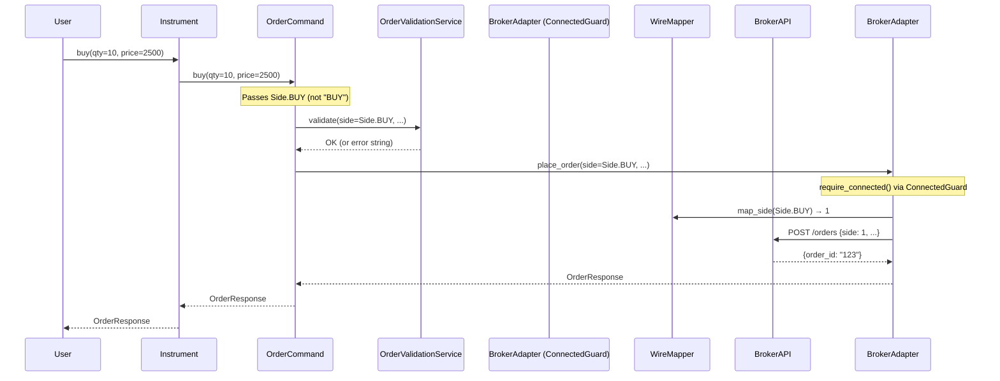
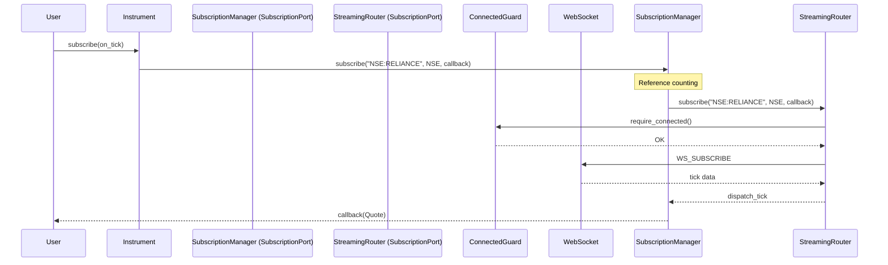
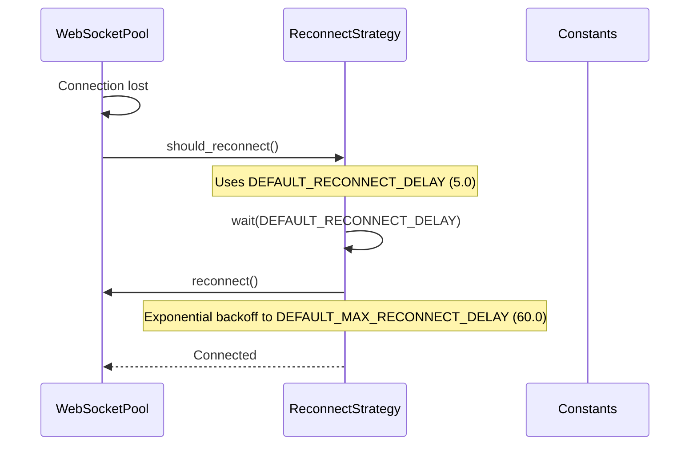
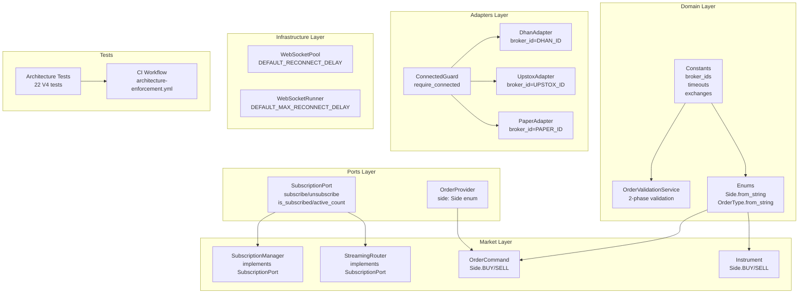
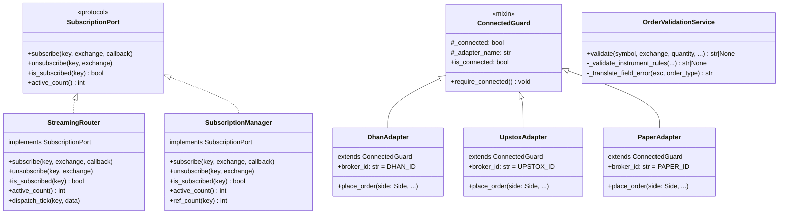

# INCTrade V4 Architecture — Remaining Work Plan

**Date:** July 6, 2026  
**Status:** Phases 0-7 Complete, Gaps Identified  
**Scope:** Complete the remaining gaps from the V4 redesign

---

## Table of Contents

1. [Gap Analysis Summary](#1-gap-analysis-summary)
2. [Pending Reactive Modules](#2-pending-reactive-modules)
3. [Architecture Design — Remaining](#3-architecture-design--remaining)
4. [Flow Diagrams — Updated](#4-flow-diagrams--updated)
5. [Component Diagram — Updated](#5-component-diagram--updated)
6. [Class Diagram — Updated](#6-class-diagram--updated)
7. [Multi-Agent Team Plan](#7-multi-agent-team-plan)
8. [Execution Timeline](#8-execution-timeline)
9. [Testing Strategy](#9-testing-strategy)
10. [Risk Mitigation](#10-risk-mitigation)

---

## 1. Gap Analysis Summary

### 1.1 What Was Completed (Phases 0-7)

| Phase | Deliverables | Status |
|-------|-------------|--------|
| Phase 0 | `broker_ids.py`, `Side.from_string()`, `OrderType.from_string()`, centralized timeouts | ✅ |
| Phase 1 | `SubscriptionPort` protocol, `OrderProvider(side: Side)` | ✅ |
| Phase 2 | `ConnectedGuard` in 3 adapters, `Side` enum in adapters | ✅ |
| Phase 3 | `StreamingRouter` + `SubscriptionManager` implement `SubscriptionPort` | ✅ |
| Phase 4 | `OrderValidationService`, Dhan/Upstox delegate to it | ✅ |
| Phase 5 | 22 architecture boundary tests (6 classes) | ✅ |
| Phase 6 | 4 new strangler bridge files, updated `__init__.py` exports | ✅ |
| Phase 7 | `architecture-enforcement.yml` CI workflow | ✅ |

### 1.2 Remaining Gaps

| Gap | Severity | Effort | Files Affected |
|-----|----------|--------|----------------|
| **G1: Reconnect constant defaults** — 21 function params hardcode `5.0`/`60.0` | MEDIUM | 30 min | 10 files |
| **G2: Strategy `side.upper()`** — 3 instances in `strategies/base.py` | LOW | 15 min | 1 file |
| **G3: Broker ID string literals** — 3 adapters hardcode `"dhan"`/`"upstox"`/`"paper"` | MEDIUM | 15 min | 3 files |
| **G4: Full test suite verification** — Not run after Phases 0-7 | HIGH | 5 min | 0 files |
| **G5: Architecture test regex gap** — Doesn't catch `: float = 5.0` pattern | MEDIUM | 10 min | 1 file |
| **G6: Strangler bridge pruning** — 100+ bridge files, many unused | LOW | 2 hours | 30-50 files |
| **G7: `BrokerFacade` validation consolidation** — May overlap with `OrderValidationService` | LOW | 30 min | 2 files |
| **G8: `OrderService` validation delegation** — May still have redundant checks | LOW | 20 min | 1 file |

---

## 2. Pending Reactive Modules

### RM-1: Reconnect Constants (MEDIUM — Partially Resolved)

**Current state:** Constants are centralized in `domain/constants/timeouts.py` but 21 function parameter defaults still hardcode `5.0`/`60.0`.

**Files affected:**
```
adapters/base_streaming.py          (2 defaults)
adapters/dhan/streaming.py          (2 defaults)
adapters/dhan/streaming_pool.py     (4 defaults)
adapters/dhan/order_stream.py       (2 defaults)
adapters/upstox/streaming.py        (2 defaults)
adapters/upstox/portfolio_stream.py (1 default)
infrastructure/websocket_pool.py    (6 defaults)
infrastructure/websocket_runner.py  (2 defaults)
```

**Resolution:** Change all `reconnect_delay: float = 5.0` → `reconnect_delay: float = DEFAULT_RECONNECT_DELAY` and `max_reconnect_delay: float = 60.0` → `max_reconnect_delay: float = DEFAULT_MAX_RECONNECT_DELAY`.

### RM-2: Strategy Side Conversion (LOW)

**Current state:** `market/strategies/base.py` has 3 instances of `leg.side.upper() == "BUY"`.

**Resolution:** Change to `leg.side == Side.BUY` after ensuring `leg.side` is typed as `Side`.

### RM-3: Broker ID String Literals (MEDIUM)

**Current state:** 3 adapters have `broker_id: str = "dhan"` etc.

**Resolution:** Change to `broker_id: str = DHAN_ID` etc. using the centralized constants.

### RM-4: Architecture Test Regex Gap (MEDIUM)

**Current state:** The `TestConstantCentralization` regex `reconnect_delay\s*[:=]\s*5\.0` doesn't match `reconnect_delay: float = 5.0` (type-annotated defaults).

**Resolution:** Update regex to `reconnect_delay.*[:=].*5\.0` to catch type-annotated defaults.

---

## 3. Architecture Design — Remaining

### 3.1 Target State After Gap Resolution

```
brokers-core/src/brokers_core/
├── domain/
│   ├── constants/
│   │   ├── broker_ids.py          ✅ Done
│   │   ├── exchanges.py           ✅ Done
│   │   ├── segments.py            ✅ Done
│   │   ├── timeouts.py            ✅ Done (constants defined)
│   │   └── capabilities.py        ✅ Done
│   ├── enums.py                   ✅ Done (Side.from_string, OrderType.from_string)
│   └── validators/
│       └── order_validator.py     ✅ Done (field-level validation)
│
├── ports/
│   ├── subscription.py            ✅ Done
│   ├── providers.py               ✅ Done (side: Side)
│   └── ... (22 ports)             ✅ Done
│
├── services/
│   ├── order_validator.py         ✅ Done (OrderValidationService)
│   └── ... (10 services)          ⚠️ G7, G8 pending
│
├── adapters/
│   ├── base.py                    ✅ Done (ConnectedGuard)
│   ├── dhan/adapter.py            ⚠️ G3 pending (broker_id string)
│   ├── upstox/adapter.py          ⚠️ G3 pending (broker_id string)
│   ├── paper/adapter.py           ⚠️ G3 pending (broker_id string)
│   └── ... (10+ reconnect files)  ⚠️ G1 pending (constant defaults)
│
├── market/
│   ├── streaming_router.py        ✅ Done (SubscriptionPort)
│   ├── subscription_manager.py    ✅ Done (SubscriptionPort)
│   ├── instrument.py              ✅ Done (Side enum in buy/sell)
│   ├── order.py                   ✅ Done (Side enum)
│   ├── strategies/base.py         ⚠️ G2 pending (side.upper())
│   └── option_chain.py            ℹ️ OK (CE/PE check, not Side)
│
├── infrastructure/
│   └── websocket_*.py             ⚠️ G1 pending (reconnect defaults)
│
└── tests/
    └── architecture/
        ├── test_brokers_core_boundaries.py  ✅ Done
        └── test_architecture_v4.py          ✅ Done (22 tests)
            ⚠️ G5 pending (regex gap)
```

### 3.2 Layer Dependency Rules (Enforced by Tests)

```
domain/        → ∅ (zero dependencies)
utils/         → ∅ (zero dependencies)
config/        → domain.exceptions
ports/         → domain/
services/      → domain/ + ports/ + utils/
resilience/    → domain/ + self
market/        → domain/ + ports/ + extensions/
infrastructure/→ domain/ + resilience/ + ports/ + external libs
adapters/      → domain/ + ports/ + infrastructure/ + external SDKs
```

**Enforced by:** `TestBoundaryRules` (existing) + `TestConstantCentralization` (V4)

---

## 4. Flow Diagrams — Updated

### 4.1 Order Placement Flow (After Gap Resolution)



### 4.2 Streaming Flow (After Gap Resolution)



### 4.3 Reconnect Flow (After Gap Resolution)



---

## 5. Component Diagram — Updated



---

## 6. Class Diagram — Updated



---

## 7. Multi-Agent Team Plan

### 7.1 Team Structure

```
┌─────────────────────────────────────────────────────────────────┐
│                     TEAM LEAD (Orchestrator)                     │
│  Buffy — Coordinates teams, resolves conflicts, merges changes  │
└─────────────────────────────────────────────────────────────────┘
                              │
        ┌─────────────────────┼─────────────────────┐
        ▼                     ▼                     ▼
┌──────────────────┐ ┌──────────────────┐ ┌──────────────────┐
│    Team Alpha    │ │    Team Beta     │ │   Team Gamma     │
│  Gap Resolution  │ │  Test & CI       │ │  Cleanup &       │
│  (Code Changes)  │ │  (Validation)    │ │  Pruning         │
└──────────────────┘ └──────────────────┘ └──────────────────┘
```

### 7.2 Team Alpha: Gap Resolution (Code Changes)

**Expertise:** Adapter internals, constant references, enum enforcement  
**Focus:** Fix G1, G2, G3, G5

| Agent | Role | Tasks |
|-------|------|-------|
| `code-searcher` | Constant Scanner | Find all hardcoded `5.0`/`60.0` reconnect defaults |
| `code-searcher` | Side Scanner | Find all `side.upper()` patterns in strategies |
| `basher` | File Editor | Apply constant references to all 10 files |
| `basher` | Strategy Editor | Fix 3 `side.upper()` instances in strategies/base.py |
| `basher` | Adapter Editor | Fix 3 adapter `broker_id` string literals |
| `code-reviewer-mimo` | Reviewer | Review all changes for correctness |

**Deliverables:**
- G1: Update 10 files with `DEFAULT_RECONNECT_DELAY` / `DEFAULT_MAX_RECONNECT_DELAY`
- G2: Fix 3 `leg.side.upper() == "BUY"` → `leg.side == Side.BUY`
- G3: Fix 3 `broker_id: str = "dhan"` → `broker_id: str = DHAN_ID`
- G5: Update architecture test regex to catch type-annotated defaults

**Parallelism:** All file edits can run in parallel (independent files)

### 7.3 Team Beta: Test & CI (Validation)

**Expertise:** Test execution, CI validation, regression detection  
**Focus:** Run full test suite, verify CI workflow, fix any regressions

| Agent | Role | Tasks |
|-------|------|-------|
| `basher` | Test Runner | Run `pytest brokers-core/tests/ -x -q` |
| `basher` | Architecture Tests | Run `pytest -m architecture -v` |
| `basher` | CI Validation | Verify workflow YAML syntax |
| `code-reviewer-mimo` | Reviewer | Review test results for regressions |

**Deliverables:**
- G4: Full test suite verification (must pass 781+ tests)
- CI workflow validation (all 27 architecture tests pass)
- Regression report if any failures

**Dependencies:** Waits for Team Alpha to complete code changes

### 7.4 Team Gamma: Cleanup & Pruning (Optional)

**Expertise:** Dead code detection, bridge file auditing, import analysis  
**Focus:** G6, G7, G8 — lower priority cleanup

| Agent | Role | Tasks |
|-------|------|-------|
| `code-searcher` | Import Scanner | Find all `from inc_trade` imports to identify used bridges |
| `code-searcher` | Validation Scanner | Find redundant validation in BrokerFacade/OrderService |
| `basher` | Bridge Auditor | List unused bridge files |
| `code-reviewer-mimo` | Reviewer | Review pruning list for safety |

**Deliverables:**
- G6: List of unused bridge files (30-50 candidates for removal)
- G7: Audit BrokerFacade for redundant validation
- G8: Audit OrderService for redundant validation

**Dependencies:** Can run in parallel with Team Alpha

### 7.5 Agent Spawn Matrix

| Phase | Team Alpha | Team Beta | Team Gamma |
|-------|-----------|-----------|------------|
| Scan | code-searcher ×2 | — | code-searcher ×2 |
| Implement | basher ×3 | — | basher ×1 |
| Test | — | basher ×3 | — |
| Review | code-reviewer ×1 | code-reviewer ×1 | code-reviewer ×1 |
| **Peak parallel** | **5 agents** | **4 agents** | **3 agents** |

**Total peak parallel agents:** 12

---

## 8. Execution Timeline

```
Hour 1:
  Team Alpha: ████████████████████████ (G1: Fix 10 reconnect files)
  Team Alpha: ████████████████████████ (G2: Fix 3 strategy files) [parallel]
  Team Alpha: ████████████████████████ (G3: Fix 3 adapter files) [parallel]
  Team Gamma: ████████████████████████ (G6: Audit bridge files) [parallel]

Hour 2:
  Team Alpha: ████████████████████████ (G5: Fix architecture test regex)
  Team Beta:  ████████████████████████ (G4: Run full test suite)
  Team Gamma: ████████████████████████ (G7-G8: Audit validation paths)

Hour 3:
  Team Beta:  ████████████████████████ (CI workflow validation)
  All Teams:  ████████████████████████ (Code review + conflict resolution)
```

---

## 9. Testing Strategy

### 9.1 Test Categories

| Category | Count | Purpose | When |
|----------|-------|---------|------|
| Unit tests | 500+ | Component behavior | After each change |
| Architecture tests | 27 | Boundary enforcement | After each phase |
| Contract tests | 50+ | Port implementation | After adapter changes |
| Integration tests | 30+ | Broker API (needs credentials) | Manual |

### 9.2 Validation Commands

```bash
# After Team Alpha changes
cd /Users/apple/Downloads/INC_Trade
PYTHONPATH=brokers-core/src python -m pytest brokers-core/tests/ -x -q

# Architecture boundary tests
PYTHONPATH=brokers-core/src python -m pytest brokers-core/tests/architecture/ -v -m architecture

# Type check
mypy --strict brokers-core/src/brokers_core/domain/
mypy --strict brokers-core/src/brokers_core/ports/

# Lint
ruff check brokers-core/src/
ruff format --check brokers-core/src/
```

### 9.3 Exit Criteria

| Criterion | Target | Current |
|-----------|--------|---------|
| Tests passing | 781+ | Unknown (not run after Phases 0-7) |
| Architecture tests | 27/27 | 27/27 ✅ |
| No `side.upper()` in adapters | 0 | 0 ✅ |
| No `side.upper()` in strategies | 0 | 3 ❌ (G2) |
| Reconnect defaults use constants | 21/21 | 0/21 ❌ (G1) |
| Broker IDs use constants | 3/3 | 0/3 ❌ (G3) |
| Architecture test regex complete | 100% | ~80% ❌ (G5) |

---

## 10. Risk Mitigation

### 10.1 Risk Register

| Risk | Probability | Impact | Mitigation |
|------|------------|--------|-----------|
| Reconnect constant change breaks streaming | LOW | HIGH | Parameter defaults are backward-compatible; callers can still override |
| Strategy side type change breaks strategies | LOW | MEDIUM | `leg.side` should already be `Side` from instrument buy/sell |
| Broker ID constant change breaks broker routing | LOW | MEDIUM | Constants have same values as strings |
| Test regressions after all changes | MEDIUM | HIGH | Run full test suite after each team completes |
| Merge conflicts between teams | LOW | LOW | Teams work on independent file sets |

### 10.2 Rollback Strategy

Each gap fix is independently revertable:

```bash
# Revert a specific file
git checkout -- brokers-core/src/brokers_core/adapters/dhan/streaming.py

# Revert all changes from a team
git stash  # or git revert <team-commit>
```

### 10.3 Integration Checkpoints

| Checkpoint | When | Validation |
|------------|------|-----------|
| CP-1 | Team Alpha complete | All reconnect defaults use constants |
| CP-2 | Team Beta complete | Full test suite passes (781+) |
| CP-3 | Team Gamma complete | No unused bridge files |
| CP-4 | All teams complete | All architecture tests pass |

---

**Document Version:** 1.0  
**Author:** Buffy (Architecture Agent)  
**Last Updated:** July 6, 2026  
