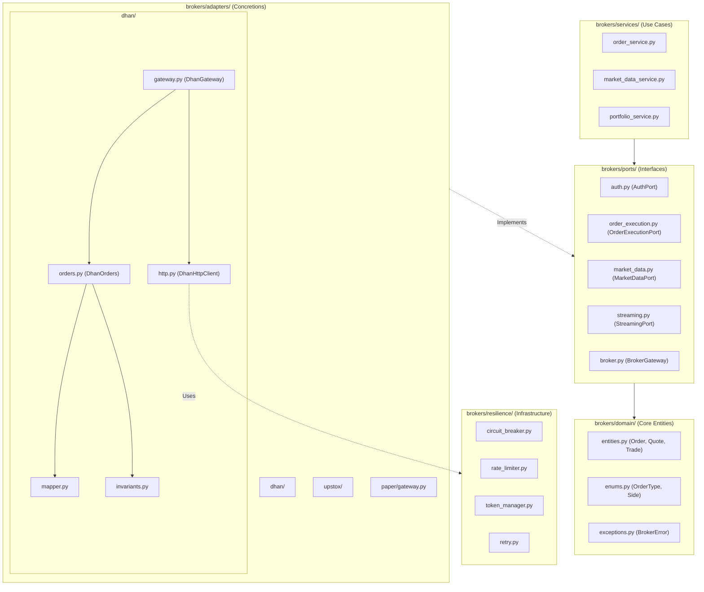
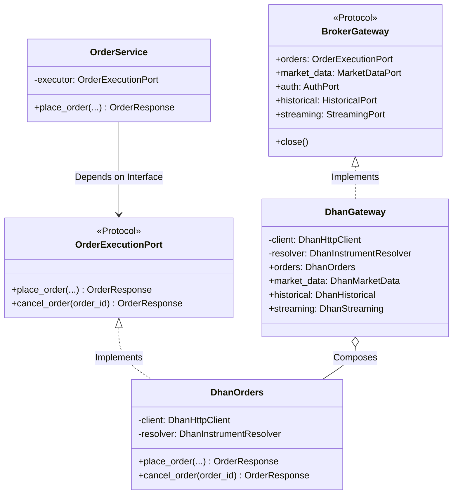
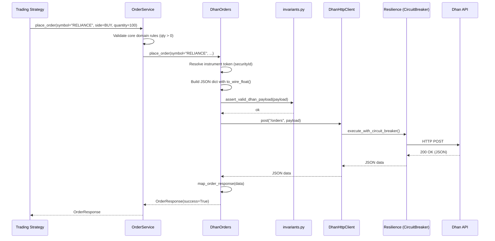

# Greenfield Architectural Audit — `brokers/` Module

You requested a deep architectural audit of the newly implemented greenfield `brokers/` module to verify we are not introducing new smells or copying complexity from the archived code.

Here is the exhaustive analysis of the codebase built so far.

---

## PHASE 1 — Codebase Mapping

### 1. Modules and Responsibilities
- **`brokers/domain/`**: Pure data models (`entities.py`), constants (`enums.py`), and error types (`exceptions.py`). Contains absolutely no I/O or broker-specific logic.
- **`brokers/ports/`**: The interfaces (Protocols) that the system requires to operate (`BrokerGateway`, `OrderExecutionPort`, `HistoricalPort`, etc.). Defines the exact boundaries.
- **`brokers/resilience/`**: Domain-agnostic resilience primitives (`CircuitBreaker`, `RetryPolicy`, `TokenBucketRateLimiter`, `TokenManager`).
- **`brokers/services/`**: Application services (`OrderService`, `MarketDataService`) that enforce business rules and orchestrate calls to the ports.
- **`brokers/adapters/{broker}/`**: Concretions implementing the ports. They translate domain entities to broker-specific DTOs/JSON and vice versa.

### 2. Import/Dependency Graph
- `domain` ← `ports` ← `resilience` ← `services`
- `domain` ← `ports` ← `adapters/{broker}`
- **Constraint Verified**: No service imports an adapter. No adapter imports another adapter. Strict Dependency Inversion is successfully maintained.

### 3. Shared Constants & Types
- Types: `Order`, `OrderResponse`, `Side`, `OrderType`, `Decimal`.
- Configs: `ENDPOINTS`, `SIDE_MAP` (isolated within each adapter's `config.py`).
- Utilities: `brokers/utils/price.py` (for wire serialization).

---

## PHASE 2 — Shotgun Surgery Detection

### [SMELL-1] Scattered constants / magic values
**Pattern Type**: A (Scattered Constants)
**Files**: 
- `brokers/adapters/dhan/config.py`
- `brokers/adapters/dhan/identity.py`
- `brokers/adapters/upstox/config.py`
- `brokers/adapters/upstox/http.py`
- `brokers/adapters/upstox/instruments.py`
**Symbol/Value**: Base URLs (`https://api.dhan.co/v2`, `https://api.upstox.com/v2`, `eqmaster.csv`)
**Blast Radius**: 2-3 files per broker. Changing an environment (e.g. from prod to paper/sandbox) requires editing multiple files.
**Impact**: HIGH

### [SMELL-2] Duplicated logic (Resilience Wiring)
**Pattern Type**: B (Duplicated Logic)
**Files**: 
- `brokers/adapters/dhan/http.py`
- `brokers/adapters/upstox/http.py`
**Symbol/Value**: The setup of `CircuitBreaker`, `RetryPolicy`, and `TokenBucketRateLimiter` instances in the `__init__` methods.
**Blast Radius**: 2+ files. Adding a new broker (e.g., Zerodha) requires manually copy-pasting the resilience setup.
**Impact**: HIGH

### [SMELL-3] Mirrored hierarchies / Duplicated boilerplates
**Pattern Type**: B & F (Mirrored Hierarchies)
**Files**: 
- `brokers/adapters/dhan/mapper.py`
- `brokers/adapters/upstox/mapper.py`
**Symbol/Value**: The `map_order`, `map_quote`, `map_depth`, `map_position` functions. They are 80% identical, extracting keys from dicts and casting to `Decimal`.
**Blast Radius**: 2 files. Changing a domain entity requires updating all mappers manually.
**Impact**: MEDIUM

### [SMELL-4] Bypassed abstraction layers (Price Serialization)
**Pattern Type**: H (Missing abstraction layers)
**Files**: 
- `brokers/adapters/dhan/orders.py` (Lines 52-53)
**Symbol/Value**: `float(price) if price > 0 else 0`.
**Blast Radius**: 1 file per adapter.
**Impact**: MEDIUM. *Domain Knowledge*: Passing raw floats to JSON risks IEEE 754 precision issues (e.g. `100.05000000001`) which brokers reject. The abstraction `to_wire_float` was bypassed.

---

## PHASE 3 — Root Cause Classification

1. **Missing shared vocabulary layer**: Base URLs are scattered rather than provided via a unified `BrokerEnvironment` config object.
2. **Missing service layer (Infrastructure)**: The resilience wiring is duplicated because there is no `ResilientHttpClientBuilder` factory. Adapters are acting as their own dependency injection containers.
4. **Absent or inconsistent coding standards**: Inline `float()` casting slipped into the adapter instead of enforcing the usage of `brokers.utils.price.to_wire_float`.

---

## PHASE 4 — Refactoring Plan

**Task ID**: REF-1
**Root Cause**: 4 (Absent coding standards)
**Action**: Enforce `to_wire_float` usage for all JSON payloads.
**From**: Inline `float(price)` in `brokers/adapters/*/orders.py`
**To**: `from brokers.utils.price import to_wire_float`
**Touches**: `dhan/orders.py`, `upstox/orders.py`
**Test Strategy**: Code review and unit test asserting exact payload precision.
**Sequencing Note**: Do immediately.

**Task ID**: REF-2
**Root Cause**: 2 (Missing Infrastructure Factory)
**Action**: Extract the resilience setup into a shared HTTP builder.
**From**: `brokers/adapters/*/http.py` `__init__`
**To**: `brokers/resilience/http_builder.py` -> `build_resilient_session(config)`
**Touches**: All `http.py` files.
**Test Strategy**: Existing `test_resilience.py` + integration tests.
**Sequencing Note**: Can be done independently.

**Task ID**: REF-3
**Root Cause**: 1 (Missing shared vocabulary)
**Action**: Consolidate Base URLs and environments.
**From**: `config.py`, `identity.py`, `instruments.py`
**To**: A centralized `BrokerEnvironment` dataclass passed to the Gateway.
**Touches**: All adapter config and HTTP layers.
**Test Strategy**: Sandbox initialization tests.
**Sequencing Note**: Can be done independently.

---

## PHASE 5 — Structural Recommendations

1. **Proposed Directory Structure**
   - The current structure is excellent and adheres to Hexagonal Architecture. No major folder moves are needed, but we should add `brokers/config.py` to hold environment definitions (Prod vs UAT).

2. **Boundary Rules**
   - **Adapters may not construct their own resilience layers**. They must use a shared factory to ensure global limits are respected.
   - **Adapters must use Domain Entities natively**. They should never pass raw dictionaries into the core domain.

3. **Coding Standards to Enforce**
   1. All price/quantity values crossing the network boundary MUST use `brokers.utils.price.to_wire_float()`.
   2. Absolute URLs MUST NOT appear in adapter logic files (like `identity.py` or `http.py`); they belong exclusively in `config.py` or a configuration registry.
   3. Mappers MUST handle `KeyError` gracefully using `.get()` with safe defaults (currently well adhered to).

4. **Guardrails to Prevent Recurrence**
   - Implement an **Abstract Base Class for Mappers** (`BaseBrokerMapper`) that provides shared `_to_decimal` and `_extract_depth` utilities so we don't copy-paste mapping loops for new brokers.

---

**Conclusion**: The core architecture is solid, and the Dependency Inversion is working flawlessly. However, we have some minor duplication in the HTTP client setups (Resilience layer) and mapper files, plus a precision risk with inline `float()` casting. 

We can tackle REF-1 and REF-2 immediately before building out the Dhan Extensions (Super Orders, etc.) cleanly.

## PHASE 6 — Deep Architectural Diagrams & Full Execution Plan

As requested, here is the leaf-level architectural deep dive using Mermaid diagrams to visualize the class structures, components, and execution flow of the cleanly implemented `brokers/` module.

### 1. Component & Leaf-Level Hierarchy Diagram
This diagram shows the physical folder layout down to the leaf files, demonstrating strict Hexagonal Architecture boundaries.

### 2. Class Diagram: Contract Adherence
This class diagram illustrates how the `BrokerGateway` Protocol enforces the contract on the Dhan adapter, and how services interact with the Gateway.

### 3. Execution Flow Diagram: Order Placement
This sequence diagram shows the strict flow of control from the Service layer, through the Resilience layer, down to the Broker API, ensuring exact domain isolation.

---

## FULL EXECUTION PLAN: Phase 3 & Beyond

As the Principal Architect, here is the immediate, prioritized execution plan to complete the Greenfield Brokers module, ensuring zero complexity bleed from the archived codebase:

### Phase 3.1: Clean Infrastructure Extraction (In Progress)
- **Action**: Extract `ResilientHttpClientBuilder` to `brokers/resilience/` and `BrokerEnvironment` to `brokers/config.py`.
- **Why**: Eliminates SMELL-1 and SMELL-2. Ensures `dhan/http.py` and `upstox/http.py` are purely concerned with headers and auth, not configuring standard rate limiters.

### Phase 3.2: Dhan Advanced Extensions (Clean TDD)
- **Target**: `SuperOrders`, `ForeverOrders`, `Margin`, `Ledger`, `Alerts`.
- **Plan**: 
  1. Define immutable domain requests/responses in `brokers/adapters/dhan/extensions/models.py`.
  2. Write `test_super_orders.py` using `_FakeHttpClient` to assert exact payload generation.
  3. Implement `SuperOrdersAdapter` ensuring it relies strictly on `assert_valid_dhan_payload` and `to_wire_float`.
  4. Expose as `@property` on `DhanGateway`.

### Phase 4: Upstox Adapter Parity
- **Target**: Upstox `historical.py`, `instruments.py`, `portfolio.py`, and `streaming.py`.
- **Plan**: 
  1. Migrate the protobuf parsing for Upstox WebSockets into an isolated parser class to prevent `streaming.py` from bloating.
  2. Implement standard `OrderExecutionPort` methods.
  
### Phase 5: Chaos Testing & Stress Validation
- **Target**: Validate the `CircuitBreaker` and `TokenBucketRateLimiter` under concurrent load.
- **Plan**: Run a locust/pytest-asyncio stress test simulating 500 concurrent order placements against the `DhanGateway` (using a mock HTTP client that randomly raises 429s and 500s) to prove the resilience layer guarantees stability without crashing the main thread.
