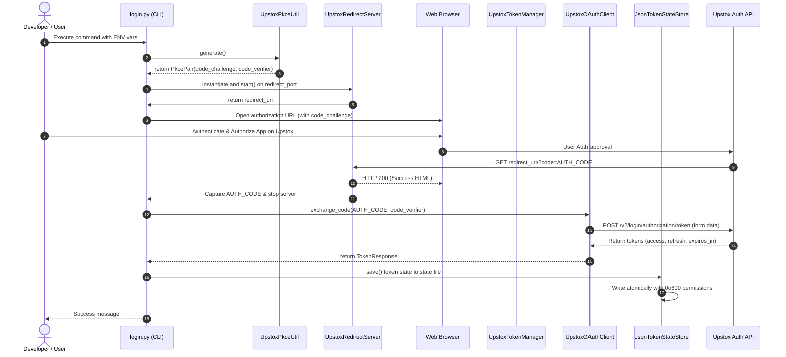
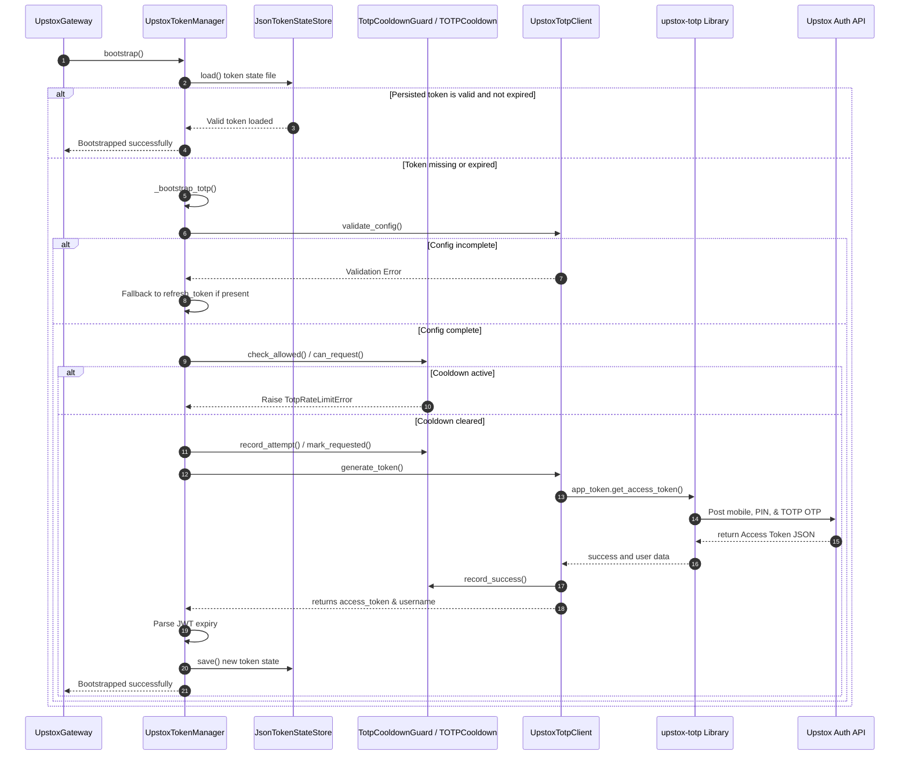

# Upstox Broker Adapter: Phase 0+1 Forensic Audit Report (Foundation + Authentication)

This report presents a comprehensive comparison of the legacy archived Upstox auth subsystem (located at `archive/brokers/upstox/auth/`) against the greenfield implementation (located at `brokers/adapters/upstox/auth/` and `brokers/adapters/upstox/`).

---

## 1. SOURCE AUDIT

### A. Legacy Archived Files (`archive/brokers/upstox/auth/`)

1. **`__init__.py`**
   - **Purpose**: Subsystem package entry point.
   - **Classes**: None.
   - **Methods**: None.

2. **`config.py`**
   - **Purpose**: Defines system settings loader, default parameters (rate limits, pings, caching), validation bounds, and connection records.
   - **Classes**: `UpstoxConnectionSettings`, `UpstoxSettingsLoader`.
   - **Properties/Methods**:
     - `UpstoxConnectionSettings`: Properties for authentication states (`is_sandbox`, `is_live`, `is_static`, `is_oauth`, `is_interactive`, `is_extended`, `is_webhook`, `is_totp`, `has_totp_config`, `has_access_token`, `has_refresh_token`, `has_extended_token`, `has_refresh`, `rest_base_override`, `instrument_cache_path`, `base_v2`, `base_hft`).
     - `UpstoxSettingsLoader`: `from_env`, `from_properties`, `_read_properties`, `_get`, `_path_from_env`, `_parse_bool`, `_parse_int`.

3. **`context.py`**
   - **Purpose**: Dependency Injection (DI) container managing URLs, HTTP sessions, retry executors, and token managers.
   - **Classes**: `UpstoxAdapterContext`.
   - **Properties/Methods**: `__init__`, properties for settings and clients (`settings`, `token_provider`, `url_resolver`, `http_client`, `oauth_client`, `token_manager`), and `make_retry_executor` (assigns bucketed configurations for order, quote, and data rate-limits).

4. **`exceptions.py`**
   - **Purpose**: Custom auth-related and API-related exceptions.
   - **Classes**: `UpstoxApiError`, `UpstoxAuthError`.
   - **Methods**: `__init__`, `__repr__`.

5. **`holders.py`**
   - **Purpose**: Token holder wrappers that define token permissions (static, analytics-only, extended read-only) and guarantee thread safety.
   - **Classes**: `TokenSnapshot`, `UpstoxTokenHolder`, `UpstoxStaticTokenHolder`, `UpstoxAnalyticsTokenHolder`, `UpstoxExtendedTokenHolder`, `ThreadSafeTokenHolder`.
   - **Properties/Methods**:
     - `TokenSnapshot`: `is_expired`.
     - `UpstoxTokenHolder`: `bearer_token`, `expiry_epoch_ms`, `ensure_valid`, `analytics_only`.
     - `ThreadSafeTokenHolder`: `bearer_token`, `expiry_epoch_ms`, `ensure_valid`, `analytics_only`, `replace`.

6. **`http.py`**
   - **Purpose**: Custom HTTP client supporting dynamic header resolution, token failure intercepts, circuit breaking, and rate-limiting.
   - **Classes/Helper Functions**: `_categorize_upstox_url`, `UpstoxHttpClient`.
   - **Methods**: `__init__`, property `settings`, `_get_circuit_breaker`, `_headers`, `get_json`, `post_json`, `put_json`, `delete_json`, `_request`, `_execute_request` (with automatic retry on 401).

7. **`json_token_state_store.py`**
   - **Purpose**: Secures OAuth states locally via atomic temporary writes and file permission restrictions (`0o600`).
   - **Classes**: `JsonTokenStateStore`.
   - **Properties/Methods**: `__init__`, property `path`, `load`, `save`, `clear`.

8. **`login.py`**
   - **Purpose**: CLI application managing PKCE state, loopback listening, code exchanges, and token persistence during manual logins.
   - **Functions**: `_parse_args`, `build_auth_url`, `_open_browser`, `_capture_code`, `_redirect_path`, `perform_login`, `_persist_state`, `main`.

9. **`oauth_client.py`**
   - **Purpose**: Raw OAuth 2.0 transaction layer (authorization code, token refresh, and profile fetching).
   - **Classes**: `TokenResponse`, `UpstoxOAuthClient`.
   - **Methods**: `__init__`, `exchange_code`, `refresh_token`, `fetch_profile`, `validate_read_only_token`, `trigger_token_request`, `_post_token`.

10. **`pkce.py`**
    - **Purpose**: Generates standard cryptographically secure PKCE challenges and verifiers.
    - **Classes**: `PkcePair`, `UpstoxPkceUtil`.
    - **Methods**: `generate`, `compute_challenge`.

11. **`redirect_server.py`**
    - **Purpose**: Runs a lightweight async `aiohttp` web server to capture callbacks on loopback.
    - **Classes**: `UpstoxRedirectServer`.
    - **Properties/Methods**: `__init__`, property `redirect_uri`, property `path`, property `port`, `_handle_callback`, `start`, `stop`, `capture_code`, `wait_for_authorization`, property `state`, `__aenter__`, `__aexit__`.

12. **`token_expiry.py`**
    - **Purpose**: Resolves the next standard daily 3:30 AM IST Upstox token expiration epoch.
    - **Classes**: `UpstoxTokenExpiry`.
    - **Methods**: `next_expiry_epoch_ms`.

13. **`token_manager.py`**
    - **Purpose**: High-level token lifecycle controller managing bootstrap initialization, proactive refreshes, and webhook overrides.
    - **Classes**: `UpstoxTokenManager`.
    - **Methods**: `__init__`, `_build_initial_holder`, property `settings`, property `oauth_client`, property `state_store`, `get_holder`, `bearer_token`, `current_token`, `current_state`, `ensure_valid`, `try_refresh_on_401`, `force_refresh`, `refresh_totp`, `bootstrap`, `_needs_proactive_refresh`, `_effective_expiry_ms`, `_run_exclusive_refresh`, `_do_totp_refresh`, `_do_totp_force_refresh`, `_do_oauth_refresh`, `_apply_token_state`, `_bootstrap_totp_if_needed`, `perform_interactive_oauth`, `complete_interactive_oauth`, `upgrade_from_webhook`, `invalidate`, class methods `create_extended`/`create_analytics`/`create_static`, `_acquire_initial`, `_refresh_now`, `_persist`, `_valid_persisted`, `_valid_snapshot`, `_from_persisted`, `_bootstrap_totp`.

14. **`totp_client.py`**
    - **Purpose**: Integrates the `upstox-totp` library with rate limit cooldown guards for passwordless auth.
    - **Classes**: `UpstoxTotpClient`.
    - **Methods**: `__init__`, `_initialize_client`, `generate_token`, `_response_error_message`, `_is_rate_limit_error`, `validate_config`.

15. **`totp_scheduler.py`**
    - **Purpose**: Daemon service orchestrator running daily token updates in the background.
    - **Classes**: `TotpRefreshScheduler` (inherits from `ManagedService`).
    - **Properties/Methods**: `__init__`, `start`, `stop`, `health`, `refresh_now`, property `is_running`, property `refresh_count`, `_run`, `_do_refresh`.

16. **`urls.py`**
    - **Purpose**: Unified resolver connecting various modules to explicit endpoint templates.
    - **Classes**: `UpstoxApiUrlResolver`.
    - **Methods**: `__init__`, `_v2`, `_v3`, `_hft`, and specific endpoint mapping wrappers (e.g. `place_order_v3_url`, `profile_url`).

---

## 2. RUNTIME SEQUENCE

### Flow 1: Interactive OAuth 2.0 PKCE Flow

---

### Flow 2: Automated TOTP Login Flow

---

## 3. PARITY GAPS

### Gap 1: Missing Redirect Server Module (`redirect_server.py`)
* **Reference File**: `archive/brokers/upstox/auth/redirect_server.py`
* **Greenfield Location**: *Missing entirely.*
* **Impact**: Greenfield lacks the in-process callback capture server needed to listen on localhost (e.g. `http://localhost:18080`) for the authorization code from Upstox. As a result, interactive OAuth logins are non-functional in the greenfield codebase.

### Gap 2: Missing Background TOTP Renewal Scheduler (`totp_scheduler.py`)
* **Reference File**: `archive/brokers/upstox/auth/totp_scheduler.py`
* **Greenfield Location**: *Missing entirely.*
* **Impact**: The legacy system provides a `TotpRefreshScheduler` daemon service that triggers automatically at a set time (e.g. 8:00 AM IST) daily to ensure the system is authenticated before the market opens. Greenfield has no background daemon executing this renewal, leaving the token subject to unexpected expiration during trading hours.

### Gap 3: Missing Interactive CLI Application (`login.py`)
* **Reference File**: `archive/brokers/upstox/auth/login.py`
* **Greenfield Location**: *Missing entirely.*
* **Impact**: Developers cannot execute automated logins from the command-line environment (`python -m brokers.upstox.auth.login`) to bootstrap local settings or write a valid credentials file.

### Gap 4: Missing Dependency Injection Context (`context.py`)
* **Reference File**: `archive/brokers/upstox/auth/context.py`
* **Greenfield Location**: *Missing entirely.*
* **Impact**: Greenfield adapters lack the centralized `UpstoxAdapterContext` container which maps connection pools, circuit breakers, rate limits, and custom bucketed `RetryExecutor` definitions (e.g. 3 attempts for orders, 2 for quotes) to the endpoints.

### Gap 5: Static vs. Dynamic Token Resolution Mismatch in HTTP Client
* **Reference File**: `archive/brokers/upstox/auth/http.py#L62`, `L148`, `L156-L193`
* **Greenfield File**: `brokers/adapters/upstox/http.py#L35-L51`
* **Impact**:
  - The archive HTTP client registers a callback: `token_provider: Callable[[], str]` and evaluates `"Authorization": f"Bearer {self._token_provider()}"` on every REST request.
  - The greenfield HTTP client accepts a static `access_token: str` and writes it permanently to the session header. If `UpstoxTokenManager` refreshes a token via TOTP or a webhook upgrade, the REST client will continue sending the stale/expired token.

### Gap 6: Missing Reactive Refresh & Automatic Retries on HTTP 401
* **Reference File**: `archive/brokers/upstox/auth/http.py#L263-L277`
* **Greenfield File**: `brokers/adapters/upstox/http.py#L70-L71`
* **Impact**:
  - In the archive client, if an API call returns a 401 Unauthorized error, it triggers the `_on_auth_failure` callback (calling the token manager's `try_refresh_on_401` method) and automatically retries the failed HTTP request.
  - Greenfield's client immediately raises `AuthenticationError` on a 401 response and lacks any refresh hook or recovery logic.

### Gap 7: TOTP Configuration Error Bypasses Refresh Token Fallback
* **Reference File**: `archive/brokers/upstox/auth/token_manager.py#L557-L566`
* **Greenfield File**: `brokers/adapters/upstox/auth/token_manager.py#L560-L562`
* **Impact**:
  - In the archive manager, if the TOTP config is incomplete or fails, the manager logs a warning and falls back to the `refresh_token` mechanism if one is present.
  - In greenfield, an explicit `except UpstoxAuthError: raise` block was added. Since `validate_config()` throws an `UpstoxAuthError` if the credentials (`UPSTOX_MOBILE`, `UPSTOX_PIN`, etc.) are missing, the manager immediately re-raises it and skips the `refresh_token` fallback logic completely.

### Gap 8: Invalid Market Status Endpoint URL Path
* **Reference File**: `archive/brokers/upstox/auth/oauth_client.py#L109`
* **Greenfield File**: `brokers/adapters/upstox/auth/oauth_client.py#L89`
* **Impact**:
  - The archive correctly calls `/v2/market/status/NSE` to validate the read-only token.
  - The greenfield code calls `/v2/market-status/NSE`, which is invalid and will return a 404 error, breaking read-only token validation.

### Gap 9: Hardcoded Endpoints vs. URL Resolver abstraction
* **Reference File**: `archive/brokers/upstox/auth/urls.py`
* **Greenfield File**: `brokers/adapters/upstox/config.py#L8-L33`
* **Impact**:
  - The archive routes all URLs dynamically through `UpstoxApiUrlResolver` which delegates to the centralized, profile-aware `_UpstoxUrls` registry.
  - The greenfield codebase lacks this resolver and hardcodes the endpoints as static template strings in its configuration module, reducing flexibility (e.g. for Sandbox/Live redirection).

### Gap 10: Missing Proper Settings Configuration Loader
* **Reference File**: `archive/brokers/upstox/auth/config.py#L152-L369`
* **Greenfield File**: `brokers/adapters/upstox/auth/__init__.py#L52-L85`
* **Impact**:
  - The archive uses `UpstoxSettingsLoader` to support multiple environment profiles, validation steps, fallback secrets loading from a secrets manager, and properties files parsing.
  - Greenfield builds a mock `_Settings` container inline inside `UpstoxAuth.__init__` with hardcoded defaults. It does not load from dot-env or properties files and cannot read credentials from a secrets manager.

### Gap 11: Truncated Dev Guidance on Token Expiration Errors
* **Reference File**: `archive/brokers/upstox/auth/holders.py#L130-L133`, `L159-L162`
* **Greenfield File**: `brokers/adapters/upstox/auth/holders.py#L112-L113`, `L135-L136`
* **Impact**:
  - Greenfield truncates developer guidance on the token expiration exceptions. The archive states "regenerate from Developer Apps -> Analytics tab", while the greenfield code omits this instructions.
