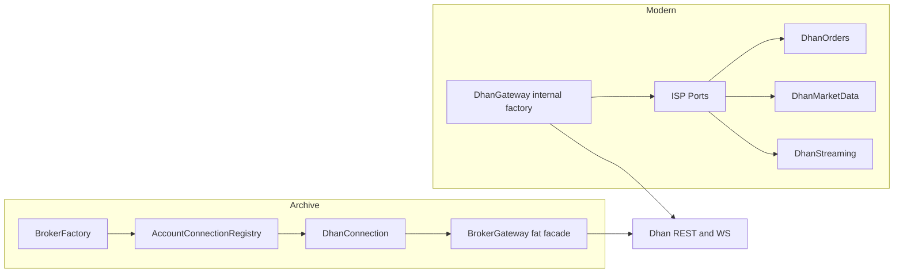

# Dhan Behavioral Parity & Production Readiness Assessment (v2)

**Date:** 2026-07-03  
**Scope:** Dhan only — `archive/brokers/dhan/` vs `brokers/adapters/dhan/`  
**Audit type:** Behavioral contract + operational readiness (not file comparison)  
**Parity dimensions:** (1) Dhan API/runtime behavior, (2) archived consumer API compatibility  
**Prior work:** Re-verified in [`dhan_parity_phase0_reverification.md`](dhan_parity_phase0_reverification.md)

---

## 1. System Intent

The Dhan broker adapter must provide production-safe access to DhanHQ APIs for live trading: authentication, instrument resolution, order execution, market data, streaming, portfolio, and broker-specific extensions — with identical externally observable outcomes to the archived implementation, and compatibility for code that depended on the archived `BrokerGateway` fat facade.

---

## 2. Current Architecture Map



| Layer | Archive | Modern |
|-------|---------|--------|
| Entry | `BrokerFactory.create()` → `BrokerGateway` | `DhanGateway(...)` direct construction |
| Composition | External `DhanConnection` with 15+ ports | Internal wiring in `__init__` |
| Public API | Fat facade: `gw.place_order()`, `gw.ltp()`, `gw.stream()` | Narrow ports: `gw.orders.place_order()`, `gw.market_data.ltp()` |
| Registry | `AccountConnectionRegistry` per client_id | `GatewayRegistry` exists but not integrated in Dhan bootstrap |
| Observability | `ObservabilityProvider` on gateway | `health()` dict only |

---

## 3. Behavioral Capability Catalog

Status codes: **FR** Fully Replicated | **PR** Partially Replicated | **MI** Missing | **DB** Different Behavior | **BT** Better Than Archived | **ABP** Archived Bug Preserved | **ABF** Archived Bug Fixed | **UN** Unknown

### 3.1 Authentication

| Capability | Archive | Modern | Status | Evidence |
|------------|---------|--------|--------|----------|
| TOTP token generation | `DhanTotpClient` + cooldown guard | `DhanAuth.generate_token()` inline | **DB** | `totp_client.py:26-33` vs `auth.py:125-196` |
| Token state persistence | `TokenState` + JSON store | Same | **FR** | Both use shared infrastructure |
| Token broadcast to WS/HTTP | `ConnectionTokenManager` | `TokenBroadcast` | **FR** | Weak-ref semantics preserved |
| Shared refresh lock | Factory-created lock | `gateway._refresh_lock` | **FR** | `gateway.py:110-118` |
| 401 auto-retry | HTTP client + lock 5s | Same pattern | **FR** | `http.py:263-271` |
| Proactive TOTP rate-limit guard | `TotpCooldownGuard.check_allowed()` | Reactive parse only | **MI** | No guard in `auth.py` |
| IPv4 auth workaround | None | `_prefer_ipv4()` | **BT** | `auth.py:26-44` |
| Session manager lifecycle | `DhanSessionManager` | None | **MI** | No modern equivalent |
| Duplicate login prevention | Account registry singleton | `GatewayRegistry` unwired | **PR** | `registry.py:21` exists, not used by Dhan |

### 3.2 Identity & Instruments

| Capability | Archive | Modern | Status | Evidence |
|------------|---------|--------|--------|----------|
| `DhanInstrumentRef` validation | Yes | Yes | **FR** | `identity.py:51-64` |
| Symbol resolution | Multi-step + CE/CALL + index table | Prefix-family scan | **PR** | `identity.py:152-184` |
| `expected_segment` disambiguation | PR-C defense | Absent | **MI** | `archive/identity.py:415-425` |
| security_id audit logging | Structured `security_id_issued` | None | **MI** | |
| MCX detailed supplement | `_fetch_mcx_detailed()` | Single CSV only | **MI** | `loader.py:20` |
| Disk cache 6h TTL | `InstrumentLoader.load_cached()` | In-memory once per resolver | **DB** | `loader.py:79` vs `identity.py:87-91` |
| Instrument search | `search_instruments()` on gateway | `instruments.search()` | **PR** | Different API path |

### 3.3 Orders

| Capability | Archive | Modern | Status | Evidence |
|------------|---------|--------|--------|----------|
| Place order | With idempotency + correlation_id | No idempotency, no correlation_id | **MI** / **DB** | `archive/orders.py:186-314` vs `orders.py:37-80` |
| Pre-trade validation | Lot, tick, segment checks | Price/type only | **PR** | |
| Cancel with race detection | DELETE + response parsing | POST + post-check | **DB** | `archive/orders.py:401` vs `orders.py:89-90` |
| Modify order | `**changes` dict | Named optional params | **PR** | Compatible at Dhan payload level |
| Kill switch | Yes | No adapter | **MI** | |
| Slice orders | `place_slice_order()` | Endpoint only in config | **MI** | |
| Trade history pagination | Yes | No | **MI** | |
| Risk manager gate | `RiskManagerPort` | No | **MI** | |
| Domain events | `ORDER_PLACED` | No | **MI** | |

### 3.4 Market Data & Streaming

| Capability | Archive | Modern | Status | Evidence |
|------------|---------|--------|--------|----------|
| REST LTP/quote/depth | Yes | Yes | **PR** | Live verification needed for depth both-sides fix |
| Batch LTP/quote | `ltp_batch()` on gateway | Via market_data adapter | **PR** | API path differs |
| WS subscribe FULL/QUOTE | `gw.stream()` sync + handle | `StreamingPort` async | **DB** | `streaming.py` vs `ports/streaming.py` |
| Depth20 REST merge | Regression-tested | `depth20.py` exists | **UN** | Needs manifest case port |
| Depth200 1-instrument limit | Documented + pool | `depth200.py` + pool | **PR** | |
| Order stream | `stream_order()` distinct from market | `order_stream` property | **PR** | |
| Subscription engine | Yes | Yes | **FR** | Both have `subscription_engine.py` |
| Reconnect/gap recovery | Extensive tests | `reconnecting_service.py` | **UN** | |

### 3.5 Historical Data

| Capability | Archive | Modern | Status | Evidence |
|------------|---------|--------|--------|----------|
| OHLCV fetch | `history()` → `pd.DataFrame` | `get_historical_candles()` → `list[Candle]` | **DB** | `historical.py:44-51` |
| Pagination/chunking | Window constraints in capabilities | Basic date range | **PR** | |
| Timezone handling | Via adapters | `ZoneInfo` in historical | **PR** | |

### 3.6 Portfolio & Reconciliation

| Capability | Archive | Modern | Status | Evidence |
|------------|---------|--------|--------|----------|
| positions/holdings/funds | Yes | Yes | **FR** | Integration tests exist |
| Reconciliation drift severity | `DriftItem` HIGH/MED/LOW | Simple match lists | **DB** | |
| Order reconciliation | `compare_orders()` | No | **MI** | |
| Auto-repair OMS | `_repair_local_oms()` | No | **MI** | |

### 3.7 Extended Features

| Feature | Status | Notes |
|---------|--------|-------|
| Super Orders | **PR** | Module + integration test; full CRUD parity unverified live |
| Forever Orders | **PR** | Module + integration test |
| Conditional Triggers | **PR** | Module exists |
| Margin | **PR** | `extensions/margin.py` + integration test |
| MTF | **BT** | Dedicated `DhanMTF` |
| EDIS | **DB** | Different endpoints and surface |
| Alerts, IP, Ledger, User Profile | **PR** | Exist; typed responses vs raw dicts |
| Futures chain | **DB** | Cache-based vs symbol parsing |
| Options chain | **PR** | Both implemented |

### 3.8 Cross-Cutting

| Concern | Status | Notes |
|---------|--------|-------|
| Circuit breakers | **FR** | Per-category in HTTP client |
| Rate limiting | **FR** | Token bucket via `RATE_LIMITS` |
| Retry | **FR** | 3 retries, exponential backoff |
| Metrics | **PR** | 8 defined; WS increment wiring unverified |
| ObservabilityProvider | **MI** | |
| Dynamic configuration | **MI** | Static `config.py` |
| Exception hierarchy | **PR** | 17 modern vs 14 archive classes |

---

## 4. End-to-End Execution Flow (Order Place — Money Path)

### 4.1 Expected Behavior Contract

| Field | Contract |
|-------|----------|
| Input | symbol, exchange, side, qty, order params, optional correlation_id |
| Output | `OrderResponse` with broker order_id, success flag |
| Timing | Single broker POST within rate limit |
| Idempotency | Same correlation_id → same response, no duplicate POST |
| Failure | Validation errors before network; network retry must not duplicate |

### 4.2 Archive Flow

```
place_order() → correlation_id resolve → idempotency.lock → validation (lot/tick/segment)
  → resolve_ref(expected_segment) → risk_manager.check → POST /orders
  → idempotency.put → DomainEvent ORDER_PLACED
```

### 4.3 Modern Flow

```
orders.place_order() → price/type validation → resolve(symbol, exchange) [no expected_segment]
  → POST /orders → map_order_response
```

### 4.4 State Evolution & Silent Failures

| Step | Archive | Modern | Risk |
|------|---------|--------|------|
| Retry on timeout | Idempotency returns cached | **New POST → duplicate order** | **CRITICAL silent failure** |
| NIFTY futures resolve | `expected_segment=NSE_FNO` blocks IDX_I | Prefix scan may return wrong segment | **HIGH wrong instrument** |
| Cancel | DELETE + parse broker status | POST; assumes success if no exception | **MEDIUM false success** |

---

## 5. Consumer API Compatibility Matrix

| Archived Method | Modern Equivalent | Classification |
|-----------------|-------------------|----------------|
| `gw.place_order(...)` | `gw.orders.place_order(...)` | **Breaking Change** |
| `gw.cancel_order(id)` | `gw.orders.cancel_order(id)` | **Breaking Change** |
| `gw.ltp(sym, exch)` | `gw.market_data.ltp(sym, exch)` | **Breaking Change** |
| `gw.quote(sym, exch)` | `gw.market_data.quote(sym, exch)` | **Breaking Change** |
| `gw.depth(sym, exch)` | `gw.market_data.depth(sym, exch)` | **Breaking Change** |
| `gw.history(...)` → DataFrame | `gw.historical.get_historical_candles(...)` → list[Candle] | **Breaking Change** |
| `gw.stream(sym, mode, on_tick)` | `gw.streaming` async port | **Breaking Change** |
| `gw.stream_order(on_order)` | `gw.order_stream` | **Breaking Change** |
| `gw.extended.*` | `gw.super_orders`, `gw.forever_orders`, etc. | **Breaking Change** |
| `gw.get_connection_status()` | `gw.health()` partial | **Behavioral Difference** |
| `gw.capabilities()` | `DhanCapabilities` dataclass (minimal) | **Behavioral Difference** |
| `BrokerFactory.create()` | `DhanGateway(...)` | **Breaking Change** |

**Shim requirement:** Any production migration must provide a `BrokerGateway` compatibility facade or update all call sites. `GatewayRegistry` can host singletons but does not restore archived method signatures.

---

## 6. Invariant Checklist

| Invariant | Archive | Modern | Pass |
|-----------|---------|--------|------|
| Token refresh only when expired (scheduler) | Yes | Yes | ✓ |
| No duplicate order on retry | Yes | **No** | ✗ |
| Derivative orders use FNO segment not index | Yes (expected_segment) | **No** | ✗ |
| Cancel verifies FILLED race | Yes | Yes | ✓ |
| WS token hot-swap on refresh | Yes | Yes | ✓ |
| Instrument master cached across restarts | Yes (disk) | **No** | ✗ |
| P0 regression manifest cases pass | Yes (when run) | **Not ported** | ✗ |

---

## 7. Failure & Risk Points

See [`dhan_parity_roadmap.md`](dhan_parity_roadmap.md) for full register.

**Silent failure modes (money at risk):**

1. HTTP retry after timeout → duplicate live order (no idempotency)
2. Symbol resolve returns equity/index for derivative intent
3. Cancel POST may not match Dhan DELETE semantics — false success
4. TOTP storm during 401 cascade → 2-minute lockout, stale token continues
5. Reconciliation mismatch ignored — OMS drift undetected severity

**Real-time breakage:**

- Async `StreamingPort` vs sync `gw.stream()` — caller thread model incompatible
- No `BrokerStreamHandle` — infrastructure cannot track/disconnect per subscription
- Missing observability — cannot detect stale WS feeds programmatically

---

## 8. Test Coverage Analysis

| Metric | Archive | Modern |
|--------|---------|--------|
| Test files | 78 | 15 |
| Regression manifest P0 cases | 23 | 0 ported |
| Idempotency tests | `test_orders_idempotency.py` (5 tests) | None |
| Contract suite | `test_broker_contract.py` (Dhan-specific) | Generic fake-only `brokers/tests/contract/test_broker_contract.py` |
| `parity_validation.py` | N/A | Import smoke only — **not behavioral** |

Full traceability: [`dhan_behavioral_traceability_matrix.md`](dhan_behavioral_traceability_matrix.md)

---

## 9. Architecture Assessment (Evidence-Based)

| Principle | Assessment |
|-----------|------------|
| **ISP** | Modern improves port decomposition; breaks archived consumers |
| **DIP** | Archive factory injects connection; modern gateway violates DIP (constructs dependencies) |
| **SRP** | Modern adapters are focused; gateway is a god-object factory |
| **Testability** | Archive allows mocking `DhanConnection`; modern requires patching 20+ internals |
| **Plugin architecture** | `BrokerProviderFactory` pattern lost for Dhan |
| **Concurrency** | Both thread-safe HTTP; modern streaming async/sync boundary unclear |

---

## 10. Production Readiness Checklist

| Category | Status | Evidence |
|----------|--------|----------|
| Authentication | **PR** | No TOTP cooldown guard |
| Instrument Download | **DB** | No disk cache, no MCX supplement |
| Orders | **DB** | No idempotency; cancel verb differs |
| Market Data | **PR** | Core REST exists; depth fix unverified |
| Historical | **DB** | Return type changed |
| Streaming | **UN** | Needs manifest + soak validation |
| Portfolio | **FR** | Positions/holdings tested |
| Rate Limits | **FR** | Token bucket configured |
| Retry/Timeouts | **FR** | 3 retries, 10s timeout |
| Fault Tolerance | **PR** | Missing idempotency |
| Observability | **MI** | No ObservabilityProvider |
| Configuration | **DB** | Static vs dynamic loader |
| Consumer API | **DB** | Breaking port migration |
| Operational readiness | **PR** | See [`dhan_operational_readiness.md`](dhan_operational_readiness.md) |

---

## 11. Final Verdict

### NOT READY FOR PRODUCTION

**Objective evidence:**

- **0/23** archive P0 regression manifest cases ported to modern suite
- **CRITICAL:** No order idempotency — duplicate placement on retry
- **HIGH:** No `expected_segment` — derivative misroute risk
- **HIGH:** No TOTP proactive cooldown — auth lockout risk
- **HIGH:** Consumer API breaking changes without compatibility shim
- **HIGH:** Cancel uses POST vs archive DELETE — unverified equivalence
- **HIGH:** Historical API return type changed (DataFrame → list[Candle])
- **78 vs 15** test files — majority of behavioral assertions unported

**Staging criteria (CONDITIONALLY READY):** All CRITICAL/HIGH blockers resolved + P0 manifest ported + 24h soak pass.

**Production criteria (READY FOR PRODUCTION):** 100% P0 parity verified + traceability matrix complete + observability + reconciliation severity.

---

## 12. Related Deliverables

| Document | Purpose |
|----------|---------|
| [`dhan_parity_phase0_reverification.md`](dhan_parity_phase0_reverification.md) | Prior report corrections |
| [`dhan_behavioral_traceability_matrix.md`](dhan_behavioral_traceability_matrix.md) | Feature → test → impl chain |
| [`dhan_operational_readiness.md`](dhan_operational_readiness.md) | Shutdown, soak, health |
| [`dhan_parity_roadmap.md`](dhan_parity_roadmap.md) | Prioritized backlog |
