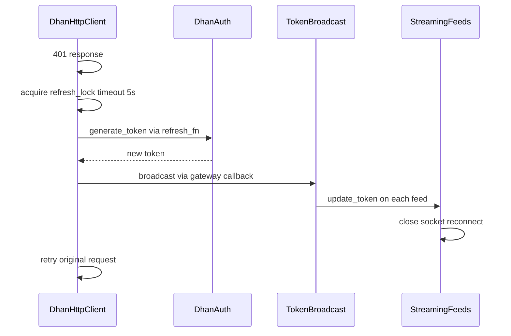

# Dhan Operational Readiness Review

**Date:** 2026-07-03  
**Scope:** Modern `DhanGateway` and supporting infrastructure  
**Companion:** [`dhan_behavioral_parity_assessment_v2.md`](dhan_behavioral_parity_assessment_v2.md)

---

## 1. Startup Sequencing

### Archive Sequence (`BrokerFactory._build_gateway`)

```
1. Load settings from env/JSON (.env.local)
2. Create AuthManager + token (or load from store)
3. Create shared refresh_lock
4. Build DhanHttpClient with token + refresh_fn
5. Build DhanConnection (all adapters + WS feeds)
6. Optionally load instruments (InstrumentLoader.load_cached)
7. Register TokenRefreshScheduler with lifecycle manager
8. Register with AccountConnectionRegistry (singleton per client_id)
9. Return BrokerGateway(connection)
```

### Modern Sequence (`DhanGateway.__init__`)

```
1. Create JsonTokenStateStore (if token_state_dir)
2. Create DhanAuth (may TOTP generate immediately)
3. Create refresh_lock + TokenBroadcast
4. Create DhanHttpClient with token + refresh_fn
5. Create resolver + 20 adapters inline
6. Wire token broadcast receivers (HTTP, streaming, order_stream, depth20, depth200)
7. Start TokenRefreshScheduler (if pin+totp) or register with lifecycle
8. Persist initial token
```

### Comparison

| Control | Archive | Modern | Gap |
|---------|---------|--------|-----|
| Settings validation before network | `DhanSettingsLoader` | Constructor args only | **No centralized config validation** |
| Instrument preload at startup | Optional `load_instruments=True` | Lazy on first resolve | **Different default — first call slower** |
| Singleton per account | `AccountConnectionRegistry` | None in gateway path | **Duplicate gateways possible** |
| Lifecycle registration | Explicit `lifecycle.register()` | Optional lifecycle param | **Parity when lifecycle provided** |
| Event bus / risk manager injection | Factory params | Not supported | **Missing integration hooks** |

### Silent Failure Risk

If two `DhanGateway` instances are created for the same `client_id`, both may run independent schedulers and TOTP refreshes → rate limit lockout.

---

## 2. Graceful Shutdown

### Modern `DhanGateway.close()` (`gateway.py:355-363`)

```python
if self._scheduler is not None:
    self._scheduler.stop()
self._streaming.stop()
self._order_stream.stop()
self._depth20_stream.stop()
self._depth200_stream.stop()
self._client.close()
```

### Archive `BrokerGateway.close()` → `DhanConnection.close()` → `connection_lifecycle.py`

Archive delegates to connection lifecycle which closes HTTP pool, all WS feeds, depth pool, and releases connection admission lock.

### Assessment

| Check | Modern | Pass |
|-------|--------|------|
| Scheduler thread joined | `TokenRefreshScheduler.stop()` with 5s timeout | ✓ |
| Market WS stopped | `streaming.stop()` | ✓ |
| Order stream stopped | `order_stream.stop()` | ✓ |
| Depth feeds stopped | depth20 + depth200 stop | ✓ |
| HTTP session closed | `_client.close()` | ✓ |
| Connection admission lock released | `connection_admission.py` exists | **Unverified** — not called from `gateway.close()` |
| Depth200 pool `close_all()` | Via `connection_lifecycle` in archive | **Not in gateway.close()** |
| Async WS event loop cleanup | `depth_feed_base._close_active_websocket` | **Partial** — per-feed, not gateway-orchestrated |
| Registry eviction | N/A | **GatewayRegistry has no remove on close** |

### Memory Leak Test

`test_dhan_gateway.py::test_gateway_no_memory_leaks` — object count delta < 100 after create/close. **Passes in CI (mocked).**

**Gap:** No test with real WS connections or scheduler running.

---

## 3. Connection Recovery

| Scenario | Archive | Modern | Status |
|----------|---------|--------|--------|
| WS disconnect | `reconnecting_service.py` + managed feeds | `reconnecting_service.py` copied | **PR** — tests not ported |
| Token expiry mid-session | Broadcast → all feeds reconnect | `TokenBroadcast` wired in gateway | **FR** |
| 401 on HTTP | Refresh + retry once | `http.py:147,229,263` | **FR** |
| 429 rate limit | Adaptive backoff on token + endpoint | `_rate_limit_backoff_seconds=130` | **FR** |
| Circuit breaker open | Exposed via `get_circuit_breaker_states()` | CB exists, **not exposed on gateway** | **PR** |
| Stale feed detection | `market_feed_stale` in connection status | Not in `health()` | **MI** |

### Recovery Sequence (Token Refresh)



**Risk:** If `generate_token()` hits rate limit during 401 storm, retry uses stale token → silent auth failure loop.

---

## 4. Health Endpoints

### Modern `DhanGateway.health()`

Returns:
- `auth_valid`: bool from `DhanAuth.is_valid()`
- `scheduler`: scheduler health dict or None
- `broadcast`: token refresh metrics

### Archive `ObservabilityProvider`

Returns:
- `get_connection_status()` — per-feed bools (market_feed, order_stream, depth_20, depth_200)
- `get_connection_metadata()` — non-bool diagnostics
- `get_circuit_breaker_states()` — CLOSED/OPEN/HALF_OPEN per category
- `get_token_refresh_metrics()` — refresh counters

### Gap Analysis

| Signal | Required for ops | Modern | Archive |
|--------|------------------|--------|---------|
| WS connected | Yes | **No** | Yes |
| Feed stale | Yes | **No** | Yes |
| Circuit breaker state | Yes | **No** | Yes |
| Token refresh count | Yes | Partial (broadcast) | Yes |
| Auth valid | Yes | Yes | Yes |
| Scheduler running | Yes | Yes | Yes |

**Recommendation:** Implement `ObservabilityProvider` on `DhanGateway` or expose equivalent via `health()` before production.

---

## 5. Metrics & Alerting

### Defined Metrics (`brokers/adapters/dhan/metrics.py`)

| Metric | Type | Wired to runtime |
|--------|------|------------------|
| `dhan_requests_total` | Counter | Via `@observe_metrics` on HTTP — **partial** |
| `dhan_request_errors_total` | Counter | Partial |
| `dhan_request_duration_seconds` | Histogram | Partial |
| `dhan_ws_reconnect_total` | Counter | **Unverified** |
| `dhan_ws_ticks_total` | Counter | **Unverified** |
| `dhan_ws_dropped_ticks_total` | Counter | **Unverified** |
| `dhan_ws_callbacks` | Gauge | **Unverified** |
| `dhan_ws_subscriptions` | Gauge | **Unverified** |

### Suggested Alert Thresholds (for soak/production)

| Alert | Condition | Severity |
|-------|-----------|----------|
| AuthDegraded | `auth_valid == false` for > 60s | Critical |
| WSDisconnected | market feed disconnected > 30s during market hours | High |
| TickDropRate | `dropped_ticks / ticks > 1%` over 5m | High |
| ReconnectStorm | `ws_reconnect > 10` in 15m | Medium |
| TokenRefreshFailure | refresh errors > 3 in 10m | High |
| CircuitOpen | any CB open > 60s | High |

---

## 6. Structured Logging

| Event | Archive | Modern |
|-------|---------|--------|
| Order placed | Structured + correlation_id | Basic `logger` |
| Token refresh | Audit fields | `dhan_token_generated` info |
| security_id issued | `security_id_issued` with source | **Missing** |
| WS reconnect | Feed-type tagged | `reconnecting_service` basic |
| Rate limit hit | Endpoint class tagged | `TokenRateLimitError` raised |

**Gap:** Insufficient structured fields for production log aggregation (no consistent `correlation_id` propagation).

---

## 7. Resource Cleanup

| Resource | Cleanup path | Verified |
|----------|--------------|----------|
| HTTP session | `_client.close()` | Yes |
| Scheduler thread | `scheduler.stop()` | Yes |
| WS threads/loops | Per-feed `stop()` | Partial |
| File locks (connection admission) | `connection_admission.py` | **Not wired to gateway** |
| Token state file handles | JsonTokenStateStore | Yes |
| GatewayRegistry entries | `clear()` manual only | No auto-evict on close |

---

## 8. Long-Running Stability — Soak Test Protocol

### Objective

Validate 24–72 hour continuous operation without memory growth, connection leaks, or token refresh failures.

### Prerequisites

- `.env.local` with valid Dhan credentials
- Market hours window (or 24h spanning two sessions)
- Prometheus scrape endpoint (optional)
- Kill switch: `allow_live_orders=False` unless pre-prod account

### Configuration

```text
DHAN_CLIENT_ID=<id>
DHAN_PIN / DHAN_TOTP_SECRET (or DHAN_ACCESS_TOKEN)
allow_live_orders=false (default for soak)
auto_refresh=true
refresh_interval_seconds=60
```

### Workload Profile

| Phase | Duration | Actions |
|-------|----------|---------|
| Warmup | 15 min | `gateway.instruments.load()`, subscribe 10 NSE symbols FULL mode |
| Steady | 23h | Maintain subscriptions; LTP poll every 30s for 5 symbols |
| Token cycle | Span 2+ expiries | Let scheduler refresh; verify broadcast |
| Fault injection | 3x during soak | Kill WS connection; verify reconnect < 30s |
| Shutdown | 5 min | `gateway.close()`; verify clean exit |

### Measurements (every 5 min)

- Process RSS memory (MB)
- Thread count
- `gateway.health()` snapshot
- WS reconnect count (if metrics wired)
- Tick receive rate

### Pass Criteria

| Metric | Threshold |
|--------|-----------|
| Memory growth | < 10% over 24h |
| Thread count | Stable ± 2 |
| Auth valid | > 99.9% of samples |
| WS uptime during market hours | > 99% |
| Unhandled exceptions | 0 |
| Scheduler stop on close | < 5s |

### Fail Actions

- Capture heap dump if memory growth > 10%
- Dump `health()` timeline
- File incident with correlation to open blockers in roadmap

### Status

**Not yet executed.** Protocol defined; execution is a production exit criterion.

---

## 9. Operational Readiness Checklist

| Control | Status | Blocker |
|---------|--------|---------|
| Deterministic startup order | **PR** | No settings loader |
| Graceful shutdown | **PR** | Admission lock / depth pool not in close() |
| Connection recovery | **PR** | Tests not ported |
| Health endpoints | **MI** | No ObservabilityProvider |
| Metrics | **PR** | WS metrics unwired |
| Structured logging | **PR** | No security_id audit |
| Resource cleanup | **PR** | Registry leak risk |
| 24h soak test | **Not run** | Required for production |
| Alerting thresholds | **Defined** | Not deployed |

### Operational Verdict

**NOT OPERATIONALLY READY** — shutdown and recovery primitives exist but observability gaps and unexecuted soak test block production deployment.
