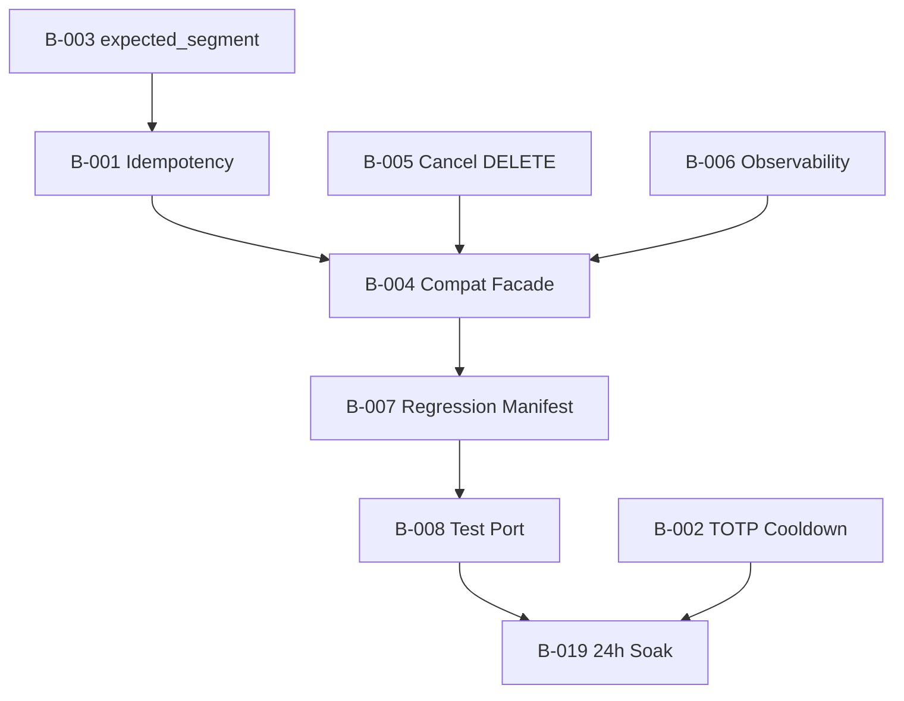

# Dhan Parity — Risk Register & Prioritized Engineering Roadmap

**Date:** 2026-07-03  
**Verdict:** NOT READY FOR PRODUCTION  
**Companion:** [`dhan_behavioral_parity_assessment_v2.md`](dhan_behavioral_parity_assessment_v2.md)

---

## 1. Risk Register

| ID | Finding | Severity | Likelihood | Impact | Detection | Mitigation | Owner |
|----|---------|----------|------------|--------|-----------|------------|-------|
| R-001 | No order idempotency on retry | **Critical** | High | Catastrophic — duplicate live orders | Fault injection test | Port `SimpleIdempotencyCache` + correlation_id to `DhanOrders` | Orders |
| R-002 | No TOTP proactive cooldown | **High** | Medium | 2-min auth lockout | Concurrent refresh stress test | Integrate `TotpCooldownGuard` in `DhanAuth` | Auth |
| R-003 | No `expected_segment` disambiguation | **High** | High | Wrong instrument orders | Derivative symbol integration tests | Add param to `resolve()` + adapter call sites | Identity |
| R-004 | Consumer API breaking change (ports vs facade) | **High** | Certain | All archived callers break | Static analysis of call sites | Compatibility facade or migration guide | Gateway |
| R-005 | Cancel POST vs DELETE | **High** | Medium | False cancel success | Live cancel integration test | Align with Dhan API spec + archive behavior | Orders |
| R-006 | No ObservabilityProvider | **High** | Medium | Blind ops during outages | Infra health check test | Implement on `DhanGateway` | Gateway |
| R-007 | Historical return type change | **High** | Certain | Downstream DataFrame consumers break | Type check on callers | Shim `history()` → DataFrame or migrate callers | Historical |
| R-008 | P0 regression manifest not ported | **High** | Certain | Undetected regressions | CI manifest gate | Port 23 cases to modern integration suite | QA |
| R-009 | Test coverage gap (78→15 files) | **High** | High | Silent regressions | Traceability matrix | Systematic test port | QA |
| R-010 | Reconciliation no drift severity/repair | **Medium** | Low | Stale OMS state | Reconciliation integration test | Port `ReconciliationEngine` | Portfolio |
| R-011 | No session manager | **Medium** | Low | Ops visibility gap | Monitoring review | Expose connection states in health | Gateway |
| R-012 | No instrument disk cache | **Medium** | High | Slow startup, rate limits | Load test | Port `InstrumentLoader` TTL cache | Identity |
| R-013 | MCX supplement missing | **Medium** | Medium | Commodity symbol gaps | MCX integration test | Port `_fetch_mcx_detailed` | Identity |
| R-014 | WS metrics unwired | **Medium** | Medium | No tick drop alerts | Prometheus scrape | Wire counters in streaming/depth | Observability |
| R-015 | GatewayRegistry not used for Dhan | **Medium** | Medium | Duplicate schedulers | Multi-gateway test | Wire factory through registry | Infra |
| R-016 | No security_id audit logging | **Low** | Medium | Forensic gap | Log audit | Port structured log from archive | Identity |
| R-017 | EDIS API surface divergence | **Low** | Low | EDIS workflow break | EDIS integration test | Align methods with archive or document | Extended |
| R-018 | 24h soak test not executed | **Medium** | Medium | Memory/thread leaks | Soak protocol | Execute per ops doc | Ops |

---

## 2. Prioritized Engineering Backlog

### Wave 0 — Production Blockers (P0)

#### B-001: Order Idempotency

| Field | Value |
|-------|-------|
| **Priority** | P0 / Critical |
| **Risk** | R-001 |
| **Dependencies** | `brokers/infrastructure` idempotency module (or port from archive) |
| **Complexity** | Medium |
| **Parallel** | Can run parallel to B-002 after interface defined |

**Acceptance criteria:**
- `DhanOrders.place_order()` accepts optional `correlation_id`
- Same correlation_id within TTL returns cached `OrderResponse` without second POST
- Thread-safe under concurrent calls (port `test_orders_idempotency.py` cases)
- Validation failures are NOT cached

**Required tests:**
- Port `archive/.../test_orders_idempotency.py` → `brokers/tests/unit/adapters/dhan/test_orders_idempotency.py`
- Add to `test_broker_contract.py` Dhan implementation

**Parity verification:** Compare behavior with `archive/brokers/dhan/orders.py:186-314`

**Production exit:** Fault injection test — simulate timeout after POST, retry returns same order_id

---

#### B-002: TOTP Cooldown Guard

| Field | Value |
|-------|-------|
| **Priority** | P0 / High |
| **Risk** | R-002 |
| **Dependencies** | `TotpCooldownGuard` from shared auth infrastructure |
| **Complexity** | Low |
| **Parallel** | Yes — independent module |

**Acceptance criteria:**
- `check_allowed()` before every TOTP HTTP call
- `record_rate_limited()` on broker "once every 2 minutes" response
- Concurrent refresh attempts serialized without duplicate TOTP calls

**Required tests:**
- Port `test_token_bootstrap_policy.py` scenarios
- Stress test: 10 concurrent `generate_token()` → ≤ 1 HTTP call per 120s window

**Parity verification:** Match `archive/brokers/dhan/totp_client.py:28-79`

---

#### B-003: expected_segment Identity Defense

| Field | Value |
|-------|-------|
| **Priority** | P0 / High |
| **Risk** | R-003 |
| **Dependencies** | B-001 (orders must pass segment hint) |
| **Complexity** | Medium |
| **Parallel** | After identity interface stable |

**Acceptance criteria:**
- `DhanInstrumentResolver.resolve(symbol, exchange, *, expected_segment=None)`
- Rejects IDX_I when derivative segment expected
- `DhanOrders.place_order` passes `EXCHANGE_TO_SEGMENT[exchange]` as hint

**Required tests:**
- Port `test_resolver.py` PR-C cases
- Integration: NIFTY FNO order does not resolve to IDX_I

**Parity verification:** `archive/brokers/dhan/identity.py:415-425`

---

#### B-004: Consumer API Compatibility Facade

| Field | Value |
|-------|-------|
| **Priority** | P0 / High |
| **Risk** | R-004, R-007 |
| **Dependencies** | Stable port APIs |
| **Complexity** | High |
| **Parallel** | Design can start immediately; impl after B-001 |

**Acceptance criteria:**
- `DhanCompatibilityGateway` (or similar) implements archived method signatures
- `place_order`, `ltp`, `quote`, `depth`, `history` (DataFrame), `stream` (sync + handle)
- Delegates to modern ports internally
- `BrokerFactory.create()` equivalent for drop-in migration

**Required tests:**
- Port `archive/.../contract/test_broker_contract.py` against compatibility facade
- All archived integration tests compile against new facade

**Parity verification:** Method-by-method matrix in v2 assessment Section 5

---

#### B-005: Cancel Order HTTP Semantics

| Field | Value |
|-------|-------|
| **Priority** | P0 / High |
| **Risk** | R-005 |
| **Dependencies** | None |
| **Complexity** | Low |
| **Parallel** | Yes |

**Acceptance criteria:**
- Use DELETE `/orders/{id}` matching archive and Dhan API
- Parse broker response status field (success/ok vs error)
- Post-cancel FILLED race detection preserved

**Required tests:**
- Port cancel tests from `archive/.../test_orders.py`
- Live integration cancel on pre-prod account

---

#### B-006: ObservabilityProvider Implementation

| Field | Value |
|-------|-------|
| **Priority** | P0 / High |
| **Risk** | R-006 |
| **Dependencies** | WS feeds expose `is_connected` |
| **Complexity** | Medium |
| **Parallel** | Yes |

**Acceptance criteria:**
- `get_connection_status()`, `get_connection_metadata()`, `get_circuit_breaker_states()`, `get_token_refresh_metrics()` on `DhanGateway`
- Values match archive semantics for each feed

**Required tests:**
- Port `test_live_observability.py`
- Unit test with mocked feeds

---

### Wave 1 — High Priority (P1)

#### B-007: Port P0 Regression Manifest

| Field | Value |
|-------|-------|
| **Priority** | P1 |
| **Risk** | R-008 |
| **Dependencies** | B-004 (facade) or port tests to port APIs |
| **Complexity** | Medium |
| **Parallel** | After B-004 or parallel with direct port assertions |

**Acceptance criteria:**
- `brokers/tests/integration/adapters/dhan/test_regression_manifest.py` parametrizes all 23 cases
- `test_coverage_manifest.py` fails CI if P0 capability uncovered

---

#### B-008: Systematic Test Port (78→15 gap)

| Field | Value |
|-------|-------|
| **Priority** | P1 |
| **Risk** | R-009 |
| **Dependencies** | Feature implementations |
| **Complexity** | High |
| **Parallel** | Per-module parallelization |

**Acceptance criteria:**
- Traceability matrix MC rows < 10
- All idempotency, WS, reconciliation, resolver tests ported

---

#### B-009: Instrument Disk Cache + MCX

| Field | Value |
|-------|-------|
| **Priority** | P1 |
| **Risk** | R-012, R-013 |
| **Dependencies** | None |
| **Complexity** | Medium |
| **Parallel** | Yes |

**Acceptance criteria:**
- 6h TTL disk cache with 7-day cleanup
- MCX detailed supplement with `mcx_required` flag
- Port `test_loader_cache_path.py`, `test_cache_refresh.py`

---

#### B-010: Reconciliation Engine

| Field | Value |
|-------|-------|
| **Priority** | P1 |
| **Risk** | R-010 |
| **Dependencies** | OMS interface (if auto-repair) |
| **Complexity** | Medium |
| **Parallel** | Yes |

**Acceptance criteria:**
- `DriftItem` severity levels
- `compare_orders()` + `compare_positions()`
- Optional auto-repair when OMS provided

---

### Wave 2 — Medium Priority (P2)

| ID | Item | Risk | Complexity |
|----|------|------|------------|
| B-011 | Wire GatewayRegistry into Dhan bootstrap | R-015 | Low |
| B-012 | Wire WS Prometheus metrics | R-014 | Low |
| B-013 | security_id audit logging | R-016 | Low |
| B-014 | EDIS API alignment | R-017 | Medium |
| B-015 | Pre-trade validation (lot/tick/segment) | — | Medium |
| B-016 | Kill switch + slice orders + trade history | — | Medium |
| B-017 | Dynamic config loader (DhanSettingsLoader port) | — | Medium |
| B-018 | Gateway close() — admission lock + depth pool | — | Low |

### Wave 3 — Operational Exit (P2)

| ID | Item | Risk | Complexity |
|----|------|------|------------|
| B-019 | Execute 24h soak test per ops protocol | R-018 | Low (ops time) |
| B-020 | Deploy alerting thresholds | — | Low |
| B-021 | 72h soak for production sign-off | R-018 | Ops |

---

## 3. Dependency Graph

---

## 4. Parallel Execution Plan

| Track | Items | Duration est. |
|-------|-------|---------------|
| **A — Money path** | B-001, B-003, B-005 | 3–5 days |
| **B — Auth/Ops** | B-002, B-006, B-011, B-012 | 2–3 days |
| **C — Compatibility** | B-004 | 5–7 days |
| **D — Data/Identity** | B-009, B-010 | 3–4 days |
| **E — Quality gate** | B-007, B-008 | 5–7 days (ongoing) |
| **F — Ops exit** | B-019, B-020, B-021 | 3–4 days wall time |

Tracks A, B, D can run in parallel. Track C starts after A interfaces stable. Track E follows C. Track F is last.

---

## 5. Production Exit Criteria

### CONDITIONALLY READY (Staging)

- [ ] B-001 through B-006 complete with tests passing
- [ ] B-007: all 23 P0 manifest cases pass (live or off-market tier as appropriate)
- [ ] Zero Critical open risks
- [ ] B-019: 24h soak pass

### READY FOR PRODUCTION

- [ ] All CONDITIONALLY READY criteria
- [ ] Traceability matrix: 0 MC rows for P0 features
- [ ] B-008: < 10 MC unit test rows
- [ ] B-010: reconciliation with severity
- [ ] B-021: 72h soak pass
- [ ] Alerting deployed and validated
- [ ] Compatibility facade documented and all production call sites migrated

---

## 6. Final Verdict

| Stage | Verdict | Rationale |
|-------|---------|-----------|
| **Current** | **NOT READY** | Critical idempotency gap; 0/23 P0 manifest ported; consumer API breaking |
| **After Wave 0** | **CONDITIONALLY READY** | Money-path blockers resolved + manifest green |
| **After Wave 1–3** | **READY FOR PRODUCTION** | Full traceability + soak + observability |

**Evidence base:** 57 audit findings across 5 documents, 78 archive tests mapped, 7 prior assessment corrections applied.
